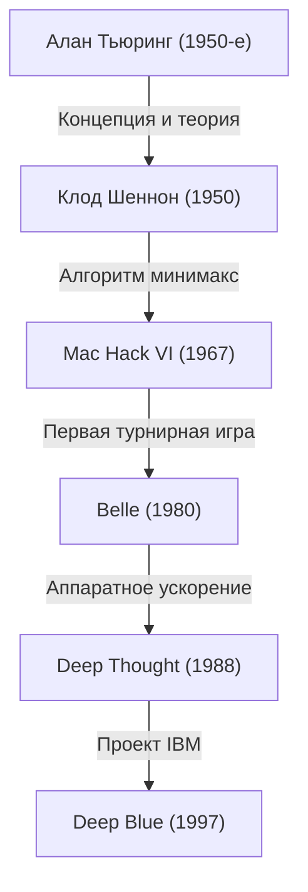
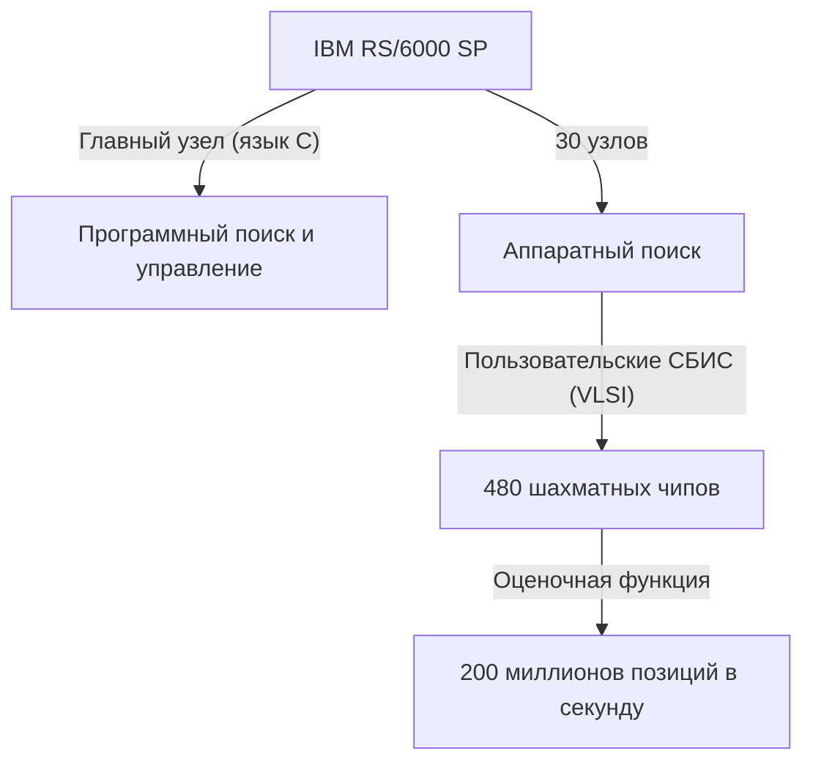

## Введение: 1997 год, «неизведанный интеллект», с которым столкнулось человечество

Шахматный матч, состоявшийся 11 мая 1997 года в Equitable Center в Нью-Йорке, запомнился как своеобразная сингулярность в истории человечества. Гарри Каспаров, действовавший чемпион мира по шахматам и признанный «сильнейшим игроком в истории», потерпел поражение от суперкомпьютера «Deep Blue», разработанного компанией IBM.

Это событие вышло далеко за рамки простой победы или поражения в настольной игре, став мощной вехой в ответе на давний философский вопрос: «Настанет ли день, когда машина превзойдет человеческий интеллект?». В этой статье мы подробно рассмотрим историю компьютерных шахмат, предшествовавшую матчу 1997 года, путь великого Каспарова, технологическую подоплеку Deep Blue и детали легендарного матча из 6 партий, чтобы глубоко проанализировать, какое значение этот инцидент имел в истории искусственного интеллекта (ИИ).

## Заря компьютерных шахмат: от Тьюринга до Deep Blue

Идея заставить компьютер играть в шахматы существовала с самого зарождения информатики. Пионеры, такие как Алан Тьюринг и Клод Шеннон, рассматривали шахматы как «идеальный испытательный стенд для имитации и понимания процессов человеческого мышления».

В 1950-х годах Клод Шеннон опубликовал знаменательную статью о шахматных программах, заложив основу для алгоритмов поиска на основе метода минимакса. Впоследствии, в 1970-х и 80-х годах, начали появляться машины, оснащенные специализированным аппаратным обеспечением для игры в шахматы. Компьютер «Belle» от Bell Labs использовал специальные схемы для оценки десятков тысяч позиций в секунду, демонстрируя силу на уровне мастера.

Затем «Deep Thought», разработанный студентами Университета Карнеги-Меллона, стал первым компьютером, победившим гроссмейстера. IBM переняла этот проект, вложив в него огромные средства и лучшую инженерию, чтобы создать «Deep Blue».

## Архитектура шедевра IBM «Deep Blue»

Deep Blue стал кульминацией передовых технологий параллельных вычислений того времени. Он базировался на универсальном суперкомпьютере «IBM RS/6000 SP» и был оснащен большим количеством СБИС-чипов (VLSI), специально разработанных для шахмат.

Его главной особенностью была ошеломляющая вычислительная мощность, позволявшая оценивать невероятное количество позиций — **200 миллионов ходов (позиций) в секунду**. Это был так называемый «brute force» (метод грубой силы). В то время как игрок-человек анализирует от нескольких единиц до нескольких десятков ходов в секунду (но с помощью высокой интуиции сужает выбор до наиболее перспективных), Deep Blue использовал подход ковровой бомбардировки, просчитывая абсолютно все варианты. Кроме того, к команде разработчиков присоединился шахматный гроссмейстер Джоэль Бенджамин и другие эксперты, которые тщательно настроили оценочную функцию (алгоритм для количественной оценки преимущества или недостатка позиции).

## Сильнейший чемпион в истории: Гарри Каспаров

Его противник, Гарри Каспаров, — абсолютный гений, ставший самым молодым чемпионом мира в истории в возрасте 22 лет и удерживавший этот титул на протяжении 15 лет. Его стиль игры был чрезвычайно агрессивным; он славился глубоким расчетом, выдающейся интуицией и психологической борьбой, оказывавшей колоссальное давление на противника.

До этого момента он играл на равных или превосходил любой компьютер и был убежден, что человек никогда не проиграет машине (по крайней мере, при его жизни). В первом матче против Deep Blue в 1996 году в Филадельфии Каспаров хоть и проиграл первую партию, в итоге одержал победу со счетом 3 победы, 1 поражение и 2 ничьи. Тогда Каспаров заявил: «Машина никогда не сможет победить истинный человеческий интеллект и интуицию».

## 1997 год: матч-реванш (Нью-Йорк)

После поражения в 1996 году команда разработчиков IBM (Фэн-Сюн Сюй, Мюррей Кэмпбелл и др.) основательно модернизировала Deep Blue. Они удвоили скорость вычислений, сделали оценочную функцию более гибкой, приближенной к человеческой, и обучили систему на всех прошлых партиях Каспарова. Эта новая версия, иногда называемая «Deeper Blue», вышла на арену для матча-реванша в мае 1997 года.

### Партия 1: Ожидаемая победа Каспарова
В первой партии Каспаров остался верен своему стилю, перевел игру в сложную позицию и одержал победу. Казалось, что Deep Blue, несмотря на свою вычислительную мощь, не понимает долгосрочной стратегии и тонкостей позиционной игры. Все думали: «И в этот раз Каспаров победит».

### Партия 2: Подозрительный 44-й ход и смятение Каспарова
Поворотным моментом в истории стала вторая партия. Здесь Deep Blue сделал ход, который казался «человечным» и «ориентированным на долгосрочное позиционное преимущество», чего традиционные компьютеры никогда не делали. В частности, 44-й ход Deep Blue был чрезвычайно изощренным стратегическим решением: компьютер намеренно отказался от немедленной материальной выгоды (шанса взять фигуру), чтобы полностью пресечь в зародыше контригру противника.

Каспаров был глубоко потрясен этим ходом. Позже он сказал: «Я почувствовал по ту сторону доски выдающийся человеческий интеллект». Впав в панику, Каспаров сдался на 45-м ходу, хотя у него еще были шансы свести партию вничью. Это поражение заставило Каспарова заподозрить, что IBM тайно привлекает к игре человеческих гроссмейстеров во время матча, что психологически сильно на него давило.

### Партии 3–5: Напряженные ничьи
С третьей по пятую партию Каспаров пытался нейтрализовать вычислительную мощь Deep Blue, избегая тактических осложнений, в которых компьютеры так сильны, и переводя игру в русло долгосрочной стратегической борьбы (закрытые позиции). В результате все три партии завершились вничью. Счет стал равным — 2.5 на 2.5. Все решалось в финальной, шестой партии.

### Партия 6: Падение чемпиона (11 мая)
Решающая 6-я партия. Каспаров играл черными и выбрал защиту Каро-Канн. Однако в дебюте он сделал рискованный ход, отклонившись от известных теоретических линий. Это была попытка запутать дебютную базу данных Deep Blue, но она оказалась фатальной ошибкой.

Deep Blue мгновенно начал мощную атаку, пожертвовав коня. В компьютерных шахматах это был ход, который «обычно не выбирается из-за временного падения оценки», но улучшенный Deep Blue безупречно просчитал дальнейшее развитие событий.

Каспаров, вынужденный только защищаться, был вынужден унизительно сдаться всего через 19 ходов. Итоговый счет стал 3.5 против 2.5. Это был момент, когда сильнейший представитель человечества впервые проиграл машине.

## Что означало это поражение: смена парадигмы ИИ

Победа Deep Blue вызвала невероятный шок во всем мире. Журнал Newsweek вышел с заголовком на обложке: «Последний рубеж мозга» (The Brain's Last Stand).

Однако с технической точки зрения Deep Blue в корне отличается от современного ИИ (такого как глубокое обучение). Deep Blue не был «ИИ, который автономно обучается и понимает концепции», а являлся высшей формой «экспертной системы», которая находила оптимальные решения путем **полного перебора (brute force)** с помощью сверхбыстрого аппаратного обеспечения, основываясь на правилах и оценочных функциях, заданных людьми-экспертами.

Эта победа показала следующее: «В рамках игры с ограниченными правилами и полной информацией, такой как шахматы, даже человеческая интуиция и глобальное видение могут быть превзойдены с помощью распознавания паттернов за счет колоссальных вычислительных мощностей».

Впоследствии исследования искусственного интеллекта перешли от поиска на основе правил к машинному обучению с использованием нейронных сетей. В 2016 году программа «AlphaGo» от Google DeepMind, победившая одного из лучших в мире игроков в го Ли Седоля, одержала победу не с помощью полного перебора, как Deep Blue, а используя подход, более близкий к человеческой интуиции — она «самостоятельно обучалась оценочной функции» с помощью глубокого (deep learning) и обучения с подкреплением. Deep Blue был, в каком-то смысле, вершиной и законченной формой «старого доброго ИИ».

## Заключение: предел человечества или новые возможности?

После матча разгневанный Каспаров потребовал от IBM опубликовать логи и провести матч-реванш, но IBM, посчитав цель достигнутой, немедленно разобрала Deep Blue и отправила его на пенсию. Этот шаг оставил у Каспарова глубокое чувство недоверия на долгое время.

Однако со временем взгляды Каспарова изменились. Сегодня он является одним из сторонников «Продвинутых шахмат» (Кентавр-шахматы, где человек и ИИ играют в тандеме), рассматривая ИИ не как чрезмерную угрозу, а как «инструмент для расширения человеческих возможностей».

Победа Deep Blue в 1997 году не была поражением человечества. Это был «триумф человеческой инженерии» — момент, когда инструмент, созданный самим человеческим интеллектом, наконец превзошел пределы своего создателя в одной конкретной области. Даже сейчас, спустя десятилетия после этого исторического матча, вопрос о том, как нам сосуществовать с ИИ и как расширять наши собственные возможности, продолжает стоять перед нами с не меньшей остротой.
