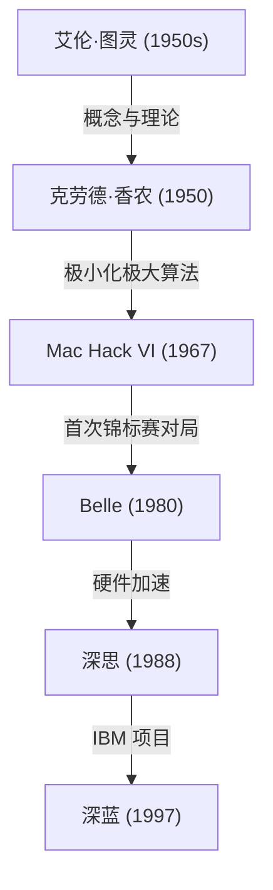
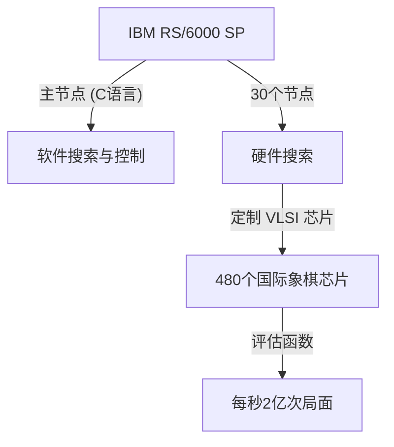

## 前言：1997年，人类面临的“未知智慧”

1997年5月11日，在纽约公平中心（Equitable Center）举行的一场国际象棋对局，作为人类历史上的一个奇点被铭记。当时的国际象棋世界冠军、被誉为“史上最强棋手”的加里·卡斯帕罗夫（Garry Kasparov），败给了IBM开发的超级计算机“深蓝（Deep Blue）”。

这一事件超越了单纯的棋盘胜负，对于“机器是否终有一天会超越人类智慧？”这个长久以来的哲学拷问，它成为了一个强烈的里程碑。本文将追溯这场1997年对决之前的计算机国际象棋历史、卡斯帕罗夫这位巨人的轨迹、深蓝的技术背景，以及那场传奇六番棋的细节，深入探讨这一事件在AI（人工智能）历史中究竟具有怎样的意义。

## 计算机国际象棋的黎明：从图灵到深蓝

让计算机下国际象棋的想法，在计算机科学的黎明期就已存在。艾伦·图灵（Alan Turing）和克劳德·香农（Claude Shannon）等先驱者，将国际象棋视为“模拟和解析人类思维过程的理想试验床”。

1950年代，克劳德·香农发表了关于国际象棋程序的纪念碑式论文，奠定了基于极小化极大（Minimax）算法的搜索算法基础。随后，从1970年代到80年代，搭载国际象棋专用硬件的机器开始登场。贝尔实验室的“Belle”通过使用专用电路，每秒能搜索数万个局面，拥有了大师级的实力。

接着，由卡内基梅隆大学学生们开发的“深思（Deep Thought）”，成为了第一台击败特级大师的计算机。IBM接手了这个项目，投入了巨额资金和顶尖工程技术，最终孕育出了“深蓝”。

## IBM的杰作：“深蓝”的架构

深蓝是当时最尖端并行计算技术的结晶。它以通用超级计算机“IBM RS/6000 SP”为基础，搭载了大量专为国际象棋设计的VLSI芯片。

其最大的特点在于压倒性的计算能力——**每秒能够搜索2亿步（2亿个局面）**，这被称为“暴力破解（力任せの探索 / Brute-force search）”。人类棋手每秒只能看透几步到几十步（但能通过高度的直觉锁定有希望的走法），而深蓝则采取了像地毯式轰炸一样算尽所有可能性的策略。此外，国际象棋特级大师乔尔·本杰明（Joel Benjamin）等人也加入了开发团队，对局面的评估函数（将局面的优劣数字化的算法）进行了彻底的调优。

## 史上最强王者，加里·卡斯帕罗夫

对面的加里·卡斯帕罗夫，是在22岁时就成为史上最年轻的世界冠军、此后连续15年稳居王座的绝对天才。他的棋风极具攻击性，精于深远的计算、卓越的直觉以及能给对手施加巨大压力的心理战。

在此之前，他与任何计算机对局都游刃有余，并坚信人类绝不会输给机器（至少在他有生之年不会）。在1996年与深蓝的首次对决（费城）中，尽管卡斯帕罗夫输掉了第一局，但最终以3胜1负2平的成绩取得胜利。当时，卡斯帕罗夫宣称：“机器永远无法战胜人类真正的智慧与直觉。”

## 1997年：命运的复仇战（纽约）

经历了1996年的失败，IBM的开发团队（许峰雄、默里·坎贝尔等）对深蓝进行了彻底的改良。计算速度翻倍，评估函数被调整得更像人类般灵活，并让它学习了卡斯帕罗夫过去所有的棋谱。这个也被称为“更深蓝（Deeper Blue）”的新版本，登上了1997年5月的重赛舞台。

### 第一局：卡斯帕罗夫顺利取胜
第一局，卡斯帕罗夫贯彻了自己的风格，将局面引向复杂化并取得了胜利。深蓝虽然计算能力出色，但似乎并不理解长期战略和局面的微妙之处。所有人都以为“这次也会以卡斯帕罗夫的胜利告终”。

### 第二局：令人生疑的第44步与卡斯帕罗夫的动摇
历史的转折点出现在第二局。在这里，深蓝下出了一步以往计算机绝对不会走的、“人性化”且“重视长期局面优势”的棋。特别是深蓝的第44步，它刻意放弃了眼前的物质利益（吃子的机会），彻底掐断了对手反击的苗头，这是一步极其精妙的战略好棋。

卡斯帕罗夫被这一步深深震撼。他后来表示：“在棋盘的另一侧，我感觉到了卓越的人类智慧。”陷入恐慌的卡斯帕罗夫，在明明还有可能逼平的情况下，在第45步主动认输（投降）。这场失利让卡斯帕罗夫开始怀疑“IBM是否在对局中让人类特级大师介入了”，他在心理上被逼入了绝境。

### 第三至第五局：令人窒息的平局
在第三至第五局中，卡斯帕罗夫试图避开计算机擅长的战术性混战，将其拖入长期战略战（封闭局面），以此来使深蓝的计算能力失效。结果这几局全部以平局（Draw）告终。比分来到2.5比2.5平。一切都交给了最终的第六局。

### 第六局：王者的崩溃（5月11日）
命运的第六局。卡斯帕罗夫执黑（后手），选择了卡罗-康防御（Caro-Kann Defense）。然而，他在开局阶段走了一步偏离已知定式、近乎赌博的棋。这本是打乱深蓝定式数据库的策略，却成了致命的失误。

深蓝立刻发起了牺牲骑士的强力攻击（骑士弃子）。在计算机国际象棋中，这通常是“因为评估值会暂时下降，所以通常不会被选择的走法”，但改良后的深蓝完美地算透了之后的展开。

陷入单方面防守的卡斯帕罗夫，仅仅走了19步这样短暂的回合，就不得不屈辱地认输。比分定格在3.5比2.5。史上最强的人类，终于被机器击败的瞬间到来了。

## 失败意味着什么：AI范式的变迁

深蓝的胜利给全世界带来了难以估量的冲击。《新闻周刊》封面上赫然印着“The Brain's Last Stand（大脑的最后抵抗）”的标题。

然而，从技术角度来看，深蓝与现代AI（如深度学习等）有着根本的不同。深蓝并非“自主学习并理解概念的AI”，而是基于人类专家定义的规则和评估函数，通过超高速硬件进行**暴力全搜索（Brute-force）**以得出最优解的“专家系统”的终极形态。

这场胜利证明了一个事实：“只要在国际象棋这种规则受限且完全信息博弈的框架内，即便是人类的直觉和大局观，也能被拥有压倒性计算量的模式搜索所超越。”

此后，人工智能的研究从基于规则的搜索转向了使用神经网络的机器学习。2016年击败围棋世界顶尖棋手李世石的Google DeepMind“AlphaGo（阿尔法狗）”，并没有使用深蓝那样的暴力破解，而是运用深度学习（Deep Learning）和强化学习，“自己学习评估函数”，以一种更接近人类直觉的方式取得了胜利。可以说，深蓝在某种意义上是“古典AI”的顶点与完成态。

## 结语：人类的极限，还是新的可能？

对局结束后，卡斯帕罗夫勃然大怒，要求IBM公开日志并重新比赛，但IBM以目标已达成而立即解散并让深蓝退役。这一应对在卡斯帕罗夫心中留下了长久的猜忌。

不过，随着时间的推移，卡斯帕罗夫的想法也发生了改变。现在，他不再过度恐惧AI的威胁，而是将AI视为“扩展人类能力的工具”，成为了“半人马国际象棋（Centaur Chess，人类与AI搭档进行对局的形式）”的倡导者之一。

1997年深蓝的胜利，并非人类的失败。它是人类自身智慧创造出的工具，终于在一个领域超越了造物主极限的“人类工程学的胜利”。距离那场历史性对决已经过去了几十年，如今，我们该如何与AI共存、如何扩展自身能力的问题，依然鲜活地摆在我们面前。
