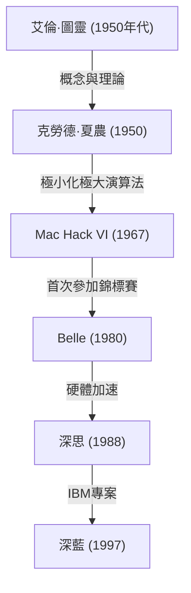
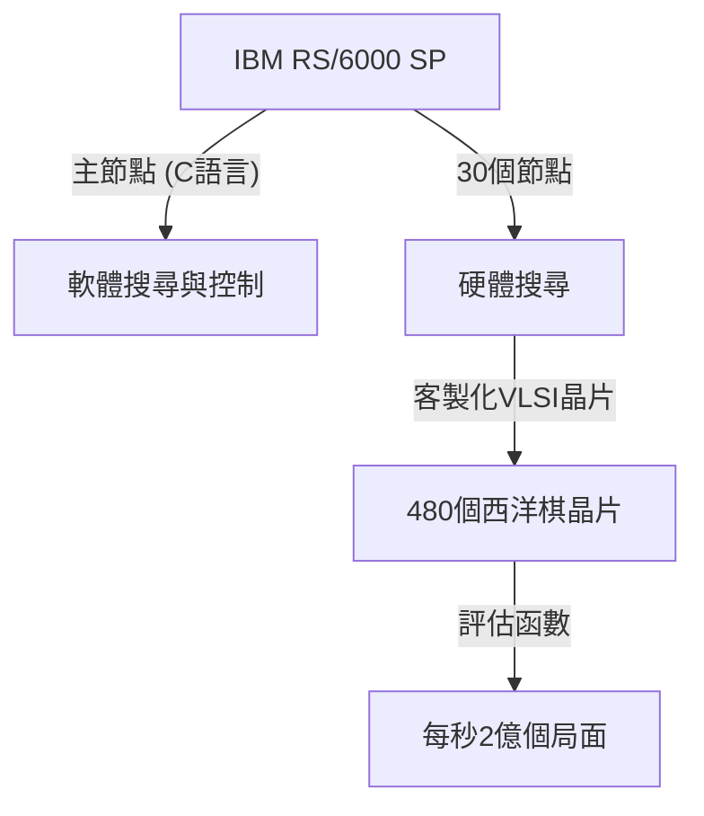

## 前言：1997年，人類面臨的「未知智慧」

1997年5月11日，在紐約 Equitable Center 舉行的西洋棋對弈，被銘記為人類歷史上的一個奇異點。當時的西洋棋世界冠軍、被譽為「史上最強棋手」的加里·卡斯帕羅夫（Garry Kasparov），敗給了IBM開發的超級電腦「深藍（Deep Blue）」。

這起事件超越了單純的棋盤遊戲勝負，成為了一個強烈的里程碑，回應了長期以來的哲學問題：「機器超越人類智慧的一天會到來嗎？」本篇文章將回顧直到1997年這場比賽為止的電腦西洋棋歷史、卡斯帕羅夫這位巨人的軌跡、深藍的技術背景，並詳細剖析成為傳奇的六局對決，深入探討這起事件在AI（人工智慧）發展史上的意義。

## 電腦西洋棋的黎明：從圖靈到深藍

讓電腦下西洋棋的想法，從計算機科學的黎明期就已存在。艾倫·圖靈（Alan Turing）與克勞德·夏農（Claude Shannon）等先驅者，將西洋棋視為「模仿與解開人類思考過程的理想測試平台」。

1950年代，克勞德·夏農發表了關於西洋棋程式的紀念碑式論文，奠定了基於極小化極大演算法（Minimax Algorithm）的搜尋演算法基礎。隨後，在1970年代至80年代期間，搭載西洋棋專用硬體的機器開始出現。貝爾實驗室的「Belle」利用專用電路，一秒鐘能搜尋數萬個局面，展現了具備大師等級的實力。

接著，由卡內基梅隆大學學生們開發的「深思（Deep Thought）」，成為首台擊敗特級大師的電腦。IBM接手了這個專案，投入了龐大的資金與最頂尖的工程技術，最終誕生了「深藍」。

## IBM的傑作「深藍」的架構

深藍是當時最尖端平行運算技術的結晶。它以通用超級電腦「IBM RS/6000 SP」為基礎，搭載了大量專為西洋棋設計的VLSI晶片。

其最大的特徵在於具備**每秒鐘搜尋2億步（2億個局面）**這種驚人數量局面的壓倒性計算能力，也就是所謂的「暴力搜尋（Brute-force search）」。相較於人類棋手一秒鐘只能預測數步到數十步（但能憑藉高度直覺限縮出有希望的棋步），深藍採取了如同地毯式轟炸般窮舉所有可能性的方法。此外，西洋棋特級大師喬爾·本傑明（Joel Benjamin）等人也加入了開發團隊，對局面的評估函數（將局面的優劣數值化的演算法）進行了徹底的微調。

## 史上最強的王者，加里·卡斯帕羅夫

對手加里·卡斯帕羅夫是一位絕對的天才，以史上最年輕的22歲之姿成為世界冠軍，隨後稱霸棋壇長達15年。他的棋風極具攻擊性，擅長深遠的計算與卓越的直覺，並精通能給予對手極大壓力的心理戰。

他過往與任何電腦對弈都佔據上風，並深信人類絕不會輸給機器（至少在有生之年）。在1996年首次與深藍的對決（於費城）中，雖然卡斯帕羅夫輸掉了第一局，但最終仍以3勝1敗2和的成績取得勝利。當時，卡斯帕羅夫宣告：「機器絕對無法戰勝人類真正的智慧與直覺。」

## 1997年：命運的復仇之戰（紐約）

經歷了1996年的敗北，IBM的開發團隊（許峰雄、默里·坎貝爾等人）對深藍進行了徹底的改良。他們將計算速度提升了一倍，將評估函數調整得更接近人類的靈活度，並讓它學習了卡斯帕羅夫過去所有的棋譜。這個被稱為「更深的藍（Deeper Blue）」的新版本，登上了1997年5月的重賽舞台。

### 第1局：卡斯帕羅夫順理成章的勝利
在第1局中，卡斯帕羅夫堅持自己的風格，將局面導向複雜化並取得勝利。深藍雖然計算能力出色，但似乎無法理解長期的戰略與局面的微妙之處。所有人都認為「這次也會以卡斯帕羅夫的勝利告終」。

### 第2局：充滿疑雲的第44步與卡斯帕羅夫的動搖
成為歷史轉捩點的是第2局。在這裡，深藍走出了一步過去電腦絕對不會走的「人性化」且「重視長期局面優勢」的棋。特別是深藍的第44步，它刻意放棄了眼前的物質利益（吃子的機會），選擇了徹底掐斷對手反擊火苗這極度洗鍊的戰略性一步。

卡斯帕羅夫對這一步感到極度震驚。他後來表示：「在棋盤的另一端，我感受到了卓越的人類智慧。」陷入恐慌的卡斯帕羅夫，明明還有逼平的機會，卻在第45步自行投降（認輸）。這次的敗北讓卡斯帕羅夫開始懷疑「IBM是否在對弈過程中讓人類特級大師介入」，在心理上被逼入了絕境。

### 第3至5局：令人窒息的平局
在第3局到第5局中，卡斯帕羅夫試圖避開電腦擅長的戰術性混戰，將局面導向長期的戰略戰（封閉性局面），企圖使深藍的計算能力無效化。結果這些對局全部以平局（和棋）收場。比分來到2.5對2.5平手。一切都取決於最後的第6局。

### 第6局：王者的崩潰（5月11日）
命運的第6局。卡斯帕羅夫執黑（後手），選擇了卡羅-康防禦（Caro-Kann Defense）。然而，他在開局階段走出了一步偏離已知定石、某種程度上可以說是賭博的棋。這是為了打亂深藍定石資料庫的策略，但卻成了致命的失誤。

深藍立刻發動了犧牲騎士的強力攻擊（Knight Sacrifice）。在電腦西洋棋中，這是「因為評估值會暫時下降，通常不會被選擇的棋步」，但改良後的深藍已經完美地算盡了之後的發展。

陷入單方面防守的卡斯帕羅夫，僅僅經過了短短的19步，就被迫屈辱地投降。比分3.5對2.5。史上最強的人類，終於敗給機器的瞬間。

## 這次敗北的意義：AI典範的變遷

深藍的勝利給全世界帶來了無法估量的衝擊。《新聞週刊》的封面上赫然印著「大腦的最後抵抗（The Brain's Last Stand）」的標題。

然而，從技術角度來看，深藍與現代的AI（如深度學習）有著根本上的不同。深藍並非「能自主學習並理解概念的AI」，而是基於人類專家定義的規則與評估函數，藉由超高速硬體進行**暴力搜尋（Brute-force search）**來得出最佳解的「專家系統」的終極形態。

這場勝利所展示的事實是：「只要在西洋棋這種規則受限且完全資訊遊戲的框架內，即使是人類的直覺與大局觀，也能被壓倒性計算量的模式搜尋所超越。」

隨後，人工智慧的研究從基於規則的搜尋，轉向了使用神經網路的機器學習。2016年擊敗圍棋世界頂尖棋手李世乭的Google DeepMind「AlphaGo」，並非像深藍那樣的暴力搜尋，而是運用深度學習與強化學習來「自行學習評估函數」，以更接近人類直覺的方式取得了勝利。從某種意義上來說，深藍是「美好的舊時代AI」的頂點，也是其完成型態。

## 結語：人類的極限，還是新的可能性？

對弈結束後，卡斯帕羅夫大為光火，要求IBM公開日誌並進行重賽，但IBM認為目的已經達成，隨即將深藍解體並讓其退役。這種處理方式在卡斯帕羅夫心中留下了長期的不信任感。

然而，隨著時間的推移，卡斯帕羅夫的想法也發生了改變。現在，他不再過度恐懼AI的威脅，而是將AI視為「擴展人類能力的工具」，成為提倡「半人馬西洋棋（人類與AI搭檔進行比賽的模式）」的推動者之一。

1997年深藍的勝利，並非人類的失敗。那是人類自身的智慧所創造出的工具，終於在一個領域超越了造物主極限的「人類工程學的勝利」。距離這場歷史性對弈已過去數十年，如今我們該如何與AI共存、如何擴展自身能力的問題，依然毫不褪色地擺在我們面前。
