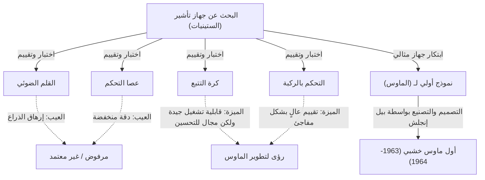
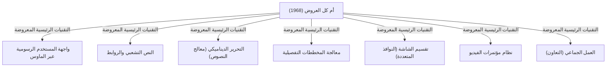

# مقدمة: التشغيل الحديث للكمبيوتر وأهمية الماوس

أصبح الكمبيوتر جزءًا لا يتجزأ من حياتنا اليومية وعملنا. ومن بين واجهات تشغيل هذا الكمبيوتر، يعد "الماوس" الجهاز الأكثر دراية بجانب لوحة المفاتيح. في الوقت الحاضر، مع انتشار الأجهزة ذات الشاشات التي تعمل باللمس مثل الهواتف الذكية والأجهزة اللوحية، أصبح اللمس المباشر للشاشة بأطراف الأصابع أمرًا شائعًا، لكن الماوس لا يزال يحتفظ بمكانة ثابتة في العمليات الدقيقة والعمل لفترات طويلة.

ومع ذلك، قد يكون من المثير للدهشة قلة عدد الأشخاص الذين يعرفون حقًا متى ومن ولأي غرض تم اختراع هذا الجهاز الصغير. يُسجل التاريخ اسم الباحث الأمريكي دوغلاس إنجيلبارت (Douglas Engelbart) كمخترع للماوس. لم يكن هدفه ببساطة إنشاء "جهاز تأشير مناسب". بل كان ما يطمح إليه هو بناء "نظام لتعزيز الذكاء البشري وحل المشكلات الاجتماعية المعقدة".

في هذا المقال، سنتعمق في حياة دوغلاس إنجيلبارت، هذا صاحب الرؤية الاستثنائية، ورؤيته الطموحة التي تبناها، والقصة وراء ولادة "الماوس" كأداة لتحقيق تلك الرؤية. بالإضافة إلى ذلك، سنناقش العرض التقديمي الأسطوري "The Mother of All Demos (أم كل العروض التجريبية)" الذي ترك أثرًا كبيرًا على عالم الحوسبة الحديث.

# شخصية دوغلاس إنجيلبارت

## نشأته وبدايات مسيرته المهنية

وُلد دوغلاس كارل إنجيلبارت في 30 يناير 1925، في بورتلاند، ولاية أوريغون بالولايات المتحدة الأمريكية. تزامنت طفولته مع عصر الكساد الكبير، ولم تكن بيئته ثرية بأي حال من الأحوال، إلا أن حياته في أوريغون وسط الطبيعة عززت فيه روح الاستكشاف والاستقلالية.

بدأ دراسة الهندسة الكهربائية في جامعة ولاية أوريغون، لكنه أوقف دراسته بسبب اندلاع الحرب العالمية الثانية وتم تجنيده في البحرية الأمريكية. تم تعيينه للعمل كفني رادار في الفلبين. كانت هذه التجربة كفني رادار بمثابة نقطة تحول أصلية حاسمة حددت [مسار](/ar/p/windows-%E3%81%A7%D9%85%D8%B3%D8%A7%D8%B1%E3%81%AE%E9%80%9A%E3%81%A3%E3%81%9F%D9%85%D9%84%D9%81-%D8%AA%D9%86%D9%81%D9%8A%D8%B0%D9%8A%E3%81%AE%E5%A0%B4%E6%89%80%E3%82%92%E8%A6%8B%E3%81%A4%E3%81%91%E3%82%8B%E6%96%B9%E6%B3%95/) حياته لاحقًا.

## تجربته كفني رادار والإلهام

على شاشة الرادار، تُعرض المعلومات التي يلتقطها الهوائي كنقاط ضوئية في الوقت الفعلي. تأثر إنجيلبارت بشدة بعملية "التقاط المعلومات بصريًا على الشاشة والتعامل معها بناءً على ذلك". كانت أجهزة الكمبيوتر (الحاسبات) في ذلك الوقت مجرد آلات ضخمة تعمل بنظام معالجة الدفعات، حيث يتم إدخال البيانات باستخدام البطاقات المثقبة وتلقي المخرجات كأعداد هائلة مطبوعة على الورق. لم يكن هناك أي فورية أو تفاعلية (Interactivity).

ومع ذلك، تصور إنجيلبارت مستقبلاً يتم فيه توصيل شاشات أنبوب الأشعة المهبطية (CRT) -مثل شاشات الرادار- بأجهزة الكمبيوتر، مما يسمح للبشر بمعالجة وبناء المعلومات في الوقت الفعلي أثناء النظر إلى الشاشة. كانت هذه فكرة رائدة للغاية ابتعدت تمامًا عن التفكير السائد في ذلك الوقت.

## التأثر بمقال فانيفار بوش "As We May Think"

بعد انتهاء الحرب، التقى إنجيلبارت بمقال غيّر مجرى حياته في مكتبة الصليب الأحمر في الفلبين. كان هذا المقال يحمل عنوان "As We May Think (كما قد نفكر)"، والذي كتبه فانيفار بوش، رئيس الإدارة العلمية الأمريكية، وتم نشره في مجلة The Atlantic Monthly عام 1945.

في هذا المقال، اقترح بوش نظامًا افتراضيًا لاسترجاع المعلومات يُدعى "Memex (ميميكس)". ميميكس هو جهاز يُخزن كل كتب الفرد وسجلاته واتصالاته على الميكروفيلم، ويسمح بالبحث عنها وعرضها فورًا من مكتب ميكانيكي. الأهم من ذلك، أنه تنبأ بمفهوم النص التشعبي (Hypertext) الحالي، والذي يسمح بربط وتتبع المعلومات مع بعضها البعض.

استلهم إنجيلبارت بقوة من مفهوم Memex. كان يعتقد أنه يمكن تحقيق النظام الميكانيكي المستند إلى الميكروفيلم الذي صوره بوش بشكل أكثر تطورًا باستخدام أحدث تقنيات الكمبيوتر الإلكتروني.

# رؤية "تعزيز الذكاء البشري (Augmenting Human Intellect)"

## المشاكل المعقدة التي تواجه البشرية

بعد تخرجه من الجامعة، بدأ إنجيلبارت العمل كمهندس في NACA (سلف وكالة ناسا الحالية). لكن بعد بضع سنوات، ومع اقتراب زواجه، بدأ يتأمل بعمق في الهدف من حياته: "ما الذي يجب أن أفعله لأقدم أكبر قيمة للعالم خلال ما تبقى من حياتي؟"

كانت النتيجة التي توصل إليها كالتالي:
1. تزداد مشاكل العالم تعقيدًا وإلحاحًا.
2. لا يمكن حل معظم هذه المشاكل بخبرة متخصصة واحدة.
3. لذلك، من الضروري تحسين قدرة البشرية نفسها على "التعامل مع المشاكل المعقدة".

هذه كانت بداية مفهوم "تعزيز الذكاء البشري (Augmenting Human Intellect)" الذي أصبح عمل حياته.

## الكمبيوتر كأداة للتفكير

اعتقد إنجيلبارت أن قدرة الإنسان على حل المشاكل المعقدة تعتمد بشكل كبير ليس فقط على الذكاء الفطري، ولكن أيضًا على اللغة والمنهجية و"الأدوات (Tools)". طوال التاريخ، عززت البشرية قدراتها على التفكير من خلال اختراع الكتابة وتقنيات الطباعة والتدوين الرياضي وغيرها.

لقد نظر إلى أجهزة الكمبيوتر الحديثة آنذاك ليس كـ "آلات حسابية"، بل كـ "أدوات متطورة لدعم وتوسيع العمل الفكري البشري". كان يعتقد أنه من خلال تفاعل البشر وأجهزة الكمبيوتر في الوقت الفعلي، وتصور الأفكار وهيكلتها ومشاركتها، يمكن تعزيز ليس فقط الذكاء الفردي ولكن أيضًا الذكاء الجماعي (Collective Intelligence) بشكل هائل.

## الإطار المفاهيمي (نظام H-LAM/T)

في عام 1962، نشر إنجيلبارت ورقة بحثية هامة بعنوان "Augmenting Human Intellect: A Conceptual Framework (تعزيز الذكاء البشري: إطار مفاهيمي)". في هذه الورقة، اقترح نموذجًا يُعرف بنظام "H-LAM/T (الإنسان الذي يستخدم اللغة والأدوات الاصطناعية والمنهجية، والذي تم تدريبه فيها)".

ينظر هذا النموذج إلى الإنسان (Human) الذي يستخدم اللغة (Language) والأدوات/الأشياء الاصطناعية (Artifacts) والمنهجية (Methodology)، ويتلقى التدريب (Training) عليها كحالة متكاملة لنظام واحد. كان يجادل بأن التعزيز الجذري للذكاء لا يحدث فقط من خلال تطوير أجهزة الكمبيوتر (الأدوات)، بل بإنشاء مفاهيم وأساليب تشغيل جديدة تتناسب معها، وبحصول الإنسان نفسه على التدريب للتكيف مع البيئة الجديدة.

هذا الموقف الذي يركز على "التدريب (Training)" ارتبط ارتباطًا وثيقًا بفلسفة تصميم نظامه اللاحق (إعطاء الأولوية للوظائف والقدرة على التعبير على حساب سهولة الاستخدام).

# تأسيس مركز أبحاث التعزيز (ARC) والتحدي

## العمل في معهد أبحاث ستانفورد (SRI)

لتحقيق رؤيته، انضم إنجيلبارت إلى معهد أبحاث ستانفورد (SRI، المعروف حاليًا بـ SRI International) بعد حصوله على درجة الدكتوراه من جامعة كاليفورنيا في بيركلي. في البداية، كان عدد قليل من الناس يفهمون رؤيته الكبيرة، وواجه صعوبات في جمع التبرعات، ولكن تدريجيًا بدأ باحثون موهوبون يتفقون مع أفكاره في التجمع حوله.

أسس مختبرًا بحثيًا داخل SRI يُسمى "مركز أبحاث التعزيز (ARC)"، وبدأ العمل الجاد على تطوير النظام بدعم من وكالة مشاريع الأبحاث المتقدمة التابعة لوزارة الدفاع (ARPA، المعروفة لاحقًا بـ DARPA) وغيرها.

## تطوير نظام NLS (oN-Line System)

كان هدف مركز أبحاث التعزيز (ARC) هو بناء نظام كمبيوتر متكامل يجسد رؤية إنجيلبارت. كان هذا النظام هو "NLS (oN-Line System)".

تضمن NLS النماذج الأولية للعديد من الميزات التي نستخدمها اليوم كأمر مسلم به.
- تحرير المستندات على الشاشة (وظيفة معالجة النصوص)
- النص التشعبي (الروابط بين المستندات)
- معالجة المخططات التفصيلية (توسيع وطي الهياكل الهرمية)
- النوافذ المتعددة
- العمل التعاوني عبر الشبكة ومؤتمرات الفيديو

لتشغيل هذه الميزات المتقدمة بشكل حدسي أثناء النظر إلى الشاشة، كانت الطريقة التقليدية للكتابة باستخدام لوحة المفاتيح وحدها محدودة. كانت هناك حاجة إلى "جهاز جديد" لتحديد أي مكان (نص أو رابط) على الشاشة بسرعة وبدقة.

# ولادة الماوس: التجربة والخطأ والاختراق

## البحث عن جهاز تأشير

للعثور على أفضل جهاز تأشير للعمل مع نظام NLS، قام إنجيلبارت وفريق ARC (وخاصة كبير المهندسين بيل إنجلش) باختبار ومقارنة الأجهزة المختلفة المتاحة في ذلك الوقت بدقة.

وشملت الأجهزة المختبرة ما يلي:
- **القلم الضوئي (Light Pen)**: طريقة لضغط القلم مباشرة على الشاشة. هو حدسي ولكنه متعب للغاية لأنه يتطلب إبقاء الذراع مرفوعة باستمرار.
- **عصا التحكم (Joystick)**: تحريك المؤشر عن طريق إمالة الرافعة. من الصعب ضبط الموضع الدقيق.
- **كرة التتبع (Trackball)**: طريقة تعتمد على دحرجة كرة. قابلية التشغيل جيدة نسبيًا.
- **التحكم بالركبة (Knee Control)**: جهاز يتم تشغيله باستخدام الركبة تحت المكتب. فاجأ الجميع بقابلية تشغيله الجيدة.
- **جرافاكون (Grafacon)**: جهاز يشبه القلم يستخدم على الأجهزة اللوحية.

قام إنجيلبارت بقياس ومقارنة قابلية الاستخدام وسرعة الإدخال ومعدل الخطأ لهذه الأجهزة بطريقة علمية.

## التعاون مع بيل إنجلش

كان لدى إنجيلبارت بالفعل فكرة عن جهاز ينزلق على المكتب لتحديد الإحداثيات على الشاشة، وقد رسم المخطط في دفتر ملاحظاته. لقد ابتكر جهازًا بعجلتين تقرأ حركات المحور X (الأفقي) والمحور Y (العمودي) بشكل منفصل.

تم تحويل هذه الفكرة إلى جهاز فعلي من قبل بيل إنجلش (Bill English)، مهندس الأجهزة البارز في ARC. بدأ في بناء النموذج الأولي حوالي عام 1963 بناءً على رسومات إنجيلبارت.

## صندوق خشبي وعجلتان: أول نموذج أولي

كان تصميم الماوس الأول في العالم مختلفًا تمامًا عن التصميم البلاستيكي الأنيق الحالي. كان عبارة عن كتلة مربعة (صندوق خشبي) مصنوعة من خشب الصنوبر، مع زر أحمر واحد فقط في الأعلى.

في الأسفل، تم تركيب عجلتين معدنيتين (أقراص) بزاوية قائمة مع بعضهما البعض. عند تحريك الماوس على المكتب، تُقرأ الحركة الرأسية كدوران لإحدى العجلات، والحركة الأفقية كدوران للعجلة الأخرى، ويتم تحويلها إلى إشارات كهربائية وإرسالها إلى الكمبيوتر. سمح هذا لمؤشر الشاشة بالتحرك بالتزامن التام مع حركة الماوس.

أثبتت التجارب المقارنة أن هذا "الجهاز الذي يتدحرج على المكتب" يمكن أن يشير بشكل أسرع وأكثر دقة بكثير من القلم الضوئي أو عصا التحكم.

## أصل اسم "الماوس"

لا يوجد سجل واضح يوضح متى ومن أطلق على هذا الجهاز اسم "الماوس (Mouse)". ذكر إنجيلبارت نفسه لاحقًا في إحدى المقابلات: "بدأ الجميع في المختبر في تسميته هكذا. بدا شكله كالفأر، وكان السلك يشبه الذيل. حاولنا إعطاءه اسمًا أكثر وقارًا، لكنه لم يترسخ في النهاية".

بالمناسبة، كانت العلامة التي تتحرك على الشاشة بالتزامن مع الماوس تُسمى في ذلك الوقت "حشرة (Bug)". كان يُستخدم كمصطلح عامي فكاهي يعني "الفأر (Mouse) يطارد الحشرة (Bug)".

# عام 1968: "أم كل العروض التجريبية (The Mother of All Demos)"

## العرض التقديمي الأسطوري

في 9 ديسمبر 1968، وقع حدث تاريخي غيّر تاريخ الكمبيوتر في مؤتمر الكمبيوتر المشترك لفصل الخريف الذي عُقد في سان فرانسيسكو. لقد كان عرضًا عامًا مدته 90 دقيقة قدمه دوغلاس إنجيلبارت أمام حوالي 1000 خبير في الكمبيوتر.

كان هذا العرض مذهلاً للغاية لدرجة أنه بدا وكأنه يتنبأ بكل التطورات التكنولوجية في مجال الكمبيوتر التي ستتبعه، ولذلك تمت الإشادة به لاحقًا باسم "أم كل العروض التجريبية (The Mother of All Demos)".

## التقنيات الثورية المعروضة

وضع إنجيلبارت وحدة تحكم خاصة في وسط المسرح، وجلس ممسكًا بـ "لوحة مفاتيح الأوتار (Keyset)" في يده اليسرى لإدخال الأكواد، و"الماوس" في يده اليمنى، وخلفه شاشة عرض عملاقة. ارتدى سماعة رأس وبدأ في عرض ميزات NLS واحدة تلو الأخرى بنبرة هادئة.

تم ربط قاعة المؤتمرات في سان فرانسيسكو ومختبر SRI في مينلو بارك الذي يبعد حوالي 50 كيلومترًا، باستخدام أحدث اتصالات الموجات الدقيقة والخطوط المؤجرة في ذلك الوقت. تم تحرير المستندات على الشاشة في الوقت الفعلي تزامنًا مع عمليات إنجيلبارت، وعُرضت الملفات الموجودة في مواقع مختلفة من خلال الانتقال السريع عبر الروابط التشعبية.

الأمر الأكثر إثارة للدهشة هو عرض ظهر فيه وجه زميل في المختبر كفيديو في نافذة على الشاشة، وقاموا بتحرير نفس المستند معًا ومشاركة نفس المؤشر بينما كانوا يتحدثون عبر الصوت. هذا يعني أنه تم تحقيق أداة تعاون مشابهة لتطبيقات Zoom وGoogle Docs في الستينيات، قبل وجود الإنترنت وحتى قبل وجود أجهزة الكمبيوتر الشخصية.

## صدمة الجمهور والتأثير على الأجيال القادمة

بالنسبة للخبراء في ذلك الوقت، الذين كانوا يعرفون فقط الأنظمة التي تقرأ البطاقات المثقبة وتطبع النتائج بعد عدة ساعات، كان هذا العرض صادمًا وكأنه سحر أو فيلم خيال علمي. عندما انتهى العرض التقديمي، وقف الجمهور بأكمله وصفق بحرارة، وملأ التصفيق الحار القاعة.

تأثر العديد من الباحثين، بما في ذلك آلان كاي (Alan Kay) في شبابه، بشدة برؤية إنجيلبارت بعد رؤية هذا العرض، وقادوا لاحقًا ثورة الكمبيوتر الشخصي.

# الانتقال إلى مختبر بالو ألتو (Xerox PARC) والتوسع نحو أبل

## رؤية "Dynabook" لآلان كاي وجهاز Dynabook المؤقت (Alto)

في أوائل السبعينيات، بدأ مختبر ARC التابع لإنجيلبارت يفقد زخمه تدريجيًا بسبب الصعوبات المالية الناجمة عن حرب فيتنام وإصراره على نظام "صعب الفهم" للغاية. انتقل العديد من الباحثين الممتازين، بمن فيهم مرؤوسه بيل إنجلش، إلى مركز أبحاث بالو ألتو (Xerox PARC) الذي أسسته شركة زيروكس حديثًا.

في PARC، استمرت الأبحاث نحو رؤية "الحوسبة الشخصية" التي دعا إليها آلان كاي وآخرون. ورثوا مفاهيم إنجيلبارت الخاصة بـ "الماوس" و"العمليات على الشاشة"، وقاموا بتحسين نظام التشغيل المعقد ليصبح أكثر سهولة وألفة للمستخدم. هكذا وُلد "ألتو (Alto)"، أول كمبيوتر في العالم مزود بشاشة عرض نقطية، وواجهة مستخدم رسومية (GUI)، وماوس. تطور الماوس أيضًا من كونه خشبيًا إلى جهاز يستخدم كرة ليصبح أسهل في الاستخدام.

## نقل التكنولوجيا من زيروكس إلى أبل (ماكنتوش)

في عام 1979، أتيحت الفرصة لستيف جوبز، المؤسس المشارك لشركة أبل (Apple Computer)، لزيارة Xerox PARC. صُدم جوبز بواجهة المستخدم الرسومية لـ Alto وسهولة تشغيل الماوس، واقتنع بأن "هذا هو مستقبل أجهزة الكمبيوتر"، وأدخل هذه المفاهيم بقوة في مشروع التطوير الخاص بشركته.

أعاد مهندسو أبل تصميم ماوس زيروكس المكلف والمعقد إلى جهاز بزر واحد يمكن إنتاجه بكميات كبيرة بتكلفة منخفضة ويتحرك بسلاسة على أي مكتب. مع إطلاق "ليزا (Lisa)" في عام 1983 و"ماكنتوش (Macintosh)" في عام 1984، تطور الماوس بشكل سريع من أداة مخصصة لبعض الباحثين إلى جهاز إدخال قياسي يستخدمه المستهلكون العاديون في منازلهم.

## النجاح التجاري للماوس وتعميمه

لاحقًا، وبالتزامن مع انتشار Microsoft Windows، أصبح الماوس جهازًا قياسيًا في جميع أجهزة الكمبيوتر الشخصية في جميع أنحاء العالم. تغيرت العجلتان إلى كرة مطاطية، ثم تطورت إلى مستشعرات بصرية، وحققت تقدمًا تقنيًا لتصبح نماذج ليزرية ولاسلكية. ومع ذلك، لا يزال النموذج الأساسي الذي ابتكره إنجيلبارت "الإمساك به باليد وتحريكه للتحكم في المؤشر على الشاشة" قائمًا حتى بعد مرور أكثر من نصف قرن.

# تراث إنجيلبارت من منظور حديث

## الرؤية غير المكتملة: التحذير من مجرد سهولة الاستخدام (User-friendly)

انتشر الماوس في جميع أنحاء العالم، وأصبح بإمكان أي شخص تشغيل الكمبيوتر بشكل حدسي (ما يسمى بـ سهولة الاستخدام). ومع ذلك، كان لدى إنجيلبارت نفسه مشاعر مختلطة تجاه هذا الوضع الحالي.

انتقد تبسيط النظام في السعي وراء "سهولة الاستخدام (User-friendly)" فقط، واعتبر ذلك مشابهًا لإعطاء شخص دراجة ثلاثية العجلات وإخباره "هذا يكفي". يتطلب إتقان ركوب الدراجة بعض التدريب، ولكن بمجرد إتقانها، ستحصل على سرعة وحرية لا يمكن مقارنتها بالدراجة الثلاثية.

كان نظام H-LAM/T الذي استهدفه إنجيلبارت مخصصًا لتمكين البشر من إتقان استخدام أدوات (أنظمة) أكثر قوة من خلال التدريب ورفع حدود الذكاء. على الرغم من أن واجهات المستخدم الرسومية (GUI) الحديثة سهلة الاستخدام بالتأكيد، إلا أنها قد تكون مجرد بوابة للإمكانيات عند النظر إليها من منظور "التعزيز الجذري للذكاء" الذي حلم به.

## الارتباط بالذكاء الجماعي (Collective Intelligence)

يكمن الإنجاز الحقيقي لإنجيلبارت، أكثر من اختراع الماوس نفسه، في تجسيد مفهوم "الذكاء الجماعي (Collective Intelligence)" كنظام، حيث يتشارك الناس حول العالم المعرفة ويتعاونون لحل المشكلات من خلال الشبكة.

يمكن القول إن الإنترنت الحالي، والشبكة العالمية (WWW)، وويكيبيديا، ومجتمعات المصادر المفتوحة مثل GitHub هي بالضبط تطبيقات حديثة لـ "تعزيز الذكاء" الذي تصوره. قبل فترة طويلة من اختراع تيم بيرنرز لي لشبكة WWW، رأى إنجيلبارت مستقبلاً ترتبط فيه المعلومات ببعضها البعض عبر الشبكة.

## التطور المشترك للإنسان والتكنولوجيا

في العصر الحالي حيث يتطور الذكاء الاصطناعي (AI) بسرعة وتدور المناقشات حول "التفرد (Singularity)" الذي يتجاوز الذكاء البشري، تتألق أفكار إنجيلبارت مرة أخرى. لم يكن هدفه استبدال التفكير البشري بالآلات (الذكاء الاصطناعي)، بل استخدام الآلات لتوسيع واستكمال قدرات التفكير البشري (تعزيز الذكاء: Intelligence Amplification / IA).

الآن ومع تغلغل الذكاء الاصطناعي في حياتنا، كيف نصمم التكنولوجيا وكيف نستخدمها (نتدرب عليها)؟ يشكل موضوع التطور المشترك للإنسان والتكنولوجيا، وهو الموضوع الضخم الذي طرحه إنجيلبارت، تحديًا كبيرًا لنا في العصر الحديث.

# خاتمة: سؤال إنجيلبارت المتروك للـ "مستقبل"

توفي دوغلاس إنجيلبارت في 2 يوليو 2013، عن عمر يناهز 88 عامًا. أصبح الماوس الذي صنعه من صندوق خشبي وعجلات جسرًا يربط مليارات الأشخاص بالعالم الرقمي، وغيّر العالم من جذوره.

لقد أصبحت المشاهد السحرية التي عُرضت في "أم كل العروض" عام 1968 جزءًا من حياتنا اليومية الآن. ومع ذلك، فإن رؤيته النهائية المتمثلة في "حل المشاكل المعقدة على مستوى الكوكب من خلال تعزيز الذكاء البشري" لم تتحقق بالكامل بعد.

عندما نمسك الماوس، وننقر على المعلومات الموجودة على الشاشة، ونسبح في بحر الإنترنت، فإن نفحات "المستقبل" التي رآها ذلك العبقري تتنفس هناك. إن النظر إلى مسيرة دوغلاس إنجيلبارت يجب أن يكون دليلاً مؤكدًا لنا للتفكير في المكان الذي يجب أن نتجه إليه مع التكنولوجيا من الآن فصاعدًا.
