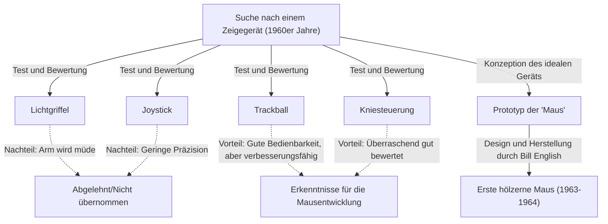
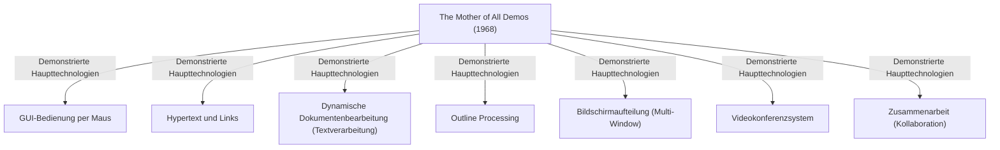

# Einleitung: Die moderne Computerbedienung und die Bedeutung der Maus

In unserem Alltag und bei der Arbeit sind Computer unverzichtbar geworden. Neben der Tastatur ist die "Maus" das bekannteste Gerät als Schnittstelle zur Bedienung des Computers. Obwohl Touch-Panel-Geräte wie Smartphones und Tablets heute weit verbreitet sind und die direkte Berührung des Bildschirms mit den Fingerspitzen alltäglich geworden ist, behält die Maus bei präzisen Operationen und stundenlanger Arbeit weiterhin eine unerschütterliche Position.

Dennoch wissen überraschend wenige Menschen, wann, von wem und zu welchem Zweck dieses kleine Gerät erfunden wurde. Der Mann, der als Erfinder der Maus in die Geschichte einging, ist der amerikanische Forscher Douglas Engelbart. Er wollte nicht einfach nur ein "bequemes Zeigegerät" entwickeln. Sein Ziel war es, ein "System zur Erweiterung des menschlichen Intellekts und zur Lösung komplexer sozialer Probleme" aufzubauen.

Dieser Artikel geht detailliert auf das Leben von Douglas Engelbart, einem seltenen Visionär, seine großartige Vision und die geheime Entstehungsgeschichte der "Maus" als Werkzeug zur Verwirklichung dieser Vision ein. Darüber hinaus wird die legendäre Präsentation "The Mother of All Demos" beleuchtet, die das moderne Computing massiv beeinflusst hat.

# Die Person Douglas Engelbart

## Frühes Leben und anfängliche Karriere

Douglas Carl Engelbart wurde am 30. Januar 1925 in Portland, Oregon, USA, geboren. Seine Kindheit fiel in die Zeit der Great Depression, und seine Umgebung war keineswegs wohlhabend, aber das Leben in der Natur Oregons förderte seinen Forschergeist und seine Unabhängigkeit.

Er begann ein Studium der Elektrotechnik an der Oregon State University, unterbrach jedoch sein Studium aufgrund des Ausbruchs des Zweiten Weltkriegs und wurde zur US Navy eingezogen. Er wurde als Radartechniker auf die Philippinen geschickt. Diese Erfahrung als Radartechniker wurde zu einer entscheidenden Urerfahrung, die sein späteres Leben bestimmen sollte.

## Erfahrung und Offenbarung als Radartechniker

Auf dem Bildschirm des Radars werden die von der Antenne erfassten Informationen in Echtzeit als Lichtpunkte angezeigt. Engelbart war tief beeindruckt von diesem Prozess des "visuellen Erfassens von Informationen auf einem Bildschirm und der darauf basierenden Informationsmanipulation". Die damaligen Computer (Rechner) waren lediglich gigantische, stapelverarbeitende Maschinen, in die Daten über Lochkarten eingegeben wurden und die als Ausgabe riesige Zahlenreihen auf Papier gedruckt lieferten. Es gab weder Echtzeitfähigkeit noch Interaktivität (Dialogfähigkeit).

Engelbart stellte sich jedoch eine Zukunft vor, in der ein Kathodenstrahlröhren-Bildschirm (CRT) ähnlich dem eines Radarschirms an einen Computer angeschlossen ist und der Mensch Informationen in Echtzeit manipulieren und strukturieren kann, während er auf den Bildschirm blickt. Dies war eine äußerst fortschrittliche Idee, die weit von der damaligen Norm abwich.

## Der Einfluss von Vannevar Bushs "As We May Think"

Nach dem Krieg stieß Engelbart in einer Bibliothek des Roten Kreuzes auf den Philippinen auf einen schicksalhaften Artikel. Es war der Essay "As We May Think", den Vannevar Bush, der Chef der amerikanischen Wissenschaftsadministration, 1945 in der Zeitschrift *The Atlantic Monthly* veröffentlicht hatte.

Bush schlug in diesem Artikel ein fiktives Informationsabrufsystem namens "Memex" vor. Memex war ein Gerät, das alle persönlichen Bücher, Aufzeichnungen und Kommunikationen auf Mikrofilm speicherte und sie von einem mechanisierten Schreibtisch aus sofort durchsuchbar und lesbar machte. Am wichtigsten ist, dass es das Konzept des heutigen Hypertexts vorwegnahm, indem Informationen miteinander "verknüpft (verlinkt)", gespeichert und nachverfolgt werden konnten.

Engelbart war stark von dem Konzept des Memex inspiriert. Er glaubte, dass das mechanische System auf Mikrofilmbasis, das Bush entworfen hatte, durch den Einsatz modernster elektronischer Computertechnologie noch weiterentwickelt werden könnte.

# Die Vision von "Augmenting Human Intellect" (Erweiterung des menschlichen Intellekts)

## Komplexe Probleme der Menschheit

Nach seinem Universitätsabschluss begann Engelbart als Ingenieur bei NACA (dem Vorgänger der heutigen NASA) zu arbeiten. Doch einige Jahre später, kurz vor seiner Hochzeit, begann er tief über den Sinn seines Lebens nachzudenken: "Was sollte ich mit dem Rest meines Lebens anfangen, um der Welt den größten Nutzen zu bringen?"

Die Schlussfolgerungen, zu denen er kam, waren folgende:
1. Die Probleme der Welt werden immer komplexer und dringender.
2. Es handelt sich ausschließlich um Probleme, die nicht durch ein einzelnes Fachwissen allein gelöst werden können.
3. Daher ist es notwendig, die "Fähigkeit der Menschheit, mit komplexen Problemen umzugehen", selbst zu verbessern.

Dies war die Geburt des Konzepts der "Erweiterung des menschlichen Intellekts" (Augmenting Human Intellect), das zu seinem Lebenswerk werden sollte.

## Der Computer als Denkwerkzeug

Engelbart glaubte, dass die Fähigkeit des Menschen, komplexe Probleme zu lösen, stark von Sprache, Methodik und "Werkzeugen" abhängt, nicht nur von der angeborenen Intelligenz. Die Menschheit hat bisher ihre Denkfähigkeit durch die Erfindung der Schrift, den Buchdruck, die mathematische Notation usw. erweitert.

Er sah den gerade neu aufgekommenen Computer nicht als "Maschine zum Rechnen", sondern als "das ultimative Werkzeug zur Unterstützung und Erweiterung der menschlichen intellektuellen Arbeit". Er glaubte fest daran, dass nicht nur der individuelle Intellekt, sondern auch der kollektive Intellekt exponentiell gesteigert werden könnte, wenn Mensch und Computer in Echtzeit miteinander interagieren, um Gedanken zu visualisieren, zu strukturieren und zu teilen.

## Das konzeptionelle Framework (H-LAM/T-System)

1962 veröffentlichte Engelbart die bahnbrechende Arbeit "Augmenting Human Intellect: A Conceptual Framework". Darin schlug er ein Modell namens "H-LAM/T (Human using Language, Artifacts, Methodology, in which he is Trained)" System vor.

Dieses System betrachtet einen Zustand, in dem ein Mensch (Human) Sprache (Language), Artefakte/Werkzeuge (Artifacts) und Methoden (Methodology) verwendet und darin geschult (Training) ist, als ein einheitliches, integriertes System. Seine Behauptung war, dass eine drastische Erweiterung des Intellekts erst dann stattfindet, wenn nicht nur die Computer (Artifacts) weiterentwickelt werden, sondern auch neue Konzepte und Operationsmethoden (Language, Methodology) geschaffen werden, die an diese angepasst sind, und wenn die Menschen selbst trainiert werden, sich an die neue Umgebung anzupassen.

Diese Haltung, großen Wert auf das "Training" zu legen, ist eng mit der späteren Designphilosophie seines Systems verbunden (Funktionalität und Ausdruckskraft über Benutzerfreundlichkeit stellen).

# Die Gründung des ARC (Augmentation Research Center) und seine Herausforderungen

## Aktivitäten am SRI (Stanford Research Institute)

Um seine Vision zu verwirklichen, schloss sich Engelbart nach seiner Promotion an der UC Berkeley dem Stanford Research Institute (SRI, heute SRI International) an. Anfangs verstanden nur wenige seine großartige Vision, und er hatte Mühe, finanzielle Mittel aufzubringen, aber allmählich begannen sich exzellente Forscher zu versammeln, die seine Ideen unterstützten.

Er gründete im SRI ein Forschungslabor namens "ARC (Augmentation Research Center)" und begann mit ernsthafter Systementwicklung, unterstützt durch Institutionen wie die ARPA (Advanced Research Projects Agency des Verteidigungsministeriums, später DARPA).

## Die Entwicklung von NLS (oN-Line System)

Das Ziel von ARC war es, ein integriertes Computersystem aufzubauen, das Engelbarts Vision verkörpert. Das Ergebnis war das "NLS (oN-Line System)".

NLS wies bereits die Prototypen vieler Funktionen auf, die wir heute selbstverständlich nutzen:
- Dokumentenbearbeitung auf dem Bildschirm (Textverarbeitungsfunktionen)
- Hypertext (Links zwischen Dokumenten)
- Outline Processing (Erweitern und Reduzieren von hierarchischen Strukturen)
- Mehrere Fenster (Multi-Windowing)
- Zusammenarbeit über ein Netzwerk und Videokonferenzen

Um diese fortgeschrittenen Funktionen intuitiv mit Blick auf den Bildschirm bedienen zu können, stieß die traditionelle Methode der reinen Tastatureingabe an ihre Grenzen. Es wurde ein "neues Gerät" benötigt, um einen beliebigen Ort auf dem Bildschirm (Text oder Link) schnell und präzise anzuvisieren.

# Die Entstehung der Maus: Trial and Error und der Durchbruch

## Die Suche nach dem Zeigegerät

Um das optimale Zeigegerät für den Betrieb von NLS zu finden, testeten und verglichen Engelbart und das ARC-Team (insbesondere der Chefingenieur Bill English) intensiv verschiedene damals existierende Geräte.

Zu den getesteten Geräten gehörten:
- **Lichtgriffel**: Eine Methode, bei der ein Stift direkt auf den Bildschirm gedrückt wird. Intuitiv, aber sehr ermüdend, da der Arm ständig angehoben bleiben muss.
- **Joystick**: Einen Hebel bewegen, um den Cursor zu steuern. Eine feine Ausrichtung ist schwierig.
- **Trackball**: Eine Methode, bei der eine Kugel gerollt wird. Die Bedienbarkeit ist relativ gut.
- **Kniesteuerung (Knee Control)**: Ein Gerät, das unter dem Schreibtisch mit dem Knie bedient wird. Die Bedienbarkeit war überraschend gut.
- **Grafacon**: Ein stiftähnliches Gerät auf einem Tablet.

Engelbart maß und verglich die Benutzerfreundlichkeit, die Eingabegeschwindigkeit und die Fehlerrate dieser Geräte wissenschaftlich.

## Zusammenarbeit mit Bill English

Engelbart hatte schon seit einiger Zeit die Idee, einen Cursor auf dem Bildschirm zu steuern, indem man etwas über den Schreibtisch gleiten lässt, und hatte eine Skizze davon in seinem Notizbuch angefertigt. Er entwarf ein Gerät mit zwei Rädern, die die Bewegung auf der X-Achse (horizontal) und der Y-Achse (vertikal) getrennt erfassen.

Bill English, ein brillanter Hardware-Ingenieur bei ARC, verwandelte diese Idee in tatsächliche Hardware. Basierend auf Engelbarts Skizzen begann er um 1963 mit der Arbeit an einem Prototyp.

## Eine Holzkiste und zwei Räder: Der erste Prototyp

Die erste Maus der Welt unterschied sich grundlegend vom raffinierten Kunststoffdesign der Gegenwart. Es handelte sich um einen quadratischen Block (Holzkiste) aus Kiefernholz mit nur einem einzigen roten Knopf auf der Oberseite.

Auf der Unterseite waren zwei Metallräder (Scheiben) im rechten Winkel zueinander angebracht. Wenn die Maus über den Schreibtisch bewegt wurde, wurde die vertikale Bewegung als Drehung des einen Rades und die horizontale Bewegung als Drehung des anderen Rades erfasst, in elektrische Signale umgewandelt und an den Computer gesendet. Dadurch bewegte sich der Cursor auf dem Bildschirm perfekt synchron mit der Bewegung der Maus.

Vergleichsexperimente zeigten, dass dieses "Gerät, das über den Schreibtisch rollt", Lichtgriffeln oder Joysticks in Bezug auf Geschwindigkeit und Genauigkeit beim Zeigen weitaus überlegen war.

## Der Ursprung des Namens "Maus"

Tatsächlich gibt es keine eindeutige Aufzeichnung darüber, wann und von wem dieses Gerät "Maus" (Mouse) genannt wurde. Engelbart selbst sagte in einem späteren Interview: "Jeder im Labor fing an, sie so zu nennen. Ihre Form ähnelte einer Maus, und das Kabel sah aus wie ein Schwanz. Wir haben versucht, ihr einen würdevolleren Namen zu geben, aber das hat sich nie durchgesetzt."

Übrigens wurde die Markierung, die sich auf dem Bildschirm in Verbindung mit der Maus bewegte, damals als "Bug" (Käfer) bezeichnet. Es wurde als humorvoller Slang für "Die Maus jagt den Käfer" verwendet.

# 1968: "The Mother of All Demos"

## Eine legendäre Präsentation

Am 9. Dezember 1968 fand auf der Fall Joint Computer Conference in San Francisco ein historisches Ereignis statt, das die Geschichte des Computers verändern sollte. Es war eine 90-minütige öffentliche Demonstration von Douglas Engelbart vor etwa 1.000 Computerexperten.

Diese Demo war so überwältigend, als hätte sie die gesamten zukünftigen Fortschritte der Computertechnologie vorhergesehen, dass sie später als "The Mother of All Demos" gelobt wurde.

## Vorgestellte bahnbrechende Technologien

Engelbart stellte eine spezielle Konsole in die Mitte der Bühne und saß mit einer riesigen Projektionsfläche im Rücken. In seiner linken Hand hielt er ein "Keyset" (eine Tastatur mit 5 Tasten für die Akkordeingabe) und in seiner rechten Hand die "Maus". Mit einem Headset-Mikrofon ausgestattet, demonstrierte er mit ruhiger Stimme eine NLS-Funktion nach der anderen.

Der Veranstaltungsort in San Francisco und das etwa 50 Kilometer entfernte SRI-Labor in Menlo Park waren über eine hochmoderne Mikrowellenverbindung und Standleitungen verbunden. Dokumente auf dem Bildschirm wurden in Echtzeit entsprechend Engelbarts Eingaben bearbeitet, und an verschiedenen Orten gespeicherte Dateien wurden durch Hyperlinks angesprungen und angezeigt.

Noch erstaunlicher war eine Demo, bei der das Gesicht eines Kollegen im Labor als Videobild in einem Fenster auf dem Bildschirm erschien und sie miteinander redeten, während sie denselben Cursor im selben Dokument teilten, um dieses gemeinsam zu bearbeiten. Dies bedeutete, dass ein Collaboration-Tool wie Zoom oder Google Docs bereits in den 1960er Jahren existierte – lange bevor es das Internet oder gar Personal Computer gab.

## Der Schock des Publikums und die Auswirkungen auf zukünftige Generationen

Für die damaligen Experten, die nur Systeme kannten, bei denen man Lochkarten in eine Maschine einlas und Stunden später den Ausdruck der Ergebnisse erhielt, war diese Demo ein Schock, als würden sie Magie oder einen Science-Fiction-Film sehen. Als die Präsentation endete, erhob sich das Publikum zu stehenden Ovationen, die den Saal erfüllten.

Viele Forscher, darunter ein junger Alan Kay, die diese Demo sahen, wurden entscheidend von Engelbarts Vision beeinflusst und trieben die anschließende Personal-Computer-Revolution voran.

# Die Weitergabe an das Palo Alto Research Center (Xerox PARC) und die Ausbreitung auf Apple

## Alan Kays "Dynabook"-Konzept und das Interim-Dynabook (Alto)

In den 1970er Jahren verlor Engelbarts ARC-Laboratorium aufgrund finanzieller Schwierigkeiten im Zusammenhang mit dem Vietnamkrieg und seiner eigenen Beharrlichkeit auf ein "zu komplexes" System allmählich an Dynamik. Viele brillante Forscher, darunter sein Untergebener Bill English, wechselten an das von Xerox neu gegründete Palo Alto Research Center (Xerox PARC).

Bei PARC wurde die Forschung in Richtung der Vision des "Personal Computing" vorangetrieben, die von Alan Kay und anderen vertreten wurde. Sie übernahmen Engelbarts Konzepte der "Maus" und der "Bildschirmbedienung", verbesserten jedoch das komplexe Bediensystem, um es intuitiver und benutzerfreundlicher zu machen. Daraus entstand der "Alto", der erste Computer der Welt mit einem Bitmap-Display, einer GUI (Graphical User Interface) und einer Maus. Auch die Maus entwickelte sich von einem Holzmodell zu einem mit einer Kugel betriebenen, benutzerfreundlicheren Gerät weiter.

## Technologietransfer von Xerox zu Apple (Macintosh)

Im Jahr 1979 hatte Steve Jobs, Mitbegründer von Apple Computer, die Gelegenheit, Xerox PARC zu besuchen. Geschockt von der GUI und der Bedienbarkeit der Maus des Alto war Jobs überzeugt: "Das ist die Zukunft des Computers", und integrierte dieses Konzept mit Nachdruck in die Entwicklungsprojekte seines eigenen Unternehmens.

Die Ingenieure von Apple überarbeiteten die teure und komplexe Xerox-Maus radikal. Sie gestalteten sie so um, dass sie nur eine Taste besaß, kostengünstig massenproduziert werden konnte und sich reibungslos auf jedem Schreibtisch bewegte. Mit der Veröffentlichung der "Lisa" im Jahr 1983 und des "Macintosh" im Jahr 1984 verbreitete sich die Maus rasant – von einem Werkzeug für einige wenige Forscher zu einem Standard-Eingabegerät für normale Verbraucher zu Hause.

## Der kommerzielle Erfolg der Maus und ihre Popularisierung

Danach, gekoppelt mit der Verbreitung von Microsoft Windows, wurde die Maus zur Standardausstattung aller PCs weltweit. Die beiden Räder wurden durch eine Gummikugel ersetzt, entwickelten sich schließlich zu optischen Sensoren und machten technische Fortschritte in Form von Lasern und kabellosen Verbindungen. Doch das grundlegende Paradigma, das Engelbart erfunden hat – "sie in der Hand halten, bewegen und damit einen Cursor auf dem Bildschirm steuern" –, ist auch nach über einem halben Jahrhundert unverändert geblieben.

# Engelbarts Vermächtnis aus heutiger Sicht

## Eine unvollendete Vision: Eine Warnung vor bloßer Benutzerfreundlichkeit (User-friendly)

Die Maus hat sich weltweit verbreitet, und jeder kann einen Computer intuitiv bedienen (das sogenannte User-friendly). Engelbart selbst hatte jedoch gemischte Gefühle bezüglich dieses Zustands.

Er kritisierte, dass die Vereinfachung von Systemen nur im Streben nach "Benutzerfreundlichkeit" (User-friendly) dem gleichkomme, jemandem ein Dreirad zu geben und zu sagen: "Das reicht aus". Das Fahren eines Fahrrads erfordert ein wenig Training, aber sobald man es beherrscht, erreicht man eine Geschwindigkeit und Freiheit, die mit der eines Dreirads nicht vergleichbar sind.

Das von Engelbart angestrebte H-LAM/T-System war dafür gedacht, Menschen durch Training den Umgang mit mächtigeren Werkzeugen (Systemen) beizubringen und die Grenzen des Intellekts zu erweitern. Die modernen GUIs sind zwar sicherlich einfach zu bedienen, aber aus der Perspektive seiner erträumten "dramatischen Erweiterung des Intellekts" betrachtet, stehen wir vielleicht immer noch nur am Anfang ihrer Möglichkeiten.

## Verbindung zum kollektiven Intellekt (Kollektive Intelligenz)

Engelbarts wahre Leistung liegt nicht in der Erfindung der Maus selbst, sondern vielmehr in der systemischen Verwirklichung des Konzepts der "kollektiven Intelligenz" (Collective Intelligence), bei dem Menschen auf der ganzen Welt Wissen über ein Netzwerk austauschen und zusammenarbeiten, um Probleme zu lösen.

Das moderne Internet, das World Wide Web (WWW), Wikipedia, GitHub und andere Open-Source-Communities können als die moderne Implementierungsform der von ihm envisioned "Erweiterung des Intellekts" angesehen werden. Lange bevor Tim Berners-Lee das WWW erfand, sah Engelbart eine Zukunft, in der Informationen über ein Netzwerk miteinander verlinkt sind.

## Die Koevolution von Mensch und Technologie

In der heutigen Zeit, in der sich die künstliche Intelligenz (KI) rasant entwickelt und über eine "Singularität" diskutiert wird, die die menschliche Intelligenz übertreffen könnte, leuchtet Engelbarts Philosophie wieder auf. Sein Ziel war es nicht, das menschliche Denken durch Maschinen zu ersetzen (Künstliche Intelligenz), sondern Maschinen zu nutzen, um die menschliche Denkfähigkeit zu erweitern und zu ergänzen (Intelligenzverstärkung: Intelligence Amplification / IA).

Jetzt, da KI zunehmend in unser Leben eindringt, stellt sich die Frage: Wie sollten wir Technologien entwerfen und wie werden wir sie nutzen (uns daran trainieren)? Die Koevolution von Mensch und Technologie, das gigantische Thema, das Engelbart präsentierte, ist eine wichtige Aufgabe für uns, die wir in der heutigen Zeit leben.

# Fazit: Engelbarts Frage an die "Zukunft"

Douglas Engelbart verstarb am 2. Juli 2013 im Alter von 88 Jahren. Die "Maus", die er aus einer Holzkiste und Rädern schuf, ist zu einer Brücke geworden, die Milliarden von Menschen mit der digitalen Welt verbindet und die Welt grundlegend verändert hat.

Die magischen Szenen, die 1968 in der *The Mother of All Demos* gezeigt wurden, sind heute unser Alltag. Doch seine ultimative Vision – "die Lösung komplexer globaler Probleme durch die Erweiterung des menschlichen Intellekts" – ist noch immer nicht vollständig verwirklicht.

Wenn wir heute eine Maus in die Hand nehmen, auf Informationen auf einem Bildschirm klicken und durch das Meer des Internets schwimmen, spüren wir den Hauch der "Zukunft", die von einem einzelnen Genie gesehen wurde. Der Rückblick auf den Weg von Douglas Engelbart sollte ein sicherer Wegweiser für unsere Überlegungen sein, wohin wir uns zusammen mit der Technologie in Zukunft bewegen sollten.
