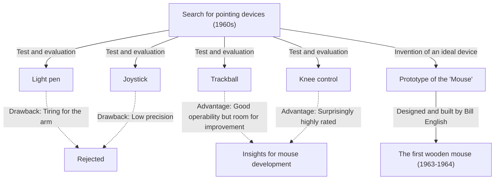
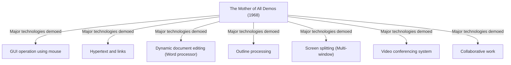

# Introduction: Modern Computer Operation and the Significance of the Mouse

In our daily lives and work, computers have become indispensable. As an interface for operating these computers, the "mouse" is the most familiar device alongside the keyboard. Today, touch panel devices like smartphones and tablets have become widespread, and operating by directly touching the screen with fingertips has become common, but for precise operations and long hours of work, the mouse still holds an immovable position.

However, surprisingly few people may know deeply when, by whom, and for what purpose this small device was invented. The person who etched his name in history as the inventor of the mouse is Douglas Engelbart, an American researcher. He didn't just want to create a "convenient pointing device." His goal was to build a "system to amplify human intellect and solve complex social problems."

This article delves deep into the life of Douglas Engelbart, a rare visionary, his grand vision, the birth story of the "mouse" created as a tool to realize that vision, and the legendary presentation "The Mother of All Demos" that greatly influenced modern computing.

# Who was Douglas Engelbart?

## Early Life and Career

Douglas Carl Engelbart was born on January 30, 1925, in Portland, Oregon, USA. His childhood overlapped with the Great Depression, and it was by no means a wealthy environment, but living in Oregon, surrounded by nature, nurtured his inquisitive mind and independence.

He began studying electrical engineering at Oregon State University but interrupted his studies due to the outbreak of World War II and was drafted into the US Navy. He was assigned as a radar technician in the Philippines. This experience as a radar technician became an important original experience that would define his later life.

## Experience and Revelation as a Radar Technician

On a radar screen, information captured by the antenna is displayed in real-time as points of light. Engelbart was deeply impressed by this process of "visually capturing information on a screen and manipulating information based on it." Computers (calculators) of the time were nothing more than massive, batch-processing machines where data was input via punch cards and output was received as vast sequences of numbers printed on paper. There was neither real-time capability nor interactivity.

However, Engelbart envisioned a future where a cathode-ray tube (CRT) display, like a radar screen, was connected to a computer, allowing humans to manipulate and construct information in real-time while looking at the screen. This was an extremely pioneering idea, far removed from the common sense of the time.

## Influence from Vannevar Bush's "As We May Think"

After the war, in a Red Cross library in the Philippines, Engelbart had a fateful encounter with an article. It was an essay titled "As We May Think," contributed to The Atlantic Monthly in 1945 by Vannevar Bush, the head of US science administration.

In this article, Bush proposed a hypothetical information retrieval system called "Memex." Memex is a device that stores an individual's entire library, records, and communications on microfilm, allowing instant retrieval and viewing from a mechanized desk. Most importantly, it foresaw the concept of modern hypertext, where information could be stored and tracked by "associating (linking)" one piece of information with another.

Engelbart received strong inspiration from the concept of Memex. He thought that the mechanical system using microfilm envisioned by Bush could be realized even more sophisticatedly using cutting-edge electronic computer technology.

# The Vision of "Augmenting Human Intellect"

## Complex Problems Facing Humanity

After graduating from college, Engelbart started working as an engineer at NACA (the predecessor of current NASA), but a few years later, facing marriage, he began to think deeply about the purpose of his life. "What should I do with the rest of my life to bring the maximum value to the world?"

The conclusion he reached was as follows:
1. The world's problems are becoming increasingly complex and urgent.
2. The problems are such that they cannot be solved by a single field of expertise alone.
3. Therefore, it is necessary to improve humanity's ability to "deal with complex problems."

This was the birth of the concept of "Augmenting Human Intellect," which would become his life's work.

## The Computer as a Tool for Thought

Engelbart believed that the human ability to solve complex problems relies heavily not only on innate intelligence but also on language, methodology, and "tools." Humanity has expanded its thinking capacity through the invention of writing, printing technology, and mathematical notation.

He viewed the newly emerged computer not as a "machine for calculation," but as the "ultimate tool to support and augment human intellectual work." He believed that by having humans and computers interact in real-time to visualize, structure, and share thoughts, not only individual intellect but also collective intelligence could be dramatically enhanced.

## Conceptual Framework (H-LAM/T System)

In 1962, Engelbart published an important paper titled "Augmenting Human Intellect: A Conceptual Framework." In it, he proposed a model called the "H-LAM/T (Human using Language, Artifacts, Methodology, in which he is Trained)" system.

This model views the state in which a human uses language, artifacts (tools), and methodology, and is trained in them, as an integrated system. He argued that a dramatic amplification of intellect occurs only when we not only evolve computers (Artifacts) but also create new concepts and operational methods (Language, Methodology) suited for them, and when humans themselves undergo training to adapt to the new environment.

This emphasis on "Training" is deeply connected to the design philosophy of his later systems (prioritizing functionality and expressiveness over ease of use).

# The Establishment and Challenge of ARC (Augmentation Research Center)

## Activities at SRI (Stanford Research Institute)

To realize his vision, Engelbart, after obtaining his Ph.D. at the University of California, Berkeley, joined the Stanford Research Institute (SRI, now SRI International). Initially, few people understood his grand vision, and he struggled to raise funds, but gradually, brilliant researchers who agreed with his ideas began to gather.

He established a research lab called "ARC (Augmentation Research Center)" within SRI and, with support from ARPA (Advanced Research Projects Agency of the Department of Defense, later DARPA) and others, began full-scale system development.

## Development of NLS (oN-Line System)

ARC's goal was to build an integrated computer system that embodied Engelbart's vision. That was "NLS (oN-Line System)."

NLS had the prototypes of many features we take for granted today:
- On-screen document editing (word processing features)
- Hypertext (links between documents)
- Outline processing (expanding/collapsing hierarchical structures)
- Multi-windows
- Collaborative work and video conferencing over a network

In order to operate these advanced functions intuitively while looking at the display, the conventional method of inputting only with a keyboard had its limits. A "new device" was needed to quickly and accurately specify any location (text or link) on the screen.

# The Birth of the Mouse: Trial and Error and Breakthrough

## Search for a Pointing Device

To find the optimal pointing device for operating NLS, Engelbart and the ARC team (especially lead engineer Bill English) thoroughly tested and compared various devices existing at the time.

The tested devices included the following:
- **Light pen**: A method of pressing a pen directly against the screen. Intuitive, but extremely tiring as the arm must always be raised.
- **Joystick**: Moving the cursor by tilting a lever. Fine positioning is difficult.
- **Tracker ball (Trackball)**: A method of rolling a ball. Operability is relatively good.
- **Knee control**: A device operated using the knee under the desk. Operability was surprisingly good.
- **Grafacon**: A pen-style device on a tablet.

Engelbart scientifically measured the usability, input speed, and error rate of these devices, comparing and examining them.

## Collaboration with Bill English

Engelbart had long held the idea of specifying coordinates on the screen by sliding a device on a desk, and had sketched it in his notebook. He devised a device with two wheels that read the movement of the X-axis (horizontal) and Y-axis (vertical) separately.

Bill English, a brilliant hardware engineer at ARC, turned this idea into actual hardware. Based on Engelbart's sketches, he began building a prototype around 1963.

## A Wooden Box and Two Wheels: The First Prototype

The world's first mouse looked very different from the sleek plastic designs of today. It was a square block (wooden box) made of pine wood with only one red button on top.

On the underside, two metal wheels (disks) were attached at right angles to each other. When the mouse was moved on the desk, the vertical movement was read as the rotation of one wheel, and the horizontal movement as the rotation of the other wheel, which were then converted into electrical signals and sent to the computer. This allowed the cursor on the screen to move completely in sync with the movement of the mouse.

As a result of comparative experiments, it was proven that this "device rolled on a desk" could point overwhelmingly faster and more accurately than a light pen or a joystick.

## The Origin of the Name "Mouse"

There is actually no clear record of when or by whom this device was named the "mouse." Engelbart himself stated in a later interview, "Everyone in the lab started calling it that. The shape resembled a mouse, and the cord looked like a tail. We tried to give it a more dignified name, but it never caught on."

Incidentally, the mark on the screen that moved in conjunction with the mouse was called a "bug" at the time. It was used as a humorous slang term meaning "the mouse chases the bug."

# 1968: "The Mother of All Demos"

## A Legendary Presentation

On December 9, 1968, at the Fall Joint Computer Conference held in San Francisco, a historic event occurred that would change the history of computers. It was a 90-minute public demonstration given by Douglas Engelbart in front of about 1,000 computer experts.

Because this demo was so overwhelming, seeming to foresee all subsequent advances in computer technology, it was later hailed as "The Mother of All Demos."

## Groundbreaking Technologies Showcased

Engelbart placed a special console in the center of the stage, with a "keyset (a 5-key chorded keyboard)" for his left hand, a "mouse" for his right hand, and sat with his back to a massive projector screen. He wore a headset microphone and quietly demonstrated the features of NLS one after another.

The venue in San Francisco and the SRI lab in Menlo Park, about 50 kilometers away, were connected by state-of-the-art microwave communication and dedicated lines. Documents on the screen were edited in real-time according to Engelbart's operations, and files in different locations were displayed by jumping through hyperlinks.

Even more astonishing was the demo where the face of a colleague in the lab was shown as video footage in a window on the screen, and they collaboratively edited the same document with a shared cursor while conversing over voice calls. This means that collaborative tools like modern Zoom or Google Docs were realized in the 1960s, long before the internet or even personal computers existed.

## The Shock to the Audience and Influence on Future Generations

For the experts of the time, who only knew systems where punch cards were fed into a machine and printouts were received hours later, this demo was a shock, as if they were watching magic or a sci-fi movie. When the presentation ended, the audience stood up, and a deafening standing ovation filled the hall.

Many researchers, including a young Alan Kay who watched this demo, were decisively influenced by Engelbart's vision and went on to lead the subsequent personal computer revolution.

## Succession to Palo Alto Research Center (Xerox PARC) and Spread to Apple

## Alan Kay's "Dynabook" Concept and the Interim Dynabook (Alto)

Entering the 1970s, Engelbart's ARC lab gradually lost momentum due to funding difficulties from the Vietnam War and his own insistence on a system that was "too difficult to understand." Many brilliant researchers, including his subordinate Bill English, transferred to the newly established Palo Alto Research Center (Xerox PARC).

At PARC, research progressed toward the vision of "personal computing" advocated by Alan Kay and others. While inheriting Engelbart's concepts of the "mouse" and "on-screen operation," they improved the complex operating system into something more intuitive and approachable. Thus, the "Alto," a computer equipped with the world's first bitmap display, GUI (Graphical User Interface), and mouse, was born. The mouse also evolved from a wooden one to an easier-to-use one using a ball.

## Technology Transfer from Xerox to Apple (Macintosh)

In 1979, Steve Jobs, co-founder of Apple Computer, had the opportunity to tour Xerox PARC. Shocked by the Alto's GUI and mouse operability, Jobs was convinced that "this is the future of computers" and forcibly incorporated the concept into his own company's development projects.

Apple's engineers redesigned Xerox's expensive and complex mouse so that it could be mass-produced cheaply with just one button and moved smoothly on any desk. With the release of the "Lisa" in 1983 and the "Macintosh" in 1984, the mouse made a dramatic leap from a tool for a few researchers to a standard input device used by general consumers at home.

## Commercial Success and Popularization of the Mouse

Subsequently, coupled with the spread of Microsoft Windows, the mouse became standard equipment on all PCs worldwide. The two wheels changed to a rubber ball, and eventually evolved into optical sensors, laser types, and wireless types, achieving technological advancement, but the basic paradigm devised by Engelbart of "holding it, moving it, and operating a cursor on the screen" remains unchanged even after more than half a century.

# Engelbart's Legacy Viewed from Today

## The Unfinished Vision: A Warning Against Mere User-Friendliness

The mouse has spread worldwide, allowing anyone to operate computers intuitively (so-called user-friendly). However, Engelbart himself harbored mixed feelings about this current state.

He criticized that simplifying a system solely in pursuit of "user-friendliness" is like giving someone a tricycle and saying "this is enough." Riding a bicycle requires a little training, but once mastered, it provides speed and degrees of freedom that cannot be compared to a tricycle.

The H-LAM/T system that Engelbart aimed for was for humans to master more powerful tools (systems) through training and raise the limits of their intellect. Modern GUIs are certainly easy to use, but from the perspective of the "dramatic amplification of intellect" he dreamed of, we may still be only at the entrance of its possibilities.

## Connection to Collective Intelligence

Engelbart's true achievement lies not in the invention of the mouse itself, but in the realization of the concept of "Collective Intelligence," where people around the world share knowledge through networks and cooperate to solve problems.

The current Internet, World Wide Web (WWW), Wikipedia, and open-source communities like GitHub can be said to be modern implementations of the "augmentation of intellect" he envisioned. Long before Tim Berners-Lee invented the WWW, Engelbart saw a future where information linked together on a network.

## Co-evolution of Humans and Technology

In an era where Artificial Intelligence (AI) is rapidly evolving and the "Singularity," where AI surpasses human intelligence, is being discussed, Engelbart's philosophy is shining brightly again. What he aimed for was not to have machines replace human thought (Artificial Intelligence), but to expand and complement human thinking capacity using machines (Intelligence Amplification / IA).

Now that AI is permeating our lives, how should we design technology, and how should we use (train in) it? The co-evolution of humans and technology, a massive theme presented by Engelbart, is an important task posed to us living in the modern age.

## Conclusion: Engelbart's Question to the "Future"

Douglas Engelbart passed away on July 2, 2013, at the age of 88. The "mouse" he created from a wooden box and wheels became a bridge connecting billions of people to the digital world, fundamentally changing the world.

The magical scene shown at The Mother of All Demos in 1968 has now become our everyday reality. However, the ultimate vision he truly aimed for, "the resolution of global-scale complex problems through the amplification of human intellect," has not yet been fully realized.

When we hold a mouse, click on information on a screen, and swim in the sea of the internet, the breath of the "future" seen by a single genius dwells there. Looking back on the path of Douglas Engelbart should serve as a sure guidepost for us to think about where we should head with technology from now on.
