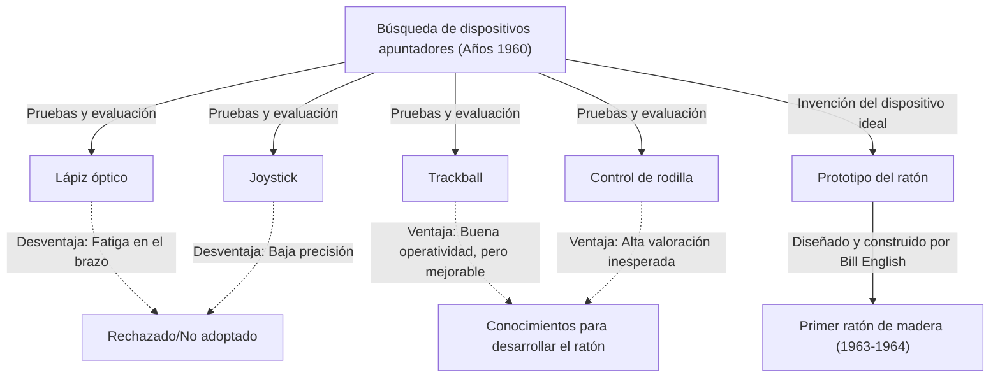
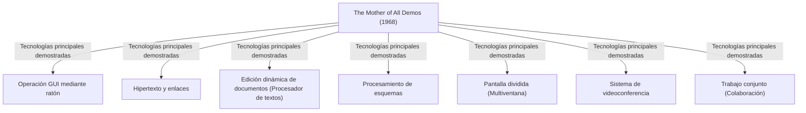

# Introducción: El manejo actual de las computadoras y la razón de ser del ratón

En nuestra vida cotidiana y en el trabajo, la computadora se ha convertido en una presencia indispensable. Como interfaz para operar estas computadoras, junto con el teclado, el dispositivo más familiar es el "ratón". Hoy en día, los dispositivos con pantalla táctil como teléfonos inteligentes y tabletas se han popularizado, y la manipulación directa de la pantalla con los dedos se ha generalizado, pero para operaciones precisas o trabajos prolongados, el ratón sigue ocupando una posición inquebrantable.

Sin embargo, sorprendentemente pocas personas saben exactamente cuándo, por quién y con qué propósito fue inventado este pequeño dispositivo. Quien ha pasado a la historia como el inventor del ratón es el investigador estadounidense Douglas Engelbart. Él no quería simplemente crear un "dispositivo apuntador conveniente". Su objetivo era construir un "sistema para aumentar el intelecto humano y resolver problemas sociales complejos".

En este artículo, profundizaremos en la vida de este extraordinario visionario, Douglas Engelbart, la gran visión que propuso, la historia secreta del nacimiento del "ratón" como herramienta para materializar esa visión, y la legendaria presentación "The Mother of All Demos" (La Madre de Todas las Demos) que tuvo un inmenso impacto en la informática moderna.

# Douglas Engelbart, la persona

## Infancia y primeros pasos en su carrera

Douglas Carl Engelbart nació el 30 de enero de 1925 en Portland, Oregón, Estados Unidos. Su infancia coincidió con la Gran Depresión y su entorno nunca fue rico, pero la vida en Oregón, rodeado de naturaleza, fomentó su espíritu de exploración y su independencia.

Tras comenzar a estudiar ingeniería eléctrica en la Universidad Estatal de Oregón, la Segunda Guerra Mundial interrumpió sus estudios y fue reclutado por la Marina de los Estados Unidos. Fue asignado como técnico de radar en Filipinas. Esta experiencia como técnico de radar se convertiría en una experiencia original importante que determinaría el rumbo del resto de su vida.

## La experiencia y revelación como técnico de radar

En la pantalla del radar, la información captada por la antena se muestra en tiempo real como puntos de luz. Engelbart quedó profundamente impresionado por este proceso de "captar visualmente la información en la pantalla y manipularla en consecuencia". Las computadoras de aquella época no eran más que enormes máquinas de procesamiento por lotes en las que se introducían datos con tarjetas perforadas y se recibían largas secuencias numéricas impresas en papel. No existía ni inmediatez (tiempo real) ni interactividad.

Sin embargo, Engelbart imaginó un futuro en el que los seres humanos pudieran conectar una pantalla de tubo de rayos catódicos (CRT) similar a la de un radar a una computadora, y manipular y estructurar la información en tiempo real mientras miraban la pantalla. Esta era una idea extremadamente pionera, muy alejada del sentido común de la época.

## La influencia de "As We May Think" de Vannevar Bush

Después de la guerra, en una biblioteca de la Cruz Roja en Filipinas, Engelbart se encontró con un artículo providencial. Fue un ensayo titulado "As We May Think" (Como podríamos pensar), escrito en 1945 para la revista The Atlantic Monthly por Vannevar Bush, quien estaba al frente de la administración científica estadounidense.

En este artículo, Bush propuso un sistema de búsqueda de información virtual llamado "Memex". Memex era un dispositivo en el que se guardaban todos los libros, registros y comunicaciones de una persona en microfilm, y podían buscarse y visualizarse instantáneamente desde un escritorio mecanizado. Lo más importante fue que anticipó el concepto actual de hipertexto, donde la información podía ser almacenada y rastreada "vinculando" (enlazando) unas partes con otras.

Engelbart recibió una fuerte inspiración de la concepción del Memex. Pensó que el sistema mecánico basado en microfilm ideado por Bush podría materializarse de manera aún más avanzada utilizando la tecnología informática electrónica de vanguardia.

# La visión de "Aumentar el Intelecto Humano" (Augmenting Human Intellect)

## Los problemas complejos que afronta la humanidad

Tras graduarse en la universidad, Engelbart empezó a trabajar como ingeniero en la NACA (predecesora de la actual NASA), pero unos años después, a punto de casarse, empezó a reflexionar profundamente sobre el propósito de su vida. "¿Qué debería hacer para aportar el mayor valor al mundo durante el resto de mi vida?"

La conclusión a la que llegó fue la siguiente:
1. Los problemas del mundo se vuelven cada vez más complejos y urgentes.
2. Estos problemas no se pueden resolver con un solo conjunto de conocimientos especializados.
3. Por lo tanto, es necesario mejorar la "capacidad humana para hacer frente a problemas complejos" en sí misma.

Este fue el nacimiento del concepto "Aumentar el Intelecto Humano" (Augmenting Human Intellect), que se convertiría en la obra de su vida.

## La computadora como herramienta de pensamiento

Engelbart creía que la capacidad humana para resolver problemas complejos dependía en gran medida no solo de la inteligencia innata, sino también del lenguaje, la metodología y las "herramientas". A lo largo de la historia, la humanidad ha ampliado su capacidad de pensamiento a través de la invención de la escritura, la tecnología de la imprenta, la notación matemática, etc.

Él concibió la computadora, que acababa de aparecer, no como una "máquina para calcular", sino como "la herramienta definitiva para apoyar y ampliar el trabajo intelectual humano". Estaba convencido de que al interactuar en tiempo real con la computadora para visualizar, estructurar y compartir el pensamiento, se podría mejorar drásticamente no solo la inteligencia individual, sino también la inteligencia colectiva.

## Marco conceptual (El sistema H-LAM/T)

En 1962, Engelbart publicó un importante ensayo titulado "Augmenting Human Intellect: A Conceptual Framework" (Aumentando el intelecto humano: Un marco conceptual). En él, propuso un modelo llamado sistema "H-LAM/T" (Human using Language, Artifacts, Methodology, in which he is Trained).

Este modelo conceptualiza el estado en el que un Ser Humano (Human) utiliza el Lenguaje (Language), Artefactos/herramientas (Artifacts) y Metodologías (Methodology), habiendo recibido Entrenamiento (Training) para ello, como un sistema unificado e integrado. Sostuvo que el aumento dramático del intelecto solo ocurre no solo avanzando las computadoras (Artifacts), sino también creando nuevos conceptos y métodos de operación (Language, Methodology) acordes a ellas, y entrenando a los humanos mismos para adaptarse al nuevo entorno.

Esta actitud de enfatizar el "Entrenamiento" (Training) está profundamente ligada a la filosofía de diseño de sus sistemas posteriores (priorizar la funcionalidad y la expresividad sobre la facilidad de uso).

# La creación y el desafío del ARC (Augmentation Research Center)

## Actividades en el SRI (Stanford Research Institute)

Para hacer realidad su visión, Engelbart obtuvo un doctorado en la Universidad de California, Berkeley, y luego se unió al Stanford Research Institute (SRI, ahora SRI International). Al principio, pocos entendían su grandiosa visión y tuvo dificultades para conseguir fondos, pero gradualmente comenzaron a reunirse excelentes investigadores que simpatizaban con sus ideas.

Fundó un laboratorio de investigación llamado "ARC (Augmentation Research Center)" dentro del SRI, y con el apoyo de agencias como ARPA (Agencia de Proyectos de Investigación Avanzados del Departamento de Defensa, luego DARPA), comenzó en serio el desarrollo del sistema.

## El desarrollo del NLS (oN-Line System)

El objetivo del ARC era construir un sistema informático integrado que encarnara la visión de Engelbart. Eso fue el "NLS (oN-Line System)".

El NLS poseía los prototipos de muchas funciones que hoy en día damos por sentadas:
- Edición de documentos en pantalla (función de procesador de textos)
- Hipertexto (enlaces entre documentos)
- Procesamiento de esquemas (desplegar y plegar estructuras jerárquicas)
- Multiventana
- Trabajo colaborativo en red y videoconferencia

Para operar de forma intuitiva estas funciones avanzadas mientras se miraba la pantalla, el método tradicional de introducir datos solo con un teclado tenía sus límites. Se necesitaba un "nuevo dispositivo" para especificar rápida y precisamente cualquier lugar de la pantalla (texto o enlaces).

# El nacimiento del ratón: Ensayo y error, y el gran avance

## La búsqueda de un dispositivo apuntador

Para encontrar el mejor dispositivo apuntador para operar el NLS, Engelbart y el equipo del ARC (especialmente el ingeniero jefe Bill English) probaron y compararon exhaustivamente varios dispositivos que existían en ese momento.

Entre los dispositivos probados se incluían:
- **Lápiz óptico**: Un método de presionar directamente un bolígrafo contra la pantalla. Intuitivo, pero requiere tener el brazo levantado todo el tiempo, lo que es muy agotador.
- **Joystick**: Se mueve una palanca para mover el cursor. Dificulta los ajustes precisos.
- **Trackball**: Método de hacer rodar una esfera. La operatividad es relativamente buena.
- **Control de rodilla**: Dispositivo que se maneja con la rodilla debajo del escritorio. Sorprendentemente tuvo buena operatividad.
- **Grafacon**: Dispositivo tipo bolígrafo sobre una tableta.

Engelbart midió científicamente y comparó la usabilidad, la velocidad de entrada y la tasa de errores de estos dispositivos.

## La colaboración con Bill English

Engelbart ya tenía desde antes la idea de deslizar algo sobre un escritorio para especificar las coordenadas en la pantalla, y había dibujado bocetos de ello en su cuaderno. Ideó un dispositivo con dos ruedas que leían los movimientos del eje X (horizontal) y el eje Y (vertical) por separado.

Quien materializó esta idea en hardware real fue Bill English, el brillante ingeniero de hardware del ARC. Basándose en los bocetos de Engelbart, comenzó a construir prototipos alrededor de 1963.

## Una caja de madera y dos ruedas: El primer prototipo

El primer ratón del mundo era muy diferente del diseño elegante de plástico actual. Era un bloque cuadrado (caja de madera) hecho de madera de pino, y tenía un único botón rojo en la parte superior.

En la parte posterior, tenía acopladas dos ruedas (discos) de metal dispuestas para cruzarse en ángulo recto. Al mover el ratón sobre el escritorio, el movimiento vertical se leía como la rotación de una rueda, y el movimiento horizontal como la rotación de la otra, que luego se convertían en señales eléctricas enviadas a la computadora. Como resultado, el cursor en la pantalla se movía en perfecta sincronización con el movimiento del ratón.

Los resultados de experimentos comparativos demostraron que este "dispositivo que rueda sobre el escritorio" permitía apuntar de forma abrumadoramente más rápida y precisa que un lápiz óptico o un joystick.

## El origen del nombre "Ratón" (Mouse)

En realidad, no hay un registro claro de cuándo o quién nombró a este dispositivo "Ratón" (Mouse). Engelbart mismo dijo en una entrevista posterior: "Todos en el laboratorio empezaron a llamarlo así. Porque la forma se parecía a un ratón, y el cable parecía una cola. Intentamos darle un nombre más digno, pero al final no se popularizó".

Por cierto, la marca en la pantalla que se movía en sincronía con el ratón se llamaba entonces "Bug" (bicho). Se usaba como una jerga humorística de que "El ratón (Mouse) persigue al bicho (Bug)".

# 1968: "The Mother of All Demos" (La Madre de Todas las Demos)

## La legendaria presentación

El 9 de diciembre de 1968, en la Conferencia Conjunta de Computación de Otoño (Fall Joint Computer Conference) celebrada en San Francisco, ocurrió un evento histórico que cambiaría la historia de las computadoras. Fue una demostración pública de 90 minutos realizada por Douglas Engelbart ante unos 1.000 expertos en computación.

Dado que esta demostración fue un contenido abrumador que parecía haber anticipado todos los avances en la tecnología informática subsiguientes, más tarde sería aclamada como "The Mother of All Demos" (La Madre de Todas las Demos).

## Tecnologías revolucionarias exhibidas

Engelbart colocó una consola especial en el centro del escenario, y se sentó con un "teclado de acordes" (keyset de 5 teclas para entrada de códigos) en la mano izquierda, un "ratón" en la derecha, y una enorme pantalla de proyector a sus espaldas. Llevaba unos auriculares con micrófono y, con voz tranquila, fue revelando una por una las funciones del NLS.

El recinto en San Francisco y el laboratorio del SRI en Menlo Park, a unos 50 kilómetros de distancia, estaban conectados por enlaces de microondas y líneas dedicadas, que eran lo más avanzado de la época. A medida que Engelbart operaba, el documento en la pantalla se editaba en tiempo real, y los archivos en diferentes ubicaciones se mostraban saltando a través de hipervínculos.

Aún más sorprendente fue la demostración en la que el rostro de un colega en el instituto de investigación se mostraba en una ventana de la pantalla como un video, y conversaban por audio mientras compartían el mismo cursor en el mismo documento para realizar una edición conjunta. Esto significa que ya habían implementado herramientas de colaboración similares a las actuales de Zoom o Google Docs en la década de 1960, cuando ni siquiera existían las computadoras personales, por no hablar de Internet.

## El impacto en la audiencia y su influencia en la posteridad

Para los expertos de la época, que solo conocían sistemas en los que se alimentaban tarjetas perforadas a una máquina y se recibía una impresión impresa de los resultados horas después, esta demostración les causó el mismo impacto que si estuvieran presenciando magia o viendo una película de ciencia ficción. Al finalizar la presentación, el público se puso de pie, envolviendo el recinto en una ovación atronadora.

Muchos investigadores, incluyendo a un joven Alan Kay que presenció la demostración, fueron decisivamente influenciados por la visión de Engelbart, y posteriormente liderarían la revolución de las computadoras personales.

# Sucesión en el Centro de Investigación de Palo Alto (Xerox PARC) y la expansión hacia Apple

## El concepto del "Dynabook" de Alan Kay y el Dynabook interino (Alto)

En la década de 1970, el laboratorio ARC de Engelbart fue perdiendo impulso gradualmente debido a las dificultades financieras causadas por la Guerra de Vietnam y la propia insistencia de Engelbart en sistemas que eran "demasiado difíciles de entender". Muchos investigadores brillantes, incluido su subordinado Bill English, se trasladaron al recién creado Centro de Investigación de Palo Alto (Xerox PARC) establecido por Xerox.

En PARC, se avanzó en la investigación orientada hacia la visión de la "computación personal" defendida por Alan Kay y otros. Ellos heredaron los conceptos de Engelbart sobre el "ratón" y la "operación en pantalla", al mismo tiempo que mejoraron el complejo sistema operativo hacia algo más intuitivo y amigable. De este modo se creó el "Alto", la primera computadora equipada con una pantalla de mapa de bits, una Interfaz Gráfica de Usuario (GUI) y un ratón. El ratón también evolucionó del diseño de madera a uno más fácil de usar con una bola en su interior.

## La transferencia tecnológica de Xerox a Apple (Macintosh)

En 1979, el cofundador de Apple Computer, Steve Jobs, tuvo la oportunidad de visitar el Xerox PARC. Jobs quedó impactado por la GUI del Alto y la operatividad del ratón, y se convenció de que "esto es el futuro de las computadoras", integrando ese concepto por la fuerza en los proyectos de desarrollo de su propia empresa.

Los ingenieros de Apple rediseñaron el costoso y complejo ratón de Xerox en uno con un solo botón, que pudiera producirse en masa de forma económica y moverse suavemente sobre cualquier escritorio. Con el lanzamiento de "Lisa" en 1983 y el de "Macintosh" en 1984, el ratón pasó de ser una herramienta para unos pocos investigadores a convertirse en el dispositivo de entrada estándar para los consumidores en general en sus hogares.

## El éxito comercial del ratón y su popularización

Posteriormente, sumado a la popularización de Microsoft Windows, el ratón se convirtió en equipamiento estándar en todos los PC del mundo. Las dos ruedas cambiaron a una bola de goma, que más tarde evolucionó a sensores ópticos, y logró avances técnicos con modelos láser e inalámbricos. No obstante, el paradigma básico de "sostener y mover con la mano para manejar un cursor en la pantalla" inventado por Engelbart no ha cambiado en absoluto, más de medio siglo después.

# El legado de Engelbart visto desde el presente

## La visión incompleta: Una advertencia contra la simple "facilidad de uso" (User-friendly)

El ratón se ha extendido por todo el mundo, y cualquiera puede operar intuitivamente una computadora (lo que se conoce como "user-friendly" o fácil de usar). Sin embargo, el propio Engelbart albergaba sentimientos encontrados sobre esta situación actual.

Criticó que simplificar los sistemas buscando únicamente la "facilidad de uso" (User-friendly) es como dar un triciclo a alguien y decir "esto es suficiente". Dominar una bicicleta requiere cierto entrenamiento, pero una vez aprendida, ofrece una velocidad y libertad incomparables con las de un triciclo.

El sistema H-LAM/T al que aspiraba Engelbart estaba destinado a permitir que los humanos dominaran herramientas (sistemas) más potentes a través del entrenamiento, y así expandir los límites de su intelecto. La GUI moderna es ciertamente fácil de usar, pero desde la perspectiva de su sueño de un "aumento dramático del intelecto", tal vez sea solo el comienzo de su verdadero potencial.

## Conexión con la Inteligencia Colectiva

El verdadero logro de Engelbart, más que la invención del ratón en sí, reside en haber materializado como un sistema el concepto de "inteligencia colectiva" (Collective Intelligence), en el que personas de todo el mundo comparten conocimientos a través de redes y cooperan para resolver problemas.

El Internet actual, la World Wide Web (WWW), Wikipedia y comunidades de código abierto como GitHub pueden considerarse precisamente como implementaciones modernas del "aumento del intelecto" que él imaginó. Mucho antes de que Tim Berners-Lee inventara la WWW, Engelbart había visualizado un futuro donde la información se enlazaba mutuamente a través de redes.

## La coevolución entre los seres humanos y la tecnología

En la era moderna, donde la inteligencia artificial (IA) evoluciona rápidamente y se debate una "singularidad" que superará a la inteligencia humana, el pensamiento de Engelbart vuelve a brillar intensamente. Su objetivo no era que las máquinas reemplazaran el pensamiento humano (Inteligencia Artificial), sino que las máquinas se utilizaran para ampliar y complementar la capacidad de pensamiento del ser humano (Amplificación de Inteligencia: Intelligence Amplification / IA).

Ahora que la IA está impregnando nuestras vidas, ¿cómo debemos diseñar la tecnología y cómo debemos utilizarla (entrenarnos con ella)? La coevolución entre el ser humano y la tecnología, un tema enorme planteado por Engelbart, es un desafío crucial que se nos presenta a quienes vivimos en la era actual.

# Conclusión: La pregunta de Engelbart hacia el "futuro"

Douglas Engelbart falleció el 2 de julio de 2013 a la edad de 88 años. El "ratón" que creó a partir de una caja de madera y unas ruedas se convirtió en el puente que conecta a miles de millones de personas con el mundo digital, cambiando el mundo desde sus cimientos.

La escena mágica mostrada en The Mother of All Demos de 1968 es ahora nuestra vida cotidiana. Sin embargo, su visión definitiva de "resolver problemas globales complejos a través del aumento del intelecto humano" a la que verdaderamente aspiraba, aún no se ha materializado por completo.

Cuando empuñamos el ratón, hacemos clic en información en la pantalla y navegamos por el mar de Internet, está presente el aliento del "futuro" que un genio vislumbró. Reflexionar sobre la trayectoria de Douglas Engelbart debería ser una guía segura para que pensemos hacia dónde deberíamos dirigirnos con la tecnología a partir de ahora.
