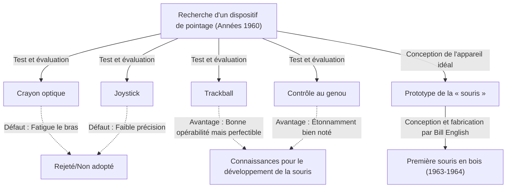
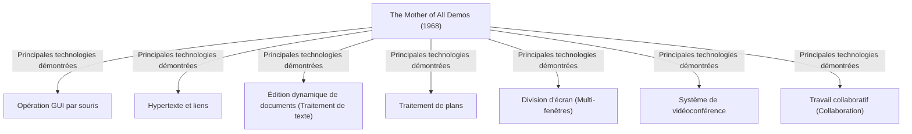

# Introduction : L'interaction informatique moderne et l'importance de la souris

Dans notre vie quotidienne et notre travail, les ordinateurs sont devenus indispensables. En tant qu'interface pour opérer ces ordinateurs, aux côtés du clavier, l'appareil le plus familier est la « souris ». Aujourd'hui, avec la popularisation des appareils à écran tactile tels que les smartphones et les tablettes, l'interaction directe avec l'écran du bout des doigts s'est généralisée. Cependant, pour des opérations précises ou un travail prolongé, la souris conserve une position inébranlable.

Pourtant, peu de gens savent vraiment quand, par qui, et dans quel but ce petit appareil a été inventé. Celui dont le nom est gravé dans l'histoire en tant qu'inventeur de la souris est le chercheur américain Douglas Engelbart. Il ne voulait pas simplement créer un « dispositif de pointage pratique ». Son objectif était de construire un « système pour amplifier l'intellect humain et résoudre des problèmes sociaux complexes ».

Dans cet article, nous explorerons en profondeur la vie de ce visionnaire extraordinaire qu'était Douglas Engelbart, sa grande vision, l'histoire secrète de la naissance de la « souris » créée comme outil pour réaliser cette vision, ainsi que la légendaire présentation « The Mother of All Demos » (La Mère de toutes les démos) qui a eu un impact énorme sur l'informatique moderne.

# Qui était Douglas Engelbart

## Jeunesse et début de carrière

Douglas Carl Engelbart est né le 30 janvier 1925 à Portland, dans l'Oregon, aux États-Unis. Son enfance a coïncidé avec la Grande Dépression, et bien qu'il n'ait pas grandi dans un environnement riche, sa vie dans la nature de l'Oregon a nourri sa curiosité et son indépendance.

Alors qu'il commençait des études de génie électrique à l'Université d'État de l'Oregon, il a interrompu ses études en raison du déclenchement de la Seconde Guerre mondiale et a été appelé dans la marine américaine. Il a été affecté en tant que technicien radar aux Philippines. Cette expérience en tant que technicien radar est devenue une expérience formatrice cruciale qui a façonné le reste de sa vie.

## Expérience de technicien radar et révélation

Sur l'écran d'un radar, les informations captées par l'antenne s'affichent en temps réel sous forme de points lumineux. Engelbart a été profondément impressionné par ce processus de « perception visuelle des informations à l'écran et de leur manipulation en conséquence ». À l'époque, les ordinateurs (calculatrices) n'étaient que de gigantesques machines de traitement par lots où l'on entrait des données avec des cartes perforées pour recevoir en sortie d'énormes séquences de nombres imprimées sur papier. Il n'y avait ni temps réel ni interactivité.

Cependant, Engelbart a imaginé un avenir où un écran à tube cathodique (CRT) semblable à un écran de radar serait connecté à un ordinateur, permettant aux humains de manipuler et de structurer des informations en temps réel tout en regardant l'écran. Il s'agissait d'une idée extrêmement novatrice, très éloignée du bon sens de l'époque.

## L'influence de « As We May Think » de Vannevar Bush

Après la guerre, dans une bibliothèque de la Croix-Rouge aux Philippines, Engelbart est tombé sur un article fatidique. Il s'agissait de l'essai « As We May Think » (Comme nous pourrions penser), écrit en 1945 pour le magazine The Atlantic Monthly par Vannevar Bush, le chef de l'administration scientifique américaine.

Dans cet article, Bush a proposé un système de recherche d'informations virtuel appelé « Memex ». Memex est un dispositif qui permet de stocker l'ensemble des livres, des dossiers et des communications d'un individu sur des microfilms, et de les rechercher et de les visualiser instantanément depuis un bureau mécanisé. Le point le plus important est qu'il anticipait le concept actuel d'hypertexte, permettant de sauvegarder et de retracer les informations en les « associant (liens) » les unes aux autres.

Engelbart a été fortement inspiré par le concept de Memex. Il pensait que le système mécanique sur microfilm imaginé par Bush pourrait être réalisé de manière encore plus avancée en utilisant la technologie informatique électronique de pointe.

# La vision de l'« Amplification de l'intellect humain (Augmenting Human Intellect) »

## Les problèmes complexes auxquels l'humanité est confrontée

Après avoir obtenu son diplôme universitaire et commencé à travailler comme ingénieur pour le NACA (le prédécesseur de l'actuelle NASA), Engelbart, quelques années plus tard et sur le point de se marier, a commencé à réfléchir profondément au but de sa vie. « Que devrais-je faire du reste de ma vie pour apporter la plus grande valeur au monde ? »

La conclusion à laquelle il est parvenu était la suivante :
1. Les problèmes du monde deviennent de plus en plus complexes et urgents.
2. La plupart des problèmes ne peuvent être résolus par une seule expertise.
3. Par conséquent, il est nécessaire d'améliorer la « capacité de l'humanité à faire face à des problèmes complexes ».

C'est ainsi qu'est né le concept d'« Amplification de l'intellect humain (Augmenting Human Intellect) », qui deviendra l'œuvre de sa vie.

## L'ordinateur comme outil de réflexion

Engelbart pensait que la capacité humaine à résoudre des problèmes complexes dépendait grandement non seulement de l'intelligence innée, mais aussi du langage, des méthodologies et des « outils ». L'humanité a étendu ses capacités de réflexion grâce à l'invention de l'écriture, de la technologie de l'imprimerie et de la notation mathématique.

Il voyait l'ordinateur, récemment apparu, non pas comme une « machine à calculer », mais comme l'« outil ultime pour soutenir et étendre le travail intellectuel humain ». Il croyait qu'en permettant aux humains et aux ordinateurs d'interagir en temps réel pour visualiser, structurer et partager la pensée, on pourrait considérablement améliorer non seulement l'intelligence individuelle, mais aussi l'intelligence collective.

## Cadre conceptuel (Système H-LAM/T)

En 1962, Engelbart a publié un article fondamental intitulé « Augmenting Human Intellect: A Conceptual Framework » (Amplification de l'intellect humain : un cadre conceptuel). Il y proposait le modèle du système « H-LAM/T » (Human using Language, Artifacts, Methodology, in which he is Trained - L'Humain utilisant le Langage, les Artefacts, la Méthodologie, auxquels il est Formé).

Cela considère l'humain (Human) qui utilise le langage (Language), des artefacts et outils (Artifacts), et une méthodologie (Methodology), et qui est formé (Training) à leur utilisation, comme un seul système intégré. Son argument était qu'une amplification spectaculaire de l'intellect ne pourrait se produire que si l'on faisait non seulement évoluer les ordinateurs (Artifacts), mais qu'on créait également de nouveaux concepts et méthodes d'opération adaptés (Language, Methodology), et que les humains eux-mêmes recevaient une formation pour s'adapter à ce nouvel environnement.

Cette insistance sur la « formation (Training) » est profondément liée à la philosophie de conception de ses systèmes ultérieurs (privilégiant la fonctionnalité et l'expressivité à la simple facilité d'utilisation).

# Création de l'ARC (Augmentation Research Center) et ses défis

## Activités au SRI (Stanford Research Institute)

Pour concrétiser sa vision, Engelbart a rejoint le Stanford Research Institute (SRI, aujourd'hui SRI International) après avoir obtenu son doctorat à l'Université de Californie à Berkeley. Au début, peu de gens comprenaient sa vision grandiose et il a eu du mal à réunir des fonds, mais d'excellents chercheurs qui partageaient ses idées ont commencé à se rassembler progressivement.

Il a fondé un laboratoire de recherche appelé « ARC (Augmentation Research Center) » au sein du SRI et a commencé à développer un système à part entière avec le soutien d'organisations telles que l'ARPA (Advanced Research Projects Agency du Département de la Défense, plus tard DARPA).

## Développement de NLS (oN-Line System)

L'objectif de l'ARC était de construire un système informatique intégré qui incarnerait la vision d'Engelbart. Ce système était « NLS (oN-Line System) ».

NLS possédait déjà les prototypes de nombreuses fonctionnalités que nous utilisons aujourd'hui comme une évidence :
- Édition de documents à l'écran (fonction de traitement de texte)
- Hypertexte (liens entre documents)
- Traitement de plans (développement/réduction de structures hiérarchiques)
- Multi-fenêtres
- Travail collaboratif et vidéoconférence via un réseau

Pour manipuler ces fonctionnalités avancées de manière intuitive tout en regardant un écran, la méthode traditionnelle de saisie avec le seul clavier avait ses limites. Il fallait un « nouvel appareil » pour spécifier rapidement et précisément n'importe quel endroit de l'écran (texte ou lien).

# La naissance de la souris : Essais et erreurs, et la percée

## À la recherche d'un dispositif de pointage

Pour trouver le dispositif de pointage idéal pour l'utilisation de NLS, Engelbart et l'équipe de l'ARC (en particulier l'ingénieur en chef Bill English) ont rigoureusement testé et comparé divers appareils existants à l'époque.

Les appareils testés comprenaient les suivants :
- **Crayon optique (Light pen)** : Une méthode où l'on presse le stylet directement contre l'écran. Intuitif, mais nécessite de garder le bras levé en permanence, ce qui est très fatigant.
- **Joystick** : On incline un levier pour déplacer le curseur. Il est difficile de faire des ajustements précis.
- **Trackball** : Une méthode où l'on fait rouler une boule. L'opérabilité est relativement bonne.
- **Contrôle au genou (Knee control)** : Un appareil manipulé avec le genou sous le bureau. Son opérabilité était étonnamment bonne.
- **Grafacon** : Un appareil en forme de stylo sur une tablette.

Engelbart a mesuré scientifiquement et comparé la convivialité, la vitesse de saisie et le taux d'erreur de ces appareils.

## Collaboration avec Bill English

Depuis un certain temps, Engelbart avait l'idée de glisser un objet sur un bureau pour spécifier des coordonnées sur un écran, et il en avait dessiné le croquis dans son carnet. Il a imaginé un appareil doté de deux roues lisant séparément les mouvements sur l'axe X (horizontal) et l'axe Y (vertical).

Celui qui a concrétisé cette idée sous forme de matériel réel fut Bill English, un brillant ingénieur matériel de l'ARC. En se basant sur le croquis d'Engelbart, il a commencé à fabriquer un prototype vers 1963.

## Une boîte en bois et deux roues : le premier prototype

La première souris au monde était très différente des conceptions sophistiquées en plastique d'aujourd'hui. C'était un bloc carré (une boîte en bois) en bois de pin, avec un seul bouton rouge sur le dessus.

En dessous, deux roues (disques) métalliques étaient fixées, disposées à angle droit. Lorsque la souris était déplacée sur le bureau, le mouvement vertical était lu comme la rotation d'une roue, et le mouvement horizontal comme la rotation de l'autre roue, puis convertis en signaux électriques envoyés à l'ordinateur. Ainsi, le curseur à l'écran bougeait en parfaite synchronisation avec le mouvement de la souris.

Les résultats des expériences comparatives ont prouvé que ce « dispositif roulant sur le bureau » permettait de pointer beaucoup plus rapidement et précisément que le crayon optique ou le joystick.

## L'origine du nom « souris (Mouse) »

En réalité, il ne reste aucune archive précise indiquant quand et par qui cet appareil a été baptisé « souris (Mouse) ». Engelbart lui-même a déclaré dans une interview ultérieure : « Tout le monde au laboratoire a commencé à l'appeler ainsi. Parce que sa forme ressemblait à celle d'une souris, et que le fil ressemblait à une queue. J'ai essayé de lui donner un nom plus digne, mais ça n'a finalement pas pris. »

À titre d'anecdote, la marque à l'écran qui bougeait avec la souris était appelée à l'époque un « insecte (Bug) ». C'était utilisé comme une expression argotique humoristique : « la souris (Mouse) chasse l'insecte (Bug) ».

# 1968 : « The Mother of All Demos » (La Mère de toutes les démos)

## Une présentation légendaire

Le 9 décembre 1968, lors de la Fall Joint Computer Conference à San Francisco, s'est produit un événement historique qui a changé l'histoire de l'informatique. C'était une démonstration publique de 90 minutes donnée par Douglas Engelbart devant environ 1 000 experts en informatique.

Cette démonstration fut si impressionnante, anticipant apparemment toutes les avancées ultérieures de la technologie informatique, qu'elle fut plus tard saluée comme « The Mother of All Demos » (La Mère de toutes les démos).

## Des technologies révolutionnaires dévoilées

Engelbart était assis au centre de la scène devant une console spéciale, avec un « Keyset » (un clavier à 5 touches pour saisir des accords) dans sa main gauche, une « souris » dans sa main droite, et un écran de projection géant derrière lui. Portant un micro-casque, il a présenté une par une les fonctionnalités de NLS d'une voix calme.

Le lieu de la conférence à San Francisco et le laboratoire du SRI à Menlo Park, à environ 50 kilomètres de là, étaient reliés par des liaisons micro-ondes et des lignes dédiées à la pointe de la technologie pour l'époque. Les documents à l'écran étaient modifiés en temps réel en réponse aux actions d'Engelbart, et des fichiers situés à différents endroits étaient affichés en sautant via des hyperliens.

Encore plus surprenant fut la démonstration où le visage d'un collègue au laboratoire est apparu sous forme de vidéo dans une fenêtre à l'écran, et où ils ont co-édité le même document, partageant le même curseur tout en discutant par appel audio. Cela signifie qu'il a réalisé l'équivalent d'outils de collaboration modernes comme Zoom ou Google Docs dans les années 1960, à une époque où l'Internet et même les ordinateurs personnels n'existaient pas.

## Le choc de l'auditoire et l'impact sur la postérité

Pour les experts de l'époque, qui ne connaissaient que des systèmes où l'on chargeait des cartes perforées dans une machine pour recevoir un imprimé des résultats quelques heures plus tard, cette démonstration a eu l'effet d'un choc, comme s'ils assistaient à de la magie ou à un film de science-fiction. À la fin de la présentation, le public s'est levé et une standing ovation assourdissante a envahi la salle.

De nombreux chercheurs qui ont vu cette démo, dont le jeune Alan Kay, ont été profondément influencés par la vision d'Engelbart et ont par la suite mené la révolution des ordinateurs personnels.

# Transmission au Centre de recherche de Palo Alto (Xerox PARC) et expansion vers Apple

## Le concept « Dynabook » d'Alan Kay et le Dynabook intérimaire (Alto)

Dans les années 1970, le laboratoire ARC d'Engelbart a progressivement perdu de son élan en raison de difficultés financières liées à la guerre du Vietnam et de son propre attachement à un système jugé « trop complexe ». De nombreux chercheurs brillants, dont son subordonné Bill English, ont été transférés au nouveau Centre de recherche de Palo Alto (Xerox PARC) créé par Xerox.

Au PARC, des recherches ont été menées en vue de la vision de l'« informatique personnelle » promue par Alan Kay et d'autres. Tout en reprenant les concepts de « souris » et de « manipulation à l'écran » d'Engelbart, ils ont amélioré le système d'exploitation complexe pour le rendre plus intuitif et accessible. C'est ainsi qu'est né l'« Alto », un ordinateur doté du premier écran bitmap au monde, d'une interface graphique utilisateur (GUI) et d'une souris. La souris est également passée d'un modèle en bois à un modèle plus facile à utiliser avec une boule.

## Transfert de technologie de Xerox vers Apple (Macintosh)

En 1979, le cofondateur d'Apple Computer, Steve Jobs, a eu l'opportunité de visiter le Xerox PARC. Frappé par la GUI de l'Alto et l'opérabilité de la souris, Jobs a acquis la certitude que « c'était là l'avenir de l'informatique » et a imposé ce concept dans les projets de développement de son entreprise.

Les ingénieurs d'Apple ont repensé la souris chère et complexe de Xerox pour qu'elle puisse être produite en série à bas prix avec un seul bouton, et qu'elle se déplace en douceur sur n'importe quel bureau. Avec la sortie du « Lisa » en 1983, puis du « Macintosh » en 1984, la souris est passée d'un outil réservé à quelques chercheurs à un périphérique de saisie standard largement adopté par les consommateurs ordinaires pour un usage domestique.

## Succès commercial et généralisation de la souris

Par la suite, avec la démocratisation de Microsoft Windows, la souris est devenue un équipement standard sur tous les PC à travers le monde. Les deux roues ont été remplacées par une boule en caoutchouc, puis ont évolué vers un capteur optique, poursuivant des avancées technologiques avec des modèles laser et sans fil. Cependant, le paradigme de base inventé par Engelbart, qui consiste à « saisir de la main, déplacer et manipuler un curseur à l'écran », reste inchangé même plus d'un demi-siècle plus tard.

# L'héritage d'Engelbart vu depuis notre époque

## Une vision inachevée : une mise en garde contre la simple facilité d'utilisation (User-friendly)

La souris s'est répandue dans le monde entier, permettant à quiconque d'utiliser intuitivement un ordinateur (ce qu'on appelle la convivialité ou user-friendly). Cependant, Engelbart lui-même éprouvait des sentiments mitigés face à cette situation.

Il critiquait le fait que simplifier les systèmes en ne recherchant que la « facilité d'utilisation (User-friendly) » revenait à donner un tricycle à quelqu'un en disant : « Cela suffit ». Maîtriser un vélo demande un peu d'entraînement, mais une fois appris, cela offre une vitesse et une liberté incomparables à celles d'un tricycle.

Le système H-LAM/T visé par Engelbart était destiné à permettre aux humains, par la formation, de maîtriser des outils (systèmes) plus puissants et de repousser les limites de leur intellect. Les interfaces graphiques modernes sont certes faciles à utiliser, mais du point de vue de l'« amplification spectaculaire de l'intellect » dont il rêvait, ce n'est peut-être encore que l'entrée de son potentiel.

## Un lien vers l'Intelligence Collective

Le véritable accomplissement d'Engelbart, plus que l'invention de la souris elle-même, réside dans la concrétisation sous forme de système du concept d'« intelligence collective (Collective Intelligence) », où les gens du monde entier partagent des connaissances via des réseaux et coopèrent pour résoudre des problèmes.

L'Internet actuel, le World Wide Web (WWW), Wikipedia, et les communautés open source comme GitHub peuvent être considérés exactement comme la mise en œuvre moderne de « l'amplification de l'intellect » qu'il avait imaginée. Bien avant que Tim Berners-Lee n'invente le WWW, Engelbart voyait un avenir où les informations seraient reliées par des liens sur un réseau.

## Coévolution de l'humain et de la technologie

À notre époque où l'intelligence artificielle (IA) évolue rapidement et où l'on discute d'une « singularité » dépassant l'intellect humain, la pensée d'Engelbart brille d'un éclat renouvelé. Son objectif n'était pas de laisser les machines remplacer la pensée humaine (Intelligence Artificielle), mais d'utiliser les machines pour étendre et compléter la capacité de réflexion humaine (Amplification de l'Intelligence / IA).

Maintenant que l'IA s'infiltre dans nos vies, comment concevons-nous la technologie et comment allons-nous l'utiliser (et nous y former) ? La coévolution de l'humain et de la technologie, un thème colossal présenté par Engelbart, est un défi important lancé à nous qui vivons aujourd'hui.

# Conclusion : La question sur l'« avenir » laissée par Engelbart

Douglas Engelbart est décédé le 2 juillet 2013 à l'âge de 88 ans. La « souris » qu'il a créée à partir d'une boîte en bois et de roues est devenue un pont reliant des milliards de personnes au monde numérique, et a fondamentalement changé le monde.

La scène magique montrée lors de la Mother of All Demos de 1968 est désormais notre réalité quotidienne. Cependant, sa vision ultime de « résoudre des problèmes complexes à l'échelle mondiale par l'amplification de l'intellect humain » n'a pas encore été pleinement réalisée.

Lorsque nous tenons une souris, cliquons sur des informations à l'écran et nageons dans l'océan de l'Internet, il y réside le souffle de l'« avenir » vu par un génie. Revenir sur le parcours de Douglas Engelbart devrait servir de guide fiable pour réfléchir à la direction que nous devons prendre à l'avenir aux côtés de la technologie.
