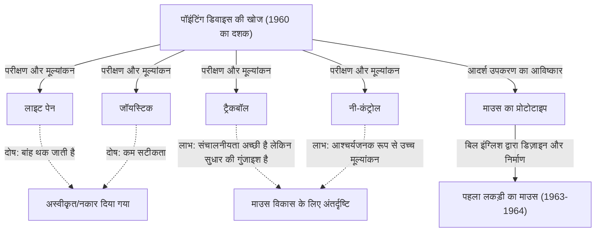
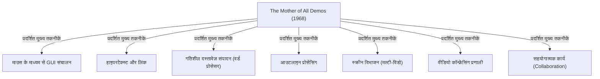

# परिचय: आधुनिक कंप्यूटर संचालन और माउस का महत्व

हमारे दैनिक जीवन और काम में, कंप्यूटर अपरिहार्य बन गए हैं। कंप्यूटर को संचालित करने के लिए एक इंटरफ़ेस के रूप में, कीबोर्ड के साथ-साथ सबसे परिचित डिवाइस "माउस" है। आज भले ही स्मार्टफोन और टैबलेट जैसे टच-पैनल डिवाइस व्यापक हो गए हैं और स्क्रीन को सीधे उंगलियों से छूना आम बात हो गई है, लेकिन सटीक संचालन और लंबे समय तक काम करने के लिए माउस अभी भी एक मजबूत स्थिति में है।

हालाँकि, आश्चर्यजनक रूप से बहुत कम लोग गहराई से जानते हैं कि इस छोटे से उपकरण का आविष्कार कब, किसने और किस उद्देश्य से किया था। माउस के आविष्कारक के रूप में इतिहास में दर्ज व्यक्ति अमेरिकी शोधकर्ता डगलस एंगेलबार्ट (Douglas Engelbart) हैं। वह केवल एक "सुविधाजनक पॉइंटिंग डिवाइस" नहीं बनाना चाहते थे। उनका लक्ष्य "मानव बुद्धि को बढ़ाने (Augmenting Human Intellect) और जटिल सामाजिक समस्याओं को हल करने के लिए एक प्रणाली" का निर्माण करना था।

इस लेख में, हम डगलस एंगेलबार्ट नामक इस असाधारण दूरदर्शी व्यक्ति के जीवन, उनके भव्य दृष्टिकोण, उस दृष्टिकोण को साकार करने के लिए एक उपकरण के रूप में पैदा हुए "माउस" के जन्म की गुप्त कहानी, और आधुनिक कंप्यूटिंग को गहराई से प्रभावित करने वाले प्रसिद्ध प्रेजेंटेशन "The Mother of All Demos (सभी डेमो की माँ)" के बारे में विस्तार से चर्चा करेंगे।

# डगलस एंगेलबार्ट का परिचय

## प्रारंभिक जीवन और करियर की शुरुआत

डगलस कार्ल एंगेलबार्ट (Douglas Carl Engelbart) का जन्म 30 जनवरी, 1925 को पोर्टलैंड, ओरेगन, संयुक्त राज्य अमेरिका में हुआ था। उनका बचपन महामंदी के युग के साथ मेल खाता था, और हालांकि उनका परिवार समृद्ध नहीं था, लेकिन ओरेगन में प्रकृति से घिरे उनके जीवन ने उनकी जिज्ञासा और स्वतंत्रता की भावना को पोषित किया।

ओरेगन स्टेट यूनिवर्सिटी में इलेक्ट्रिकल इंजीनियरिंग का अध्ययन शुरू करने के बाद, द्वितीय विश्व युद्ध के छिड़ने के कारण उन्हें अपनी पढ़ाई छोड़नी पड़ी और अमेरिकी नौसेना में भर्ती होना पड़ा। उन्हें फिलीपींस में एक रडार तकनीशियन के रूप में नियुक्त किया गया था। रडार तकनीशियन के रूप में यह अनुभव उनके बाद के जीवन को निर्धारित करने वाला एक महत्वपूर्ण मूल अनुभव बन गया।

## रडार तकनीशियन के रूप में अनुभव और रहस्योद्घाटन

रडार की स्क्रीन पर, एंटीना द्वारा कैप्चर की गई जानकारी वास्तविक समय में प्रकाश के बिंदुओं के रूप में प्रदर्शित होती है। एंगेलबार्ट इस प्रक्रिया से गहराई से प्रभावित हुए कि "स्क्रीन पर जानकारी को दृष्टिगत रूप से समझना और उसके आधार पर जानकारी में हेरफेर करना"। उस समय के कंप्यूटर (कैलकुलेटर) पंच कार्ड के साथ डेटा दर्ज करने और कागज पर छपे भारी संख्यात्मक अनुक्रमों को आउटपुट के रूप में प्राप्त करने वाली बैच-प्रोसेसिंग विशाल मशीनों से ज्यादा कुछ नहीं थे। वहां न तो कोई वास्तविक समय (real-time) की कार्यक्षमता थी और न ही अन्तरक्रियाशीलता (interactivity)।

हालाँकि, एंगेलबार्ट ने एक ऐसे भविष्य की कल्पना की जहाँ एक कैथोड रे ट्यूब (CRT) डिस्प्ले, जैसे कि रडार स्क्रीन, कंप्यूटर से जुड़ा हो, और मनुष्य स्क्रीन को देखते हुए वास्तविक समय में जानकारी में हेरफेर और निर्माण कर सकें। यह उस समय के सामान्य ज्ञान से बहुत दूर, एक अत्यंत अग्रणी विचार था।

## वन्नेवर बुश के "As We May Think" का प्रभाव

युद्ध के बाद, फिलीपींस में रेड क्रॉस के पुस्तकालय में, एंगेलबार्ट को एक भाग्यशाली लेख मिला। वह लेख "As We May Think (जैसा हम सोच सकते हैं)" था, जिसे वन्नेवर बुश (Vannevar Bush), अमेरिकी विज्ञान प्रशासन के शीर्ष अधिकारी ने 1945 में द अटलांटिक मंथली (The Atlantic Monthly) पत्रिका में प्रकाशित किया था।

इस लेख में, बुश ने "Memex (मेमेक्स)" नामक एक आभासी सूचना पुनर्प्राप्ति प्रणाली का प्रस्ताव रखा। Memex एक ऐसा उपकरण था जो किसी व्यक्ति की सभी पुस्तकों, अभिलेखों और संचारों को माइक्रोफिल्म पर संग्रहीत कर सकता था, और एक यंत्रीकृत डेस्क से उन्हें तुरंत खोजा और देखा जा सकता था। सबसे महत्वपूर्ण बात यह है कि यह सूचनाओं को एक साथ जोड़ने (लिंकिंग) और ट्रैकिंग करने की अवधारणा की भविष्यवाणी करता है, जो आज के हाइपरटेक्स्ट की अवधारणा है।

एंगेलबार्ट Memex की अवधारणा से बहुत प्रेरित हुए। उनका मानना था कि बुश द्वारा परिकल्पित माइक्रोफिल्म-आधारित यांत्रिक प्रणाली को अत्याधुनिक इलेक्ट्रॉनिक कंप्यूटर प्रौद्योगिकी का उपयोग करके और भी अधिक उन्नत स्तर पर महसूस किया जा सकता है।

# "बुद्धि का प्रवर्धन (Augmenting Human Intellect)" का दृष्टिकोण

## मानवता के सामने जटिल समस्याएं

विश्वविद्यालय से स्नातक होने के बाद, एंगेलबार्ट ने नाका (NACA, नासा का पूर्ववर्ती) में एक इंजीनियर के रूप में काम करना शुरू किया, लेकिन कुछ वर्षों बाद, जब वे शादी करने वाले थे, उन्होंने अपने जीवन के उद्देश्य के बारे में गहराई से सोचना शुरू कर दिया। "अपने शेष जीवन को दुनिया में अधिकतम मूल्य लाने के लिए मुझे क्या करना चाहिए?"

उनका निष्कर्ष इस प्रकार था:
1. दुनिया की समस्याएं तेजी से जटिल हो रही हैं और तात्कालिकता बढ़ रही है।
2. अधिकांश समस्याएं ऐसी हैं जिन्हें केवल एक ही विशेषज्ञता द्वारा हल नहीं किया जा सकता है।
3. इसलिए, "जटिल समस्याओं से निपटने" की मानवता की क्षमता में सुधार करना आवश्यक है।

यही उनके जीवन के काम, "बुद्धि के प्रवर्धन (Augmenting Human Intellect)" की अवधारणा का जन्म था।

## सोचने के उपकरण के रूप में कंप्यूटर

एंगेलबार्ट का मानना था कि जटिल समस्याओं को हल करने की मानव क्षमता न केवल उनकी जन्मजात बुद्धि पर, बल्कि भाषा, कार्यप्रणाली और "उपकरणों" पर भी बहुत अधिक निर्भर करती है। मानवता ने लेखन के आविष्कार, छपाई तकनीक और गणितीय संकेतन के माध्यम से अपनी सोचने की क्षमता का विस्तार किया है।

उन्होंने हाल ही में दिखाई देने वाले कंप्यूटर को "गणना के लिए मशीन" के रूप में नहीं, बल्कि "मानव बौद्धिक कार्य का समर्थन करने और विस्तार करने के लिए अंतिम उपकरण" के रूप में देखा। उनका मानना था कि मनुष्य और कंप्यूटर के बीच वास्तविक समय में बातचीत करके और विचारों की कल्पना, संरचना और साझा करके, न केवल व्यक्तिगत बुद्धि बल्कि सामूहिक बुद्धि (Collective Intelligence) को नाटकीय रूप से बढ़ाया जा सकता है।

## वैचारिक ढांचा (H-LAM/T सिस्टम)

1962 में, एंगेलबार्ट ने एक महत्वपूर्ण पेपर प्रकाशित किया जिसका शीर्षक था "Augmenting Human Intellect: A Conceptual Framework (मानव बुद्धि का प्रवर्धन: एक वैचारिक ढांचा)"। इसमें, उन्होंने "H-LAM/T (Human using Language, Artifacts, Methodology, in which he is Trained)" प्रणाली का एक मॉडल प्रस्तावित किया।

यह एक एकीकृत प्रणाली के रूप में है जहां मानव (Human) भाषा (Language), कृत्रिम वस्तुओं/उपकरणों (Artifacts), और कार्यप्रणाली (Methodology) का उपयोग करते हैं, और उन्हें इसके लिए प्रशिक्षित (Trained) किया जाता है। उनका तर्क था कि बुद्धि में नाटकीय वृद्धि केवल तभी होगी जब न केवल कंप्यूटर (Artifacts) विकसित हों, बल्कि नई अवधारणाएं और संचालन के तरीके (Language, Methodology) भी बनाए जाएं, और मनुष्य स्वयं नए वातावरण के अनुकूल होने के लिए प्रशिक्षण प्राप्त करें।

"प्रशिक्षण (Training)" पर जोर देने का यह रुख उनकी बाद की प्रणाली के डिजाइन दर्शन (उपयोग में आसानी से अधिक कार्यक्षमता और अभिव्यक्ति पर जोर देना) से गहराई से जुड़ा हुआ है।

# ARC (Augmentation Research Center) की स्थापना और चुनौतियां

## SRI (स्टैनफोर्ड रिसर्च इंस्टीट्यूट) में गतिविधियां

अपने दृष्टिकोण को साकार करने के लिए, कैलिफोर्निया विश्वविद्यालय, बर्कले से डॉक्टरेट प्राप्त करने के बाद, एंगेलबार्ट स्टैनफोर्ड रिसर्च इंस्टीट्यूट (SRI, अब SRI इंटरनेशनल) में शामिल हो गए। प्रारंभ में, बहुत कम लोग उनके भव्य दृष्टिकोण को समझते थे और उन्हें धन जुटाने में भी कठिनाई हुई, लेकिन धीरे-धीरे उनके विचारों का समर्थन करने वाले उत्कृष्ट शोधकर्ता इकट्ठा होने लगे।

उन्होंने SRI के भीतर एक शोध प्रयोगशाला, "ARC (Augmentation Research Center)" की स्थापना की, और ARPA (रक्षा विभाग की उन्नत अनुसंधान परियोजना एजेंसी, बाद में DARPA) जैसे संगठनों के समर्थन से, प्रणाली के पूर्ण पैमाने पर विकास की शुरुआत की।

## NLS (oN-Line System) का विकास

ARC का लक्ष्य एक एकीकृत कंप्यूटर प्रणाली का निर्माण करना था जो एंगेलबार्ट के दृष्टिकोण को मूर्त रूप दे सके। वह प्रणाली थी "NLS (oN-Line System)"।

NLS में कई विशेषताओं के प्रोटोटाइप थे जिन्हें हम आज हल्के में लेते हैं:
- स्क्रीन पर दस्तावेज़ संपादन (वर्ड प्रोसेसिंग फ़ंक्शन)
- हाइपरटेक्स्ट (दस्तावेज़ों के बीच लिंक)
- आउटलाइन प्रोसेसिंग (पदानुक्रमित संरचना का विस्तार/पतन)
- मल्टी-विंडो
- नेटवर्क के माध्यम से सहयोग और वीडियो कॉन्फ्रेंसिंग

डिस्प्ले को देखते हुए इन उन्नत कार्यों को सहज रूप से संचालित करने के लिए, केवल कीबोर्ड से इनपुट करने के पारंपरिक तरीके की एक सीमा थी। स्क्रीन पर किसी भी स्थान (टेक्स्ट या लिंक) को जल्दी और सटीक रूप से निर्दिष्ट करने के लिए एक "नए उपकरण" की आवश्यकता थी।

# माउस का जन्म: परीक्षण और त्रुटि और सफलता

## पॉइंटिंग डिवाइस की खोज

NLS को संचालित करने के लिए सर्वश्रेष्ठ पॉइंटिंग डिवाइस खोजने के लिए, एंगेलबार्ट और ARC टीम (विशेष रूप से मुख्य इंजीनियर बिल इंग्लिश) ने उस समय मौजूद विभिन्न उपकरणों का कड़ाई से परीक्षण और तुलना की।

परीक्षण किए गए उपकरणों में शामिल थे:
- **लाइट पेन**: स्क्रीन के खिलाफ सीधे पेन को दबाने की विधि। सहज ज्ञान युक्त, लेकिन आपको हमेशा अपनी बांह को ऊपर रखना होगा, जो बहुत थका देने वाला है।
- **जॉयस्टिक**: कर्सर को स्थानांतरित करने के लिए एक लीवर को झुकाना। ठीक स्थिति मुश्किल है।
- **ट्रैकर बॉल (ट्रैकबॉल)**: एक गेंद को रोल करने की विधि। संचालनीयता (Operability) अपेक्षाकृत अच्छी है।
- **नी-कंट्रोल**: एक उपकरण जिसे डेस्क के नीचे घुटने से संचालित किया जाता है। आश्चर्यजनक रूप से इसकी संचालनीयता अच्छी थी।
- **ग्राफाकॉन (Grafacon)**: टैबलेट पर पेन-प्रकार का उपकरण।

एंगेलबार्ट ने वैज्ञानिक रूप से इन उपकरणों की उपयोगिता, इनपुट गति और त्रुटि दर को मापा और उनकी तुलना की।

## बिल इंग्लिश के साथ सहयोग

एंगेलबार्ट के पास पहले से ही स्क्रीन पर निर्देशांक (coordinates) निर्दिष्ट करने के लिए डेस्क के पार स्लाइड करने वाले एक उपकरण का विचार था, और उन्होंने अपनी नोटबुक में इसका एक स्केच बनाया था। उन्होंने एक ऐसे उपकरण की कल्पना की जिसमें दो पहिए हों जो अलग-अलग X-अक्ष (क्षैतिज) और Y-अक्ष (लंबवत) आंदोलनों को पढ़ते हैं।

ARC के एक शानदार हार्डवेयर इंजीनियर बिल इंग्लिश (Bill English) ने इस विचार को वास्तविक हार्डवेयर में बदल दिया। एंगेलबार्ट के रेखाचित्रों के आधार पर, उन्होंने 1963 के आसपास एक प्रोटोटाइप बनाना शुरू किया।

## लकड़ी का डिब्बा और 2 पहिए: पहला प्रोटोटाइप

दुनिया का पहला माउस आज के चिकने प्लास्टिक डिज़ाइन से बहुत अलग था। यह देवदार की लकड़ी से बना एक चौकोर ब्लॉक (लकड़ी का डिब्बा) था जिसके ऊपर केवल एक लाल बटन था।

पीछे की तरफ, समकोण पर व्यवस्थित दो धातु के पहिये (डिस्क) लगे थे। जब माउस को डेस्क के पार ले जाया जाता था, तो ऊर्ध्वाधर गति एक पहिये के घुमाव के रूप में और क्षैतिज गति दूसरे पहिये के घुमाव के रूप में पढ़ी जाती थी, जो विद्युत संकेतों में परिवर्तित होकर कंप्यूटर को भेजी जाती थी। इसके परिणामस्वरूप स्क्रीन पर कर्सर माउस के हिलने-डुलने के साथ पूरी तरह से सिंक्रनाइज़ होकर चलने लगा।

तुलनात्मक प्रयोगों के परिणामों ने साबित कर दिया कि यह "डेस्कटॉप रोलिंग डिवाइस" लाइट पेन और जॉयस्टिक की तुलना में बहुत तेज और अधिक सटीक था।

## "माउस" नाम की उत्पत्ति

वास्तव में, इसका कोई स्पष्ट रिकॉर्ड नहीं है कि इस डिवाइस का नाम "माउस (Mouse)" कब और किसने रखा। एंगेलबार्ट ने बाद में एक साक्षात्कार में कहा, "प्रयोगशाला में सभी इसे इस तरह पुकारने लगे। यह एक चूहे जैसा दिखता था, और इसकी कॉर्ड पूंछ जैसी दिखती थी। हमने इसे एक अधिक सम्मानजनक नाम देने की कोशिश की, लेकिन अंत में यह कभी नहीं टिक पाया।"

संयोग से, स्क्रीन पर माउस के साथ जाने वाले निशान को उस समय "बग (Bug, कीड़ा)" कहा जाता था। इसका उपयोग एक विनोदी शब्दजाल के रूप में किया जाता था जिसका अर्थ है "चूहा (Mouse) कीड़े (Bug) का पीछा करता है"।

# 1968 "The Mother of All Demos (सभी डेमो की माँ)"

## एक प्रसिद्ध प्रेजेंटेशन

9 दिसंबर 1968 को सैन फ्रांसिस्को में आयोजित फॉल ज्वाइंट कंप्यूटर कॉन्फ्रेंस (Fall Joint Computer Conference) में एक ऐतिहासिक घटना घटी जिसने कंप्यूटर के इतिहास को बदल दिया। यह लगभग 1,000 कंप्यूटर विशेषज्ञों के सामने डगलस एंगेलबार्ट द्वारा दिया गया 90 मिनट का सार्वजनिक प्रदर्शन था।

इस डेमो को बाद में "द मदर ऑफ ऑल डेमोस (The Mother of All Demos)" के रूप में सराहा गया, क्योंकि इसकी भारी सामग्री ऐसा लग रहा था मानो उसने कंप्यूटर प्रौद्योगिकी में बाद की सभी प्रगति की भविष्यवाणी कर दी हो।

## दिखाई गई अभूतपूर्व तकनीकें

एंगेलबार्ट मंच के केंद्र में एक विशेष कंसोल पर बैठे, उनके बाएं हाथ में एक "कीसेट (कॉर्ड इनपुट के लिए 5-कुंजी कीबोर्ड)" और उनके दाहिने हाथ में एक "माउस", और उनके पीछे एक विशाल प्रोजेक्टर स्क्रीन थी। उन्होंने एक हेडसेट माइक्रोफोन पहना और शांत लहजे में एक के बाद एक NLS के कार्यों का प्रदर्शन किया।

सैन फ्रांसिस्को आयोजन स्थल और लगभग 50 किलोमीटर दूर मेनलो पार्क में SRI प्रयोगशाला उस समय अत्याधुनिक माइक्रोवेव संचार और एक समर्पित लाइन से जुड़े थे। एंगेलबार्ट के संचालन के साथ ही स्क्रीन पर मौजूद दस्तावेजों को वास्तविक समय में संपादित किया गया था, और विभिन्न स्थानों की फाइलों को हाइपरलिंक के माध्यम से छलांग लगाकर प्रदर्शित किया गया था।

और भी अधिक आश्चर्यजनक एक डेमो था जिसमें प्रयोगशाला में सहकर्मियों के चेहरे स्क्रीन पर एक खिड़की में वीडियो छवियों के रूप में प्रदर्शित किए गए थे, और वे वॉयस कॉल पर बातचीत करते हुए एक ही दस्तावेज़ पर एक ही कर्सर साझा करके सहयोग से संपादन कर रहे थे। इसका मतलब है कि उन्होंने 1960 के दशक में आधुनिक ज़ूम और गूगल डॉक्स जैसे सहयोग उपकरण हासिल कर लिए थे, जब न तो इंटरनेट और न ही पर्सनल कंप्यूटर मौजूद थे।

## दर्शकों को लगा झटका और आने वाली पीढ़ियों पर प्रभाव

उस समय के विशेषज्ञों के लिए, जो केवल ऐसे सिस्टम को जानते थे जहां वे मशीनों में पंच कार्ड फीड करते थे और कुछ घंटों बाद मुद्रित परिणाम प्राप्त करते थे, यह प्रदर्शन किसी जादू या विज्ञान-कथा फिल्म देखने जैसा झटका था। जब प्रेजेंटेशन समाप्त हुआ, तो दर्शक खड़े हो गए, और एक शानदार स्टैंडिंग ओवेशन ने कार्यक्रम स्थल को भर दिया।

एलन के (Alan Kay) और इस डेमो को देखने वाले कई अन्य युवा शोधकर्ता एंगेलबार्ट के दृष्टिकोण से निर्णायक रूप से प्रभावित हुए और बाद में पर्सनल कंप्यूटर क्रांति का नेतृत्व किया।

# पालो ऑल्टो रिसर्च सेंटर (Xerox PARC) का उत्तराधिकार और Apple तक विस्तार

## एलन के का "डायनाबुक" (Dynabook) विजन और अंतरिम डायनाबुक (ऑल्टो)

1970 के दशक की शुरुआत में, वियतनाम युद्ध के प्रभाव के कारण धन की कमी और बहुत जटिल प्रणालियों पर उनके अपने आग्रह के कारण एंगेलबार्ट के ARC संस्थान ने धीरे-धीरे अपनी गति खो दी। बिल इंग्लिश, उनके अधीनस्थ, सहित कई उत्कृष्ट शोधकर्ता, ज़ेरॉक्स (Xerox) द्वारा स्थापित नए पालो ऑल्टो रिसर्च सेंटर (Xerox PARC) में चले गए।

PARC में, एलन के और अन्य लोगों द्वारा प्रस्तावित "पर्सनल कंप्यूटिंग" के दृष्टिकोण की दिशा में अनुसंधान आगे बढ़ा। एंगेलबार्ट के "माउस" और "ऑन-स्क्रीन ऑपरेशन" की अवधारणाओं को विरासत में लेते हुए, उन्होंने जटिल संचालन प्रणाली में सुधार किया ताकि इसे अधिक सहज और उपयोग में आसान बनाया जा सके। इस तरह "ऑल्टो (Alto)" का जन्म हुआ, जो दुनिया के पहले बिटमैप डिस्प्ले, GUI (ग्राफिकल यूजर इंटरफेस) और माउस से लैस कंप्यूटर था। माउस भी एक लकड़ी के मॉडल से अधिक उपयोग में आसान मॉडल के रूप में विकसित हुआ जो एक गेंद का उपयोग करता था।

## ज़ेरॉक्स से Apple (Macintosh) को प्रौद्योगिकी हस्तांतरण

1979 में, Apple Computer के सह-संस्थापक स्टीव जॉब्स (Steve Jobs) को Xerox PARC का दौरा करने का अवसर मिला। ऑल्टो के GUI और माउस की संचालनीयता से प्रभावित होकर, जॉब्स आश्वस्त थे कि "यही कंप्यूटर का भविष्य है" और उन्होंने अपनी कंपनी की विकास परियोजना में उस अवधारणा को जबरदस्ती शामिल कर लिया।

Apple के इंजीनियरों ने ज़ेरॉक्स के महंगे और जटिल माउस को केवल एक बटन के साथ फिर से डिज़ाइन किया, जिससे यह उत्पादन करने में सस्ता हो गया और किसी भी डेस्क पर सुचारू रूप से चल सकता था। 1983 में "लिसा (Lisa)" और 1984 में "मैकिन्टोश (Macintosh)" के लॉन्च के साथ, माउस ने एक छलांग लगाई, जो कुछ शोधकर्ताओं के लिए एक उपकरण से हटकर घर पर साधारण उपभोक्ताओं द्वारा उपयोग किए जाने वाले एक मानक इनपुट डिवाइस में बदल गया।

## माउस की व्यावसायिक सफलता और सामान्यीकरण

इसके बाद, Microsoft Windows के प्रसार के साथ, दुनिया भर के सभी पीसी में माउस मानक उपकरण बन गया। दो पहियों को रबर की गेंद से बदल दिया गया, और अंततः ऑप्टिकल सेंसर, लेजर और वायरलेस प्रौद्योगिकियों में विकसित किया गया, लेकिन "हाथ से पकड़ना, इसे हिलाना और स्क्रीन पर कर्सर को संचालित करना" का मूल प्रतिमान, जो एंगेलबार्ट द्वारा गढ़ा गया था, आधी सदी से अधिक समय के बाद भी अपरिवर्तित बना हुआ है।

# आधुनिक दृष्टिकोण से एंगेलबार्ट की विरासत

## अधूरा दृष्टिकोण: केवल "उपयोग में आसान (User-friendly)" के प्रति चेतावनी

माउस दुनिया भर में फैल गया है, और हर कोई सहजता से कंप्यूटर संचालित कर सकता है (तथाकथित उपयोगकर्ता के अनुकूल या user-friendly)। हालाँकि, एंगेलबार्ट की स्वयं इस वर्तमान स्थिति के प्रति मिश्रित भावनाएँ थीं।

उन्होंने आलोचना की कि केवल "उपयोगकर्ता के अनुकूल (user-friendly)" का पीछा करके सिस्टम को सरल बनाना किसी को तिपहिया साइकिल देने और यह कहने जैसा है "यह काफी अच्छा है।" साइकिल चलाने में महारत हासिल करने के लिए थोड़े प्रशिक्षण की आवश्यकता होती है, लेकिन एक बार जब आप इसे सीख लेते हैं, तो आपको गति और स्वतंत्रता मिलती है जिसकी तुलना तिपहिया साइकिल से नहीं की जा सकती।

एंगेलबार्ट का H-LAM/T सिस्टम मनुष्यों को प्रशिक्षण के माध्यम से अधिक शक्तिशाली उपकरणों (प्रणालियों) का उपयोग करने और बुद्धि की सीमाओं को बढ़ाने के लिए डिज़ाइन किया गया था। यद्यपि आधुनिक GUI निश्चित रूप से उपयोग करने में आसान है, "बुद्धि के नाटकीय प्रवर्धन" के उनके सपने के परिप्रेक्ष्य से, यह केवल इसकी संभावनाओं की शुरुआत हो सकती है।

## सामूहिक बुद्धि (Collective Intelligence) से जुड़ाव

एंगेलबार्ट की वास्तविक उपलब्धि माउस के आविष्कार से कहीं अधिक "सामूहिक बुद्धि (Collective Intelligence)" की अवधारणा को एक प्रणाली के रूप में मूर्त रूप देना है, जहां दुनिया भर के लोग एक नेटवर्क के माध्यम से ज्ञान साझा कर सकते हैं और समस्याओं को हल करने के लिए एक साथ काम कर सकते हैं।

आज का इंटरनेट, वर्ल्ड वाइड वेब (WWW), विकिपीडिया और गिटहब (GitHub) जैसे ओपन सोर्स समुदाय वास्तव में उनके द्वारा परिकल्पित "बुद्धि के प्रवर्धन" के आधुनिक कार्यान्वयन हैं। टिम बर्नर्स-ली (Tim Berners-Lee) द्वारा WWW का आविष्कार करने से बहुत पहले, एंगेलबार्ट ने एक ऐसा भविष्य देखा था जहां सूचनाएं नेटवर्क पर एक-दूसरे से जुड़ी होंगी।

## मनुष्य और प्रौद्योगिकी का सह-विकास

आज के युग में, जब कृत्रिम बुद्धिमत्ता (AI) तेजी से विकसित हो रही है और मानव बुद्धि से अधिक होने वाली "सिंगुलैरिटी (Singularity)" पर चर्चा हो रही है, एंगेलबार्ट के विचार एक बार फिर चमक रहे हैं। उनका लक्ष्य मशीनों को मानव सोच (Artificial Intelligence) से बदलना नहीं था, बल्कि मानव सोचने की क्षमता (बुद्धि विस्तार: Intelligence Amplification / IA) का विस्तार और पूरक करने के लिए मशीनों का उपयोग करना था।

अब जब AI हमारे जीवन में प्रवेश कर रहा है, हम प्रौद्योगिकी को कैसे डिजाइन करते हैं और हम इसका उपयोग (प्रशिक्षण) कैसे करते हैं? मनुष्यों और प्रौद्योगिकी का सह-विकास, एंगेलबार्ट द्वारा प्रस्तुत एक बड़ा विषय है, जो आज रहने वाले हमारे लिए एक महत्वपूर्ण चुनौती है।

# निष्कर्ष: एंगेलबार्ट द्वारा पीछे छोड़े गए "भविष्य" के लिए प्रश्न

डगलस एंगेलबार्ट का निधन 2 जुलाई 2013 को 88 वर्ष की आयु में हुआ। उन्होंने लकड़ी के डिब्बे और पहियों से जो "माउस" बनाया था, वह अरबों लोगों और डिजिटल दुनिया के बीच एक पुल बन गया, जिसने दुनिया को मौलिक रूप से बदल दिया।

1968 में The Mother of All Demos में दिखाया गया जादुई दृश्य अब हमारा दैनिक जीवन बन गया है। हालाँकि, उनका अंतिम लक्ष्य "मानव बुद्धि को बढ़ाकर वैश्विक पैमाने पर जटिल समस्याओं को हल करना" अभी भी पूरी तरह से महसूस नहीं हुआ है।

जब हम माउस को पकड़ते हैं, स्क्रीन पर जानकारी पर क्लिक करते हैं और इंटरनेट के समुद्र में तैरते हैं, तो एक प्रतिभा द्वारा देखा गया "भविष्य" की सांस वहां बसती है। डगलस एंगेलबार्ट के प्रक्षेपवक्र को पीछे मुड़कर देखना हमारे लिए इस बात पर विचार करने के लिए एक निश्चित मार्गदर्शक होना चाहिए कि हमें प्रौद्योगिकी के साथ कहां जाना चाहिए।
