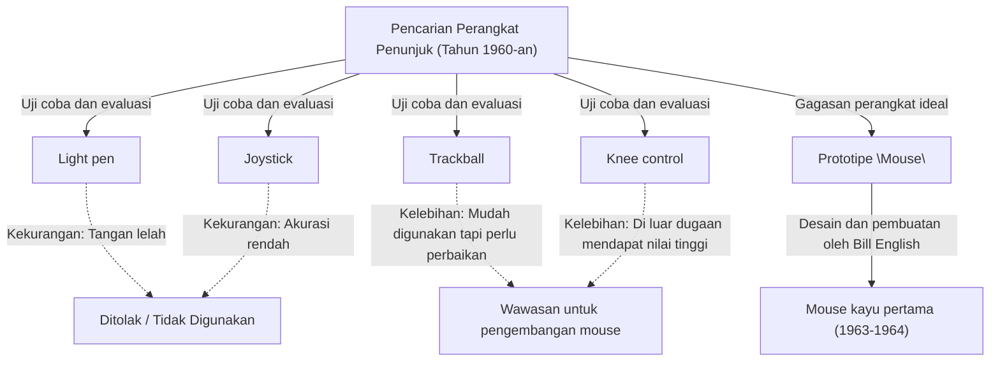
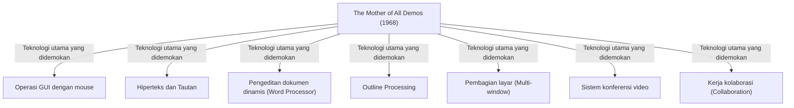

# Pendahuluan: Signifikansi Pengoperasian Komputer Modern dan Eksistensi Mouse

Dalam kehidupan sehari-hari dan pekerjaan kita, komputer telah menjadi keberadaan yang sangat penting. Sebagai antarmuka untuk mengoperasikan komputer, perangkat yang paling akrab di samping keyboard adalah "mouse". Meskipun saat ini perangkat layar sentuh seperti ponsel cerdas dan tablet telah meluas, dan menyentuh layar langsung dengan ujung jari sudah menjadi hal umum, mouse masih mempertahankan posisi yang tak tergoyahkan dalam operasi presisi atau pekerjaan jangka panjang.

Namun, hanya sedikit orang yang mengetahui secara mendalam kapan, oleh siapa, dan untuk tujuan apa perangkat kecil ini ditemukan. Orang yang tercatat dalam sejarah sebagai penemu mouse adalah peneliti Amerika, Douglas Engelbart. Dia tidak hanya ingin membuat "perangkat penunjuk yang praktis". Tujuannya adalah untuk membangun "sistem untuk meningkatkan kecerdasan manusia dan memecahkan masalah sosial yang kompleks".

Artikel ini akan menggali dan menjelaskan lebih dalam tentang kehidupan Douglas Engelbart, seorang visioner langka, visi besarnya, kisah kelahiran "mouse" sebagai alat untuk mewujudkan visi tersebut, serta presentasi legendaris "The Mother of All Demos" yang memberikan pengaruh besar pada komputasi modern.

# Sosok Douglas Engelbart

## Masa Muda dan Awal Karier

Douglas Carl Engelbart lahir pada tanggal 30 Januari 1925, di Portland, Oregon, Amerika Serikat. Masa kecilnya bertepatan dengan era Depresi Besar, di lingkungan yang jauh dari kata kaya, tetapi kehidupan di Oregon yang dikelilingi alam memupuk rasa ingin tahu dan kemandiriannya.

Dia mulai belajar teknik elektro di Oregon State University, namun studinya terhenti karena pecahnya Perang Dunia II, dan dia direkrut ke dalam Angkatan Laut AS. Dia ditugaskan sebagai teknisi radar di Filipina. Pengalaman sebagai teknisi radar ini menjadi pengalaman asli (primal) yang penting dan menentukan jalan hidupnya kelak.

## Pengalaman sebagai Teknisi Radar dan Pewahyuan

Di layar radar, informasi yang ditangkap oleh antena ditampilkan secara real-time sebagai titik cahaya. Engelbart sangat terkesan dengan proses "menangkap informasi di layar secara visual dan memanipulasi informasi berdasarkan itu". Komputer (mesin hitung) pada masa itu hanyalah mesin raksasa pemrosesan batch, di mana data dimasukkan melalui kartu punch dan output diterima berupa barisan angka besar yang dicetak di atas kertas. Tidak ada sifat real-time atau interaktivitas.

Namun, Engelbart membayangkan masa depan di mana layar CRT (tabung sinar katoda) seperti layar radar dihubungkan ke komputer, dan manusia dapat berinteraksi serta membangun informasi secara real-time sambil melihat layar. Ini adalah gagasan yang sangat pionir dan jauh menyimpang dari akal sehat pada masa itu.

## Pengaruh dari "As We May Think" karya Vannevar Bush

Setelah perang berakhir, di perpustakaan Palang Merah di Filipina, Engelbart menemukan sebuah artikel yang menentukan takdirnya. Itu adalah esai berjudul "As We May Think" yang ditulis pada tahun 1945 oleh Vannevar Bush, kepala administrasi ilmiah Amerika, di majalah The Atlantic Monthly.

Dalam artikel tersebut, Bush mengusulkan sistem pencarian informasi virtual bernama "Memex". Memex adalah perangkat yang menyimpan semua koleksi buku, catatan, dan komunikasi seseorang di mikrofilm, yang dapat dicari dan dilihat secara instan dari meja mekanis. Yang paling penting adalah konsep ini meramalkan gagasan hiperteks modern, yaitu menghubungkan (me-link) dan melacak satu informasi dengan informasi lainnya.

Engelbart mendapat inspirasi yang kuat dari konsep Memex. Dia berpikir bahwa sistem mekanis dengan mikrofilm yang digambarkan oleh Bush dapat direalisasikan dengan lebih canggih jika menggunakan teknologi komputer elektronik termutakhir.

# Visi "Peningkatan Kecerdasan Manusia (Augmenting Human Intellect)"

## Masalah Kompleks yang Dihadapi Umat Manusia

Setelah lulus universitas dan bekerja sebagai insinyur di NACA (pendahulu NASA saat ini), beberapa tahun kemudian, menjelang pernikahannya, Engelbart mulai merenungkan secara mendalam tentang tujuan hidupnya. "Apa yang harus saya lakukan di sisa hidup saya untuk memberikan nilai terbesar bagi dunia?"

Kesimpulan yang dia capai adalah sebagai berikut:
1. Masalah dunia menjadi semakin kompleks dan mendesak.
2. Banyak masalah yang tidak dapat dipecahkan dengan satu keahlian tunggal.
3. Oleh karena itu, kemampuan umat manusia itu sendiri untuk "menangani masalah kompleks" perlu ditingkatkan.

Inilah kelahiran konsep "Peningkatan Kecerdasan Manusia (Augmenting Human Intellect)", yang menjadi pekerjaan seumur hidupnya.

## Komputer sebagai Alat Berpikir

Engelbart percaya bahwa kemampuan manusia untuk memecahkan masalah kompleks sangat bergantung tidak hanya pada kecerdasan bawaan, tetapi juga pada bahasa, metodologi, dan "alat". Sepanjang sejarah, umat manusia telah memperluas kemampuan berpikir melalui penemuan tulisan, teknologi cetak, dan notasi matematika.

Dia memandang komputer yang baru saja muncul bukan sebagai "mesin untuk berhitung", melainkan sebagai "alat pamungkas untuk mendukung dan memperluas kerja intelektual manusia". Dia percaya bahwa dengan manusia dan komputer berinteraksi secara real-time, memvisualisasikan, menyusun, dan membagikan pemikiran, bukan hanya kecerdasan individu tetapi juga kecerdasan kolektif (collective intelligence) dapat ditingkatkan secara dramatis.

## Kerangka Konseptual (Sistem H-LAM/T)

Pada tahun 1962, Engelbart menerbitkan makalah penting berjudul "Augmenting Human Intellect: A Conceptual Framework". Di dalamnya, ia mengusulkan model sistem yang disebut "H-LAM/T (Human using Language, Artifacts, Methodology, in which he is Trained)".

Model ini memandang Manusia (Human) yang menggunakan Bahasa (Language), Artefak/Alat (Artifacts), dan Metodologi (Methodology), dan telah menerima Pelatihan (Training) untuk itu, sebagai satu sistem terpadu. Ia berpendapat bahwa peningkatan kecerdasan yang dramatis hanya akan terjadi jika, selain memajukan komputer (Artifacts), kita juga menciptakan konsep dan metode operasi baru (Language, Methodology) yang sesuai, serta melatih manusia itu sendiri untuk beradaptasi dengan lingkungan baru tersebut.

Sikap yang menekankan "Pelatihan (Training)" ini sangat terkait erat dengan filosofi desain sistemnya kelak (lebih mengutamakan fungsionalitas dan daya ekspresi daripada sekadar kemudahan penggunaan).

# Pendirian ARC (Augmentation Research Center) dan Tantangannya

## Aktivitas di SRI (Stanford Research Institute)

Untuk mewujudkan visinya, setelah meraih gelar doktor di University of California, Berkeley, Engelbart bergabung dengan Stanford Research Institute (SRI, sekarang SRI International). Pada awalnya, hanya sedikit orang yang memahami visi besarnya, dan dia juga kesulitan mengumpulkan dana, namun secara bertahap para peneliti berbakat yang sepaham dengan idenya mulai berkumpul.

Dia mendirikan laboratorium penelitian "ARC (Augmentation Research Center)" di dalam SRI, dan dengan dukungan dari ARPA (Defense Advanced Research Projects Agency, kelak menjadi DARPA), dia mulai serius mengembangkan sistem tersebut.

## Pengembangan NLS (oN-Line System)

Tujuan ARC adalah membangun sistem komputer terpadu yang mewujudkan visi Engelbart. Sistem itu adalah "NLS (oN-Line System)".

NLS memiliki banyak fitur dasar (prototipe) dari apa yang kita gunakan saat ini sebagai hal yang lumrah:
- Pengeditan dokumen di layar (fungsi word processor)
- Hiperteks (tautan antar dokumen)
- Outline processing (memperluas dan melipat struktur hierarki)
- Multi-window
- Kerja kolaborasi dan konferensi video melalui jaringan

Untuk mengoperasikan fitur-fitur canggih ini secara intuitif sambil melihat layar, metode konvensional dengan hanya menggunakan keyboard untuk mengetik memiliki keterbatasan. Diperlukan "perangkat baru" untuk menunjuk lokasi (teks atau tautan) manapun di layar dengan cepat dan akurat.

# Kelahiran Mouse: Uji Coba dan Terobosan

## Pencarian Perangkat Penunjuk

Untuk menemukan perangkat penunjuk terbaik dalam mengoperasikan NLS, Engelbart dan tim ARC (terutama insinyur utama Bill English) menguji dan membandingkan secara mendalam berbagai perangkat yang ada saat itu.

Perangkat yang diuji meliputi:
- **Light pen**: Metode menekan pena langsung ke layar. Intuitif, tetapi mengharuskan tangan selalu diangkat sehingga sangat melelahkan.
- **Joystick**: Menggerakkan kursor dengan memiringkan tuas. Sulit untuk posisi yang presisi.
- **Trackball**: Metode menggulirkan bola. Kemudahan pengoperasiannya relatif baik.
- **Knee control**: Perangkat yang dioperasikan dengan lutut di bawah meja. Secara mengejutkan mudah digunakan.
- **Grafacon**: Perangkat berbentuk pena pada tablet.

Engelbart secara ilmiah mengukur dan membandingkan tingkat kegunaan, kecepatan input, dan tingkat kesalahan dari perangkat-perangkat tersebut.

## Kerja Sama dengan Bill English

Sejak sebelumnya, Engelbart sudah memiliki ide tentang sebuah perangkat yang digeser di atas meja untuk menentukan koordinat di layar, dan telah menggambar sketsa ide tersebut di buku catatannya. Dia merancang perangkat dengan dua roda yang membaca pergerakan sumbu X (horizontal) dan sumbu Y (vertikal) secara terpisah.

Orang yang mewujudkan ide ini menjadi perangkat keras nyata adalah insinyur perangkat keras hebat dari ARC, Bill English. Berdasarkan sketsa Engelbart, ia mulai membuat purwarupa (prototipe) sekitar tahun 1963.

## Kotak Kayu dan Dua Roda: Prototipe Pertama

Mouse pertama di dunia sangat berbeda dengan desain berbahan plastik yang elegan saat ini. Perangkat itu berbentuk balok kotak yang terbuat dari kayu pinus, dengan satu tombol merah di bagian atas.

Di bagian bawahnya, terpasang dua roda logam (cakram) yang ditempatkan saling tegak lurus. Saat mouse digerakkan di atas meja, gerakan vertikal dibaca sebagai putaran satu roda, sedangkan gerakan horizontal dibaca sebagai putaran roda yang lain, yang kemudian diubah menjadi sinyal listrik dan dikirim ke komputer. Dengan demikian, kursor di layar akan bergerak sepenuhnya seirama dengan gerakan mouse.

Hasil dari eksperimen perbandingan membuktikan bahwa "perangkat yang digulirkan di atas meja" ini dapat menunjuk jauh lebih cepat dan akurat dibandingkan dengan light pen atau joystick.

## Asal Usul Nama "Mouse"

Sebenarnya tidak ada catatan pasti kapan dan oleh siapa perangkat ini dinamakan "Mouse" (tikus). Engelbart sendiri dalam sebuah wawancara di kemudian hari mengatakan, "Semua orang di laboratorium mulai menyebutnya begitu. Bentuknya menyerupai tikus, dan kabelnya tampak seperti ekor. Kami mencoba memberinya nama yang lebih bermartabat, tetapi pada akhirnya tidak pernah menetap."

Sebagai informasi tambahan, tanda di layar yang bergerak mengikuti mouse saat itu disebut "Bug" (kutu). Itu digunakan sebagai lelucon atau istilah slang bahwa "tikus (Mouse) mengejar kutu (Bug)".

# 1968 "The Mother of All Demos"

## Presentasi Legendaris

Pada tanggal 9 Desember 1968, di ajang Fall Joint Computer Conference yang diadakan di San Francisco, terjadi peristiwa bersejarah yang mengubah sejarah komputer. Douglas Engelbart melakukan demonstrasi publik berdurasi 90 menit di depan sekitar 1.000 ahli komputer.

Demonstrasi ini berisi konten yang begitu luar biasa, seolah-olah telah meramalkan semua kemajuan teknologi komputer di masa depan, sehingga belakangan dijuluki sebagai "The Mother of All Demos" (Induk dari Semua Demo).

## Teknologi Revolusioner yang Dipamerkan

Engelbart menempatkan konsol khusus di tengah panggung, duduk membelakangi layar proyektor raksasa, dengan tangan kirinya pada "keyset" (keyboard lima tuts untuk input kode) dan tangan kanannya memegang "mouse". Dia mengenakan mikrofon headset dan dengan suara tenang secara berurutan memamerkan fitur-fitur NLS.

Lokasi di San Francisco dan laboratorium SRI di Menlo Park yang berjarak sekitar 50 kilometer, terhubung oleh komunikasi gelombang mikro mutakhir dan jaringan khusus (dedicated line) pada saat itu. Sesuai dengan pengoperasian Engelbart, dokumen di layar diedit secara real-time, dan file yang berada di lokasi berbeda ditampilkan dengan melompat melalui hyperlink.

Yang lebih menakjubkan lagi adalah demo di mana wajah rekannya yang berada di laboratorium ditampilkan sebagai video di dalam jendela (window) di layar, sambil mereka berbicara melalui sambungan suara, mereka melakukan pengeditan kolaboratif secara bersama-sama pada kursor yang sama di dokumen yang sama. Ini berarti bahwa perangkat kolaborasi seperti Zoom atau Google Docs masa kini telah diwujudkan pada tahun 1960-an, masa di mana internet bahkan komputer pribadi pun belum ada.

## Keterkejutan Para Penonton dan Pengaruhnya bagi Generasi Mendatang

Bagi para ahli di masa itu yang hanya mengetahui sistem di mana kartu punch dimasukkan ke mesin dan hasil cetak diterima beberapa jam kemudian, demonstrasi ini memberikan kejutan yang luar biasa seolah-olah mereka sedang melihat sihir atau film fiksi ilmiah. Saat presentasi berakhir, seluruh hadirin berdiri dan memberikan tepuk tangan meriah yang menggemuruh memenuhi ruangan.

Banyak peneliti yang melihat demo ini, termasuk Alan Kay saat masih muda, sangat terpengaruh oleh visi Engelbart, dan kelak mereka memimpin revolusi komputer pribadi.

# Estafet ke Pusat Penelitian Palo Alto (Xerox PARC) dan Penyebaran ke Apple

## Konsep "Dynabook" Alan Kay dan Interim Dynabook (Alto)

Memasuki tahun 1970-an, laboratorium ARC milik Engelbart perlahan-lahan kehilangan pamornya karena kesulitan finansial akibat Perang Vietnam, dan obsesi Engelbart terhadap sistem yang dianggap "terlalu rumit". Banyak peneliti berbakatnya, termasuk Bill English, berpindah ke Pusat Penelitian Palo Alto (Xerox PARC) yang baru didirikan oleh Xerox.

Di PARC, penelitian diarahkan untuk mewujudkan visi "personal computing" yang dicetuskan oleh Alan Kay dan rekan-rekannya. Mereka mewarisi konsep "mouse" dan "operasi di layar" dari Engelbart, namun memperbaiki sistem operasi yang rumit menjadi lebih intuitif dan mudah diakses. Dari sinilah lahir "Alto", komputer pertama di dunia yang dilengkapi dengan layar bitmap, GUI (Graphical User Interface), dan mouse. Mouse kayu pun berevolusi menjadi desain yang lebih mudah digunakan dengan bola (trackball).

## Transfer Teknologi dari Xerox ke Apple (Macintosh)

Pada tahun 1979, salah satu pendiri Apple Computer, Steve Jobs, mendapat kesempatan untuk mengunjungi Xerox PARC. Jobs sangat terkesan dengan GUI dan kemudahan penggunaan mouse Alto, serta meyakini bahwa "inilah masa depan komputer", lalu dia secara paksa memasukkan konsep tersebut ke dalam proyek pengembangan perusahaannya sendiri.

Para insinyur Apple mendesain ulang mouse Xerox yang mahal dan rumit menjadi mouse dengan hanya satu tombol, yang dapat diproduksi secara massal dengan harga murah, dan dapat bergerak mulus di atas meja apapun. Melalui perilisan "Lisa" pada tahun 1983 dan "Macintosh" pada tahun 1984, mouse bertransformasi dari sekadar alat bagi segelintir peneliti, menjadi perangkat input standar yang digunakan konsumen umum di rumah dengan penyebaran yang sangat pesat.

## Kesuksesan Komersial dan Popularisasi Mouse

Kemudian, seiring dengan popularitas Microsoft Windows, mouse menjadi kelengkapan standar di semua PC di seluruh dunia. Kedua rodanya digantikan dengan bola karet, kemudian berevolusi menjadi sensor optik, berbasis laser, hingga nirkabel (wireless). Namun, paradigma dasar yang diciptakan Engelbart, yaitu "menggenggamnya dengan tangan dan menggerakkannya untuk memanipulasi kursor di layar", tetap tidak berubah meskipun lebih dari setengah abad telah berlalu.

# Warisan Engelbart dari Perspektif Modern

## Visi yang Belum Selesai: Peringatan Terhadap Sekadar "User-friendly"

Mouse telah menyebar ke seluruh dunia, memungkinkan siapa pun mengoperasikan komputer secara intuitif (atau yang sering disebut user-friendly). Namun, Engelbart sendiri memiliki perasaan campur aduk terhadap situasi ini.

Dia mengkritik bahwa menyederhanakan sistem hanya demi mengejar "kemudahan penggunaan (user-friendly)" itu ibarat memberikan sepeda roda tiga kepada seseorang dan berkata, "Ini sudah cukup". Mengendarai sepeda roda dua memang membutuhkan sedikit latihan, tetapi begitu dikuasai, kita akan mendapatkan kecepatan dan kebebasan yang tidak bisa dibandingkan dengan sepeda roda tiga.

Sistem H-LAM/T yang diimpikan Engelbart bertujuan agar manusia, melalui pelatihan, dapat menguasai alat (sistem) yang lebih kuat dan mendobrak batas-batas kecerdasan. GUI modern memang mudah digunakan, tetapi dari sudut pandang "peningkatan kecerdasan yang dramatis" yang diimpikannya, ini mungkin baru menjadi pintu masuk bagi potensi tersebut.

## Keterkaitan dengan Collective Intelligence (Kecerdasan Kolektif)

Pencapaian nyata dari Engelbart bukan sekadar penemuan mouse itu sendiri, melainkan perwujudan konsep "Collective Intelligence (Kecerdasan Kolektif)", di mana orang-orang di seluruh dunia berbagi pengetahuan melalui jaringan dan bekerja sama untuk memecahkan masalah.

Internet modern, World Wide Web (WWW), Wikipedia, dan komunitas open-source seperti GitHub dapat dikatakan sebagai implementasi modern dari "Peningkatan Kecerdasan" yang ia gambarkan. Jauh sebelum Tim Berners-Lee menemukan WWW, Engelbart telah melihat masa depan di mana informasi saling tertaut dalam sebuah jaringan.

## Ko-Evolusi Manusia dan Teknologi

Di era modern ini, di mana Kecerdasan Buatan (AI) berkembang pesat dan "Singularitas" di mana mesin melampaui kecerdasan manusia mulai diperdebatkan, pemikiran Engelbart kembali bersinar. Yang menjadi tujuannya bukanlah menggantikan pikiran manusia dengan mesin (Kecerdasan Buatan), melainkan menggunakan mesin untuk memperluas dan melengkapi kemampuan berpikir manusia (Peningkatan Kecerdasan: Intelligence Amplification / IA).

Saat AI mulai meresap ke dalam kehidupan kita saat ini, bagaimana kita mendesain teknologi, dan bagaimana kita memanfaatkannya (melatih diri). Ko-evolusi manusia dan teknologi, sebuah tema raksasa yang ditawarkan oleh Engelbart, adalah tantangan penting yang dilemparkan kepada kita yang hidup di era modern.

# Penutup: Pertanyaan Engelbart untuk "Masa Depan"

Douglas Engelbart menghembuskan napas terakhirnya pada tanggal 2 Juli 2013, di usia 88 tahun. "Mouse" yang diciptakannya dari sebuah balok kayu dan roda telah menjadi jembatan yang menghubungkan miliaran orang dengan dunia digital, dan mengubah dunia secara fundamental.

Pemandangan menakjubkan layaknya sihir yang ditunjukkan pada "The Mother of All Demos" tahun 1968, kini telah menjadi bagian dari kehidupan kita sehari-hari. Namun, visi pamungkasnya untuk "memecahkan masalah kompleks dalam skala global melalui peningkatan kecerdasan manusia" masih belum sepenuhnya terwujud.

Ketika kita memegang mouse, mengklik informasi di layar, dan berenang di lautan internet, terdapat hembusan "masa depan" yang dilihat oleh seorang jenius. Mengingat kembali jejak Douglas Engelbart akan menjadi petunjuk yang pasti bagi kita untuk memikirkan ke mana kita harus melangkah bersama dengan teknologi dari sekarang.
