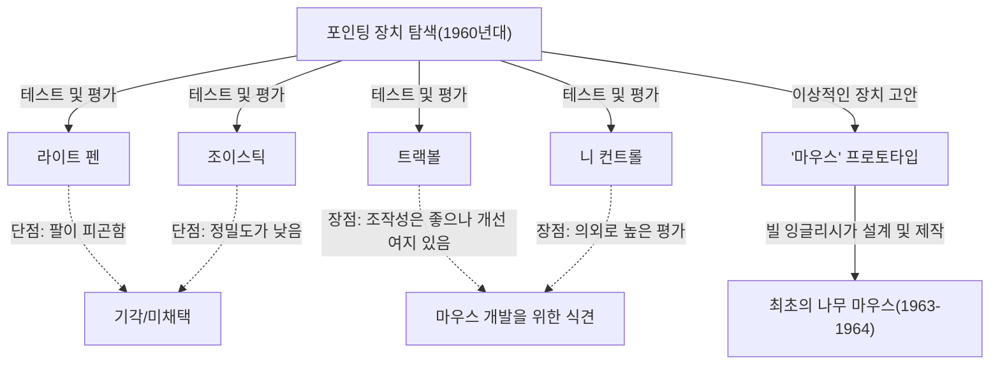
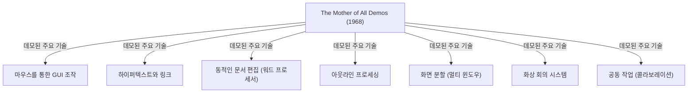

# 서론: 현대 컴퓨터 조작과 마우스의 존재 의의

우리의 일상생활이나 업무에 있어 컴퓨터는 필수 불가결한 존재가 되었습니다. 그 컴퓨터를 조작하기 위한 인터페이스로서 키보드와 더불어 가장 친숙한 장치가 '마우스'입니다. 지금에야 스마트폰이나 태블릿 등 터치스크린 기기가 보급되어 손가락 끝으로 직접 화면을 만지는 조작이 일반화되었지만, 정밀한 조작이나 장시간의 작업에 있어서 마우스는 여전히 확고한 지위를 구축하고 있습니다.

그러나 이 작은 장치가 언제, 누구에 의해, 어떤 목적으로 발명되었는지 깊이 아는 사람은 의외로 적을지도 모릅니다. 마우스의 발명자로서 역사에 이름을 남긴 인물은 미국의 연구자인 더글러스 엥겔바트(Douglas Engelbart)입니다. 그는 단순히 '편리한 포인팅 장치'를 만들고 싶었던 것이 아닙니다. 그가 목표로 한 것은 "인류의 지성을 증폭시켜 복잡한 사회 문제를 해결하기 위한 시스템"을 구축하는 것이었습니다.

이 글에서는 더글러스 엥겔바트라는 희대의 비저너리(선견지명을 가진 인물)의 생애와 그가 내세운 장대한 비전, 그리고 그 비전을 실현하기 위한 도구로서 탄생한 '마우스'의 탄생 비화, 나아가 현대 컴퓨팅에 지대한 영향을 미친 전설적인 프레젠테이션 'The Mother of All Demos(모든 데모의 어머니)'에 대해 깊이 파헤쳐 보겠습니다.

# 더글러스 엥겔바트라는 인물

## 성장 과정과 초기 경력

더글러스 칼 엥겔바트(Douglas Carl Engelbart)는 1925년 1월 30일, 미국 오리건주 포틀랜드에서 태어났습니다. 그의 유년기는 대공황 시대와 겹쳐 결코 유복한 환경은 아니었지만, 자연에 둘러싸인 오리건에서의 생활은 그의 탐구심과 자립심을 길러주었습니다.

오리건 주립대학교에서 전기공학을 공부하기 시작한 그는 제2차 세계대전의 발발로 학업을 중단하고 미국 해군에 징집됩니다. 그가 배치된 곳은 필리핀에서 레이더 기술자로서의 임무였습니다. 이 레이더 기술자로서의 경험이 훗날 그의 인생을 결정짓는 중요한 원체험이 됩니다.

## 레이더 기술자로서의 경험과 계시

레이더 화면에는 안테나가 포착한 정보가 빛의 점으로 실시간 표시됩니다. 엥겔바트는 이 "화면상의 정보를 시각적으로 포착하고, 그것을 바탕으로 정보를 조작한다"는 과정에 깊은 감명을 받았습니다. 당시의 컴퓨터(계산기)라고 하면 펀치 카드로 데이터를 입력하고 종이에 인쇄된 방대한 수열을 출력으로 받는 배치 처리형의 거대한 기계에 불과했습니다. 거기에는 실시간성도, 상호작용성(인터랙티비티)도 없었습니다.

하지만 엥겔바트는 레이더 화면과 같은 브라운관(CRT) 디스플레이를 컴퓨터에 연결하고, 인간이 화면을 보면서 실시간으로 정보를 조작하고 구축할 수 있는 미래를 상상했습니다. 이것은 당시의 상식과는 크게 동떨어진 극히 선구적인 발상이었습니다.

## 배너바 부시의 "As We May Think"로부터 받은 영향

종전 후, 필리핀 적십자사 도서관에서 엥겔바트는 운명적인 기사와 만납니다. 그것은 미국 과학 행정의 최고 책임자였던 배너바 부시(Vannevar Bush)가 1945년 The Atlantic Monthly지에 기고한 『As We May Think(우리가 생각하는 대로)』라는 에세이였습니다.

부시는 이 기사에서 'Memex(메멕스)'라는 가상의 정보 검색 시스템을 제창했습니다. Memex는 개인의 모든 장서, 기록, 통신을 마이크로필름에 저장하고, 기계화된 책상에서 즉시 검색하고 열람할 수 있는 장치입니다. 가장 중요한 것은 정보와 정보를 '연결(링크)'하여 저장하고 추적할 수 있다는, 현재 하이퍼텍스트의 개념을 예견했다는 점입니다.

엥겔바트는 Memex의 구상에서 강렬한 영감을 받았습니다. 그는 부시가 그린 마이크로필름을 통한 기계적 시스템을 최첨단 전자 컴퓨터 기술을 사용하면 더욱 고도화하여 실현할 수 있다고 생각한 것입니다.

# "지성의 증폭 (Augmenting Human Intellect)"이라는 비전

## 인류가 직면한 복잡한 문제

대학을 졸업하고 NACA(현재 NASA의 전신)에서 엔지니어로 일하기 시작한 엥겔바트였지만, 몇 년 후 결혼을 앞둔 그는 자신의 인생 목적에 대해 깊이 사색하게 됩니다. "남은 인생을 바쳐 세상에 가장 큰 가치를 가져다주려면 무엇을 해야 할까?"

그가 내린 결론은 다음과 같았습니다.
1. 세계의 문제는 점점 더 복잡해지고 긴급성을 띠고 있다.
2. 단일 전문 지식만으로는 해결할 수 없는 문제들뿐이다.
3. 따라서 인류의 "복잡한 문제에 대처하는 능력" 자체를 향상시킬 필요가 있다.

이것이 그의 평생의 과업이 될 '지성의 증폭(Augmenting Human Intellect)'이라는 개념의 탄생입니다.

## 사고의 도구로서의 컴퓨터

엥겔바트는 인간이 복잡한 문제를 해결하는 능력은 타고난 지능뿐만 아니라 언어, 방법론, 그리고 '도구(툴)'에 크게 의존한다고 생각했습니다. 인류는 지금까지 문자의 발명, 인쇄 기술, 수학적 표기법 등을 통해 사고 능력을 확장해 왔습니다.

그는 갓 등장한 컴퓨터를 '계산을 위한 기계'가 아니라 "인간의 지적 작업을 지원하고 확장하기 위한 궁극적인 도구"로 인식했습니다. 인간과 컴퓨터가 실시간으로 대화하면서 사고를 시각화하고, 구조화하고, 공유함으로써 개인의 지성뿐만 아니라 집단의 지성(집단 지성)을 비약적으로 높일 수 있다고 믿은 것입니다.

## 개념적 틀 (H-LAM/T 시스템)

엥겔바트는 1962년에 『Augmenting Human Intellect: A Conceptual Framework(인간 지성의 증폭: 개념적 틀)』이라는 중요한 논문을 발표합니다. 이 논문에서 그는 'H-LAM/T(Human using Language, Artifacts, Methodology, in which he is Trained)' 시스템이라는 모델을 제창했습니다.

이는 인간(Human)이 언어(Language), 인공물/도구(Artifacts), 방법론(Methodology)을 사용하고, 그 훈련(Training)을 받은 상태를 하나의 통합된 시스템으로 파악하는 것입니다. 컴퓨터(Artifacts)를 진화시키는 것뿐만 아니라, 그에 맞춘 새로운 개념이나 조작 방법(Language, Methodology)을 만들어 내고, 인간 자신도 새로운 환경에 적응하기 위한 훈련을 받음으로써 비로소 극적인 지성의 증폭이 일어난다는 주장이었습니다.

이 '훈련(Training)'을 중시하는 태도는 훗날 그의 시스템 설계 사상(사용 편의성보다는 기능성과 표현력을 중시함)과 깊이 연결되어 있습니다.

# ARC (Augmentation Research Center) 설립과 도전

## SRI (스탠퍼드 연구소) 에서의 활동

자신의 비전을 실현하기 위해 엥겔바트는 캘리포니아 대학교 버클리 캠퍼스에서 박사 학위를 취득한 후 스탠퍼드 연구소(SRI, 현재 SRI 인터내셔널)에 합류했습니다. 초기에는 그의 장대한 비전을 이해하는 사람이 적어 자금 조달에도 어려움을 겪었지만, 점차 그의 아이디어에 찬동하는 우수한 연구자들이 모이기 시작했습니다.

그는 SRI 내에 'ARC (Augmentation Research Center)'라는 연구소를 설립하고, ARPA(국방부 고등연구계획국, 이후 DARPA) 등의 지원을 받아 본격적으로 시스템 개발에 착수합니다.

## NLS (oN-Line System) 개발

ARC의 목표는 엥겔바트의 비전을 구현하는 통합적인 컴퓨터 시스템을 구축하는 것이었습니다. 그것이 바로 'NLS (oN-Line System)'입니다.

NLS는 현재 우리가 당연하게 사용하는 많은 기능의 원형을 갖추고 있었습니다.
- 화면상 문서 편집(워드 프로세서 기능)
- 하이퍼텍스트(문서 간 링크)
- 아웃라인 프로세싱(계층 구조의 전개 및 접기)
- 멀티 윈도우
- 네트워크를 통한 공동 작업과 화상 회의

이러한 고급 기능을 디스플레이를 보면서 직관적으로 조작하기 위해서는 키보드만으로 입력하는 기존 방법으로는 한계가 있었습니다. 화면상의 임의의 위치(텍스트나 링크)를 빠르고 정확하게 지정하기 위한 '새로운 장치'가 필요했던 것입니다.

# 마우스의 탄생: 시행착오와 돌파구

## 포인팅 장치 탐색

NLS 조작에 최적인 포인팅 장치를 찾기 위해 엥겔바트와 ARC 팀(특히 수석 엔지니어 빌 잉글리시)은 당시에 존재했던 다양한 장치를 철저히 테스트하고 비교했습니다.

테스트된 장치에는 다음과 같은 것들이 있었습니다.
- **라이트 펜**: 화면에 직접 펜을 누르는 방식. 직관적이지만 항상 팔을 들고 있어야 해서 매우 피곤함.
- **조이스틱**: 레버를 기울여 커서를 움직임. 세밀한 위치 조정이 어려움.
- **트랙볼(Tracker ball)**: 공을 굴리는 방식. 조작성이 비교적 좋음.
- **니 컨트롤(Knee control)**: 책상 밑에서 무릎을 사용하여 조작하는 장치. 의외로 조작성이 좋았음.
- **그라파콘(Grafacon)**: 태블릿 위의 펜형 장치.

엥겔바트는 이러한 장치들의 사용 편의성, 입력 속도, 오류율을 과학적으로 측정하고 비교 검토했습니다.

## 빌 잉글리시와의 협력

엥겔바트는 예전부터 책상 위를 미끄러뜨려 화면상의 좌표를 지정하는 아이디어를 가지고 있었고 수첩에 그 스케치를 그렸습니다. 그는 X축(가로)과 Y축(세로)의 움직임을 따로 읽어내는 2개의 바퀴를 가진 장치를 고안했습니다.

이 아이디어를 실제 하드웨어로 구현한 것이 ARC의 우수한 하드웨어 엔지니어였던 빌 잉글리시(Bill English)입니다. 그는 엥겔바트의 스케치를 바탕으로 1963년경부터 프로토타입 제작에 착수했습니다.

## 나무 상자와 2개의 바퀴: 최초의 프로토타입

세계 최초의 마우스는 현재의 플라스틱으로 된 세련된 디자인과는 크게 달랐습니다. 소나무로 만든 네모난 블록(나무 상자)으로, 상단에는 빨간색 버튼이 1개만 달려 있었습니다.

뒷면에는 직각으로 교차하도록 배치된 2개의 금속 바퀴(디스크)가 장착되어 있었습니다. 마우스를 책상 위에서 움직이면 세로 방향의 움직임은 한쪽 바퀴의 회전으로, 가로 방향의 움직임은 다른 쪽 바퀴의 회전으로 읽혀 전기 신호로 변환되어 컴퓨터로 전송되었습니다. 이로 인해 화면상의 커서가 마우스의 움직임과 완전히 연동되어 움직이게 된 것입니다.

비교 실험 결과, 이 '책상 위를 굴리는 장치'가 라이트 펜이나 조이스틱보다 압도적으로 빠르고 정확하게 포인팅할 수 있음이 증명되었습니다.

## '마우스'라는 이름의 유래

이 장치가 언제, 누구에 의해 '마우스(Mouse)'라고 이름 붙여졌는지 사실 명확한 기록은 남아 있지 않습니다. 엥겔바트 자신도 나중에 인터뷰에서 "연구실의 모두가 그렇게 부르게 되었다. 모양이 쥐와 비슷하고 선이 꼬리처럼 보였기 때문이다. 더 위엄 있는 이름을 붙이려 했지만 결국 정착되지 않았다"고 말했습니다.

참고로, 화면상에서 마우스와 연동되어 움직이는 표시는 당시 '버그(Bug, 벌레)'라고 불렸습니다. "쥐(Mouse)가 벌레(Bug)를 쫓아간다"는 유머러스한 은어로 사용되었던 것입니다.

# 1968년 "The Mother of All Demos(모든 데모의 어머니)"

## 전설적인 프레젠테이션

1968년 12월 9일, 샌프란시스코에서 열린 추계 합동 컴퓨터 회의(Fall Joint Computer Conference)에서 컴퓨터의 역사를 바꿀 역사적인 사건이 일어났습니다. 더글러스 엥겔바트가 약 1,000명의 컴퓨터 전문가 앞에서 진행한 90분간의 공개 프레젠테이션입니다.

이 데모는 그 후의 컴퓨터 기술 진보를 모두 예견한 듯한 압도적인 내용이었기 때문에 훗날 'The Mother of All Demos(모든 데모의 어머니)'라 찬사를 받게 됩니다.

## 공개된 획기적인 기술

엥겔바트는 무대 중앙에 특제 콘솔을 놓고, 왼손에는 '키 셋(코드 입력용 5키 건반)', 오른손에는 '마우스', 그리고 거대한 프로젝터 스크린을 등지고 앉았습니다. 그는 헤드셋 마이크를 착용하고 조용한 어조로 NLS의 기능들을 차례차례 선보였습니다.

샌프란시스코 행사장과 약 50km 떨어진 멘로파크의 SRI 연구소는 당시 최고 수준의 마이크로파 통신과 전용선으로 연결되어 있었습니다. 엥겔바트의 조작에 맞춰 화면의 문서가 실시간으로 편집되고, 서로 다른 장소에 있는 파일이 하이퍼링크를 통해 점프하여 표시되었습니다.

더욱 놀라웠던 것은 연구소에 있는 동료의 얼굴이 화면의 창 안에 비디오 영상으로 비춰지고, 음성 통화로 대화하면서 같은 문서의 같은 커서를 공유하여 공동 편집을 수행하는 데모였습니다. 이는 현대의 Zoom이나 Google 문서 도구와 같은 협업 도구를 인터넷은커녕 개인용 컴퓨터조차 존재하지 않던 1960년대에 실현했음을 의미합니다.

## 청중이 받은 충격과 후세에 미친 영향

펀치 카드를 기계에 읽히고 몇 시간 후에 결과물 프린트아웃을 받는 시스템밖에 몰랐던 당시 전문가들에게 이 데모는 마치 마법이나 SF 영화를 보는 듯한 충격을 주었습니다. 프레젠테이션이 끝나자 청중들은 기립하여 장내를 가득 채우는 박수갈채를 보냈습니다.

이 데모를 본 젊은 시절의 앨런 케이(Alan Kay)를 비롯한 많은 연구자들이 엥겔바트의 비전에 결정적인 영향을 받았고, 그 후의 개인용 컴퓨터 혁명을 이끌어 나가게 됩니다.

# 팰로앨토 연구소 (Xerox PARC) 로의 계승과 Apple로의 확산

## 앨런 케이의 'Dynabook' 구상과 잠정적 Dynabook (Alto)

1970년대에 들어서자 엥겔바트의 ARC 연구소는 베트남 전쟁의 영향으로 인한 자금난과, 그 자신의 "너무 난해한" 시스템에 대한 고집으로 인해 점차 기세를 잃어갔습니다. 그의 부하였던 빌 잉글리시를 포함한 많은 우수한 연구자들은 제록스가 신설한 팰로앨토 연구소(Xerox PARC)로 이적해 갔습니다.

PARC에서는 앨런 케이 등이 제창한 '퍼스널 컴퓨팅' 비전을 향한 연구가 진행되었습니다. 그들은 엥겔바트의 '마우스'와 '화면상의 조작'이라는 개념을 이어받으면서 복잡했던 조작 체계를 보다 직관적이고 친숙하게 개선했습니다. 이렇게 탄생한 것이 세계 최초의 비트맵 디스플레이와 GUI(그래픽 사용자 인터페이스), 그리고 마우스를 갖춘 컴퓨터 'Alto(알토)'입니다. 마우스도 나무로 된 것에서 공을 사용한 더 쓰기 편한 형태로 진화했습니다.

## 제록스에서 Apple(Macintosh)로의 기술 이전

1979년, Apple Computer의 공동 창업자인 스티브 잡스는 Xerox PARC를 견학할 기회를 얻었습니다. Alto의 GUI와 마우스의 조작성에 충격을 받은 잡스는 "이것이야말로 컴퓨터의 미래다"라고 확신하고, 자사의 개발 프로젝트에 그 개념을 강하게 도입했습니다.

Apple의 엔지니어들은 제록스의 비싸고 복잡한 마우스를 단 1개의 버튼으로 저렴하게 양산할 수 있고 어떤 책상 위에서도 부드럽게 움직이도록 재설계했습니다. 1983년 'Lisa(리사)', 그리고 1984년 'Macintosh(매킨토시)'의 발매로 마우스는 일부 연구자들을 위한 도구에서 일반 소비자가 가정에서 사용하는 표준적인 입력 장치로 비약적인 보급을 이루게 됩니다.

## 마우스의 상업적 성공과 일반화

그 후 Microsoft Windows의 보급도 맞물려 마우스는 전 세계 모든 PC에 기본 장착되게 되었습니다. 두 개의 바퀴는 고무공으로 바뀌었고 이윽고 광학식 센서로 진화했으며, 레이저식, 무선식 등으로 기술적 진보를 이루었지만, "손으로 쥐고 움직여 화면상의 커서를 조작한다"는 엥겔바트가 고안한 기본 패러다임은 반세기가 넘게 지난 지금도 변하지 않고 있습니다.

# 현대의 시각으로 보는 엥겔바트의 유산

## 미완의 비전: 단순한 사용 편의성(User-friendly)에 대한 경종

마우스는 전 세계에 보급되었고 누구나 직관적으로 컴퓨터를 조작할 수 있게 되었습니다(이른바 사용자 친화적). 하지만 엥겔바트 자신은 이 현실에 대해 복잡한 심경을 안고 있었습니다.

그는 "사용 편의성(User-friendly)"만을 추구하여 시스템을 단순화하는 것은 세발자전거를 주며 "이것으로 충분하다"고 말하는 것과 같다고 비판했습니다. 두발자전거를 능숙하게 타려면 약간의 훈련이 필요하지만, 한 번 습득하면 세발자전거와는 비교할 수 없는 속도와 자유도를 얻을 수 있습니다.

엥겔바트가 목표로 한 H-LAM/T 시스템은 인간이 훈련을 통해 더 강력한 도구(시스템)를 능숙하게 다루고 지성의 한계를 끌어올리기 위한 것이었습니다. 현대의 GUI는 확실히 사용하기 쉽지만, 그가 꿈꿨던 "지성의 극적인 증폭"이라는 관점에서 보면 아직 그 가능성의 입구에 불과할지도 모릅니다.

## 집단 지성(Collective Intelligence)으로의 연결

엥겔바트의 진정한 공적은 마우스 발명 그 자체보다도, 전 세계 사람들이 네트워크를 통해 지식을 공유하고 협력하여 문제를 해결한다는 '집단 지성(Collective Intelligence)'의 개념을 시스템으로 구현한 데 있습니다.

현재의 인터넷, 월드 와이드 웹(WWW), 위키백과, GitHub 등의 오픈 소스 커뮤니티는 바로 그가 그린 '지성의 증폭'의 현대적인 구현 형태라고 할 수 있을 것입니다. 팀 버너스리가 WWW를 발명하기 훨씬 전에 엥겔바트는 정보가 네트워크상에서 서로 링크되는 미래를 보고 있었습니다.

## 인간과 기술의 공진화

인공지능(AI)이 급속히 진화하고 인간의 지성을 넘어서는 '특이점(Singularity)'이 논의되는 현대에 엥겔바트의 사상은 다시 빛을 발하고 있습니다. 그가 목표로 한 것은 기계가 인간의 사고를 대체하게 하는 것(인공지능)이 아니라, 기계를 사용하여 인간의 사고 능력을 확장하고 보완하는 것(지능 확장: Intelligence Amplification / IA)이었습니다.

AI가 우리 생활에 스며들고 있는 지금, 기술을 어떻게 설계하고 우리가 어떻게 그것을 이용(훈련)해 나갈 것인가. 인간과 기술의 공진화라는 엥겔바트가 제시한 거대한 주제는 현대를 살아가는 우리에게 던져진 중요한 과제입니다.

# 맺음말: 엥겔바트가 남긴 "미래"를 향한 질문

더글러스 엥겔바트는 2013년 7월 2일, 88세의 나이로 세상을 떠났습니다. 그가 나무 상자와 바퀴로 만들어낸 '마우스'는 수십억 명의 사람들과 디지털 세계를 연결하는 다리가 되어 세상을 근본적으로 바꾸었습니다.

1968년 The Mother of All Demos에서 보여준 마법 같은 광경은 이제 우리의 일상 그 자체가 되었습니다. 그러나 그가 진정으로 목표했던 "인류 지성 증폭을 통한 지구적 규모의 복잡한 문제 해결"이라는 궁극적인 비전은 아직 완전히 실현되지 않았습니다.

우리가 마우스를 쥐고 화면의 정보를 클릭하며 인터넷의 바다를 헤엄칠 때, 거기에는 한 천재가 본 "미래"의 숨결이 깃들어 있습니다. 더글러스 엥겔바트의 궤적을 되돌아보는 것은 우리가 앞으로 기술과 함께 어디로 나아가야 할지 생각하기 위한 확실한 이정표가 될 것입니다.
