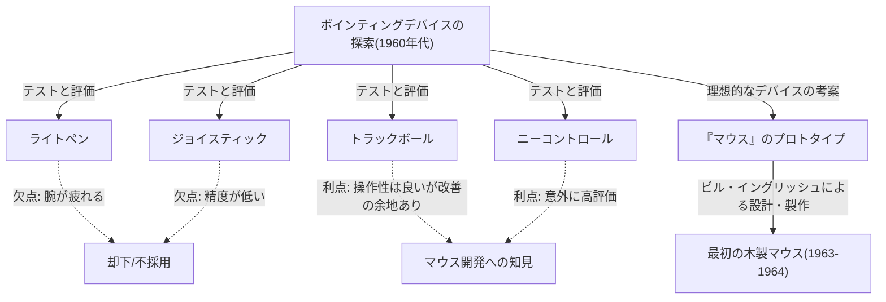
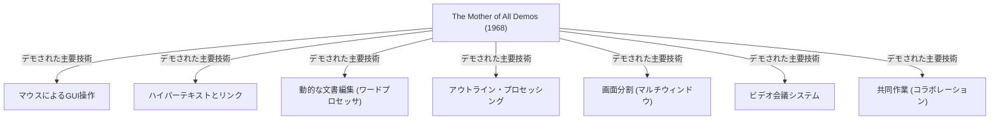

# はじめに：現代のコンピュータ操作とマウスの存在意義

私たちの日常生活や仕事において、コンピュータは不可欠な存在となりました。そのコンピュータを操作するためのインターフェースとして、キーボードと並んで最も身近なデバイスが「マウス」です。今でこそ、スマートフォンやタブレットなどのタッチパネルデバイスが普及し、指先で直接画面に触れる操作が一般化していますが、精密な操作や長時間の作業において、マウスは依然として不動の地位を築いています。

しかし、この小さなデバイスがいつ、誰によって、どのような目的で発明されたのかを深く知る人は意外と少ないかもしれません。マウスの発明者として歴史に名を刻むのは、アメリカの研究者であるダグラス・エンゲルバート（Douglas Engelbart）です。彼は単に「便利なポインティングデバイス」を作りたかったわけではありません。彼が目指したのは、「人類の知性を増幅し、複雑な社会問題を解決するためのシステム」を構築することでした。

本記事では、ダグラス・エンゲルバートという希代のビジョナリー（先見の明を持つ人物）の生涯と、彼が掲げた壮大なビジョン、そしてそのビジョンを実現するためのツールとして生まれた「マウス」の誕生秘話、さらには現代のコンピューティングに多大な影響を与えた伝説のプレゼンテーション「The Mother of All Demos（すべてのデモの母）」について、深く掘り下げて解説していきます。

# ダグラス・エンゲルバートという人物

## 生い立ちと初期のキャリア

ダグラス・カール・エンゲルバート（Douglas Carl Engelbart）は、1925年1月30日、アメリカ合衆国オレゴン州ポートランドで生まれました。彼の幼少期は大恐慌時代と重なり、決して裕福な環境ではありませんでしたが、自然に囲まれたオレゴンでの生活は彼の探求心と自立心を育みました。

オレゴン州立大学で電気工学を学び始めた彼は、第二次世界大戦の勃発により学業を中断し、アメリカ海軍に招集されます。彼が配属されたのは、フィリピンでのレーダー技術者としての任務でした。このレーダー技術者としての経験が、後の彼の人生を決定づける重要な原体験となります。

## レーダー技術者としての経験と啓示

レーダーのスクリーン画面には、アンテナが捉えた情報が光の点としてリアルタイムに表示されます。エンゲルバートは、この「画面上の情報を視覚的に捉え、それに基づいて情報を操作する」というプロセスに深い感銘を受けました。当時のコンピュータ（計算機）といえば、パンチカードでデータを入力し、紙に印刷された膨大な数列を出力として受け取るという、バッチ処理型の巨大な機械に過ぎませんでした。そこにはリアルタイム性も、対話性（インタラクティビティ）もありませんでした。

しかしエンゲルバートは、レーダースクリーンのようなブラウン管（CRT）ディスプレイをコンピュータに接続し、人間が画面を見ながらリアルタイムに情報を操作・構築できる未来を思い描いたのです。これは、当時の常識からは大きくかけ離れた、極めて先駆的な発想でした。

## ヴァネヴァー・ブッシュの「As We May Think」からの影響

終戦後、フィリピンの赤十字の図書館で、エンゲルバートは運命的な記事と出会います。それは、アメリカの科学行政のトップであったヴァネヴァー・ブッシュ（Vannevar Bush）が1945年にThe Atlantic Monthly誌に寄稿した『As We May Think（我々が思考するごとく）』というエッセイでした。

ブッシュはこの記事の中で、「Memex（メメックス）」という仮想の情報検索システムを提唱しました。Memexは、個人のすべての蔵書、記録、通信をマイクロフィルムに保存し、機械化されたデスクから瞬時に検索・閲覧できるデバイスです。最も重要なのは、情報と情報を「関連付け（リンク）」して保存・追跡できるという、現在のハイパーテキストの概念を予見していた点です。

エンゲルバートは、Memexの構想に強烈なインスピレーションを受けました。彼は、ブッシュが描いたマイクロフィルムによる機械的システムを、最先端の電子コンピュータ技術を使えばさらに高度に実現できると考えたのです。

# 「知性の増幅 (Augmenting Human Intellect)」というビジョン

## 人類が直面する複雑な問題

大学を卒業し、NACA（現在のNASAの前身）でエンジニアとして働き始めたエンゲルバートでしたが、数年後、結婚を控えた彼は自身の人生の目的について深く思索するようになります。「残りの人生をかけて、世界に最大の価値をもたらすには何をすべきか？」

彼が出した結論は次のようなものでした。
1. 世界の問題はますます複雑化し、緊急性を増している。
2. 単一の専門知識だけでは解決できない問題ばかりである。
3. したがって、人類の「複雑な問題に対処する能力」そのものを向上させる必要がある。

これが、彼のライフワークとなる「知性の増幅（Augmenting Human Intellect）」という概念の誕生です。

## 思考のツールとしてのコンピュータ

エンゲルバートは、人間が複雑な問題を解決する能力は、生来の知能だけでなく、言語、方法論、そして「ツール（道具）」に大きく依存していると考えました。人類はこれまで、文字の発明、印刷技術、数学的記法などによって思考能力を拡張してきました。

彼は、登場したばかりのコンピュータを「計算のための機械」としてではなく、「人間の知的作業を支援し、拡張するための究極のツール」として捉えました。人間とコンピュータがリアルタイムに対話しながら、思考を視覚化し、構造化し、共有することで、個人の知性だけでなく、集団の知性（コレクティブ・インテリジェンス）を飛躍的に高めることができると信じたのです。

## 概念的枠組み (H-LAM/Tシステム)

エンゲルバートは1962年に『Augmenting Human Intellect: A Conceptual Framework（人間の知性の増幅：概念的枠組み）』という重要な論文を発表します。この中で彼は、「H-LAM/T（Human using Language, Artifacts, Methodology, in which he is Trained）」システムというモデルを提唱しました。

これは、人間（Human）が言語（Language）、人工物・ツール（Artifacts）、方法論（Methodology）を使用し、それらの訓練（Training）を受けた状態を一つの統合されたシステムとして捉えるものです。コンピュータ（Artifacts）を進化させるだけでなく、それに合わせた新しい概念や操作方法（Language, Methodology）を生み出し、人間自身も新しい環境に適応するための訓練を受けることで、初めて劇的な知性の増幅が起こるという主張でした。

この「訓練（Training）」を重視する姿勢は、後の彼のシステムの設計思想（使いやすさよりも機能性と表現力を重視する）に深く結びついています。

# ARC (Augmentation Research Center) の設立と挑戦

## SRI (スタンフォード研究所) での活動

自らのビジョンを実現するため、エンゲルバートはカリフォルニア大学バークレー校で博士号を取得した後、スタンフォード研究所（SRI、現在のSRIインターナショナル）に加わりました。当初は彼の壮大なビジョンを理解する人は少なく、資金集めにも苦労しましたが、徐々に彼のアイデアに賛同する優秀な研究者たちが集まり始めました。

彼はSRI内に「ARC (Augmentation Research Center)」という研究ラボを設立し、ARPA（国防総省高等研究計画局、のちのDARPA）などの支援を受けながら、本格的にシステムの開発に着手します。

## NLS (oN-Line System) の開発

ARCの目標は、エンゲルバートのビジョンを体現する統合的なコンピュータシステムを構築することでした。それが「NLS (oN-Line System)」です。

NLSは、現在の私たちが当たり前のように使っている多くの機能の原型を備えていました。
- 画面上での文書編集（ワープロ機能）
- ハイパーテキスト（文書間のリンク）
- アウトライン・プロセッシング（階層構造の展開・折りたたみ）
- マルチウィンドウ
- ネットワークを通じた共同作業とビデオ会議

これらの高度な機能を、ディスプレイを見ながら直感的に操作するためには、キーボードだけで入力する従来の方法では限界がありました。画面上の任意の場所（テキストやリンク）を素早く正確に指定するための「新しいデバイス」が必要だったのです。

# マウスの誕生：試行錯誤とブレイクスルー

## ポインティングデバイスの探索

NLSの操作に最適なポインティングデバイスを見つけるため、エンゲルバートとARCのチーム（特に主任エンジニアのビル・イングリッシュ）は、当時存在していた様々なデバイスを徹底的にテスト・比較しました。

テストされたデバイスには以下のようなものがありました。
- **ライトペン**：画面に直接ペンを押し当てる方式。直感的だが、常に腕を上げている必要があり非常に疲れる。
- **ジョイスティック**：レバーを倒してカーソルを動かす。細かい位置合わせが難しい。
- **トラッカーボール（トラックボール）**：球を転がす方式。操作性は比較的良い。
- **ニーコントロール**：机の下で膝を使って操作するデバイス。意外にも操作性が良かった。
- **グラフトコン（Grafacon）**：タブレット上のペン型デバイス。

エンゲルバートは、これらのデバイスの使い勝手、入力スピード、エラー率を科学的に測定し、比較検討しました。

## ビル・イングリッシュとの協力

エンゲルバートは以前から、机の上を滑らせて画面上の座標を指定するアイデアを持っており、手帳にそのスケッチを描いていました。彼はX軸（横）とY軸（縦）の動きを別々に読み取る2つの車輪を持ったデバイスを考案しました。

このアイデアを実際のハードウェアとして形にしたのが、ARCの優秀なハードウェア・エンジニアであったビル・イングリッシュ（Bill English）です。彼はエンゲルバートのスケッチをもとに、1963年頃からプロトタイプの製作に取り掛かりました。

## 木の箱と2つの車輪：最初のプロトタイプ

世界初のマウスは、現在のプラスチック製の洗練されたデザインとは大きく異なっていました。それは松の木で作られた四角いブロック（木の箱）で、上部には赤いボタンが1つだけ付いていました。

裏面には、直角に交わるように配置された2つの金属製の車輪（ディスク）が取り付けられていました。マウスを机の上で動かすと、縦方向の動きは一方の車輪の回転として、横方向の動きはもう一方の車輪の回転として読み取られ、電気信号に変換されてコンピュータに送られました。これにより、画面上のカーソルがマウスの動きと完全に連動して動くようになったのです。

比較実験の結果、この「机の上を転がすデバイス」が、ライトペンやジョイスティックよりも圧倒的に速く、正確にポインティングできることが証明されました。

## 「マウス」という名前の由来

このデバイスがいつ、誰によって「マウス（Mouse）」と名付けられたのか、実は明確な記録は残っていません。エンゲルバート自身も後のインタビューで「研究室の誰もがそう呼ぶようになった。形がネズミに似ていて、コードが尻尾のように見えたからだ。もっと威厳のある名前をつけようとしたが、結局定着しなかった」と語っています。

ちなみに、画面上でマウスに連動して動く印のことは、当時は「バグ（Bug、虫）」と呼ばれていました。「ネズミ（Mouse）が虫（Bug）を追いかける」というユーモアのある隠語として使われていたのです。

# 1968年「The Mother of All Demos（すべてのデモの母）」

## 伝説のプレゼンテーション

1968年12月9日、サンフランシスコで開催された秋季合同コンピュータ会議（Fall Joint Computer Conference）において、コンピュータの歴史を変える歴史的な出来事が起こりました。ダグラス・エンゲルバートが、約1,000人のコンピュータ専門家の前で行った90分間の公開デモンストレーションです。

このデモは、その後のコンピュータ技術の進歩をすべて予見していたかのような圧倒的な内容であったため、後に「The Mother of All Demos（すべてのデモの母）」と称賛されることになります。

## 披露された画期的技術

エンゲルバートは、ステージ上の中央に特製のコンソールを置き、左手には「キーセット（コード入力用の5キー鍵盤）」、右手には「マウス」、そして巨大なプロジェクタースクリーンを背にして座りました。彼はヘッドセットマイクを装着し、静かな語り口でNLSの機能を次々と披露していきました。

サンフランシスコの会場と、約50キロ離れたメンローパークのSRIの研究所は、当時としては最先端のマイクロ波通信と専用線で結ばれていました。エンゲルバートの操作に合わせて画面上の文書がリアルタイムに編集され、別々の場所にあるファイルがハイパーリンクでジャンプして表示されました。

さらに驚異的だったのは、研究所にいる同僚の顔が画面のウィンドウ内にビデオ映像として映し出され、音声通話で会話しながら、同じ文書の同じカーソルを共有して共同編集を行うというデモでした。これは、現代のZoomやGoogleドキュメントのようなコラボレーションツールを、インターネットはおろかパーソナルコンピュータすら存在しない1960年代に実現していたことを意味します。

## 聴衆の衝撃と後世への影響

パンチカードを機械に読み込ませて数時間後に結果のプリントアウトを受け取るようなシステムしか知らなかった当時の専門家たちにとって、このデモはまるで魔法かSF映画を見ているかのような衝撃を与えました。プレゼンテーションが終わると、聴衆は総立ちになり、割れんばかりのスタンディングオベーションが会場を包みました。

このデモを見た若き日のアラン・ケイ（Alan Kay）をはじめとする多くの研究者たちが、エンゲルバートのビジョンに決定的な影響を受け、その後のパーソナルコンピュータ革命を牽引していくことになります。

# パロアルト研究所 (Xerox PARC) への継承とAppleへの広がり

## アラン・ケイの「Dynabook」構想と暫定Dynabook (Alto)

1970年代に入ると、エンゲルバートのARC研究所は、ベトナム戦争の影響による資金難や、彼自身の「難解すぎる」システムへのこだわりから、徐々に勢いを失っていきました。彼の部下であったビル・イングリッシュを含む多くの優秀な研究者たちは、ゼロックスが新設したパロアルト研究所（Xerox PARC）へと移籍していきました。

PARCでは、アラン・ケイらが提唱する「パーソナル・コンピューティング」のビジョンに向けて研究が進められました。彼らはエンゲルバートの「マウス」と「画面上の操作」という概念を引き継ぎつつ、複雑だった操作系をより直感的で親しみやすいものへと改良しました。こうして生み出されたのが、世界初のビットマップディスプレイとGUI（グラフィカル・ユーザー・インターフェース）、そしてマウスを備えたコンピュータ「Alto（アルト）」です。マウスも木製のものから、ボールを使ったより使いやすいものへと進化しました。

## ゼロックスからApple（Macintosh）への技術移転

1979年、Apple Computerの共同創業者であるスティーブ・ジョブズは、Xerox PARCを見学する機会を得ました。AltoのGUIとマウスの操作性に衝撃を受けたジョブズは、「これこそがコンピュータの未来だ」と確信し、自社の開発プロジェクトにその概念を強引に取り入れました。

Appleのエンジニアたちは、Xeroxの高価で複雑なマウスを、たった1つのボタンで、安価に量産でき、どんな机の上でもスムーズに動くように再設計しました。1983年の「Lisa（リサ）」、そして1984年の「Macintosh（マッキントッシュ）」の発売により、マウスは一部の研究者のためのツールから、一般の消費者が家庭で使う標準的な入力デバイスへと飛躍的な普及を遂げることになります。

## マウスの商業的成功と一般化

その後、Microsoft Windowsの普及も相まって、マウスは世界中のすべてのPCに標準装備されるようになりました。2つの車輪はゴム製のボールに変わり、やがて光学式センサーへと進化し、レーザー式、ワイヤレス式と技術的な進歩を遂げていきましたが、「手で握って動かし、画面上のカーソルを操作する」というエンゲルバートが考案した基本的なパラダイムは、半世紀以上経った今でも変わっていません。

# 現代から見るエンゲルバートの遺産

## 未完のビジョン：単なる使いやすさ(User-friendly)への警鐘

マウスは世界中に普及し、誰もが直感的にコンピュータを操作できるようになりました（いわゆるユーザーフレンドリー）。しかし、エンゲルバート自身はこの現状に対して複雑な思いを抱いていました。

彼は、「使いやすさ（User-friendly）」ばかりを追求してシステムを簡略化することは、三輪車を与えて「これで十分だ」と言っているようなものだと批判しました。自転車を乗りこなすには少しの訓練が必要ですが、一度習得すれば三輪車とは比較にならない速度と自由度を手に入れることができます。

エンゲルバートが目指したH-LAM/Tシステムは、人間が訓練を通じてより強力な道具（システム）を使いこなし、知性の限界を引き上げるためのものでした。現代のGUIは確かに使いやすいですが、彼が夢見た「知性の劇的な増幅」という観点から見れば、まだその可能性の入り口に過ぎないのかもしれません。

## コレクティブ・インテリジェンス（集合知）への繋がり

エンゲルバートの真の功績は、マウスの発明そのものよりも、世界中の人々がネットワークを通じて知識を共有し、協力して問題を解決するという「コレクティブ・インテリジェンス（集合知・集団的知性）」の概念をシステムとして具現化したことにあります。

現在のインターネット、World Wide Web (WWW)、Wikipedia、GitHubなどのオープンソースコミュニティは、まさに彼が描いた「知性の増幅」の現代的な実装形態であると言えるでしょう。ティム・バーナーズ＝リーがWWWを発明するはるか前に、エンゲルバートは情報がネットワーク上でリンクし合う未来を見ていました。

## 人とテクノロジーの共進化

人工知能（AI）が急速に進化し、人間の知性を超える「シンギュラリティ」が議論される現代において、エンゲルバートの思想は再び輝きを放っています。彼が目指したのは、機械に人間の思考を代替させること（人工知能）ではなく、機械を使って人間の思考能力を拡張・補完すること（知能拡張：Intelligence Amplification / IA）でした。

AIが私たちの生活に浸透しつつある今、テクノロジーをどのように設計し、私たちがどのようにそれを利用（訓練）していくのか。人間とテクノロジーの共進化という、エンゲルバートが提示した巨大なテーマは、現代を生きる我々に投げかけられた重要な課題です。

# おわりに：エンゲルバートが残した「未来」への問いかけ

ダグラス・エンゲルバートは2013年7月2日、88歳でこの世を去りました。彼が木の箱と車輪から作り出した「マウス」は、何十億人もの人々とデジタル世界とを繋ぐ架け橋となり、世界を根本から変えました。

1968年のThe Mother of All Demosで示された魔法のような光景は、今や私たちの日常そのものになっています。しかし、彼が真に目指した「人類の知性の増幅による、地球規模の複雑な問題の解決」という究極のビジョンは、まだ完全には実現していません。

私たちがマウスを握り、画面上の情報をクリックし、インターネットの海を泳ぐとき、そこには一人の天才が見た「未来」の息吹が宿っています。ダグラス・エンゲルバートの軌跡を振り返ることは、私たちがこれからテクノロジーとともにどこへ向かうべきかを考えるための、確かな道しるべとなるはずです。
