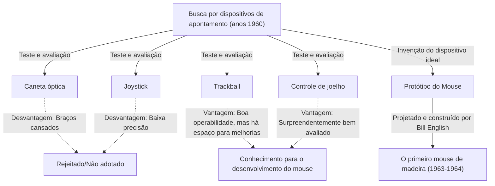
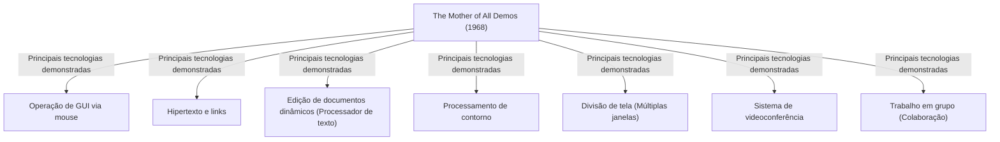

# Introdução: A Operação de Computadores Modernos e o Significado do Mouse

Em nossas vidas e trabalhos diários, os computadores se tornaram indispensáveis. Como interface para operar esses computadores, o dispositivo mais familiar ao lado do teclado é o "mouse". Hoje em dia, dispositivos com tela sensível ao toque como smartphones e tablets tornaram-se populares, e o ato de tocar a tela diretamente com as pontas dos dedos é comum, mas para operações precisas ou longas horas de trabalho, o mouse ainda mantém uma posição inabalável.

No entanto, pode haver surpreendentemente poucas pessoas que saibam profundamente quando, por quem e com que propósito este pequeno dispositivo foi inventado. O pesquisador americano Douglas Engelbart deixou seu nome na história como o inventor do mouse. Ele não queria simplesmente criar um "dispositivo de apontamento conveniente". O que ele buscava era construir "um sistema para amplificar o intelecto humano e resolver problemas sociais complexos".

Neste artigo, aprofundaremos na vida de Douglas Engelbart, um visionário raro, a grande visão que ele estabeleceu, a história por trás do nascimento do "mouse" como uma ferramenta para realizar essa visão e a lendária apresentação "The Mother of All Demos" que teve um impacto enorme na computação moderna.

# A Pessoa Douglas Engelbart

## Crescimento e Início de Carreira

Douglas Carl Engelbart nasceu em 30 de janeiro de 1925 em Portland, Oregon, EUA. Sua infância coincidiu com a Grande Depressão, e de forma alguma em um ambiente rico, mas a vida no Oregon cercado pela natureza nutriu sua curiosidade e independência.

Ele começou a estudar engenharia elétrica na Oregon State University, mas seus estudos foram interrompidos pela eclosão da Segunda Guerra Mundial, e ele foi recrutado para a Marinha dos Estados Unidos. Ele foi designado para servir nas Filipinas como técnico de radar. Essa experiência como técnico de radar se tornaria a experiência original crucial que moldaria sua vida posterior.

## Experiência e Revelação como Técnico de Radar

Na tela do radar, a informação capturada pela antena é exibida em tempo real como pontos de luz. Engelbart ficou profundamente impressionado com esse processo de "capturar informações visualmente na tela e manipulá-las com base nisso". Os computadores daquela época não passavam de enormes máquinas de processamento em lote, onde os dados eram inseridos por cartões perfurados e vastas sequências de números impressas no papel eram recebidas como saída. Não havia tempo real ou interatividade ali.

Mas Engelbart imaginou um futuro onde um tubo de raios catódicos (CRT), semelhante a uma tela de radar, fosse conectado a um computador, e os humanos pudessem manipular e estruturar informações em tempo real enquanto olhavam para a tela. Essa era uma ideia extremamente pioneira, muito distante do bom senso da época.

## A Influência de "As We May Think" de Vannevar Bush

Após a guerra, em uma biblioteca da Cruz Vermelha nas Filipinas, Engelbart encontrou um artigo fatídico. Era um ensaio intitulado "As We May Think", contribuído para a revista The Atlantic Monthly em 1945 por Vannevar Bush, chefe da administração científica da América.

Neste artigo, Bush propôs um sistema de recuperação de informação virtual chamado "Memex". Memex é um dispositivo onde os livros, registros e comunicações de um indivíduo são todos armazenados em microfilme, e podem ser instantaneamente recuperados e visualizados a partir de uma mesa mecanizada. Mais importante, previa o conceito atual de hipertexto, no qual informações podem ser "associadas (vinculadas)" umas às outras, armazenadas e rastreadas.

Engelbart foi fortemente inspirado pelo conceito do Memex. Ele achava que o sistema mecânico baseado em microfilme que Bush descrevia poderia ser realizado de forma ainda mais sofisticada usando a tecnologia de computador eletrônico de ponta.

# A Visão de "Augmenting Human Intellect" (Aumento do Intelecto Humano)

## Problemas Complexos Enfrentados pela Humanidade

Após se formar na universidade, Engelbart começou a trabalhar como engenheiro na NACA (antecessora da atual NASA), mas alguns anos depois, enquanto se preparava para o casamento, ele começou a pensar profundamente sobre o propósito de sua vida. "O que devo fazer pelo resto da minha vida para trazer o maior valor ao mundo?"

As conclusões a que ele chegou foram as seguintes:
1. Os problemas do mundo estão se tornando cada vez mais complexos e urgentes.
2. A maioria dos problemas não pode ser resolvida por uma única especialidade.
3. Portanto, é necessário melhorar a própria "capacidade da humanidade de lidar com problemas complexos".

Este foi o nascimento do conceito de "Augmenting Human Intellect" (Aumento do Intelecto Humano), que se tornaria o trabalho de sua vida.

## O Computador como uma Ferramenta para o Pensamento

Engelbart acreditava que a capacidade humana de resolver problemas complexos dependia fortemente não apenas da inteligência inata, mas também da linguagem, metodologia e "ferramentas". A humanidade até agora expandiu suas capacidades de pensamento através da invenção da escrita, impressão, notação matemática e assim por diante.

Ele viu os computadores recém-surgidos não como "máquinas para calcular", mas como "ferramentas definitivas para apoiar e estender o trabalho intelectual humano". Ele acreditava que humanos e computadores interagindo em tempo real, visualizando, estruturando e compartilhando pensamentos poderiam aumentar dramaticamente não apenas a inteligência individual, mas também a inteligência coletiva (collective intelligence).

## Quadro Conceitual (Sistema H-LAM/T)

Em 1962, Engelbart publicou um artigo importante intitulado "Augmenting Human Intellect: A Conceptual Framework". Nele, ele propôs um modelo chamado sistema "H-LAM/T (Human using Language, Artifacts, Methodology, in which he is Trained)".

Isso vê o estado em que os Humanos (Human) usam Linguagem (Language), Artefatos/Ferramentas (Artifacts) e Metodologias (Methodology) e recebem Treinamento (Training) neles como um sistema integrado. O argumento era que um aumento dramático do intelecto só ocorreria quando não apenas os computadores (Artifacts) evoluíssem, mas novos conceitos e métodos operacionais (Language, Methodology) adaptados a eles fossem criados, e os próprios humanos recebessem treinamento para se adaptarem ao novo ambiente.

Esta ênfase no "Treinamento (Training)" está profundamente conectada à sua posterior filosofia de design de sistema (enfatizando a funcionalidade e a expressividade sobre a facilidade de uso).

# O Estabelecimento do ARC (Augmentation Research Center) e Desafios

## Atividades no SRI (Stanford Research Institute)

Para realizar sua visão, Engelbart obteve um Ph.D. na Universidade da Califórnia, Berkeley, e depois se juntou ao Stanford Research Institute (SRI, agora SRI International). Inicialmente, poucos entendiam sua grande visão e ele lutou para arrecadar fundos, mas gradualmente pesquisadores brilhantes que concordavam com suas ideias começaram a se reunir.

Ele estabeleceu um laboratório de pesquisa chamado "ARC (Augmentation Research Center)" dentro do SRI e começou a desenvolver ativamente um sistema com o apoio da ARPA (Agência de Projetos de Pesquisa Avançada de Defesa, mais tarde DARPA) e outros.

## Desenvolvimento do NLS (oN-Line System)

O objetivo do ARC era construir um sistema de computador integrado que encarnasse a visão de Engelbart. Esse foi o "NLS (oN-Line System)".

O NLS tinha os protótipos de muitas das funções que usamos como certa hoje.
- Edição de documentos na tela (função de processador de texto)
- Hipertexto (links entre documentos)
- Processamento de contorno (expansão/recolhimento de estruturas hierárquicas)
- Múltiplas janelas (Multi-window)
- Trabalho colaborativo e videoconferência através de uma rede

Para operar essas funções avançadas intuitivamente enquanto olhavam para o visor, os métodos tradicionais de inserir entrada apenas com um teclado tinham limitações. Era necessário um "novo dispositivo" para apontar rápida e precisamente em qualquer local (texto ou link) na tela.

# O Nascimento do Mouse: Tentativa e Erro e Avanços

## Busca por um Dispositivo de Apontamento

Para encontrar o dispositivo de apontamento ideal para a operação do NLS, Engelbart e a equipe ARC (especialmente o engenheiro líder Bill English) testaram exaustivamente e compararam vários dispositivos existentes na época.

Os dispositivos testados incluíram o seguinte:
- **Light pen (Caneta óptica)**: Um método de pressionar uma caneta diretamente contra a tela. É intuitivo, mas extremamente cansativo, pois os braços devem ser mantidos levantados o tempo todo.
- **Joystick**: Mova o cursor inclinando uma alavanca. Posicionamento fino é difícil.
- **Tracker ball (Trackball)**: Um método de rolar uma bola. A operabilidade é relativamente boa.
- **Knee control (Controle de joelho)**: Um dispositivo operado com os joelhos sob a mesa. Surpreendentemente, a operabilidade era boa.
- **Grafacon**: Um dispositivo tipo caneta em um tablet.

Engelbart mediu cientificamente a usabilidade, a velocidade de entrada e a taxa de erro desses dispositivos e os comparou.

## Cooperação com Bill English

Engelbart há muito tempo tinha a ideia de deslizar pelo topo da mesa para especificar coordenadas na tela, e havia desenhado esse esboço em seu caderno. Ele concebeu um dispositivo com duas rodas que lê independentemente os movimentos no eixo X (horizontal) e eixo Y (vertical).

Aquele que deu a essa ideia uma forma concreta como hardware real foi Bill English, um brilhante engenheiro de hardware no ARC. Com base no esboço de Engelbart, ele começou a fazer protótipos por volta de 1963.

## Caixa de Madeira e Duas Rodas: O Primeiro Protótipo

O primeiro mouse do mundo era bem diferente do design elegante de plástico de hoje. Era um bloco quadrado (caixa de madeira) feito de pinho, com apenas um botão vermelho no topo.

A parte inferior continha duas rodas de metal (discos) dispostas de forma a se cruzarem em um ângulo reto. Ao mover o mouse sobre a mesa, o movimento vertical era lido como a rotação de uma roda e o movimento horizontal como a rotação da outra roda, que eram convertidas em sinais elétricos e enviados ao computador. Isso permitiu que o cursor na tela se movesse perfeitamente em sincronia com o movimento do mouse.

Experimentos comparativos provaram que esse "dispositivo de rolamento em cima da mesa" podia apontar mais rápido e de forma esmagadoramente mais precisa do que canetas ópticas ou joysticks.

## Origem do Nome "Mouse"

Ainda não há um registro claro de quando e por quem este dispositivo foi chamado de "Mouse". O próprio Engelbart disse em uma entrevista posterior: "Todos no laboratório começaram a chamá-lo assim. Parecia um rato e o cabo parecia um rabo. Tentamos dar a ele um nome mais digno, mas no final, não pegou."

A propósito, a marca que se movia em conjunto com o mouse na tela era chamada de "Bug" (Inseto) na época. Era usada como uma gíria humorística que significa "um rato (Mouse) caçando um inseto (Bug)".

# 1968 "The Mother of All Demos" (A Mãe de Todas as Demonstrações)

## Apresentação Lendária

Em 9 de dezembro de 1968, ocorreu um evento histórico que mudaria a história dos computadores na Conferência Conjunta de Computadores de Outono (Fall Joint Computer Conference), realizada em São Francisco. Foi uma demonstração pública de 90 minutos de Douglas Engelbart diante de cerca de 1.000 especialistas em informática.

Essa demonstração foi uma visão tão esmagadora que parecia ter previsto todos os avanços subsequentes na tecnologia da computação, e mais tarde foi aclamada como "The Mother of All Demos".

## Tecnologia Inovadora Exibida

Engelbart colocou um console feito sob encomenda no centro do palco e sentou-se com o "keyset" (um teclado de 5 teclas para entrada de acordes) à sua esquerda, o "mouse" à sua direita e uma tela de projetor gigante atrás dele. Ele usava um microfone headset e demonstrou discretamente as capacidades do NLS uma após a outra.

O local de São Francisco e o SRI Research Institute em Menlo Park, a cerca de 50 km de distância, estavam conectados pelas comunicações de micro-ondas mais avançadas e linhas dedicadas da época. À medida que Engelbart operava, o documento na tela era editado em tempo real, e arquivos em locais diferentes eram exibidos pulando com hiperlinks.

O que foi ainda mais surpreendente foi a demonstração na qual o rosto de um colega no laboratório foi projetado como imagem de vídeo em uma janela na tela, e enquanto conversavam via voz, eles compartilharam o mesmo cursor no mesmo documento e editaram em colaboração. Isso significa que ferramentas de colaboração como as modernas Zoom e Google Docs foram realizadas na década de 1960, quando a Internet ou mesmo os computadores pessoais não existiam.

## Impacto na Audiência e nas Gerações Subsequentes

Para especialistas da época, que conheciam apenas sistemas que liam cartões perfurados em uma máquina e recebiam resultados impressos horas depois, a demonstração foi como assistir a magia ou a um filme de ficção científica. Após a apresentação, a plateia ficou de pé e o salão foi tomado por ovações.

Muitos pesquisadores, incluindo um jovem Alan Kay que viu essa demonstração, foram decisivamente influenciados pela visão de Engelbart e passariam a liderar a subsequente revolução dos computadores pessoais.

# A Passagem para o Palo Alto Research Center (Xerox PARC) e a Expansão para a Apple

## O Conceito "Dynabook" de Alan Kay e o Dynabook Provisório (Alto)

Na década de 1970, o laboratório ARC de Engelbart foi perdendo fôlego devido à falta de fundos causados pelo impacto da Guerra do Vietnã e à sua própria insistência em um sistema "complicado demais". Muitos pesquisadores brilhantes, incluindo seu subordinado Bill English, mudaram-se para o recém-fundado Centro de Pesquisa de Palo Alto (Xerox PARC) da Xerox.

No PARC, a pesquisa prosseguiu em direção à visão da "computação pessoal" defendida por Alan Kay e outros. Eles assumiram os conceitos de "mouse" e "operações na tela" de Engelbart, mas refinaram o sistema de operação complexo em algo mais intuitivo e amigável. Isso resultou na criação do "Alto", o primeiro computador do mundo com uma tela de mapa de bits, GUI (Interface Gráfica do Usuário) e um mouse. O mouse também evoluiu de uma construção de madeira para uma mais fácil de usar que usava uma bola.

## Transferência de Tecnologia da Xerox para a Apple (Macintosh)

Em 1979, o co-fundador da Apple Computer, Steve Jobs, teve a oportunidade de visitar o Xerox PARC. Jobs, que ficou impressionado com a operabilidade da GUI e do mouse do Alto, estava convencido de que "esse é o futuro dos computadores", e implementou o conceito à força em seu próprio projeto de desenvolvimento.

Os engenheiros da Apple redesenharam o caro e complexo mouse da Xerox de modo que, com apenas um botão, ele pudesse ser produzido em massa de forma barata e funcionasse perfeitamente em qualquer mesa. Com o lançamento do "Lisa" em 1983 e do "Macintosh" em 1984, o mouse daria um grande salto de ser uma ferramenta para alguns pesquisadores a um dispositivo de entrada padrão usado pelos consumidores comuns em casa.

## Sucesso Comercial e Generalização do Mouse

Posteriormente, aliado à popularização do Microsoft Windows, o mouse tornou-se padrão em todos os PCs ao redor do mundo. As duas rodas evoluíram para uma bola de borracha, depois para sensores ópticos e alcançaram avanços técnicos como modelos a laser e sem fio. No entanto, o paradigma básico inventado por Engelbart - "segurar com a mão, mover e manipular o cursor na tela" - permanece inalterado mesmo após mais de meio século.

# O Legado de Engelbart na Perspectiva Atual

## Visão Inacabada: Um Alerta Contra o Foco Exclusivo na Facilidade de Uso (User-friendly)

O mouse espalhou-se pelo mundo e qualquer um agora pode operar computadores intuitivamente (ou seja, de forma fácil de usar). No entanto, o próprio Engelbart tinha sentimentos confusos sobre essa situação.

Ele criticou a simplificação do sistema em busca de "facilidade de uso (user-friendly)" como o mesmo que dar a alguém um triciclo e dizer "isso é suficiente". Andar de bicicleta requer um pouco de treinamento, mas uma vez dominado, permite níveis de velocidade e liberdade que não podem ser comparados a um triciclo.

O sistema H-LAM/T visado por Engelbart era para os humanos dominarem ferramentas (sistemas) mais poderosas através do treinamento para aumentar os limites de seu intelecto. Embora as GUIs modernas sejam de fato fáceis de usar, da perspectiva de sua sonhada "dramática amplificação do intelecto", talvez estejamos apenas no limiar de seu potencial.

## A Conexão com a Inteligência Coletiva (Collective Intelligence)

A verdadeira conquista de Engelbart não foi a própria invenção do mouse, mas a encarnação do conceito de "inteligência coletiva", onde pessoas de todo o mundo compartilham conhecimento e colaboram para resolver problemas em redes através de um sistema.

A Internet moderna, a World Wide Web (WWW), a Wikipedia, comunidades de código aberto como o GitHub, podem ser consideradas implementações modernas de sua "amplificação do intelecto". Muito antes de Tim Berners-Lee inventar a WWW, Engelbart via um futuro onde as informações seriam interligadas em uma rede.

## A Coevolução de Humanos e Tecnologia

Na era moderna, onde a inteligência artificial (IA) avança rapidamente e a "singularidade" de ultrapassar o intelecto humano é debatida, os pensamentos de Engelbart brilham novamente. O que ele buscava não era fazer com que as máquinas substituíssem o pensamento humano (inteligência artificial), mas usar máquinas para estender e complementar as capacidades do pensamento humano (ampliação da inteligência: Intelligence Amplification / IA).

Agora que a IA está se infiltrando em nossas vidas, como projetamos a tecnologia e como a usamos (treinamos)? A coevolução de humanos e tecnologia, o enorme tema apresentado por Engelbart, é um desafio importante lançado para nós que vivemos nos tempos modernos.

# Conclusão: A Pergunta de Engelbart para o "Futuro"

Douglas Engelbart faleceu em 2 de julho de 2013, aos 88 anos. O "mouse" que ele criou a partir de uma caixa de madeira e rodas se tornou uma ponte conectando bilhões de pessoas ao mundo digital e mudou o mundo desde as raízes.

A cena mágica mostrada na The Mother of All Demos de 1968 é agora nossa própria vida diária. No entanto, sua visão final de "resolver problemas complexos em escala global através da amplificação do intelecto da humanidade" ainda não foi totalmente concretizada.

Quando seguramos um mouse, clicamos em informações na tela e nadamos no mar da Internet, respirações do "futuro" que um gênio viu residem lá. Olhar para a trajetória de Douglas Engelbart deve ser um sinal claro ao considerar para onde devemos ir com a tecnologia a partir de agora.
