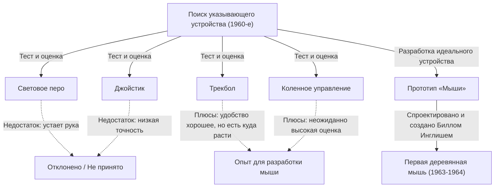
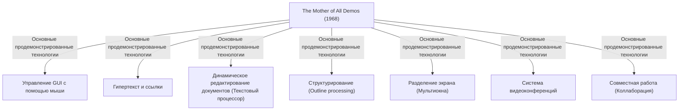

# Введение: современное управление компьютером и значение мыши

В нашей повседневной жизни и работе компьютеры стали незаменимыми. Как интерфейс для управления этими компьютерами, наряду с клавиатурой, самым знакомым устройством является «мышь». Сейчас, когда широко распространены сенсорные устройства вроде смартфонов и планшетов, и управление касанием пальцев напрямую к экрану стало обычным делом, мышь по-прежнему занимает незыблемые позиции для точных операций и длительной работы.

Однако удивительно мало людей знает, когда, кем и для какой цели было изобретено это маленькое устройство. В историю как изобретатель мыши вошел американский исследователь Дуглас Энгельбарт (Douglas Engelbart). Он не просто хотел создать «удобное указывающее устройство». Его целью было создание «системы для усиления человеческого интеллекта и решения сложных социальных проблем».

В этой статье мы глубоко погрузимся в жизнь Дугласа Энгельбарта, выдающегося визионера (человека с даром предвидения), его грандиозное видение, секрет создания «мыши», рожденной как инструмент для реализации этого видения, а также легендарную презентацию «The Mother of All Demos» (Мать всех демонстраций), оказавшую огромное влияние на современные вычисления.

# Личность Дугласа Энгельбарта

## Ранние годы и начало карьеры

Дуглас Карл Энгельбарт (Douglas Carl Engelbart) родился 30 января 1925 года в Портленде, штат Орегон, США. Его детство пришлось на времена Великой депрессии, и он рос отнюдь не в богатой семье, но жизнь в окружении природы Орегона воспитала в нем дух исследователя и самостоятельность.

Начав изучать электротехнику в Университете штата Орегон, он прервал учебу из-за начала Второй мировой войны и был призван в ВМС США. Его направили на Филиппины в качестве радиолокационного техника. Этот опыт работы техником радара стал важным исходным впечатлением, определившим его дальнейшую жизнь.

## Опыт работы техником радара и озарение

На экране радара информация, улавливаемая антенной, отображается в реальном времени в виде светящихся точек. Энгельбарт был глубоко впечатлен этим процессом «визуального восприятия информации на экране и манипулирования ею на основе увиденного». В то время компьютеры (вычислительные машины) представляли собой гигантские машины пакетной обработки, куда данные вводились с помощью перфокарт, а в качестве вывода получались огромные последовательности чисел, напечатанные на бумаге. Не было ни работы в реальном времени, ни интерактивности.

Однако Энгельбарт представил себе будущее, в котором к компьютеру будет подключен электронно-лучевой (ЭЛТ) дисплей, подобный экрану радара, и человек сможет в реальном времени создавать и изменять информацию, глядя на экран. Для того времени это была невероятно новаторская идея, сильно отличавшаяся от общепринятых представлений.

## Влияние эссе Вэннивара Буша «As We May Think»

После окончания войны в библиотеке Красного Креста на Филиппинах Энгельбарт наткнулся на статью, изменившую его судьбу. Это было эссе «As We May Think» (Как мы можем мыслить), написанное в 1945 году в журнале The Atlantic Monthly Вэнниваром Бушем (Vannevar Bush), главой американской научной администрации.

В этой статье Буш предложил концепцию виртуальной системы поиска информации под названием «Memex». Memex — это устройство, которое сохраняет все личные книги, записи и переписку на микрофильмах и позволяет мгновенно искать и просматривать их с механизированного стола. Что наиболее важно, оно предвосхитило концепцию современного гипертекста, позволяя сохранять и отслеживать информацию, связывая (создавая линки) одни данные с другими.

Энгельбарт был глубоко вдохновлен идеей Memex. Он решил, что механическую систему на основе микрофильмов, описанную Бушем, можно реализовать на гораздо более высоком уровне с использованием передовых электронных компьютерных технологий.

# Видение «Усиления человеческого интеллекта» (Augmenting Human Intellect)

## Сложные проблемы, стоящие перед человечеством

После окончания университета Энгельбарт начал работать инженером в NACA (предшественник нынешнего NASA). Спустя несколько лет, готовясь к свадьбе, он начал глубоко размышлять о цели своей жизни: «Что я должен сделать, чтобы посвятить остаток своей жизни тому, что принесет наибольшую пользу миру?»

К каким выводам он пришел:
1. Мировые проблемы становятся всё более сложными и неотложными.
2. Большинство из этих проблем невозможно решить с помощью знаний только в одной узкой области.
3. Следовательно, необходимо повысить саму способность человечества «справляться со сложными проблемами».

Так родилась концепция «Усиления человеческого интеллекта» (Augmenting Human Intellect), ставшая делом всей его жизни.

## Компьютер как инструмент мышления

Энгельбарт считал, что способность человека решать сложные проблемы сильно зависит не только от врожденного интеллекта, но и от языка, методологии и «инструментов». Человечество на протяжении всей истории расширяло свои мыслительные способности благодаря изобретению письменности, печатных технологий, математической нотации и т.д.

Он рассматривал только что появившийся компьютер не как «машину для вычислений», а как «окончательный инструмент для поддержки и расширения интеллектуальной работы человека». Он верил, что за счет взаимодействия человека и компьютера в реальном времени, визуализации, структурирования и обмена мыслями можно радикально повысить не только индивидуальный, но и коллективный интеллект (коллективный разум).

## Концептуальная структура (система H-LAM/T)

В 1962 году Энгельбарт опубликовал важную работу под названием «Augmenting Human Intellect: A Conceptual Framework» (Усиление человеческого интеллекта: Концептуальная структура). В ней он предложил модель под названием система «H-LAM/T» (Human using Language, Artifacts, Methodology, in which he is Trained).

Эта модель рассматривает состояние, при котором человек (Human) использует язык (Language), артефакты/инструменты (Artifacts) и методологию (Methodology) и прошел соответствующую подготовку (Training), как единую интегрированную систему. Он утверждал, что кардинальное усиление интеллекта произойдет только тогда, когда мы не просто усовершенствуем компьютеры (Artifacts), но и создадим новые концепции и методы управления ими (Language, Methodology), а сам человек пройдет обучение для адаптации к этой новой среде.

Это акцентирование внимания на «обучении» (Training) тесно связано с принципами проектирования его последующих систем (где функциональность и выразительность ценились выше, чем простота использования).

# Создание ARC (Augmentation Research Center) и вызовы

## Работа в SRI (Стэнфордском исследовательском институте)

Чтобы воплотить свое видение в жизнь, получив докторскую степень в Калифорнийском университете в Беркли, Энгельбарт присоединился к Стэнфордскому исследовательскому институту (SRI, ныне SRI International). Поначалу мало кто понимал его грандиозное видение, и он испытывал трудности с поиском финансирования, но постепенно вокруг него начали собираться талантливые исследователи, разделявшие его идеи.

Он основал в SRI исследовательскую лабораторию «ARC (Augmentation Research Center)» и при поддержке таких организаций, как ARPA (Агентство перспективных исследовательских проектов Министерства обороны, позднее DARPA), всерьез взялся за разработку системы.

## Разработка NLS (oN-Line System)

Целью ARC было создание интегрированной компьютерной системы, воплощающей видение Энгельбарта. Ею стала «NLS (oN-Line System)».

NLS обладала прообразами многих функций, которые мы сегодня воспринимаем как должное:
- Редактирование документов на экране (функция текстового процессора)
- Гипертекст (ссылки между документами)
- Структурирование текста (разворачивание и сворачивание иерархических структур, аутлайнинг)
- Многооконный интерфейс
- Совместная работа через сеть и видеоконференции

Для интуитивного управления этими передовыми функциями при взгляде на дисплей, традиционного метода ввода только с клавиатуры было недостаточно. Требовалось «новое устройство» для быстрого и точного указания любого места на экране (текста или ссылки).

# Рождение мыши: метод проб и ошибок и прорыв

## Поиск указывающего устройства

Чтобы найти идеальное указывающее устройство для работы с NLS, Энгельбарт и команда ARC (особенно главный инженер Билл Инглиш) тщательно протестировали и сравнили различные устройства, существовавшие в то время.

Среди протестированных устройств были:
- **Световое перо**: Метод, при котором перо прижимается непосредственно к экрану. Интуитивно понятно, но требует постоянного удерживания руки на весу, что очень утомляет.
- **Джойстик**: Управление курсором путем наклона рычага. Сложно выполнять точное позиционирование.
- **Трекбол**: Устройство с вращающимся шаром. Относительно хорошая управляемость.
- **Коленное управление**: Устройство под столом, управляемое коленом. Неожиданно показало хорошую управляемость.
- **Графакон (Grafacon)**: Устройство в виде ручки на планшете.

Энгельбарт научно измерил удобство использования, скорость ввода и процент ошибок этих устройств и провел сравнительный анализ.

## Сотрудничество с Биллом Инглишем

У Энгельбарта уже давно была идея устройства, которое указывало бы координаты на экране путем скольжения по столу, и он нарисовал эскиз в своем блокноте. Он придумал устройство с двумя колесами, которые раздельно считывали движение по оси X (горизонтали) и оси Y (вертикали).

Эту идею в реальное оборудование воплотил Билл Инглиш (Bill English), блестящий инженер-аппаратчик в ARC. Взяв за основу наброски Энгельбарта, он приступил к созданию прототипа примерно в 1963 году.

## Деревянная коробка и два колеса: первый прототип

Первая в мире мышь сильно отличалась от современного гладкого пластикового дизайна. Это был квадратный блок из сосны (деревянная коробка), на верхней части которого располагалась только одна красная кнопка.

На нижней стороне были прикреплены два металлических колеса (диска), расположенных под прямым углом друг к другу. При движении мыши по столу движение по вертикали считывалось как вращение одного колеса, а по горизонтали — другого; затем это преобразовывалось в электрические сигналы и отправлялось на компьютер. Благодаря этому курсор на экране стал двигаться в полном соответствии с движениями мыши.

Результаты сравнительных экспериментов доказали, что это «устройство, катающееся по столу» позволяет указывать точки гораздо быстрее и точнее, чем световое перо или джойстик.

## Происхождение названия «Мышь»

На самом деле не сохранилось четких записей о том, когда и кем именно это устройство было названо «мышью» (Mouse). Сам Энгельбарт в более позднем интервью сказал: «Все в лаборатории стали называть её так. Потому что по форме она напоминала мышь, а шнур выглядел как хвост. Мы пытались придумать более солидное название, но оно так и не прижилось».

Кстати, отметку, которая двигалась на экране вслед за мышью, в то время называли «Жук» (Bug). Это использовалось как юмористический сленг: «Мышь (Mouse) гоняется за жуком (Bug)».

# 1968 год: «The Mother of All Demos» (Мать всех демонстраций)

## Легендарная презентация

9 декабря 1968 года на Осенней объединенной компьютерной конференции (Fall Joint Computer Conference), проходившей в Сан-Франциско, произошло историческое событие, изменившее историю компьютеров. Это была 90-минутная публичная демонстрация Дугласа Энгельбарта перед аудиторией из примерно 1000 компьютерных специалистов.

Эта демонстрация имела настолько ошеломляющее содержание, как будто она предвидела весь последующий прогресс компьютерных технологий, что позже ее прозвали «The Mother of All Demos» (Матерью всех демонстраций).

## Представленные революционные технологии

Энгельбарт сидел в центре сцены за специально созданной консолью: в левой руке у него была «клавишная панель (keyset — 5-клавишная клавиатура для аккордового ввода)», в правой — «мышь», а за спиной — огромный проекционный экран. Он надел гарнитуру с микрофоном и спокойным тоном одну за другой демонстрировал функции NLS.

Зал в Сан-Франциско и лаборатория SRI в Менло-Парке, находившаяся примерно в 50 километрах, были соединены современной на тот момент микроволновой связью и выделенной линией. Документы на экране редактировались в реальном времени в соответствии с действиями Энгельбарта, а файлы, находящиеся в разных местах, открывались по гиперссылкам.

Что еще более поразительно, лицо коллеги из лаборатории отображалось в окне на экране в виде видеоизображения, и они вместе в реальном времени редактировали один и тот же документ, используя один и тот же курсор и разговаривая друг с другом. Это означает, что инструменты совместной работы, такие как современные Zoom или Google Документы, были реализованы еще в 1960-х годах, когда не было не только Интернета, но и персональных компьютеров.

## Шок аудитории и влияние на будущие поколения

Для специалистов того времени, которые знали лишь системы, где приходилось загружать перфокарты в машину и часами ждать распечатки результатов, эта демонстрация произвела эффект настоящего чуда или научно-фантастического фильма. Когда презентация завершилась, весь зал встал и взорвался оглушительными овациями.

Многие исследователи, в том числе молодой Алан Кэй (Alan Kay), присутствовавшие на этой демонстрации, оказались под решающим влиянием видения Энгельбарта и в дальнейшем возглавили революцию персональных компьютеров.

# Преемственность в Исследовательском центре Пало-Альто (Xerox PARC) и распространение благодаря Apple

## Концепция «Dynabook» Алана Кэя и промежуточный Dynabook (Alto)

С наступлением 1970-х годов лаборатория ARC Энгельбарта начала постепенно терять позиции из-за финансовых трудностей, вызванных влиянием Вьетнамской войны, и его собственной приверженности к «слишком сложной» системе. Многие талантливые исследователи, включая его подчиненного Билла Инглиша, перешли в недавно созданный исследовательский центр Пало-Альто (Xerox PARC) компании Xerox.

В PARC велись исследования в направлении видения «персональных вычислений», предложенного Аланом Кэем и другими. Они унаследовали концепции «мыши» и «экранного управления» Энгельбарта, но при этом усовершенствовали сложную систему управления, сделав ее более интуитивной и дружелюбной. Так был создан «Alto» — первый в мире компьютер с растровым дисплеем, GUI (графическим интерфейсом пользователя) и мышью. Сама мышь также эволюционировала от деревянной к более удобной с использованием шарика.

## Передача технологий от Xerox к Apple (Macintosh)

В 1979 году соучредитель Apple Computer Стив Джобс получил возможность посетить Xerox PARC. Потрясенный графическим интерфейсом и удобством использования мыши на Alto, Джобс был убежден, что «именно за этим будущее компьютеров», и решительно внедрил эти концепции в проекты разработки своей компании.

Инженеры Apple перепроектировали дорогую и сложную мышь Xerox так, чтобы ее можно было дешево производить в промышленных масштабах с использованием всего одной кнопки, и она могла плавно двигаться на любом столе. С выпуском «Lisa» в 1983 году и «Macintosh» в 1984 году мышь совершила стремительный скачок в популярности — из инструмента для узкого круга исследователей она превратилась в стандартное устройство ввода для обычных потребителей дома.

## Коммерческий успех и повсеместное распространение мыши

Впоследствии, вкупе с распространением Microsoft Windows, мышь стала стандартным оборудованием для всех ПК в мире. Два колеса сменились резиновым шариком, а затем устройство эволюционировало до оптического сенсора, лазерной и беспроводной технологий, но базовая парадигма «взять в руку, перемещать и управлять курсором на экране», придуманная Энгельбартом, осталась неизменной спустя более полувека.

# Наследие Энгельбарта с точки зрения современности

## Незавершенное видение: предупреждение против банального «удобства» (User-friendly)

Мыши распространились по всему миру, и любой человек смог интуитивно управлять компьютером (что называется user-friendly). Однако сам Энгельбарт испытывал смешанные чувства по поводу этого положения дел.

Он критиковал тенденцию к упрощению систем исключительно ради «удобства» (User-friendly), говоря, что это равносильно тому, как если бы дать человеку трехколесный велосипед и сказать «этого достаточно». Чтобы научиться ездить на двухколесном велосипеде, требуется некоторая тренировка, но однажды освоив его, вы получаете скорость и свободу, несравнимые с трехколесным.

Система H-LAM/T, к которой стремился Энгельбарт, предназначалась для того, чтобы с помощью обучения человек овладевал более мощными инструментами (системами) и расширял границы своего интеллекта. Современный графический интерфейс, безусловно, удобен, но с точки зрения «драматического усиления интеллекта», о котором он мечтал, возможно, мы всё еще находимся лишь на пороге его потенциала.

## Связь с коллективным интеллектом

Истинная заслуга Энгельбарта заключается не столько в самом изобретении мыши, сколько в воплощении в виде системы концепции «коллективного интеллекта» — идеи о том, что люди во всем мире делятся знаниями через сеть и сотрудничают для решения проблем.

Современный Интернет, World Wide Web (WWW), Wikipedia, сообщества открытого исходного кода (open-source), такие как GitHub — все это можно назвать современной реализацией описанного им «усиления интеллекта». Задолго до того, как Тим Бернерс-Ли изобрел WWW, Энгельбарт уже предвидел будущее, в котором информация связана ссылками в сети.

## Совместная эволюция человека и технологий

В наше время, когда искусственный интеллект (ИИ) стремительно развивается и ведутся дискуссии о «сингулярности», когда ИИ превзойдет человеческий интеллект, идеи Энгельбарта вновь обретают актуальность. Его целью было не заменить человеческое мышление машиной (искусственный интеллект), а использовать машину для расширения и дополнения мыслительных способностей человека (Усиление Интеллекта: Intelligence Amplification / IA).

Сейчас, когда ИИ все глубже проникает в нашу жизнь, возникает вопрос: как мы должны проектировать технологии и как мы должны их использовать (обучаться им)? Совместная эволюция человека и технологий — это та колоссальная тема, которую поднял Энгельбарт, и это важная задача, брошенная нам, живущим в современном мире.

## Заключение: вопрос о «будущем», оставленный Энгельбартом

Дуглас Энгельбарт ушел из жизни 2 июля 2013 года в возрасте 88 лет. «Мышь», созданная им из деревянной коробки и колес, стала мостом, соединившим миллиарды людей с цифровым миром, и в корне изменила нашу реальность.

Волшебное зрелище, показанное на The Mother of All Demos в 1968 году, теперь стало нашей повседневной жизнью. Однако его главная, конечная цель — «решение сложных проблем глобального масштаба за счет усиления человеческого интеллекта» — еще не реализована в полной мере.

Когда мы берем в руку мышь, кликаем на информацию на экране и плывем по океану Интернета, в этом живет дыхание «будущего», которое предвидел один гений. Взгляд назад на путь Дугласа Энгельбарта должен стать надежным указателем для размышлений о том, куда мы вместе с технологиями должны двигаться дальше.
