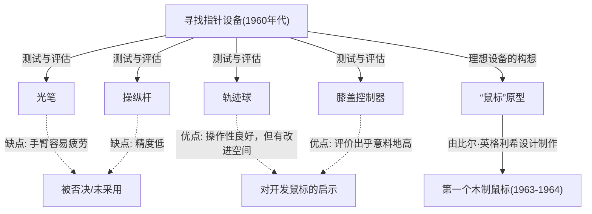
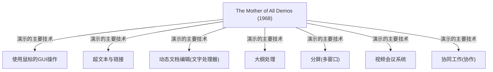

# 前言：现代计算机操作与鼠标的意义

在我们的日常生活和工作中，计算机已成为不可或缺的存在。作为操作计算机的界面，与键盘并列最普及的设备就是“鼠标”。虽然如今智能手机和平板电脑等触摸屏设备普及，用指尖直接触摸屏幕的操作已大众化，但在精密操作和长时间工作中，鼠标依然确立着不可动摇的地位。

然而，令人意外的是，很少有人深入了解这个小设备是何时、由谁、为了什么目的而发明的。作为鼠标的发明者被铭记在历史中的，是美国研究员道格拉斯·恩格尔巴特（Douglas Engelbart）。他并非仅仅想制造一个“方便的指针设备”。他的目标是构建一个“增强人类智力、以解决复杂社会问题的系统”。

本文将深入探讨道格拉斯·恩格尔巴特这位稀世愿景家（极具先见之明的人物）的一生、他提出的宏大愿景、作为实现该愿景的工具而诞生的“鼠标”的诞生秘辛，以及对现代计算产生深远影响的传奇演讲“The Mother of All Demos（所有演示之母）”。

# 道格拉斯·恩格尔巴特其人

## 成长背景与早期职业生涯

道格拉斯·卡尔·恩格尔巴特（Douglas Carl Engelbart）于1925年1月30日出生在美国俄勒冈州波特兰市。他的童年恰逢大萧条时期，家境绝对算不上富裕，但在俄勒冈州被自然环绕的生活培养了他的探索心与自立精神。

在俄勒冈州立大学开始学习电气工程的他，因第二次世界大战爆发而中断学业，应征加入美国海军。他被派往菲律宾执行雷达技术员的任务。这段作为雷达技术员的经验，成为了决定他后来人生方向的重要原初体验。

## 雷达技术员的经验与启示

在雷达屏幕上，天线捕捉到的信息以光点的形式实时显示。恩格尔巴特对这种“在屏幕上视觉化地捕捉信息，并据此操作信息”的过程留下了深刻的印象。当时的计算机（计算器）仅仅是通过打孔卡输入数据，并接收打印在纸上的庞大数列作为输出的批处理型巨大机械。那里既没有实时性，也没有交互性（Interactivity）。

然而，恩格尔巴特设想了一个未来：将类似雷达屏幕的阴极射线管（CRT）显示器连接到计算机上，人类可以看着屏幕实时操作和构建信息。在当时常识看来，这是一个极为超前的想法。

## 范内瓦·布什的《As We May Think》的影响

二战结束后，在菲律宾红十字会的图书馆里，恩格尔巴特遇到了一篇命运般的文章。那是美国科学行政机构的负责人范内瓦·布什（Vannevar Bush）在1945年向《The Atlantic Monthly》杂志投稿的随笔《As We May Think（诚如所思）》。

布什在这篇文章中提出了一个名为“Memex”的虚拟信息检索系统。Memex是一个可以将个人的所有藏书、记录和通信保存在缩微胶卷上，并能通过机械化书桌瞬间检索和阅览的设备。最重要的是，它预见了将信息与信息“关联（链接）”起来保存和追踪的概念，这正是当前超文本（Hypertext）概念的雏形。

恩格尔巴特从Memex的构想中获得了强烈的灵感。他认为，如果利用最先进的电子计算机技术，就可以比布什描绘的基于缩微胶卷的机械系统更高级地实现这一构想。

# “增强人类智力 (Augmenting Human Intellect)”的愿景

## 人类面临的复杂问题

大学毕业后，恩格尔巴特开始在NACA（现NASA的前身）作为工程师工作。几年后，即将结婚的他开始深入思考自己人生的目的：“如何用余生为世界带来最大的价值？”

他得出的结论如下：
1. 世界上的问题日益复杂化，并且越来越紧迫。
2. 这些问题往往是单一专业知识无法解决的。
3. 因此，必须提高人类本身“应对复杂问题的能力”。

这便是他毕生事业——“增强人类智力（Augmenting Human Intellect）”概念的诞生。

## 作为思考工具的计算机

恩格尔巴特认为，人类解决复杂问题的能力不仅依赖于天生的智力，很大程度上还依赖于语言、方法论和“工具”。人类迄今为止通过文字的发明、印刷技术、数学记号等扩展了思考能力。

他将刚出现不久的计算机视为“支持并扩展人类智力工作的终极工具”，而不仅是“用于计算的机器”。他相信，通过人类与计算机的实时交互，将思考可视化、结构化并共享，不仅能大幅提高个人的智力，还能飞跃性地提升集体智力（Collective Intelligence）。

## 概念框架 (H-LAM/T系统)

恩格尔巴特在1962年发表了一篇重要论文《Augmenting Human Intellect: A Conceptual Framework（增强人类智力：一个概念框架）》。在其中，他提出了“H-LAM/T（Human using Language, Artifacts, Methodology, in which he is Trained）”系统模型。

该模型将人类（Human）使用语言（Language）、人工物/工具（Artifacts）和方法论（Methodology），并接受相关训练（Training）的状态视为一个集成的系统。他的主张是，不仅要进化计算机（Artifacts），还要创造出与之相适应的新概念和操作方法（Language, Methodology），并且人类自身也要接受适应新环境的训练，只有这样，才能发生智力的剧烈增强。

这种重视“训练（Training）”的态度，与他后来的系统设计思想（更注重功能性和表现力，而非初学者的易用性）有着深刻的联系。

# ARC (Augmentation Research Center) 的设立与挑战

## 在SRI (斯坦福研究所) 的活动

为了实现自己的愿景，恩格尔巴特在加州大学伯克利分校取得博士学位后，加入了斯坦福研究所（SRI，现为SRI International）。起初，很少有人理解他宏大的愿景，筹集资金也十分困难，但渐渐地，赞同他想法的优秀研究人员开始聚集。

他在SRI内部设立了名为“ARC (Augmentation Research Center)”的研究实验室，并在ARPA（国防部高级研究计划局，即后来的DARPA）等机构的支持下，正式着手系统的开发。

## NLS (oN-Line System) 的开发

ARC的目标是构建一个体现恩格尔巴特愿景的集成计算机系统。这就是“NLS (oN-Line System)”。

NLS具备了许多我们现在习以为常的功能的雏形：
- 屏幕上的文档编辑（文字处理功能）
- 超文本（文档间的链接）
- 大纲处理（层次结构的展开与折叠）
- 多窗口
- 通过网络进行的协同工作与视频会议

为了在看着显示器的同时直观地操作这些高级功能，传统的纯键盘输入方式有着很大的局限性。我们需要一种“新设备”，能够快速准确地指定屏幕上的任意位置（文本或链接）。

# 鼠标的诞生：反复试验与突破

## 寻找指针设备

为了找到最适合操作NLS的指针设备，恩格尔巴特和ARC团队（特别是首席工程师比尔·英格利希）对当时存在的各种设备进行了彻底的测试和比较。

被测试的设备包括：
- **光笔（Light Pen）**：直接将笔压在屏幕上的方式。虽然直观，但需要一直举着手臂，非常容易疲劳。
- **操纵杆（Joystick）**：通过推拉控制杆来移动光标。很难进行精细的位置对准。
- **轨迹球（Tracker Ball/Trackball）**：滚动球体的方式。操作性相对较好。
- **膝盖控制器（Knee Control）**：在桌子底下用膝盖操作的设备。出人意料地操作性不错。
- **Grafacon**：平板上的笔型设备。

恩格尔巴特科学地测量了这些设备的易用性、输入速度和错误率，并进行了比较探讨。

## 与比尔·英格利希的合作

恩格尔巴特很早以前就有一个想法：通过在桌面上滑动来指定屏幕上的坐标，并在笔记本上画下了它的草图。他构想了一个带有两个轮子的设备，分别读取X轴（横向）和Y轴（纵向）的移动。

将这个想法化为实际硬件的，是ARC优秀的硬件工程师比尔·英格利希（Bill English）。他以恩格尔巴特的草图为基础，从1963年左右开始着手制作原型。

## 木盒与两个轮子：第一个原型

世界上第一个鼠标与现在精致的塑料设计大不相同。它是一个用松木制成的方形块（木盒），顶部只有一个红色按钮。

在背面，安装了两个垂直交叉配置的金属轮（圆盘）。当鼠标在桌面上移动时，纵向的移动被读取为一个轮子的旋转，横向的移动被读取为另一个轮子的旋转，然后被转换为电信号发送给计算机。由此，屏幕上的光标便能完全与鼠标的移动同步移动了。

对比实验的结果证明，这个“在桌面上滚动的设备”比光笔或操纵杆在指向操作上具有压倒性的速度和准确性优势。

## “鼠标”一名的由来

关于这个设备是何时、由谁命名为“鼠标（Mouse，老鼠）”的，实际上并没有留下明确的记录。恩格尔巴特本人在后来的采访中也表示：“实验室里的每个人都开始这样叫它。因为它形状像老鼠，而电线看起来像尾巴。我们试图给它起个更庄重的名字，但最终都没能流行起来。”

顺便一提，当时在屏幕上随鼠标移动的标记（光标）被称为“Bug（虫子）”。这实际上被当作一种幽默的行话，意为“老鼠（Mouse）追赶虫子（Bug）”。

# 1968年“The Mother of All Demos（所有演示之母）”

## 传奇的演示

1968年12月9日，在旧金山举行的秋季联合计算机联合会议（Fall Joint Computer Conference）上，发生了一件改变计算机历史的重大事件。道格拉斯·恩格尔巴特在约1000名计算机专家面前，进行了长达90分钟的公开演示。

这场演示的内容如此震撼，仿佛预见了其后所有的计算机技术进步，以至于后来被赞誉为“The Mother of All Demos（所有演示之母）”。

## 展现的革命性技术

恩格尔巴特在舞台中央放置了一个特制的控制台，左手放在“和弦键盘（用于和弦输入的5键键盘）”上，右手握着“鼠标”，背靠巨大的投影屏幕坐下。他戴着头戴式麦克风，用平静的语调依次展示了NLS的功能。

旧金山的会场与大约50公里外位于门洛帕克的SRI研究所，通过当时最先进的微波通信和专线连接在一起。屏幕上的文档随着恩格尔巴特的操作被实时编辑，位于不同地方的文件也能通过超链接跳转显示。

更令人惊叹的是，身在研究所的同事的脸，作为视频画面出现在屏幕的窗口内；他们一边通过语音通话交谈，一边共享同一个文档的同一个光标进行协同编辑的演示。这意味着，在互联网甚至个人电脑都不存在的1960年代，他就已经实现了类似现代Zoom或Google文档的协作工具。

## 听众的震撼与对后世的影响

对于当时只知道让机器读取打孔卡，然后在几个小时后收到结果打印输出的专家们来说，这场演示犹如魔法或科幻电影一般令人震撼。演示结束时，全场听众起立，爆发出雷鸣般的掌声。

以年轻时的阿兰·凯（Alan Kay）为首的众多研究人员，在看了这场演示后深受恩格尔巴特愿景的决定性影响，并随后引领了个人电脑革命。

# 传承至帕罗奥多研究中心 (Xerox PARC) 与向苹果 (Apple) 的扩散

## 阿兰·凯的“Dynabook”构想与暂定Dynabook (Alto)

进入1970年代，恩格尔巴特的ARC研究所因受越南战争影响而遭遇资金困难，加上他自己对“过于深奥”的系统的执念，逐渐失去了势头。他的部下，包括比尔·英格利希在内的许多优秀研究人员，纷纷转投施乐（Xerox）新设立的帕罗奥多研究中心（Xerox PARC）。

在PARC，以阿兰·凯等人倡导的“个人计算（Personal Computing）”愿景为导向的研究正在推进。他们继承了恩格尔巴特的“鼠标”和“屏幕上操作”的概念，同时将复杂的操作系统改良为更直观、更友好的形式。由此诞生的，便是世界上第一台配备位图显示器、GUI（图形用户界面）以及鼠标的计算机“Alto”。鼠标也从木制演变为使用滚球的更容易使用的形式。

## 从施乐到苹果（Macintosh）的技术转移

1979年，Apple Computer的联合创始人史蒂夫·乔布斯（Steve Jobs）获得了参观Xerox PARC的机会。乔布斯对Alto的GUI和鼠标操作性感到非常震撼，确信“这才是计算机的未来”，并强行将这一概念引入到自己公司的开发项目中。

苹果的工程师们重新设计了施乐昂贵而复杂的鼠标，使其只需一个按钮，不仅可以低成本量产，还能在任何桌面上顺畅滑动。随着1983年“Lisa”以及1984年“Macintosh”的发售，鼠标实现了从少数研究人员的工具，向普通消费者在家庭中使用的标准输入设备的飞跃性普及。

## 鼠标的商业成功与普及化

在那之后，随着Microsoft Windows的普及，鼠标成为了全球所有PC的标配。两个轮子变成了橡胶滚球，后来又进化为光学传感器，并取得了激光式、无线式等技术进步。但是，“用手握住移动，操作屏幕上的光标”这个由恩格尔巴特发明的基本范式，在经过了半个多世纪后的今天依然没有改变。

# 从现代视角看恩格尔巴特的遗产

## 未竟的愿景：对单纯追求易用性 (User-friendly) 的警示

鼠标普及到了全世界，任何人都能够直观地操作计算机（即所谓的“用户友好”，User-friendly）。然而，恩格尔巴特本人对这一现状抱有复杂的情感。

他批评道，一味追求“易用性（User-friendly）”而简化系统，就像给人们一辆三轮车并说“这已经足够了”。熟练骑自行车需要一些训练，但一旦掌握，就能获得三轮车无法比拟的速度和自由度。

恩格尔巴特所追求的H-LAM/T系统，是为了让人类通过训练掌握更强大的工具（系统），从而突破智力的极限。现代的GUI确实很容易使用，但从他梦想的“智力的剧烈增强”这一观点来看，也许我们仍只站在那扇可能性的大门前。

## 与集体智力（Collective Intelligence）的联系

恩格尔巴特真正的功绩，与其说是发明了鼠标本身，不如说是将全世界的人们通过网络共享知识、合作解决问题这一“集体智力（Collective Intelligence）”的概念具象化为了一个系统。

现在的互联网、万维网（World最好不要用中文缩写而是直接用英文，World Wide Web, WWW）、维基百科、GitHub等开源社区，可以说是他所描绘的“智力增强”的现代实现形式。在蒂姆·伯纳斯-李发明WWW的很久以前，恩格尔巴特就已经看到了信息在网络上相互链接的未来。

## 人与技术的共同进化

在人工智能（AI）飞速发展，超越人类智力的“奇点（Singularity）”被广泛讨论的现代，恩格尔巴特的思想再次闪耀光芒。他的目标不是让机器取代人类的思考（人工智能，AI），而是利用机器来扩展和补充人类的思考能力（智力放大：Intelligence Amplification / IA）。

在AI正逐渐渗透到我们生活的今天，如何设计技术，我们又该如何利用（训练）这些技术？人与技术的共同进化，这个由恩格尔巴特提出的巨大主题，是抛给生活在现代的我们的重要课题。

## 结语：恩格尔巴特留给“未来”的疑问

道格拉斯·恩格尔巴特于2013年7月2日逝世，享年88岁。他从木盒与轮子中创造出的“鼠标”，成为了连接数十亿人与数字世界的桥梁，从根本上改变了世界。

1968年The Mother of All Demos中展示的如魔法般的情景，如今已成为我们日常生活本身。然而，他真正追求的终极愿景——“通过增强人类智力，解决地球规模的复杂问题”，至今仍未完全实现。

当我们握着鼠标，点击屏幕上的信息，在互联网的海洋中遨游时，那里蕴含着一位天才所看到的“未来”的气息。回顾道格拉斯·恩格尔巴特的轨迹，必将成为我们在思考未来应如何与技术共进时，一座确切的灯塔。
