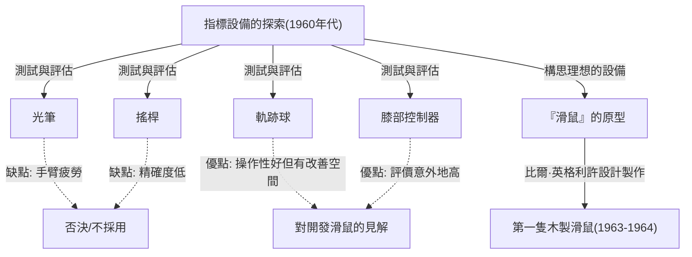
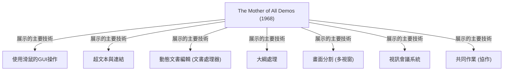

# 前言：現代電腦操作與滑鼠的存在意義

在我們的日常生活與工作中，電腦已經成為不可或缺的存在。作為操作這台電腦的介面，與鍵盤並列最親近的設備就是「滑鼠」。雖然現在智慧型手機與平板等觸控螢幕設備已經普及，指尖直接觸碰螢幕的操作已是一般常態，但是在精確的操作與長時間的工作中，滑鼠依然建立著不可動搖的地位。

然而，這個小巧的設備是在何時、由誰、為了什麼目的而發明，深入了解的人意外地可能並不多。作為滑鼠發明者而在歷史上留名的是美國研究員道格拉斯·恩格爾巴特（Douglas Engelbart）。他並不是單純想做一個「方便的指標設備」。他的目標是建立一個「增強人類智力、解決複雜社會問題的系統」。

本文將深入探討道格拉斯·恩格爾巴特這位稀世有遠見之人的生平、他所提出的宏大願景，以及作為實現該願景工具而誕生的「滑鼠」秘辛，甚至對現代運算產生巨大影響的傳奇簡報「The Mother of All Demos（展示之母）」。

# 道格拉斯·恩格爾巴特這個人

## 成長背景與早期職涯

道格拉斯·卡爾·恩格爾巴特（Douglas Carl Engelbart）於1925年1月30日出生在美國奧勒岡州波特蘭。他的童年正值大蕭條時期，環境絕對稱不上富裕，但被大自然環繞的奧勒岡生活培養了他的探究心與獨立性。

開始在奧勒岡州立大學學習電機工程的他，因為第二次世界大戰爆發而中斷學業，被美國海軍徵召。他被派往菲律賓擔任雷達技術員。這段雷達技術員的經歷，成為決定他日後人生的重要原初體驗。

## 雷達技術員的經歷與啟示

在雷達的螢幕畫面上，天線捕捉到的資訊會作為光點即時顯示。恩格爾巴特對這種「在畫面上視覺化地捕捉資訊，並以此為基礎操作資訊」的過程產生了深刻的感動。當時的電腦（計算機）只是一台透過打孔卡輸入資料，並輸出印在紙上的龐大數列的批次處理型巨大機器。那裡既沒有即時性，也沒有互動性。

但是恩格爾巴特想像了一個未來：將雷達螢幕般的陰極射線管（CRT）顯示器連接到電腦上，人類可以看著畫面即時操作與建構資訊。這在當時的常識來看，是偏離極大且極具先驅性的想法。

## 范內瓦·布希「As We May Think」的影響

戰後，在菲律賓紅十字會的圖書館中，恩格爾巴特與一篇命運般的文章相遇。那是美國科學行政高層范內瓦·布希（Vannevar Bush）於1945年發表在《大西洋月刊》的隨筆〈As We May Think（如我們所想）〉。

布希在文章中提出了一個名為「Memex」的虛擬資訊檢索系統。Memex是一個將個人所有藏書、紀錄、通訊保存於微縮膠片中，並可從機械化辦公桌上瞬間檢索、閱覽的設備。最重要的是，它預見了現在超文本的概念，即可以將資訊與資訊「建立關聯（連結）」以進行保存和追蹤。

恩格爾巴特對Memex的構想受到了強烈的啟發。他認為，如果使用最先進的電子電腦技術，就能比布希描繪的微縮膠片機械系統實現更高階的系統。

# 「增強人類智力 (Augmenting Human Intellect)」的願景

## 人類面臨的複雜問題

大學畢業後，恩格爾巴特開始在NACA（現在NASA的前身）擔任工程師。幾年後，即將結婚的他開始深入思考自己人生的目的：「我要用餘生做什麼，才能為世界帶來最大的價值？」

他得出的結論如下：
1. 世界的問題日益複雜，緊急性也不斷增加。
2. 全是單一專業知識無法解決的問題。
3. 因此，必須提升人類「處理複雜問題的能力」本身。

這就是成為他畢生志業的「增強人類智力（Augmenting Human Intellect）」概念的誕生。

## 作為思考工具的電腦

恩格爾巴特認為，人類解決複雜問題的能力不僅依賴天生的智力，也很大程度上依賴於語言、方法論以及「工具」。人類至今透過文字的發明、印刷技術、數學記號等擴展了思考能力。

他將剛出現的電腦不僅看作是「計算的機器」，而是「支援並擴展人類智力作業的終極工具」。他相信，透過人類與電腦即時互動，將思考視覺化、結構化並共享，不僅可以提升個人的智力，還能飛躍性地提升集體智力。

## 概念框架 (H-LAM/T系統)

恩格爾巴特在1962年發表了一篇重要論文《Augmenting Human Intellect: A Conceptual Framework（增強人類智力：概念框架）》。在其中，他提出了「H-LAM/T (Human using Language, Artifacts, Methodology, in which he is Trained)」系統模型。

這將人類（Human）使用語言（Language）、人工物/工具（Artifacts）、方法論（Methodology），並接受這些訓練（Training）的狀態視為一個整合的系統。他主張，不只要進化電腦（Artifacts），還要創造出適合它的新概念與操作方法（Language, Methodology），且人類自身也要接受適應新環境的訓練，這樣才能產生戲劇性的智力增強。

這種重視「訓練（Training）」的態度，深深地與他後來系統的設計理念（重視功能性與表現力勝過易用性）聯繫在一起。

# ARC (Augmentation Research Center) 的設立與挑戰

## 在SRI（史丹佛研究院）的活動

為了實現自己的願景，恩格爾巴特在加州大學柏克萊分校取得博士學位後，加入了史丹佛研究院（SRI，現在的SRI國際）。起初很少人能理解他宏大的願景，在籌集資金方面也歷經艱辛，但逐漸有贊同他想法的優秀研究人員開始聚集。

他在SRI內設立了名為「ARC (Augmentation Research Center)」的研究實驗室，並在ARPA（國防部高等研究計劃署，後來的DARPA）等機構的支持下，正式開始系統的開發。

## NLS (oN-Line System) 的開發

ARC的目標是建立一個體現恩格爾巴特願景的整合性電腦系統。這就是「NLS (oN-Line System)」。

NLS具備了許多我們現在視為理所當然的功能的原型。
- 畫面上的文書編輯（文書處理功能）
- 超文本（文件間的連結）
- 大綱處理（階層結構的展開與折疊）
- 多視窗
- 透過網路進行的共同作業與視訊會議

為了看著顯示器直觀地操作這些進階功能，僅靠鍵盤輸入的傳統方法有其極限。為此，需要一個能快速準確指定畫面上任意位置（文字或連結）的「新設備」。

# 滑鼠的誕生：反覆試驗與突破

## 探索指標設備

為了找到最適合NLS操作的指標設備，恩格爾巴特與ARC團隊（特別是首席工程師比爾·英格利許）對當時存在的各種設備進行了徹底的測試與比較。

測試的設備包含以下幾種：
- **光筆 (Light Pen)**：將筆直接壓在螢幕上的方式。雖然直觀，但需要一直舉著手臂，非常容易疲勞。
- **搖桿 (Joystick)**：推動搖桿來移動游標。難以進行精細的對齊。
- **軌跡球 (Trackball)**：滾動球體的方式。操作性相對較好。
- **膝部控制器 (Knee Control)**：在桌下用膝蓋操作的設備。出乎意料地操作性不錯。
- **Grafacon**：平板上的筆型設備。

恩格爾巴特科學地測量並比較了這些設備的易用性、輸入速度和錯誤率。

## 與比爾·英格利許的合作

恩格爾巴特很早以前就有在桌面上滑動來指定畫面上座標的想法，並在筆記本上畫了草圖。他構思了一個有兩個輪子、分別讀取X軸（橫向）與Y軸（縱向）移動的設備。

將這個想法化為實際硬體的，是ARC優秀的硬體工程師比爾·英格利許（Bill English）。他根據恩格爾巴特的草圖，從1963年左右開始製作原型。

## 木盒與兩個輪子：最初的原型

世界上第一個滑鼠與現在精緻的塑膠設計大不相同。它是一個用松木做成的方形木塊（木盒），頂部只有一個紅色按鈕。

背面安裝了兩個直角交錯配置的金屬輪子（圓盤）。在桌面上移動滑鼠時，縱向移動會被讀取為其中一個輪子的旋轉，橫向移動則為另一個輪子的旋轉，轉換成電信號送到電腦。如此一來，畫面上的游標就能與滑鼠的移動完全連動。

比較實驗的結果證明，這個「在桌上滾動的設備」在指示上比光筆或搖桿都要快得多且準確。

## 「滑鼠」名稱的由來

這個設備是在何時、由誰命名為「滑鼠（Mouse）」的，其實並沒有留下明確的紀錄。恩格爾巴特本人在後來的採訪中表示：「實驗室裡的每個人都開始這麼叫它。因為形狀像老鼠，線看起來像尾巴。雖然試圖取個更威嚴的名字，但最終沒能定案。」

順帶一提，當時在畫面上隨滑鼠連動的標記被稱為「蟲子（Bug）」。「老鼠（Mouse）追著蟲（Bug）跑」被作為一種幽默的暗語使用。

# 1968年「The Mother of All Demos（展示之母）」

## 傳奇的簡報

1968年12月9日，在舊金山舉辦的秋季聯合電腦會議（Fall Joint Computer Conference）上，發生了改變電腦歷史的歷史性事件。那就是道格拉斯·恩格爾巴特在約1,000名電腦專家面前進行的90分鐘公開展示。

這場展示的內容極具壓倒性，彷彿預見了此後所有的電腦技術進步，因此後來被讚譽為「The Mother of All Demos（展示之母）」。

## 披露的劃時代技術

恩格爾巴特在舞台中央放了一個特製的控制台，左手放在「和弦鍵盤（用於輸入代碼的5鍵鍵盤）」，右手握著「滑鼠」，背對著巨大的投影螢幕坐著。他戴著耳麥，以平靜的語氣逐一展示NLS的功能。

舊金山的會場與約50公里外門洛帕克的SRI實驗室，透過當時最先進的微波通訊與專線連接。畫面上的文件隨著恩格爾巴特的操作即時被編輯，位在不同地方的檔案透過超連結跳轉顯示。

更令人驚嘆的是，實驗室裡同事的臉作為視訊影像出現在畫面的視窗中，一邊用語音對話，一邊共享同一份文件的同一個游標進行共同編輯。這意味著，在連個人電腦甚至網際網路都不存在的1960年代，就已經實現了像現代Zoom或Google文件這樣的協作工具。

## 觀眾的震撼與對後世的影響

對於當時只知道讓機器讀取打孔卡，並在幾小時後拿到印出結果的專家們來說，這場展示帶來了宛如觀看魔法或科幻電影般的衝擊。簡報結束後，全場觀眾起立，爆發出雷鳴般的掌聲。

看到這場展示的年輕艾倫·凱（Alan Kay）等眾多研究人員，深受恩格爾巴特願景的決定性影響，並引領了後來的個人電腦革命。

# 傳承至帕羅奧多研究中心 (Xerox PARC) 與向Apple的擴展

## 艾倫·凱的「Dynabook」構想與過渡期Dynabook (Alto)

進入1970年代後，恩格爾巴特的ARC實驗室因為越戰影響導致資金困難，以及他本身對「過於深奧」的系統的堅持，而逐漸失去勢頭。他的部下，包含比爾·英格利許在內的許多優秀研究員，陸續移籍到全錄（Xerox）新設立的帕羅奧多研究中心（Xerox PARC）。

在PARC，為了實現艾倫·凱等人提倡的「個人運算」願景而推進研究。他們繼承了恩格爾巴特「滑鼠」與「畫面上操作」的概念，同時將複雜的操作系統改良得更加直觀親民。就這樣誕生了世界第一台配備點陣圖顯示器、GUI（圖形使用者介面）和滑鼠的電腦「Alto」。滑鼠也從木製進化成使用滾球、更容易使用的設計。

## 從全錄到Apple (Macintosh) 的技術轉移

1979年，Apple Computer的共同創辦人史蒂夫·賈伯斯獲得了參觀Xerox PARC的機會。賈伯斯被Alto的GUI和滑鼠的操作性所震撼，確信「這才是電腦的未來」，並強勢地將該概念導入自家的開發專案中。

Apple的工程師們將Xerox昂貴且複雜的滑鼠，重新設計成只有一個按鍵、能低成本量產，且在任何桌面上都能順暢移動的樣貌。隨著1983年「Lisa」以及1984年「Macintosh」的發售，滑鼠從少數研究人員的工具，飛躍性地普及成為一般消費者在家中使用的標準輸入設備。

## 滑鼠的商業成功與普及化

之後，伴隨著Microsoft Windows的普及，滑鼠成為全世界所有PC的標準配備。兩個輪子變成了橡膠球，接著進化成光學感測器，並在雷射、無線等技術上不斷進步。但「用手握住移動，操作畫面上的游標」這個恩格爾巴特構想的基本典範，在經過半個多世紀後的今天依然沒有改變。

# 從現代看恩格爾巴特的遺產

## 未竟的願景：對單純追求易用性 (User-friendly) 的警鐘

滑鼠普及到全世界，任何人都變得能直觀地操作電腦（所謂的用戶友善）。然而，恩格爾巴特本人對這種現狀抱持著複雜的感受。

他批評，一味追求「易用性（User-friendly）」而將系統簡化，就像給了一輛三輪車然後說「這樣就夠了」。要學會騎腳踏車需要一點訓練，但一旦掌握，就能獲得三輪車無法比擬的速度與自由度。

恩格爾巴特追求的H-LAM/T系統，是為了讓人類透過訓練掌握更強大的工具（系統），並突破智力的極限。現代的GUI確實好用，但若從他夢想的「戲劇性的智力增強」角度來看，或許仍只停留在其可能性的入口處。

## 與集體智力 (Collective Intelligence) 的連結

恩格爾巴特真正的功績，與其說是發明了滑鼠本身，不如說是他將全世界的人們透過網路共享知識、合作解決問題的「集體智力」概念化為系統具體呈現。

現在的網際網路、全球資訊網 (WWW)、維基百科 (Wikipedia)、GitHub等開源社群，可以說正是他所描繪的「智力增強」的現代實踐形式。在提姆·柏內茲-李發明WWW的很久以前，恩格爾巴特就已經看見了資訊在網路上互相連結的未來。

## 人與科技的共同進化

在人工智慧 (AI) 快速進化，探討超越人類智力的「奇異點」的現代，恩格爾巴特的思想再次綻放光芒。他的目標不是讓機器取代人類思考（人工智慧），而是利用機器來擴展、輔助人類的思考能力（智力增強：Intelligence Amplification / IA）。

在AI正滲透我們生活的現在，該如何設計科技，我們又該如何利用（訓練）它。人與科技的共同進化，這個恩格爾巴特提出的龐大主題，是拋給活在現代的我們一個重要的課題。

# 結語：恩格爾巴特留給「未來」的提問

道格拉斯·恩格爾巴特於2013年7月2日與世長辭，享壽88歲。他從木盒和輪子創造出來的「滑鼠」，成為連結數十億人與數位世界的橋樑，並從根本上改變了世界。

1968年The Mother of All Demos中展示的如魔法般的景象，現在已成為我們日常的一部分。然而，他真正追求的終極願景——「透過增強人類智力，解決地球規模的複雜問題」，至今尚未完全實現。

當我們握著滑鼠，點擊畫面上的資訊，在網路的海洋中遨遊時，那裡存在著一位天才所預見的「未來」氣息。回顧道格拉斯·恩格爾巴特的軌跡，將成為我們思考未來該如何與科技共存共榮的可靠指引。
