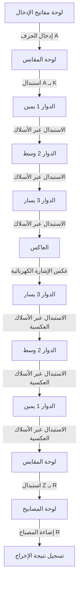
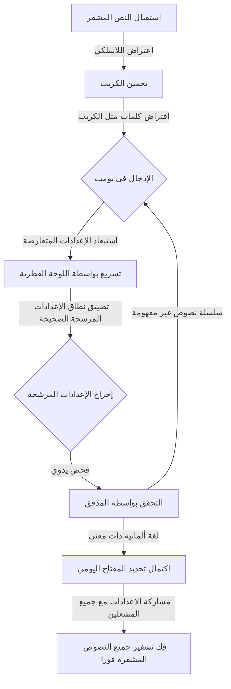

## 1. مقدمة: العصر الذي حركت فيه الشفرات مجرى التاريخ

في الحرب العالمية الثانية، وهي أقسى حرب في تاريخ البشرية، لم يكن تحديد النصر معتمدا فقط على قوة الأسلحة أو عدد الجنود. ما أثر بشكل كبير على مجرى الحرب كان السلاح غير المرئي وهو "المعلومات"، وحرب الشفرات الشرسة التي دارت خلف الكواليس.

"إنجما"، آلة التشفير التي امتلكت ألمانيا النازية ثقة مطلقة بها. كان يُعتقد أن بنيتها المعقدة والغامضة تجعل من المستحيل على أي إنسان أو آلة في ذلك الوقت فك شفرتها. ومع ذلك، تجمع العباقرة في المنشأة السرية للغاية "حديقة بليتشلي" في بريطانيا لمواجهة هذا التحدي الذي بدا مستحيلا. في قلب هؤلاء كان عالم الرياضيات العبقري آلان تورينج، الذي سُمي لاحقا "أبو علوم الكمبيوتر".

في هذه المقالة، سنستعرض بالتفصيل الدراما الملحمية المخبأة خلف الكواليس التاريخية، بدءا من الآلية المذهلة لإنجما، ومساهمات الأسلاف في طريق فك الشفرة، والمعركة المميتة في حديقة بليتشلي بقيادة تورينج، وصولا إلى النهاية المأساوية للعبقري.

## 2. آلة التشفير إنجما: آلية التشفير التي اعتُبرت مثالية

إنجما (Enigma) هي آلة تشفير كهروميكانيكية تحمل كلمة يونانية تعني "اللغز". في الأصل، تم اختراعها للاستخدام التجاري في أواخر العقد الأول من القرن العشرين بواسطة المهندس الألماني آرثر شيربيوس، لكن الجيش الألماني لاحظ قدرتها القوية على التشفير فاعتمدها للاستخدام العسكري وقام بتحسينها باستمرار.

### البنية الأساسية لإنجما

الميزة الأكبر في إنجما هي تحقيق "التشفير متعدد الأبجدية" ميكانيكيا، حيث تتغير قاعدة التشفير أو الدائرة في كل مرة يتم فيها إدخال حرف. تألفت بنيتها بشكل أساسي من العناصر التالية:

1. **لوحة المفاتيح**: مفاتيح لـ 26 حرفا أبجديا تشبه الآلة الكاتبة.
2. **لوحة المقابس**: لوحة توصيل لتبديل أزواج الحروف باستخدام الكابلات.
3. **الدوارات**: أقراص دوارة بأسلاك معقدة في الداخل. عادة ما يتم تعيين 3 منها.
4. **العاكس**: آلية تعكس الإشارة الكهربائية لتعود عبر الدوارات ولوحة المقابس مرة أخرى.
5. **لوحة المصابيح**: لوحة عرض حيث يضيء الحرف المشفر.

### عدد فلكي من التركيبات

عند الضغط على الحرف "A" في لوحة المفاتيح، تتحول الإشارة الكهربائية إلى حرف آخر في لوحة المقابس، وتمر عبر 3 دوارات لتتحول بشكل أكثر تعقيدا، ثم تنعكس في العاكس وتمر عبر الدوارات ولوحة المقابس مرة أخرى بترتيب عكسي، لتضيء المصباح على لوحة المصابيح.

هذه العملية وحدها معقدة، ولكن ما جعل إنجما مرعبة حقا هو الآلية التي يدور بها الدوار الأيمن بمقدار مسافة واحدة في كل مرة يتم فيها الضغط على مفتاح. عندما يكمل الدوار الأيمن دورة كاملة، يدور الدوار الأوسط بمقدار مسافة واحدة، وعندما يكمل الدوار الأوسط دورة كاملة، يدور الدوار الأيسر. بعبارة أخرى، الحرف "A" المكتوب أولا والحرف "A" المكتوب ثانيا يتم تشفيرهما إلى حروف مختلفة تماما.

عند الجمع بين إعدادات مثل نمط اتصال لوحة المقابس، وترتيب الدوارات، والموضع الأولي للدوارات، يصل العدد الإجمالي إلى رقم فلكي يبلغ حوالي 15,900,000,000,000,000,000 احتمال. نظرا لأن الجيش الألماني كان يغير هذه الإعدادات كل يوم عند منتصف الليل، كان من المستحيل تماما بالتقنيات المتاحة في ذلك الوقت تجربة كل الاحتمالات لفك شفرة إعدادات اليوم في نفس اليوم.

## 3. فجر حديقة بليتشلي: المساهمة البولندية

عند الحديث عن تاريخ فك شفرة إنجما، يجب ألا ننسى أبدا إنجازات مكتب الشفرات البولندي. في أوائل الثلاثينيات، عندما استسلم محللو الشفرات البريطانيون والفرنسيون معتبرين أن "إنجما لا يمكن فك شفرتها"، كانت بولندا تشعر بالتهديد الألماني بشكل مباشر، واستخدمت علماء الرياضيات لمواجهة هذا التحدي.

### الإلهام العبقري لماريان رييفسكي

على عكس فك التشفير التقليدي الذي اعتمد على الأساليب اللغوية، نجح عالم الرياضيات البولندي الشاب ماريان رييفسكي في تحديد الأسلاك الداخلية لإنجما باستخدام نهج رياضي بحت. كان هذا نتيجة رائعة للجمع بين المعلومات المجزأة من كتيب التشفير الألماني الذي حصلت عليه المخابرات الفرنسية، والبصيرة الرياضية العبقرية لرييفسكي.

### ولادة بومبا

لاكتشاف الإعدادات اليومية لإنجما، طور رييفسكي وزملاؤه آلة تسمى "بومبا". كانت هذه الآلة تقوم بربط آلات إنجما المتعددة لأتمتة البحث الشامل. بالإضافة إلى ذلك، طوروا أدوات فك تشفير يدوية، وكانت بولندا تقرأ الشفرات الألمانية بانتظام لعدة سنوات قبل اندلاع الحرب.

ومع ذلك، في أواخر عام 1938، زاد الجيش الألماني من تعقيد طرق تشغيل إنجما بزيادة أنواع الدوارات وعدد اتصالات لوحة المقابس. وبسبب نقص الأموال والموارد، تخلت بولندا عن الاستمرار في فك الشفرات بمفردها. وفي يوليو 1939، قبل اندلاع الحرب مباشرة، دعت ممثلين عن بريطانيا وفرنسا إلى ضواحي وارسو، وسلمتهم بسخاء جميع نتائج فك الشفرة وآلة إنجما المنسوخة. لولا عملية "نقل الراية" هذه، لما كان بالإمكان تحقيق نجاح بريطانيا اللاحق في فك الشفرة.

## 4. آلان تورينج وحديقة بليتشلي

أنشأت بريطانيا، التي ورثت إرثا قيما من بولندا، قاعدة لمدرسة الشفرات الحكومية في "حديقة بليتشلي"، وهو قصر شاسع يقع في باكينجهامشير شمال غرب لندن. هنا تم جمع العباقرة والموهوبين من مختلف المجالات، بما في ذلك علماء الرياضيات واللغويين المتميزين من أكسفورد وكامبريدج، وأبطال الشطرنج، وخبراء الكلمات المتقاطعة.

### ظهور آلان تورينج

من بين هؤلاء كان آلان تورينج، عالم الرياضيات الشاب الذي كان زميلا في كينجز كوليدج بجامعة كامبريدج. في ورقة بحثية نُشرت عام 1936، اقترح مفهوم "آلة تورينج"، وهي آلة افتراضية يمكنها أتمتة جميع العمليات الحسابية، ووضع الأساس النظري لأجهزة الكمبيوتر الحديثة.

في حديقة بليتشلي، أصبح تورينج رئيسا للكوخ 8، المسؤول عن فك شفرة إنجما التابعة للبحرية الألمانية، والتي كانت تُعتبر صعبة الفك بشكل خاص. كانت قواعد التشغيل في إنجما البحرية أكثر صرامة من تلك الخاصة بالجيش أو القوات الجوية، وكان يُعتبر فك الشفرة مهمة عاجلة لإيقاف تدمير التجارة في المحيط الأطلسي بواسطة الغواصات الألمانية.

## 5. اكتمال آلة فك التشفير بومب

قام تورينج بتطوير مفهوم "بومبا" البولندي بشكل أكبر وبدأ في تصميم آلة ضخمة تسمى "بومب" للبحث بسرعة عن إعدادات إنجما.

### استخدام الكريب

كان مفتاح نهج تورينج في فك التشفير هو تقنية تسمى "الكريب". الكريب هو "نص عادي معروف" يُفترض أنه متضمن في النص المشفر. على سبيل المثال، كانت تقارير الطقس للجيش الألماني تحتوي دائما على كلمة تعني الطقس كل صباح، أو تحتوي الرسائل في النهاية على عبارة تحية معتادة.

نظرا لبنية إنجما، كان هناك عيب قاتل: "لا يتم تشفير أي حرف إلى نفسه أبدا". استغل تورينج هذا العيب، وعن طريق تراكب النص المشفر والكريب وتحريكهما، حدد المواضع التي لا يحدث فيها تعارض.

### اللوحة القطرية لويلشمان

كان تصميم تورينج الأولي لآلة بومب رائعا، لكنه واجه مشكلة استغراق وقت طويل جدا في البحث الشامل. تم تحسين هذا بشكل كبير بواسطة "اللوحة القطرية" التي ابتكرها زميله جوردون ويلشمان.

بفضل هذا، أصبح من الممكن التحقق من واستبعاد عدد هائل من المجموعات المتعلقة بإعدادات لوحة المقابس في وقت واحد، مما أدى إلى تحسين سرعة الحساب لآلة بومب بشكل هائل. هذه الآلة، التي اكتملت بتعاون تورينج وويلشمان، كانت تعمل بصوت طقطقة مدوية، وقلصت الوقت اللازم لتحديد المفتاح اليومي من عدة ساعات إلى بضع عشرات من الدقائق فقط.

## 6. المعركة المميتة مع الغواصات ومعلومات ألترا

مع اكتمال آلة بومب، سارت جهود فك شفرات القوات الجوية والجيش الألماني على الطريق الصحيح، لكن فك شفرة البحرية ظل يواجه صعوبات. في أوائل عام 1942، قدمت البحرية الألمانية نوعا جديدا بإضافة دوار رابع إلى آلات إنجما للغواصات، ووقعت حديقة بليتشلي في "تعتيم" لعدة أشهر حيث لم يتمكنوا من قراءة الشفرات.

### الاستيلاء المعجزة من الغواصة

تم كسر هذا الوضع اليائس من خلال عملية انتحارية للبحرية البريطانية. عندما استولت مدمرة تابعة للحلفاء على غواصة، نجحوا في استرداد أحدث كتب الشفرات وآلة إنجما نفسها والدوارات من داخل الغواصة التي كانت على وشك الغرق. بشكل خاص، وفرت عمليات الاستيلاء معلومات حاسمة لفك الشفرة.

وبفضل هذه المعلومات، وتقنيات الفك السريعة التي طورها تورينج، بالإضافة إلى تشغيل الآلات الجديدة من بومب التي تم إنتاجها بكميات كبيرة بتمويل من الجيش الأمريكي، تمكنت قوات الحلفاء مرة أخرى من الفهم الكامل لمواقع الغواصات.

### ألترا تجلب النصر

أُطلق على المعلومات فائقة السرية التي تم فك شفرتها في حديقة بليتشلي اسم "ألترا". تم استخدام معلومات ألترا بحذر شديد حتى لا يدرك الجيش الألماني أنه يتم فك شفراتها. في بعض الأحيان، عند إغراق قوافل العدو بناء على المعلومات المفككة، كانوا يرسلون عمدا طائرات استطلاع لتضليل الجيش الألماني بادعاء "اكتشافها عبر الاستطلاع".

بفضل معلومات ألترا، دحرت قوات الحلفاء تهديد الغواصات في معركة المحيط الأطلسي، مما أدى إلى النصر في حملة شمال إفريقيا، ونجاح عملية الخداع واسعة النطاق خلال إنزال نورماندي في عام 1944. يقدر المؤرخون أن فك الشفرات في حديقة بليتشلي اختصر الحرب بما لا يقل عن عامين إلى أربعة أعوام وأنقذ عشرات الملايين من الأرواح.

## 7. مأساة ما بعد الحرب وإرث تورينج

بعد انتهاء الحرب، تم إخفاء إنجازات حديقة بليتشلي كسرية للغاية. أُجبر الآلاف من الموظفين على التوقيع على تعهد بأن "ما حدث في هذا المكان سيُؤخذ إلى القبر"، ولم تُعرف أعمالهم البطولية للعالم إلا بعد بدء الإفصاح عن المعلومات في السبعينيات.

### المأساة التي ضربت العبقري

بعد الحرب، حقق آلان تورينج إنجازات رائدة في مجالات متنوعة، مثل تصميم أجهزة الكمبيوتر المبكرة، والمفاهيم الأساسية للذكاء الاصطناعي، والبحث في علم الأحياء الرياضي حول التشكل الحيوي.

ومع ذلك، كان المجتمع البريطاني في ذلك الوقت قاسيا عليه. في عام 1952، قُبض على تورينج بتهمة المثلية الجنسية، والتي كانت غير قانونية في ذلك الوقت. ولتجنب السجن، لم يكن أمامه خيار سوى قبول عقوبة "الإخصاء الكيميائي" المهينة.

في 7 يونيو 1954، توفي العبقري الذي أصيب بجروح عميقة جسديا وعقليا في سريره في المنزل عن عمر يناهز 41 عاما. تم العثور على تفاحة مأكولة جزئيا بجانبه، وتم تحديد سبب الوفاة بأنه انتحار بسبب التسمم بالسيانيد.

### استعادة الشرف والإنجاز الخالد

المعاملة غير العادلة للعبقري الذي أنقذ العالم ووضع أسس مجتمع المعلومات الحديث واجهت انتقادات شديدة في السنوات اللاحقة. بعد مرور سنوات طويلة، في عام 2009، قدم رئيس الوزراء آنذاك جوردون براون اعتذارا رسميا نيابة عن الحكومة البريطانية. وفي عام 2013، منحته الملكة إليزابيث عفوا ملكيا بعد وفاته، واستعيد شرف تورينج بالكامل. اليوم، تُزين صورته أعلى فئة نقدية في بريطانيا، وهي ورقة الخمسين جنيها.

## 8. الخلاصة

لم تكن معركة فك شفرة إنجما مجرد حل لألغاز. لقد كانت حربا شاملة للذكاء والمعرفة حددت مصير الدول، وكانت دليلا تاريخيا على أن الرياضيات والمنطق تفوقا على الأسلحة المادية.

الإنجازات العظيمة التي حققها آلان تورينج والأبطال المجهولون في حديقة بليتشلي هي الجذور المباشرة للإنترنت ومجتمع الكمبيوتر الذي نتمتع به اليوم. إن شغفهم وذكاءهم، الذي فك شفرات معقدة وجعل المستحيل ممكنا، لا يزال يتألق عبر الزمن حتى يومنا هذا.

على الرغم من أن تكنولوجيا التشفير قد غيرت دورها اليوم من أداة للحرب إلى درع يحمي خصوصيتنا واتصالاتنا، إلا أن الجمال المنطقي الكامن في جوهرها موجود بالتأكيد كامتداد لإمكانيات الكمبيوتر التي حلم بها تورينج ورفاقه.
