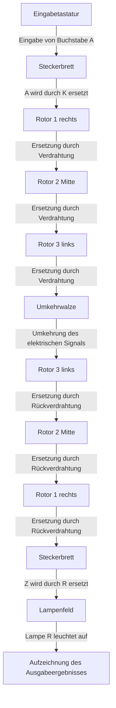
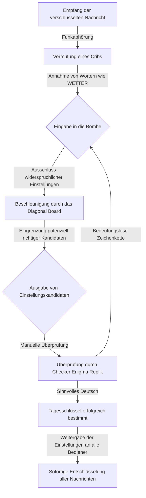

## 1. Einleitung: Die Ära, in der Codes die Geschichte bewegten

Im Zweiten Weltkrieg, dem grausamsten Krieg in der Geschichte der Menschheit, waren es nicht nur die Kraft der Waffen oder die Anzahl der Soldaten, die den Sieg bestimmten. Was den Kriegsverlauf maßgeblich beeinflusste, war die unsichtbare Waffe der "Information" und der erbitterte Kryptographie-Krieg, der sich hinter den Kulissen abspielte.

Die Verschlüsselungsmaschine "Enigma", in die Nazideutschland absolutes Vertrauen hatte. Es wurde geglaubt, dass ihre unglaublich komplexe Struktur von keinem Menschen oder einer Maschine der damaligen Zeit geknackt werden könnte. Doch die Genies, die in der streng geheimen britischen Einrichtung "Bletchley Park" versammelt waren, stellten sich dieser als unmöglich geltenden Herausforderung. Im Zentrum stand der brillante Mathematiker Alan Turing, der später als "Vater der Informatik" bekannt wurde.

Dieser Artikel enthüllt im Detail das große Drama, das sich hinter den Kulissen der Geschichte verbirgt: die erstaunlichen Mechanismen der Enigma, die Beiträge der Vorgänger auf dem Weg zur Entschlüsselung, der Kampf auf Leben und Tod in Bletchley Park um Turing und das tragische Ende des Genies.

## 2. Die Enigma-Maschine: Der Mechanismus des perfekten Codes

Enigma ist eine elektromechanische Verschlüsselungsmaschine, die das griechische Wort für "Rätsel" im Namen trägt. Ursprünglich wurde sie Ende der 1910er Jahre vom deutschen Ingenieur Arthur Scherbius für kommerzielle Zwecke erfunden. Das deutsche Militär, das ihr starkes Verschlüsselungspotenzial erkannte, übernahm sie jedoch für militärische Zwecke und verbesserte sie kontinuierlich.

### Grundstruktur der Enigma

Das Hauptmerkmal der Enigma bestand darin, dass sie mechanisch eine "polyalphabetische Substitution" implementierte, bei der sich die Verschlüsselungsregel bei jeder Buchstabeneingabe änderte. Ihre Struktur bestand hauptsächlich aus den folgenden Elementen:

1. **Tastatur**: 26 Buchstabentasten wie bei einer Schreibmaschine.
2. **Steckerbrett**: Ein Schalttafel, um Buchstabenpaare mithilfe von Kabeln zu vertauschen.
3. **Rotor**: Eine rotierende Scheibe mit komplexen internen Verdrahtungen. Normalerweise wurden 3 eingesetzt.
4. **Umkehrwalze**: Ein Mechanismus, der das elektrische Signal reflektiert und durch die Rotoren und das Steckerbrett zurückschickt.
5. **Lampenfeld**: Ein Anzeigefeld, auf dem der verschlüsselte Buchstabe aufleuchtet.

### Die astronomische Anzahl von Kombinationen

Wenn man den Buchstaben "A" auf der Tastatur drückt, wird das elektrische Signal durch das Steckerbrett in einen anderen Buchstaben umgewandelt, bei der Passage durch die 3 Rotoren noch komplexer verändert, von der Umkehrwalze reflektiert und durchläuft dann erneut die Rotoren und das Steckerbrett in umgekehrter Reihenfolge, um schließlich eine Lampe auf dem Lampenfeld zum Leuchten zu bringen.

Dieser Prozess allein ist schon komplex, aber was die Enigma wirklich furchterregend machte, war die Tatsache, dass sich der am weitesten rechts liegende Rotor jedes Mal, wenn eine Taste gedrückt wurde, um einen Schritt weiterdrehte. Wenn der rechte Rotor eine vollständige Umdrehung machte, drehte sich der mittlere Rotor um einen Schritt weiter, und wenn der mittlere Rotor eine Umdrehung vollendete, drehte sich der linke Rotor. Das bedeutete, dass ein "A", das als erster Buchstabe getippt wurde, und ein "A", das als zweiter Buchstabe getippt wurde, zu völlig unterschiedlichen Buchstaben verschlüsselt wurden.

Kombinierte man die Verbindungsmuster des Steckerbretts, die Reihenfolge der Rotoren und die Anfangspositionen der Rotoren, ergab sich die astronomische Zahl von etwa 15.900.000.000.000.000.000 Möglichkeiten. Da das deutsche Militär diese Einstellungen jeden Tag um Mitternacht änderte, war es mit der damaligen Technologie absolut unmöglich, die Einstellungen durch Brute-Force zu knacken.

## 3. Der Anbruch von Bletchley Park: Polens Beitrag

Wenn man über die Geschichte der Enigma-Entschlüsselung spricht, darf man die Errungenschaften des polnischen Chiffrierbüros nicht vergessen. Anfang der 1930er Jahre spürte Polen die deutsche Bedrohung direkt und setzte Mathematiker ein, um dieses schwierige Problem anzugehen.

### Marian Rejewskis genialer Einfall

Der junge polnische Mathematiker Marian Rejewski nutzte im Gegensatz zur herkömmlichen, auf Linguistik basierenden Entschlüsselung einen rein mathematischen Ansatz, um die interne Verdrahtung der Enigma erfolgreich zu bestimmen. Dies war das Ergebnis einer brillanten Verbindung fragmentarischer Informationen aus einem deutschen Codebuch mit Rejewskis genialer mathematischer Einsicht.

### Die Geburt der Bomba

Um die täglichen Einstellungen der Enigma herauszufinden, entwickelten Rejewski und seine Kollegen eine Maschine namens Bomba. Diese verband mehrere Enigma-Maschinen, um die Brute-Force-Suche zu automatisieren. 

Ende 1938 komplizierte das deutsche Militär jedoch die Funktionsweise der Enigma. Polen, dessen finanzielle und materielle Ressourcen erschöpft waren, gab die eigenständige Fortsetzung der Entschlüsselung auf. Im Juli 1939 luden sie britische und französische Vertreter ein und übergaben ihnen großzügig alle Ergebnisse der Enigma-Entschlüsselung sowie Repliken der Enigma-Maschine. 

## 4. Alan Turing und Bletchley Park

Großbritannien, das das wertvolle Erbe Polens übernommen hatte, richtete in Bletchley Park die Basis für die Government Code and Cypher School ein. Hier wurden brillante Mathematiker, Linguisten, Schachmeister und Kreuzworträtsel-Experten versammelt.

### Das Erscheinen von Alan Turing

Unter ihnen befand sich der junge Mathematiker Alan Turing. In seiner 1936 veröffentlichten Arbeit schlug er das Konzept der Turingmaschine vor und legte damit die theoretischen Grundlagen des modernen Computers.

In Bletchley Park wurde Turing Leiter der Abteilung, die für die Enigma der deutschen Marine zuständig war, welche als besonders schwer zu knacken galt.

## 5. Die Fertigstellung der Entschlüsselungsmaschine Bombe

Turing entwickelte das Konzept der polnischen Bomba weiter und begann mit der Konstruktion einer riesigen Maschine namens Bombe, die in der Lage war, die Enigma-Einstellungen mit hoher Geschwindigkeit zu durchsuchen.

### Die Verwendung von Cribs

Der Schlüssel zu Turings Entschlüsselungsansatz war eine Methode, die Crib genannt wurde. Ein Crib ist ein bekannter Klartext, der vermutlich in der verschlüsselten Nachricht enthalten ist. 

Turing nutzte die Schwäche der Enigma, dass ein Buchstabe niemals als er selbst verschlüsselt wird, um den verschlüsselten Text und den Crib übereinanderzuschieben und die Position zu finden, an der keine Widersprüche auftraten.

### Welchmans Diagonal Board

Turings ursprünglicher Entwurf für die Bombe war brillant, aber die Brute-Force-Suche dauerte immer noch zu lange. Dies wurde durch das von seinem Kollegen Gordon Welchman erfundene Diagonal Board drastisch verbessert.

Dadurch konnten enorm viele Kombinationen für die Einstellungen des Steckerbretts gleichzeitig überprüft und ausgeschlossen werden. Diese Maschine arbeitete mit einem lauten, klickenden Geräusch und reduzierte die Zeit zur Bestimmung des Tagesschlüssels von mehreren Stunden auf nur noch wenige Dutzend Minuten.

## 6. Der Kampf auf Leben und Tod mit den U-Booten und Ultra-Informationen

Dank der Fertigstellung der Bombe kam die Entschlüsselung der Codes auf Kurs, aber die Entschlüsselung der Codes der Marine bereitete weiterhin Schwierigkeiten. Anfang 1942 führte die deutsche Marine eine neue Version ein, was Bletchley Park in einen Blackout stürzte.

### Die wundersame Erbeutung von U-110

Diese verzweifelte Situation wurde durch eine waghalsige Operation der britischen Marine durchbrochen. Als alliierte Zerstörer ein U-Boot kaperten, gelang es ihnen, aus dem sinkenden Schiff die neuesten Codebücher und Rotoren zu bergen. 

Durch diese Informationen waren die alliierten Streitkräfte wieder in der Lage, die Positionen der U-Boote vollständig zu verfolgen.

### Der Sieg, den Ultra brachte

Die in Bletchley Park entschlüsselten streng geheimen Informationen wurden Ultra genannt. Ultra-Informationen wurden mit äußerster Vorsicht verwendet, um zu verhindern, dass die Deutschen erfuhren, dass ihre Codes geknackt worden waren.

Durch diese Ultra-Informationen konnten die Alliierten die Bedrohung durch die U-Boote in der Atlantikschlacht abwehren. Historiker schätzen, dass die Codeknacker von Bletchley Park den Krieg um mindestens zwei bis vier Jahre verkürzt und zig Millionen Menschenleben gerettet haben.

## 7. Die Tragödie der Nachkriegszeit und Turings Vermächtnis

Nach dem Ende des Krieges wurden die Errungenschaften von Bletchley Park als streng geheim eingestuft. 

### Die Tragödie, die das Genie ereilte

Nach dem Krieg erbrachte Alan Turing bahnbrechende Leistungen in verschiedenen Bereichen.

Doch die britische Gesellschaft der damaligen Zeit war grausam zu ihm. Im Jahr 1952 wurde Turing wegen Homosexualität verhaftet, was nach damaligem Recht illegal war. Um einer Gefängnisstrafe zu entgehen, war er gezwungen, die demütigende Strafe der chemischen Kastration zu wählen.

Körperlich und seelisch tief verletzt, verstarb das Genie am 7. Juni 1954. Neben ihm lag ein angebissener Apfel, und die Todesursache wurde als Selbstmord durch Zyankalivergiftung eingestuft.

### Rehabilitation und ewiger Ruhm

Die ungerechte Behandlung des Genies stieß in späteren Jahren auf große Kritik. Viele Jahre später, im Jahr 2009, entschuldigte sich der damalige Premierminister offiziell. Im Jahr 2013 wurde ihm von Königin Elisabeth postum eine königliche Begnadigung gewährt, und Turings Ehre wurde vollständig wiederhergestellt. 

## 8. Zusammenfassung

Der Kampf um die Entschlüsselung der Enigma war nicht nur das Lösen eines Puzzles. Es war ein totaler Krieg des Intellekts und ein historischer Beweis dafür, dass Mathematik und Logik physischen Waffen überlegen sein können.

Die großartigen Leistungen von Alan Turing und den namenlosen Helden von Bletchley Park sind der direkte Ursprung des Internets und der Computergesellschaft, die wir heute genießen. 

Die Rolle der Kryptographie hat sich heute von einem Kriegsinstrument zu einem Schild gewandelt, der unsere Privatsphäre schützt. Aber die Schönheit der Logik existiert zweifellos in der Verlängerung des Potenzials von Computern, von denen Turing einst träumte.
