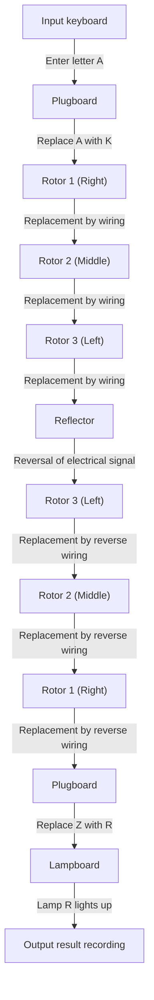
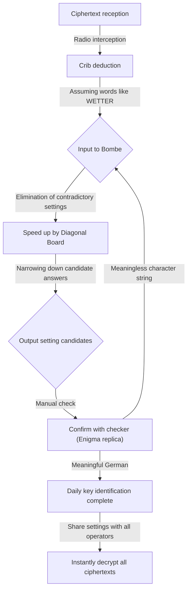

## 1. Introduction: The Era When Codes Moved History

In the most grueling war in human history, World War II, it was not only the power of weapons and the number of soldiers that determined the victory. What greatly influenced the war situation was the invisible weapon called "information," and the fierce code war that unfolded behind the scenes.

The cipher machine "Enigma," in which Nazi Germany had absolute confidence. Its complex and bizarre structure was believed to be undecipherable by any human or machine at the time. However, the geniuses gathered at the top-secret British facility "Bletchley Park" challenged this seemingly impossible task. At the center of it was the genius mathematician Alan Turing, who is later called the "father of computer science."

In this article, we will unravel in detail the grand drama hidden behind the scenes of history, from the astonishing mechanism of Enigma, the contributions of predecessors on the road to codebreaking, the desperate struggle at Bletchley Park centered around Turing, to the tragic end that the genius reached.

## 2. Enigma Cipher Machine: The Mechanism of the Code Considered Perfect

Enigma is an electromechanical cipher machine bearing the Greek word for "riddle". It was originally invented for commercial use by German engineer Arthur Scherbius in the late 1910s, but the German military, noticing its robust encryption capabilities, adopted it for military use and continued to improve it.

### Basic Structure of Enigma

The biggest feature of Enigma is that it mechanically realized a "polyalphabetic cipher" where the encryption rules (circuits) change every time a character is entered. Its structure mainly consisted of the following elements.

1. **Keyboard**: 26 alphabet keys like a typewriter.
2. **Plugboard (Steckerbrett)**: A wiring board to swap pairs of alphabets with cables.
3. **Rotor (cipher disk)**: A rotating disk with complex wiring inside. Usually, three (later four for the Navy) were set.
4. **Reflector (reversing rotor)**: A mechanism that folds back the electrical signal and passes it back through the rotors and plugboard.
5. **Lampboard**: A display board where the encrypted (or decrypted) character lights up.

### Astronomical Number of Combinations

When the letter "A" is pressed on the keyboard, the electrical signal is converted into another letter by the plugboard, further complexly converted while passing through the 3 rotors, folded back by the reflector, passes through the rotors and plugboard in reverse order again, and lights up a lamp on the lampboard.

Even just this process is complex, but what made Enigma truly terrifying was that it had a mechanism where the rightmost rotor rotated one notch every time a key was pressed. When the rightmost rotor completes one revolution, the middle rotor rotates one notch, and when the middle completes one revolution, the left rotor rotates. In other words, the "A" when typing the first letter and the "A" when typing the second letter are encrypted into completely different letters.

Combining settings such as plugboard connection patterns, rotor order (initially selecting 3 from 5 types), and initial rotor positions, the total number reached an astronomical figure of approximately 15,900,000,000,000,000,000 (15.9 quintillion). Because the German military changed these settings (daily key) every day at midnight, it was absolutely impossible with the technology of the time to decrypt it by brute-forcing the settings of the day within that day.

## 3. Dawn at Bletchley Park: Poland's Contribution

When talking about the history of Enigma codebreaking, we must absolutely not forget the achievements of the Polish Cipher Bureau (Biuro Szyfrów). In the early 1930s, when British and French codebreakers threw in the towel saying "Enigma is unbreakable," Poland directly felt the threat of Germany and challenged this difficult problem using mathematicians.

### Marian Rejewski's Genius Inspiration

A young Polish mathematician, Marian Rejewski, unlike conventional codebreaking relying on linguistic methods, succeeded in identifying the internal wiring of Enigma using a purely mathematical approach (group theory). This was the result of a brilliant combination of fragmented information from a German cipher manual obtained by French intelligence and Rejewski's genius mathematical insight.

### The Birth of "Bomba"

Rejewski and his team developed a machine called "Bomba" to find the daily settings (such as initial positions) of Enigma. This automated the brute-force search by linking multiple Enigma machines. Furthermore, they developed manual decryption tools such as "Zygalski sheets," and Poland routinely read German codes for several years before the outbreak of war.

However, from late 1938, the German military complicated the operation of Enigma by increasing the types of rotors and the number of plugboard connections. Exhausted of funds and resources, Poland abandoned the continuation of independent decryption, and in July 1939, just before the outbreak of the war, invited representatives of Britain and France to the outskirts of Warsaw and generously handed over all the results of the Enigma decryption and a replica Enigma machine. Without this "passing of the baton," the subsequent decryption drama by the British could not have happened.

## 4. Alan Turing and Bletchley Park

Inheriting the precious legacy from Poland, Britain established a base for the Government Code and Cypher School (GC&CS) at a vast estate called "Bletchley Park" in Buckinghamshire, northwest of London. Geniuses and talents from various fields, such as brilliant mathematicians from Oxford and Cambridge, linguists, chess champions, and crossword puzzle masters, were gathered here.

### The Appearance of Alan Turing

Among them was a young mathematician, Alan Turing, who served as a fellow at King's College, Cambridge. In his 1936 paper "On Computable Numbers," he proposed the concept of a hypothetical machine, the "Turing Machine," which could automate any calculation, laying the theoretical foundation for modern computers.

At Bletchley Park, Turing became the head of "Hut 8," which was in charge of the German Navy's Enigma, considered particularly difficult to decrypt. The Navy's Enigma had stricter operational rules than those of the Army or Air Force, and decryption was urgently needed to stop the Atlantic commerce raiding by U-boats (submarines).

## 5. Completion of the Decryption Machine "Bombe"

Turing further developed the concept of the Polish "Bomba" and began designing the "Bombe," a massive machine to search for Enigma settings at high speed.

### Use of "Cribs"

The key to Turing's decryption approach was a method called a "crib." A crib is a "known plaintext" presumed to be included in the ciphertext. For example, German weather reports almost always included the word "WETTER (weather)" every morning, or communications included the catchphrase "HEIL HITLER" at the end.

Due to the structure of Enigma, there was a fatal flaw that "a character is never encrypted into itself (entering A never outputs A)." Turing exploited this weakness, overlapping the ciphertext and the crib while shifting them, to identify positions where no contradictions occurred.

### Welchman's "Diagonal Board"

Turing's initial Bombe design was excellent, but it had the issue of taking too long for brute forcing. This was dramatically improved by the "Diagonal Board" devised by his colleague Gordon Welchman.

This made it possible to simultaneously verify and eliminate a huge number of combinations related to plugboard settings, and the calculation speed of the Bombe improved dramatically. This machine, completed through the cooperation of Turing and Welchman, operated with a loud ticking sound, reducing the time needed to identify the daily key from several hours to just a few tens of minutes.

## 6. Death Struggle with U-boats and Ultra Intelligence

With the completion of the Bombe, the decryption of the German Air Force and Army codes got on track, but the Navy (especially U-boat) decryption was still struggling. In early 1942, the German Navy introduced a new type (Shark cipher) that added a fourth rotor to the Enigma for U-boats, and Bletchley Park fell into a "blackout (darkness)" where they could not read the codes for several months.

### Miraculous Capture from U-110

What broke this desperate situation was a death-defying operation by the Royal Navy. When an Allied destroyer captured a U-boat, they succeeded in recovering the latest codebooks, the Enigma main unit, and rotors from the sinking ship. In particular, the capture dramas of U-110 and U-559 brought decisive information for decryption.

With this information, Turing's accelerated decryption methods (Banburismus, etc.), and the operation of new Bombes mass-produced with the financial power of the American military, the Allied forces were once again able to perfectly grasp the deployment of U-boats.

### The Victory Brought by "Ultra"

The top-secret information decrypted at Bletchley Park was called "Ultra." Ultra intelligence was utilized with the utmost care so that the German military would not realize the fact that it was being decrypted. Sometimes, when sinking enemy convoys based on decrypted information, they would intentionally fly reconnaissance planes and camouflage it to the German military as "discovered by reconnaissance."

This Ultra intelligence repelled the threat of U-boats in the Battle of the Atlantic, leading to victory in the North African campaign, and the success of the large-scale deception operation (Operation Fortitude) during the 1944 Normandy landings (D-Day). Historians estimate that the codebreaking at Bletchley Park shortened the war by at least two to four years and saved tens of millions of lives.

## 7. Post-war Tragedy and Turing's Legacy

After the war ended, the achievements of Bletchley Park were sealed as top secret. Thousands of staff members were forced to sign pledges to "take what happened at this place to the grave," and their heroic actions were not known to the world until the 1970s when information disclosure began.

### Tragedy Struck the Genius

After the war, Alan Turing made pioneering achievements in a wide range of fields, such as the design of early computers (ACE), the basic concept of artificial intelligence (Turing Test), and even research in mathematical biology regarding biological morphogenesis.

However, British society at the time was cruel to him. In 1952, Turing was arrested for the crime of homosexuality, which was illegal under the law at the time. To avoid imprisonment, he was forced to choose the humiliating punishment of "chemical castration (administration of female hormones)."

Deeply scarred both physically and mentally, the genius passed away in his bed at home on June 7, 1954. He was 41 years old. A half-eaten apple was dropped beside him, and the cause of death was ruled a suicide by potassium cyanide poisoning (*There are various theories, such as mimicking Snow White, or an accident theory).

### Restoration of Honor and Eternal Legacy

The unfair treatment of the genius who saved the world and laid the foundation for modern information society would later draw massive criticism. After a long time, in 2009, then-Prime Minister Gordon Brown officially apologized on behalf of the British government. In 2013, Queen Elizabeth granted a posthumous pardon, completely restoring Turing's honor. Today, his portrait is depicted on the £50 note, the highest denomination banknote in the UK.

## 8. Conclusion

The Enigma codebreaking war was not just puzzle-solving. It was an all-out war of intellect against intellect with the survival of the nation at stake, and it was also a historical proof that mathematics and logic surpassed physical weapons.

The great achievements accomplished by Alan Turing and the unsung heroes of Bletchley Park are the direct origins of the internet and computer society we enjoy today. Their passion and intellect, which unraveled complex codes and made the impossible possible, continue to shine brilliantly beyond time.

Although cryptography has now changed its role from a tool of war to a shield that protects our privacy and communications, the beauty of logic flowing at its root certainly exists on the extension of the possibilities of computers that Turing and his colleagues dreamed of.
