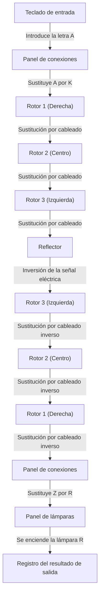
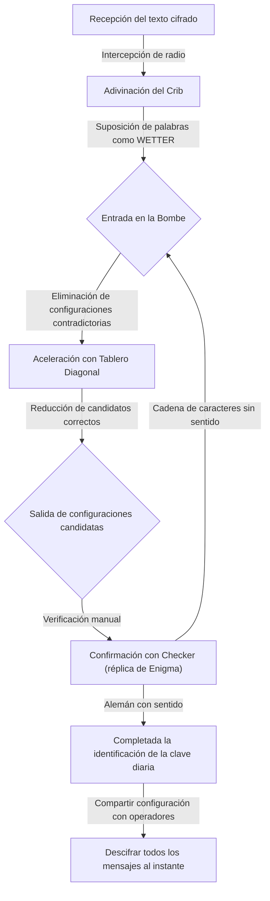

## 1. Introducción: La era en la que la criptografía movió la historia

En la guerra más dura de la historia humana, la Segunda Guerra Mundial, la victoria no fue determinada solo por el poder de las armas o el número de soldados. Lo que influyó en gran medida en la situación de la guerra fue un arma invisible llamada "información", y la feroz guerra criptográfica que se desarrolló detrás de escena.

La máquina de cifrado "Enigma", en la que la Alemania nazi tenía absoluta confianza. Se creía que su compleja y extraña estructura era indescifrable para cualquier humano o máquina de la época. Sin embargo, los genios reunidos en las instalaciones ultrasecretas británicas de "Bletchley Park" asumieron este desafío aparentemente imposible. En el centro estaba el genio matemático Alan Turing, más tarde también conocido como el "padre de la informática".

En este artículo, desentrañaremos en detalle el épico drama escondido detrás de la historia: desde el asombroso mecanismo de Enigma, las contribuciones de los pioneros en el camino hacia el desciframiento, la lucha a muerte en Bletchley Park centrada en Turing, hasta el trágico final del genio.

## 2. Máquina de cifrado Enigma: El mecanismo del cifrado considerado perfecto

Enigma es una máquina de cifrado electromecánica que lleva la palabra griega para "misterio". Originalmente inventada con fines comerciales a finales de la década de 1910 por el ingeniero alemán Arthur Scherbius, el ejército alemán notó su fuerte capacidad de cifrado, la adoptó para uso militar y continuó mejorándola.

### Estructura básica de Enigma

La principal característica de Enigma es que realizó mecánicamente un "cifrado polialfabético" en el que las reglas (circuitos) de cifrado cambiaban cada vez que se ingresaba un carácter. Su estructura constaba principalmente de los siguientes elementos:

1. **Teclado**: Teclas con las 26 letras del alfabeto, como en una máquina de escribir.
2. **Panel de conexiones (Steckerbrett)**: Un panel de cableado para intercambiar pares de letras usando cables.
3. **Rotores (discos de cifrado)**: Discos giratorios con cableado complejo en su interior. Normalmente se instalaba un conjunto de 3 (más tarde la Marina usó 4).
4. **Reflector (rotor de inversión)**: Un mecanismo que refleja las señales eléctricas y las devuelve a través de los rotores y el panel de conexiones.
5. **Panel de lámparas**: Un panel de visualización donde se ilumina el carácter cifrado (o descifrado).

### Un número astronómico de combinaciones

Al pulsar la letra "A" en el teclado, la señal eléctrica es convertida en otra letra en el panel de conexiones, se transforma de forma aún más compleja al pasar por los 3 rotores, se refleja en el reflector y vuelve a pasar por los rotores y el panel de conexiones en orden inverso, encendiendo una lámpara en el panel de lámparas.

Este proceso por sí solo es complejo, pero lo verdaderamente aterrador de Enigma era su mecanismo de hacer que el rotor de más a la derecha girara una muesca cada vez que se presionaba una tecla. Cuando el rotor derecho completaba una vuelta, el rotor central giraba una muesca, y cuando el central completaba una vuelta, el rotor izquierdo giraba. En otras palabras, la "A" tecleada como primer carácter y la "A" tecleada como segundo carácter se cifrarían en caracteres completamente diferentes.

Al combinar patrones de conexión del panel de conexiones, el orden de los rotores (inicialmente seleccionando 3 de 5 tipos) y las posiciones iniciales de los rotores, el número total de configuraciones alcanzaba la asombrosa cifra astronómica de aproximadamente 15,900,000,000,000,000,000 (15.9 trillones) de combinaciones. Como el ejército alemán cambiaba esta configuración (clave diaria) cada día a la medianoche, era absolutamente imposible con la tecnología de la época utilizar la fuerza bruta para descubrir la configuración del día en un solo día.

## 3. El amanecer de Bletchley Park: La contribución polaca

Al hablar de la historia del desciframiento de Enigma, no se debe olvidar la contribución de la Oficina de Cifrado (Biuro Szyfrów) de Polonia. A principios de la década de 1930, cuando los criptoanalistas británicos y franceses se rendían diciendo que "Enigma es indescifrable", Polonia sentía directamente la amenaza alemana y empleó matemáticos para abordar este desafío.

### La inspiración genial de Marian Rejewski

El joven matemático polaco Marian Rejewski, a diferencia del criptoanálisis tradicional que se basaba en métodos lingüísticos, tuvo éxito en la identificación del cableado interno de Enigma utilizando un enfoque puramente matemático (teoría de grupos). Este fue el resultado de una brillante combinación de la información fragmentaria del manual de cifrado alemán obtenida por el servicio de inteligencia francés y la genial intuición matemática de Rejewski.

### El nacimiento de la "Bomba (Bomba)"

Para descubrir las configuraciones diarias de Enigma (posiciones iniciales, etc.), Rejewski y su equipo desarrollaron una máquina llamada "Bomba". Ésta automatizaba la búsqueda por fuerza bruta al interconectar múltiples máquinas Enigma. Además, desarrollaron herramientas de descifrado manuales como las "hojas de Zygalski", y Polonia estuvo leyendo las comunicaciones alemanas de forma rutinaria durante varios años antes del estallido de la guerra.

Sin embargo, a partir de finales de 1938, el ejército alemán complicó el método operativo de Enigma aumentando el número de tipos de rotores y el número de conexiones en el panel de conexiones. Con sus fondos y recursos agotados, Polonia renunció a continuar el desciframiento por su cuenta y, en julio de 1939, justo antes del estallido de la guerra, invitó a representantes británicos y franceses a las afueras de Varsovia, donando generosamente todos sus logros en el desciframiento y réplicas de la máquina Enigma. Sin este "relevo", el posterior drama del desciframiento por parte del Reino Unido no habría sido posible.

## 4. Alan Turing y Bletchley Park

Habiendo heredado el valioso legado polaco, Gran Bretaña estableció una base para la Escuela Gubernamental de Códigos y Cifras (GC&CS) en la extensa mansión "Bletchley Park" en Buckinghamshire, al noroeste de Londres. Aquí se reunieron varios genios y talentos de diversos campos, incluidos matemáticos destacados de Oxford y Cambridge, lingüistas, campeones de ajedrez y expertos en crucigramas.

### La aparición de Alan Turing

Entre ellos se encontraba el joven matemático Alan Turing, que trabajaba como becario (fellow) en el King's College de la Universidad de Cambridge. Con su artículo publicado en 1936 "Sobre los números computables", propuso el concepto de una máquina virtual, la "Máquina de Turing", capaz de automatizar cualquier cálculo, sentando las bases teóricas de la informática moderna.

En Bletchley Park, Turing se convirtió en el jefe del "Hut 8 (Barracón 8)", responsable de los cifrados navales alemanes Enigma, que se consideraban particularmente difíciles de descifrar. El Enigma de la Marina tenía reglas operativas más estrictas que las del Ejército o la Fuerza Aérea, y se consideraba una necesidad urgente descifrarlo para evitar la destrucción del comercio en el Atlántico por parte de los U-Boot (submarinos).

## 5. La finalización de la máquina de descifrado "Bomba (Bombe)"

Turing desarrolló aún más el concepto de la "Bomba" polaca y comenzó a diseñar una enorme máquina llamada "Bombe" para buscar a alta velocidad las configuraciones de Enigma.

### El uso del "Crib"

La clave del enfoque de desciframiento de Turing era un método llamado "Crib". Un crib es un "texto plano conocido" que se sospecha que está incluido en el texto cifrado. Por ejemplo, los informes meteorológicos militares alemanes siempre contenían la palabra "WETTER" (tiempo) cada mañana, o al final del mensaje se incluía la frase de rigor "HEIL HITLER".

Debido a la estructura de Enigma, existía una debilidad fatal: "una letra nunca será cifrada como ella misma (si ingresas A, nunca saldrá A)". Turing aprovechó esta debilidad, superponiendo el texto cifrado y el crib y deslizándolos, para identificar la posición en la que no surgían contradicciones.

### El "Tablero Diagonal" de Welchman

El diseño inicial de la Bombe de Turing fue excelente, pero el ataque de fuerza bruta tomaba demasiado tiempo. Quien mejoró drásticamente esto fue su colega Gordon Welchman, al idear el "Tablero Diagonal".

Gracias a esto, se hizo posible verificar y descartar una gran cantidad de combinaciones relacionadas con la configuración del panel de conexiones al mismo tiempo, mejorando drásticamente la velocidad de cálculo de la Bombe. Esta máquina, completada gracias a la colaboración entre Turing y Welchman, operaba haciendo un fuerte ruido de tictac, acortando el tiempo para identificar la clave diaria de varias horas a apenas unas decenas de minutos.

## 6. La lucha a muerte con los U-Boot y la información Ultra

Si bien la finalización de la Bombe puso el descifrado de la Fuerza Aérea y el Ejército alemán por buen camino, descifrar los códigos de la Marina (especialmente de los submarinos U-Boot) seguía siendo muy difícil. A principios de 1942, la Armada alemana introdujo un nuevo tipo de Enigma (el cifrado Shark) para los U-Boots agregando un cuarto rotor, sumiendo a Bletchley Park en un "apagón (Blackout)" de desciframiento de códigos que duró varios meses.

### La captura milagrosa del U-110

Fue una misión desesperada de la Armada Real la que rompió esta situación desesperada. Cuando los destructores aliados capturaron un U-Boot, consiguieron recuperar los últimos libros de códigos, una máquina Enigma y rotores del interior del submarino a punto de hundirse. En particular, las capturas del U-110 y el U-559 proporcionaron información decisiva para el criptoanálisis.

Con esta información, sumada a los métodos de desciframiento más rápidos de Turing (como Banburismus) y la operación de nuevas Bombes producidas en masa con los fondos militares de Estados Unidos, los Aliados pudieron volver a comprender completamente las posiciones de los U-Boot.

### La victoria traída por "Ultra"

La información de máxima confidencialidad descifrada en Bletchley Park recibió el nombre de "Ultra". La inteligencia Ultra se utilizó con sumo cuidado para que las fuerzas alemanas no se dieran cuenta de que sus códigos estaban siendo descifrados. En ocasiones, al hundir una flota enemiga basándose en información descifrada, los Aliados llegaron incluso a enviar un avión de reconocimiento deliberadamente como engaño para hacer creer a las fuerzas alemanas que la habían "descubierto mediante reconocimiento".

Gracias a esta información Ultra, los Aliados lograron repeler la amenaza de los U-Boot en la Batalla del Atlántico, lo que llevó a la victoria en la campaña del Norte de África y al éxito de la operación de engaño a gran escala (Operación Fortitude) durante el desembarco de Normandía (Día D) en 1944. Los historiadores estiman que el trabajo de desciframiento de códigos en Bletchley Park acortó la guerra en al menos dos a cuatro años y salvó decenas de millones de vidas.

## 7. La tragedia de la posguerra y el legado de Turing

Tras el final de la guerra, los logros de Bletchley Park se ocultaron como secreto máximo. Miles de empleados fueron obligados a firmar acuerdos prometiendo que "se llevarían a la tumba lo sucedido en este lugar", y no fue sino hasta la década de 1970, cuando comenzó la desclasificación, que sus heroicas acciones se dieron a conocer al mundo.

### La tragedia que golpeó al genio

Después de la guerra, Alan Turing logró avances pioneros en una amplia gama de campos, incluyendo el diseño de una de las primeras computadoras (ACE), los conceptos fundacionales de la inteligencia artificial (el Test de Turing) e investigaciones en biología matemática sobre la morfogénesis en los seres vivos.

Sin embargo, la sociedad británica de la época fue cruel con él. En 1952, Turing fue arrestado por el delito de homosexualidad, que era ilegal según la ley de entonces. Para evitar la prisión, no tuvo más remedio que elegir la castración química humillante (administración de hormonas femeninas).

Herido profunda y dolorosamente tanto en cuerpo como en alma, el genio falleció en la cama de su casa el 7 de junio de 1954, a los 41 años de edad. Una manzana a medio comer yacía a su lado, y su causa de muerte se determinó como suicidio por envenenamiento con cianuro (*existen diversas teorías, como la de que imitó a Blancanieves o que fue un accidente).

### La restauración de su honor y su mérito eterno

El injusto trato hacia el genio que salvó al mundo y sentó las bases de la moderna sociedad de la información sería objeto de grandes críticas en años posteriores. Después de muchos años, en 2009, el entonces Primer Ministro Gordon Brown emitió una disculpa formal en nombre del gobierno británico. En 2013, la Reina Isabel II le concedió un indulto póstumo, y el honor de Turing quedó completamente restaurado. Hoy en día, su retrato figura en el billete de 50 libras, el de mayor denominación en el Reino Unido.

## 8. Conclusión

La batalla para descifrar el código Enigma no fue solo la resolución de un rompecabezas. Fue una guerra total de intelectos en la que estaba en juego la supervivencia de las naciones, y también la prueba histórica de que la matemática y la lógica superaron a las armas físicas.

Las grandes hazañas de Alan Turing y los héroes anónimos de Bletchley Park son el origen directo de Internet y la sociedad informatizada que disfrutamos hoy. Su pasión y su intelecto, que descifraron códigos complejos e hicieron posible lo imposible, continúan brillando más allá del tiempo.

La criptografía ha cambiado hoy de papel, de herramienta de guerra a escudo para proteger nuestra privacidad y nuestras comunicaciones, pero la belleza de la lógica que fluye en su base existe verdaderamente como una extensión de las posibilidades informáticas con las que soñaron Turing y sus colegas.
