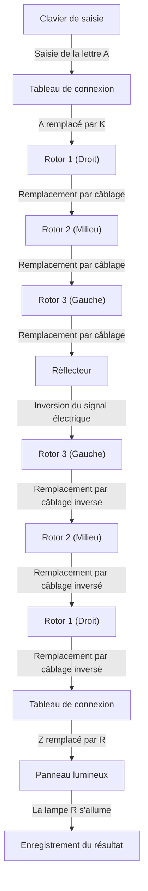
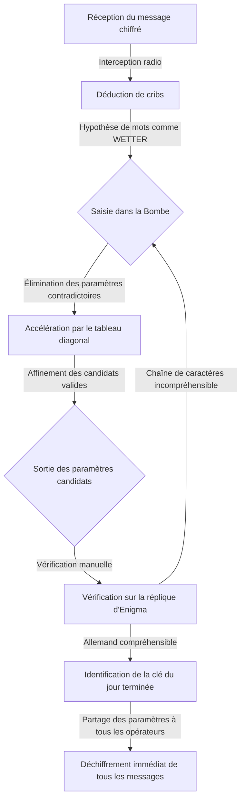

## 1. Introduction : L'époque où la cryptographie a changé l'histoire

Lors de la Seconde Guerre mondiale, le conflit le plus rude de l'histoire de l'humanité, la victoire n'a pas seulement été décidée par la puissance des armes ou le nombre de soldats. Ce qui a grandement influencé le cours de la guerre, c'est l'« information », une arme invisible, et la guerre acharnée du déchiffrement qui s'est déroulée en coulisses.

« Enigma », la machine de chiffrement dont l'Allemagne nazie était absolument certaine. Sa structure complexe et étrange était considérée comme indéchiffrable par n'importe quel humain ou machine de l'époque. Cependant, les génies rassemblés à « Bletchley Park », une installation top-secrète au Royaume-Uni, ont relevé ce défi apparemment impossible. Au centre de tout cela se trouvait Alan Turing, un génie mathématique plus tard appelé le « père de l'informatique ».

Dans cet article, nous allons explorer en détail le drame épique caché derrière l'histoire, depuis le mécanisme incroyable d'Enigma, les contributions des prédécesseurs sur le chemin du déchiffrement, la lutte à mort à Bletchley Park centrée sur Turing, jusqu'à la fin tragique qu'a connue ce génie.

## 2. La machine de chiffrement Enigma : Le mécanisme d'un code considéré comme parfait

Enigma est une machine de chiffrement électromécanique portant un nom qui signifie « mystère » en grec. Inventée à l'origine à la fin des années 1910 par l'ingénieur allemand Arthur Scherbius pour un usage commercial, l'armée allemande a remarqué ses capacités de chiffrement robustes, l'a adoptée pour un usage militaire et n'a cessé de l'améliorer.

### Structure de base d'Enigma

La plus grande caractéristique d'Enigma est qu'elle a réalisé mécaniquement un « chiffrement polyalphabétique » où la règle de chiffrement (circuit) change chaque fois qu'un caractère est saisi. Sa structure se composait principalement des éléments suivants :

1. **Clavier** : 26 touches alphabétiques semblables à celles d'une machine à écrire.
2. **Tableau de connexion (Steckerbrett)** : Un tableau de câblage permettant d'échanger des paires de lettres à l'aide de câbles.
3. **Rotors (Disques de chiffrement)** : Disques rotatifs avec un câblage interne complexe. Généralement, 3 d'entre eux (plus tard 4 pour la marine) étaient installés.
4. **Réflecteur** : Un mécanisme qui renvoie le signal électrique, le faisant repasser par les rotors et le tableau de connexion.
5. **Panneau lumineux** : Un panneau d'affichage où le caractère chiffré (ou déchiffré) s'allume.

### Un nombre astronomique de combinaisons

Lorsque vous appuyez sur la lettre « A » sur le clavier, le signal électrique est converti en une autre lettre au niveau du tableau de connexion, passe par les 3 rotors pour subir une conversion encore plus complexe, est renvoyé par le réflecteur, repasse par les rotors et le tableau de connexion dans l'ordre inverse, et allume une lampe sur le panneau lumineux.

Ce processus est déjà complexe en soi, mais ce qui rendait Enigma vraiment redoutable, c'est qu'elle possédait un mécanisme où le rotor le plus à droite tournait d'un cran chaque fois qu'une touche était pressée. Lorsque le rotor de droite fait un tour complet, le rotor du milieu tourne d'un cran, et lorsque celui du milieu fait un tour complet, le rotor de gauche tourne. En d'autres termes, le « A » tapé comme premier caractère et le « A » tapé comme deuxième caractère sont chiffrés en des caractères complètement différents.

En combinant les motifs de connexion du tableau de connexion, l'ordre des rotors (initialement 3 choisis parmi 5) et la position initiale des rotors, le nombre total atteignait le chiffre astronomique d'environ 15 900 000 000 000 000 000 (15,9 milliards de milliards) de possibilités. L'armée allemande modifiant ces paramètres (clé du jour) tous les jours à minuit, il était absolument impossible avec la technologie de l'époque de décrypter les paramètres du jour par la force brute.

## 3. L'aube de Bletchley Park : La contribution de la Pologne

Lorsqu'on parle de l'histoire du déchiffrement d'Enigma, il ne faut absolument pas oublier les réalisations du Bureau de chiffre polonais (Biuro Szyfrów). Au début des années 1930, alors que les cryptanalystes britanniques et français avaient jeté l'éponge en déclarant « Enigma est indéchiffrable », la Pologne, ressentant directement la menace allemande, s'est attaquée à ce défi en utilisant des mathématiciens.

### L'éclair de génie de Marian Rejewski

Le jeune mathématicien polonais Marian Rejewski a réussi à identifier le câblage interne d'Enigma en utilisant une approche purement mathématique (théorie des groupes), contrairement à la cryptanalyse traditionnelle qui reposait sur des méthodes linguistiques. C'était le résultat d'une brillante combinaison entre des informations fragmentaires de manuels de chiffrement allemands obtenus par les services de renseignement français et l'insight mathématique génial de Rejewski.

### La naissance de la « Bomba »

Pour découvrir les paramètres quotidiens d'Enigma (comme la position initiale), Rejewski et son équipe ont développé une machine appelée « Bomba ». Il s'agissait de l'automatisation d'une recherche par force brute en connectant plusieurs machines Enigma. En outre, ils ont également développé des outils de décryptage manuel comme les « feuilles de Zygalski », permettant à la Pologne de lire régulièrement les communications allemandes pendant les années précédant le début de la guerre.

Cependant, à partir de la fin de 1938, l'armée allemande a compliqué l'utilisation d'Enigma en augmentant le nombre de types de rotors et le nombre de connexions du tableau de connexion. À court de fonds et de ressources, la Pologne a renoncé à poursuivre le déchiffrement seule. En juillet 1939, juste avant le début de la guerre, elle a invité des représentants britanniques et français en banlieue de Varsovie et leur a généreusement cédé tous les résultats de leur déchiffrement ainsi que des répliques de la machine Enigma. Sans ce « passage de relais », l'histoire ultérieure du déchiffrement par les Britanniques n'aurait jamais pu avoir lieu.

## 4. Alan Turing et Bletchley Park

Héritant de la précieuse contribution polonaise, le Royaume-Uni a établi le siège de l'École gouvernementale de code et de chiffre (GC&CS) à « Bletchley Park », un vaste domaine situé dans le Buckinghamshire, au nord-ouest de Londres. C'est là que furent rassemblés des génies et des talents de divers domaines, notamment d'excellents mathématiciens d'Oxford et de Cambridge, des linguistes, des champions d'échecs et des experts en mots croisés.

### L'apparition d'Alan Turing

Parmi eux se trouvait Alan Turing, un jeune mathématicien et Fellow du King's College de l'Université de Cambridge. Dans son article publié en 1936, « Sur les nombres calculables », il a proposé le concept d'une machine virtuelle, la « machine de Turing », capable d'automatiser tout calcul, jetant ainsi les bases théoriques de l'ordinateur moderne.

À Bletchley Park, Turing a pris la tête de la « Hut 8 », chargée de déchiffrer l'Enigma de la marine allemande, considérée comme particulièrement difficile. L'Enigma de la marine avait des règles d'utilisation plus strictes que celles de l'armée de terre ou de l'air, et son déchiffrement était une urgence absolue pour empêcher la guerre de destruction du commerce dans l'Atlantique par les U-boote (sous-marins).

## 5. L'achèvement de la machine de décryptage « Bombe »

Turing a développé davantage le concept de la « Bomba » polonaise et a commencé à concevoir une immense machine, la « Bombe », pour rechercher à grande vitesse les paramètres d'Enigma.

### L'utilisation de « Cribs » (Mots probables)

La clé de l'approche de déchiffrement de Turing était une technique appelée « crib ». Un crib est un « texte clair connu » que l'on suppose être inclus dans le message chiffré. Par exemple, les bulletins météorologiques de l'armée allemande contenaient toujours le mot « WETTER » (temps) chaque matin, ou les communications se terminaient souvent par la phrase stéréotypée « HEIL HITLER ».

En raison de sa structure, Enigma avait un défaut fatal : « une lettre n'est jamais chiffrée par elle-même (si vous entrez A, il ne sortira jamais comme A) ». Turing a exploité cette faiblesse en superposant le message chiffré et le crib tout en les décalant pour identifier les positions où aucune contradiction ne se produisait.

### Le « Tableau diagonal » de Welchman

La conception initiale de la Bombe par Turing était brillante, mais elle souffrait du problème d'une force brute trop chronophage. Ce problème a été radicalement résolu par le « diagonal board » (tableau diagonal) inventé par son collègue Gordon Welchman.

Cela a permis de vérifier et d'éliminer simultanément un nombre énorme de combinaisons concernant les paramètres du tableau de connexion, augmentant considérablement la vitesse de calcul de la Bombe. Cette machine, achevée grâce à la collaboration de Turing et Welchman, fonctionnait avec un fort cliquetis et a réduit le temps nécessaire pour identifier la clé du jour, qui prenait auparavant des heures, à quelques dizaines de minutes seulement.

## 6. La lutte à mort avec les U-boote et les informations Ultra

Avec l'achèvement de la Bombe, le déchiffrement des codes de l'armée de l'air et de l'armée de terre allemandes était sur la bonne voie, mais le déchiffrement des codes de la marine (en particulier ceux des U-boote) restait extrêmement difficile. Au début de 1942, la marine allemande a introduit un nouveau modèle d'Enigma pour les U-boote avec un 4ème rotor supplémentaire (le code Shark), plongeant Bletchley Park dans un « blackout » (obscurité) où ils ont été incapables de lire les messages pendant des mois.

### La capture miraculeuse de l'U-110

Ce qui a mis fin à cette situation désespérée, c'est une opération à haut risque menée par la Royal Navy. Lorsque des destroyers alliés ont capturé un U-boot, ils ont réussi à récupérer les derniers manuels de codes, la machine Enigma elle-même et des rotors du navire sur le point de couler. En particulier, les captures de l'U-110 et de l'U-559 ont fourni des informations cruciales pour le déchiffrement.

Grâce à ces informations, aux méthodes de déchiffrement accélérées par Turing (comme le Banburismus) et au fonctionnement de nouvelles Bombes produites en masse grâce aux financements de l'armée américaine, les forces alliées ont pu à nouveau comprendre parfaitement le déploiement des U-boote.

### La victoire apportée par « Ultra »

Les informations top secrètes déchiffrées à Bletchley Park étaient appelées « Ultra ». Les informations Ultra ont été utilisées avec une extrême prudence pour ne pas laisser deviner à l'armée allemande qu'elle était l'objet de déchiffrements. Parfois, lorsqu'ils coulaient un convoi ennemi sur la base d'informations déchiffrées, ils allaient jusqu'à faire voler des avions de reconnaissance pour tromper l'armée allemande en leur faisant croire qu'ils l'avaient « découvert par reconnaissance ».

Grâce à ces informations Ultra, les forces alliées ont repoussé la menace des U-boote dans la bataille de l'Atlantique, ce qui a conduit à la victoire dans la campagne d'Afrique du Nord et au succès de la vaste opération de tromperie (Opération Fortitude) lors du débarquement de Normandie (Jour J) en 1944. Les historiens estiment que le déchiffrement à Bletchley Park a raccourci la guerre d'au moins 2 à 4 ans et sauvé des dizaines de millions de vies.

## 7. La tragédie d'après-guerre et l'héritage de Turing

Après la fin de la guerre, les réalisations de Bletchley Park ont été scellées sous le sceau du secret absolu. Des milliers d'employés ont dû signer un accord de non-divulgation déclarant qu'ils « emporteraient ce qui s'est passé ici dans leur tombe », et leurs actions héroïques n'ont été connues du public qu'après la déclassification des documents dans les années 1970.

### La tragédie qui a frappé le génie

Après la guerre, Alan Turing a réalisé des avancées pionnières dans de nombreux domaines, notamment la conception des premiers ordinateurs (ACE), les concepts fondamentaux de l'intelligence artificielle (le test de Turing) et la recherche en biologie mathématique sur la morphogenèse biologique.

Cependant, la société britannique de l'époque était cruelle envers lui. En 1952, Turing a été arrêté pour homosexualité, ce qui était illégal en vertu des lois de l'époque. Pour éviter l'emprisonnement, il n'a eu d'autre choix que d'accepter l'humiliante condamnation à la « castration chimique (administration d'hormones féminines) ».

Profondément blessé physiquement et mentalement, le génie a rendu son dernier souffle dans son lit à son domicile le 7 juin 1954, à l'âge de 41 ans. Une pomme à moitié mangée a été trouvée à ses côtés, et la cause du décès a été déterminée comme un suicide par empoisonnement au cyanure de potassium (bien qu'il existe d'autres théories, comme celle selon laquelle il aurait imité Blanche-Neige, ou l'hypothèse d'un accident).

### Réhabilitation et réalisations éternelles

Le traitement injuste de ce génie qui a sauvé le monde et jeté les bases de la société de l'information moderne a suscité de vives critiques par la suite. De nombreuses années plus tard, en 2009, le Premier ministre de l'époque, Gordon Brown, a présenté des excuses officielles au nom du gouvernement britannique. En 2013, la reine Elizabeth lui a accordé un pardon posthume, rétablissant ainsi pleinement l'honneur de Turing. Aujourd'hui, son portrait figure sur le billet de 50 livres, la coupure la plus élevée du Royaume-Uni.

## 8. Conclusion

La guerre du déchiffrement d'Enigma n'était pas seulement une résolution d'énigme. C'était une guerre totale de l'intelligence qui a mis en jeu la survie des nations, et la preuve historique que les mathématiques et la logique pouvaient surpasser les armes physiques.

Les grandes réalisations d'Alan Turing et des héros anonymes de Bletchley Park sont l'origine directe d'Internet et de la société informatique dont nous profitons aujourd'hui. Leur passion et leur intelligence, qui ont percé des codes complexes et rendu l'impossible possible, continuent de briller au-delà du temps.

Bien que la cryptographie ait aujourd'hui changé de rôle, passant d'un outil de guerre à un bouclier protégeant notre vie privée et nos communications, la beauté de la logique qui la sous-tend existe sans aucun doute dans le prolongement des possibilités de l'ordinateur dont rêvaient Turing et ses collègues.
