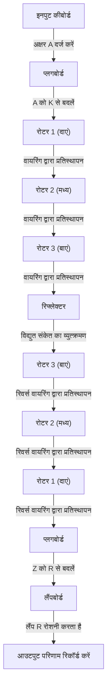
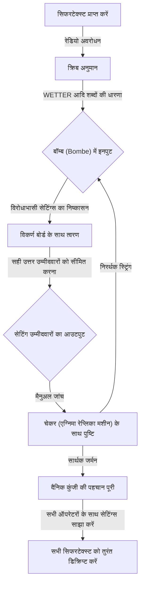

## 1. परिचय: वह युग जब कोड ने इतिहास को प्रेरित किया

द्वितीय विश्व युद्ध में, जो मानव इतिहास का सबसे कठोर युद्ध था, अकेले हथियारों की शक्ति और सैनिकों की संख्या ने जीत का फैसला नहीं किया। जिस चीज़ ने युद्ध की स्थिति को बहुत प्रभावित किया वह "सूचना" का अदृश्य हथियार था, और एक भयंकर कूटलेखन युद्ध जो पर्दे के पीछे लड़ा गया था।

नाजी जर्मनी को अपनी एन्क्रिप्शन मशीन "एग्निमा" पर पूर्ण विश्वास था। इसकी जटिल और विचित्र संरचना को उस समय किसी भी इंसान या मशीन द्वारा अटूट माना जाता था। हालांकि, ब्रिटेन की अति-गुप्त सुविधा "ब्लेचले पार्क" में इकट्ठे हुए जीनियस ने इस असंभव लगने वाली चुनौती को स्वीकार किया। इसके केंद्र में प्रतिभाशाली गणितज्ञ एलन ट्यूरिंग थे, जिन्हें बाद में "कंप्यूटर विज्ञान का पिता" कहा गया।

यह लेख एग्निमा के आश्चर्यजनक तंत्र, डिक्रिप्शन के रास्ते में पूर्ववर्तियों के योगदान, ट्यूरिंग के आसपास केंद्रित ब्लेचले पार्क में मृत्यु संघर्ष और इतिहास के पर्दे के पीछे छिपे हुए भव्य नाटक को विस्तार से उजागर करेगा, जिसमें प्रतिभाशाली व्यक्ति के दुखद अंत तक शामिल है।

## 2. एग्निमा मशीन: एक परफेक्ट कोड का तंत्र

एग्निमा (Enigma) एक इलेक्ट्रो-मैकेनिकल रोटर साइफर मशीन है जिसका नाम ग्रीक शब्द "रहस्य" के नाम पर रखा गया है। यह मूल रूप से 1910 के दशक के अंत में जर्मन इंजीनियर आर्थर शेरबियस द्वारा व्यावसायिक उपयोग के लिए आविष्कार किया गया था, लेकिन जर्मन सेना ने इसकी मजबूत एन्क्रिप्शन क्षमताओं पर ध्यान दिया और इसे सैन्य उपयोग के लिए अपनाया, जिससे इसमें सुधार हुआ।

### एग्निमा की मूल संरचना

एग्निमा की सबसे बड़ी विशेषता यह थी कि इसने यंत्रवत् रूप से "पॉलीअल्फाबेटिक साइफर" को महसूस किया, जिसमें एन्क्रिप्शन नियम (सर्किट) हर बार एक अक्षर टाइप करते समय बदलते थे। इसकी संरचना मुख्य रूप से निम्नलिखित तत्वों से बनी थी:

1. **कीबोर्ड**: टाइपराइटर की तरह वर्णमाला के 26 अक्षरों वाली कुंजियाँ।
2. **प्लगबोर्ड (Steckerbrett)**: केबल के साथ वर्णमाला के जोड़े को स्वैप करने के लिए एक वायरिंग बोर्ड।
3. **रोटर (साइफर डिस्क)**: अंदर जटिल वायरिंग के साथ एक घूर्णन डिस्क। आम तौर पर तीन (बाद में नौसेना के लिए चार) का एक सेट।
4. **रिफ्लेक्टर (रिवर्सिंग रोटर)**: एक तंत्र जो विद्युत संकेत को वापस मोड़ता है और इसे रोटर्स और प्लगबोर्ड के माध्यम से फिर से वापस करता है।
5. **लैंपबोर्ड**: एक डिस्प्ले बोर्ड जहां एन्क्रिप्टेड (या डिक्रिप्टेड) अक्षर प्रकाश करते हैं।

### खगोलीय संयोजन संख्या

जब आप कीबोर्ड पर "A" अक्षर दबाते हैं, तो विद्युत संकेत प्लगबोर्ड पर एक अन्य अक्षर में परिवर्तित हो जाता है, तीन रोटर्स से गुजरते हुए आगे जटिल रूप से परिवर्तित हो जाता है, रिफ्लेक्टर द्वारा वापस परावर्तित होता है, रोटर्स और प्लगबोर्ड के माध्यम से रिवर्स क्रम में गुजरता है, और लैंपबोर्ड पर एक लैंप को प्रकाशित करता है।

यह प्रक्रिया अपने आप में जटिल है, लेकिन एग्निमा के बारे में वास्तव में भयानक बात यह थी कि इसमें एक तंत्र था जहां हर बार एक कुंजी दबाए जाने पर सबसे दाहिना रोटर एक पायदान घूमता था। जब सबसे दाहिना रोटर एक चक्कर पूरा करता है, तो मध्य रोटर एक पायदान घूमता है, और जब मध्य रोटर एक चक्कर पूरा करता है, तो बायां रोटर घूमता है। दूसरे शब्दों में, पहले अक्षर के लिए टाइप किया गया "A" और दूसरे अक्षर के लिए टाइप किया गया "A" पूरी तरह से अलग-अलग अक्षरों में एन्क्रिप्ट किए जाते हैं।

प्लगबोर्ड कनेक्शन पैटर्न, रोटर ऑर्डर (शुरुआत में 5 प्रकारों में से 3 चुनना), रोटर की प्रारंभिक स्थिति आदि के संयोजन पर विचार करते हुए, कुल संख्या लगभग 15,900,000,000,000,000,000 (15.9 क्विन्टिल्लियन) संयोजनों की खगोलीय संख्या तक पहुंच गई। जर्मन सेना ने हर दिन आधी रात को इस सेटिंग (दैनिक कुंजी) को बदल दिया, जिससे उस समय की तकनीक के साथ उसी दिन सेटिंग को क्रूर बल द्वारा डिक्रिप्ट करना बिल्कुल असंभव हो गया।

## 3. ब्लेचले पार्क की सुबह: पोलैंड का योगदान

एग्निमा डिक्रिप्शन के इतिहास में, पोलिश साइफर ब्यूरो (Biuro Szyfrów) की उपलब्धियों को कभी नहीं भूलना चाहिए। 1930 के दशक की शुरुआत में, जब ब्रिटिश और फ्रांसीसी कोडब्रेकर्स ने हार मान ली और कहा कि "एग्निमा अटूट है," पोलैंड को जर्मनी के खतरे का सीधा अहसास हुआ और उसने गणितज्ञों का उपयोग करके इस चुनौती का सामना किया।

### मैरियन रेजेव्स्की की शानदार प्रेरणा

पारंपरिक कोडब्रेकिंग के विपरीत जो भाषाई तरीकों पर निर्भर करता था, पोलिश युवा गणितज्ञ मैरियन रेजेव्स्की ने शुद्ध गणितीय दृष्टिकोण (समूह सिद्धांत) का उपयोग करके एग्निमा के आंतरिक तारों की पहचान करने में सफलता प्राप्त की। यह फ्रांसीसी खुफिया विभाग द्वारा प्राप्त जर्मन कोडबुक की खंडित जानकारी और रेजेव्स्की की शानदार गणितीय अंतर्दृष्टि का एक आदर्श संयोजन था।

### "बोम्बा (Bomba)" का जन्म

रेजेव्स्की और उनकी टीम ने एग्निमा की दैनिक सेटिंग्स (प्रारंभिक स्थिति आदि) खोजने के लिए "बोम्बा" नामक एक मशीन विकसित की। यह क्रूर बल की खोज को स्वचालित करने के लिए कई एग्निमा मशीनों को जोड़ने वाली मशीन थी। इसके अलावा, "ज़िगाल्स्की शीट्स" जैसे मैन्युअल डिक्रिप्शन टूल भी विकसित किए गए थे, और पोलैंड युद्ध शुरू होने से पहले कई वर्षों तक दैनिक आधार पर जर्मन कोड पढ़ रहा था।

हालाँकि, 1938 के अंत से, जर्मन सेना ने रोटर्स के प्रकार बढ़ाकर और प्लगबोर्ड कनेक्शन की संख्या बढ़ाकर एग्निमा के संचालन को जटिल बना दिया। धन और संसाधनों की कमी के कारण, पोलैंड ने डिक्रिप्शन को अकेले जारी रखने का विचार छोड़ दिया, और जुलाई 1939 में, युद्ध के प्रकोप से ठीक पहले, ब्रिटिश और फ्रांसीसी प्रतिनिधियों को वारसॉ के उपनगरों में आमंत्रित किया और उन्हें अपने एग्निमा डिक्रिप्शन के सभी परिणाम और एक प्रतिकृति एग्निमा मशीन उदारतापूर्वक सौंप दी। इस "बैटन पास" के बिना, बाद में अंग्रेजों द्वारा डिक्रिप्शन नाटक संभव नहीं होता।

## 4. एलन ट्यूरिंग और ब्लेचले पार्क

पोलैंड से मूल्यवान विरासत प्राप्त करने के बाद, ब्रिटेन ने लंदन के उत्तर-पश्चिम में बकिंघमशायर में एक विशाल हवेली "ब्लेचले पार्क" में गवर्नमेंट कोड एंड साइफर स्कूल (GC&CS) का एक आधार स्थापित किया। यहां, ऑक्सफोर्ड और कैम्ब्रिज के उत्कृष्ट गणितज्ञ, भाषाविद, शतरंज चैंपियन और क्रॉसवर्ड पहेली विशेषज्ञ जैसे विभिन्न क्षेत्रों के प्रतिभाओं को इकट्ठा किया गया था।

### एलन ट्यूरिंग का आगमन

उनमें से एक युवा गणितज्ञ, एलन ट्यूरिंग थे, जो कैम्ब्रिज विश्वविद्यालय के किंग्स कॉलेज में फेलो थे। 1936 में प्रकाशित अपने पेपर "ऑन कम्प्यूटेबल नंबर्स" में, उन्होंने "ट्यूरिंग मशीन" की अवधारणा का प्रस्ताव रखा, जो एक काल्पनिक मशीन है जो किसी भी गणना को स्वचालित कर सकती है, और आधुनिक कंप्यूटरों की सैद्धांतिक नींव रखी।

ट्यूरिंग "हट 8" के प्रमुख बन गए, जो ब्लेचले पार्क में जर्मन नौसेना के एग्निमा के प्रभारी थे, जिसे विशेष रूप से डिक्रिप्ट करना मुश्किल माना जाता था। नौसेना के एग्निमा के संचालन नियम सेना और वायु सेना की तुलना में अधिक सख्त थे, और यू-बोट (पनडुब्बियों) द्वारा अटलांटिक में वाणिज्यिक विनाशकारी युद्ध को रोकने के लिए इसे डिक्रिप्ट करना एक तत्काल कार्य था।

## 5. डिक्रिप्शन मशीन "बॉम्ब (Bombe)" का पूरा होना

ट्यूरिंग ने पोलिश "बोम्बा" की अवधारणा को और विकसित किया और एक विशाल मशीन "बॉम्ब" डिजाइन करना शुरू किया जो उच्च गति पर एग्निमा की सेटिंग्स की खोज कर सकती थी।

### "क्रिब (Crib)" का उपयोग

ट्यूरिंग के डिक्रिप्शन दृष्टिकोण की कुंजी "क्रिब" नामक तकनीक थी। क्रिब एक "ज्ञात सादा पाठ" है जिसे सिफरटेक्स्ट में शामिल माना जाता है। उदाहरण के लिए, जर्मन मौसम रिपोर्टों में हर सुबह "WETTER (मौसम)" शब्द शामिल होता था, और संचार के अंत में कैचफ्रेज़ "HEIL HITLER" शामिल होता था।

एग्निमा की संरचना के कारण, एक घातक कमजोरी थी: "एक अक्षर कभी भी खुद को एन्क्रिप्ट नहीं किया जा सकता है (यदि आप A दर्ज करते हैं, तो यह कभी भी A के रूप में आउटपुट नहीं होगा)।" ट्यूरिंग ने इस कमजोरी का लाभ उठाया और विरोधाभासों का उत्पादन नहीं करने वाली स्थिति की पहचान करने के लिए साइफरटेक्स्ट और क्रिब को ओवरलैप किया।

### वेल्चमैन का "विकर्ण बोर्ड"

ट्यूरिंग का प्रारंभिक बॉम्ब डिज़ाइन शानदार था, लेकिन एक समस्या थी कि क्रूर बल को बहुत लंबा समय लगा। उनके सहयोगी गॉर्डन वेल्चमैन द्वारा तैयार किए गए "विकर्ण बोर्ड" द्वारा इसे नाटकीय रूप से सुधारा गया।

इसने प्लगबोर्ड सेटिंग्स के संयोजनों की भारी संख्या को एक साथ सत्यापित और समाप्त करना संभव बना दिया, जिससे बॉम्ब की गणना गति में काफी वृद्धि हुई। ट्यूरिंग और वेल्चमैन के सहयोग से पूरी हुई यह मशीन एक तेज टिकिंग ध्वनि के साथ काम करती थी, और दैनिक कुंजी की पहचान को कम कर देती थी, जिसमें घंटों लगते थे, केवल कुछ ही मिनटों में।

## 6. यू-बोट के साथ मृत्यु संघर्ष और अल्ट्रा इंटेलिजेंस

हालांकि बॉम्ब के पूरा होने के साथ जर्मन वायु सेना और सेना का डिक्रिप्शन पटरी पर था, नौसेना (विशेष रूप से यू-बोट) का डिक्रिप्शन अभी भी मुश्किल था। 1942 की शुरुआत में, जर्मन नौसेना ने यू-बोट एग्निमा (शार्क सिफर) में एक चौथा रोटर पेश किया, और ब्लेचले पार्क एक "ब्लैकआउट" में गिर गया जहां वे महीनों तक कोड नहीं पढ़ सके।

### U-110 से चमत्कारी कब्ज़ा

ब्रिटिश नौसेना द्वारा एक हताश ऑपरेशन ने इस हताश स्थिति को तोड़ दिया। जब मित्र देशों के विध्वंसक ने यू-बोट पर कब्जा कर लिया, तो वे डूबने वाले जहाज के अंदर से नवीनतम कोडबुक, एग्निमा बॉडी और रोटर्स को पुनर्प्राप्त करने में सफल रहे। विशेष रूप से, U-110 और U-559 के कब्जे ने डिक्रिप्शन के लिए महत्वपूर्ण जानकारी लाई।

इस जानकारी, ट्यूरिंग के त्वरित डिक्रिप्शन विधियों (जैसे बैनबुरिस्मस) और अमेरिकी सेना के वित्तपोषण के साथ उत्पादित बड़े पैमाने पर नए बॉम्ब के संचालन के साथ, मित्र देशों की सेनाएं एक बार फिर यू-बोट के प्लेसमेंट को पूरी तरह से समझने में सक्षम थीं।

### "अल्ट्रा" द्वारा लाई गई जीत

ब्लेचले पार्क में डिक्रिप्ट की गई शीर्ष गुप्त जानकारी को "अल्ट्रा (Ultra)" कहा जाता था। जर्मन सेना को यह एहसास न हो कि इसे डिक्रिप्ट किया जा रहा है, यह सुनिश्चित करने के लिए अल्ट्रा जानकारी का उपयोग बड़ी सावधानी से किया गया था। कभी-कभी, जब डिक्रिप्टेड जानकारी के आधार पर दुश्मन के काफिले को डुबोया जाता था, तो वे जर्मनों को धोखा देने के लिए एक टोही विमान भेजते थे कि इसे "टोही द्वारा खोजा गया" था।

इस अल्ट्रा खुफिया ने मित्र राष्ट्रों को अटलांटिक की लड़ाई में यू-बोट के खतरे को हराने, उत्तरी अफ्रीकी अभियान में जीत और 1944 नॉर्मंडी लैंडिंग (डी-डे) में एक बड़े पैमाने पर धोखे के ऑपरेशन (ऑपरेशन फोर्टिट्यूड) की सफलता का नेतृत्व किया। इतिहासकारों का अनुमान है कि ब्लेचले पार्क के कोडब्रेकिंग ने युद्ध को कम से कम 2 से 4 साल कम कर दिया और लाखों लोगों की जान बचाई।

## 7. युद्ध के बाद की त्रासदी और ट्यूरिंग की विरासत

युद्ध समाप्त होने के बाद, ब्लेचले पार्क की उपलब्धियों को शीर्ष गुप्त के रूप में सील कर दिया गया था। हजारों कर्मचारियों को यह कहते हुए एक प्रतिज्ञा पर हस्ताक्षर करने के लिए मजबूर किया गया था, "हम जो कुछ भी यहां हुआ उसे कब्र तक ले जाएंगे," और 1970 के दशक तक ऐसा नहीं था कि उनकी वीरतापूर्ण कार्रवाइयां दुनिया को ज्ञात हो गईं।

### प्रतिभाशाली पर प्रहार करने वाली त्रासदी

युद्ध के बाद, एलन ट्यूरिंग ने शुरुआती कंप्यूटर (एसीई) के डिजाइन, कृत्रिम बुद्धिमत्ता (ट्यूरिंग टेस्ट) की बुनियादी अवधारणा और यहां तक कि जैविक रूपजनन के संबंध में गणितीय जीव विज्ञान सहित विभिन्न क्षेत्रों में अग्रणी शोध किया।

हालांकि, उस समय ब्रिटिश समाज उनके प्रति कठोर था। 1952 में, ट्यूरिंग को समलैंगिकता के लिए गिरफ्तार किया गया था, जो उस समय कानून द्वारा अवैध था। जेल से बचने के लिए उन्हें अपमानजनक "रासायनिक बधियाकरण (महिला हार्मोन का प्रशासन)" चुनना पड़ा।

शारीरिक और मानसिक रूप से गहरे घायल हुए, इस प्रतिभाशाली व्यक्ति ने 7 जून, 1954 को अपने घर पर बिस्तर पर अंतिम सांस ली। वह 41 वर्ष के थे। उनके पास आधा खाया हुआ सेब गिरा था, और मौत का कारण पोटेशियम साइनाइड विषाक्तता द्वारा आत्महत्या निर्धारित किया गया था (हालांकि स्नो व्हाइट की नकल करने और दुर्घटना के सिद्धांतों जैसे विभिन्न सिद्धांत हैं)।

### सम्मान की बहाली और शाश्वत उपलब्धियां

दुनिया को बचाने वाले और आधुनिक सूचना समाज की नींव रखने वाले प्रतिभाशाली व्यक्ति के साथ अन्यायपूर्ण व्यवहार की बाद के वर्षों में भारी आलोचना होगी। कई वर्षों के बाद, 2009 में, तत्कालीन प्रधान मंत्री गॉर्डन ब्राउन ने ब्रिटिश सरकार की ओर से आधिकारिक तौर पर माफी मांगी। 2013 में, रानी एलिजाबेथ द्वारा एक मरणोपरांत क्षमा दी गई, और ट्यूरिंग के सम्मान को पूरी तरह से बहाल किया गया। आज, उनका चित्र ब्रिटेन के सबसे बड़े बैंकनोट, £50 के नोट पर है।

## 8. निष्कर्ष

एग्निमा कोडब्रेकिंग युद्ध केवल पहेली सुलझाना नहीं था। यह राष्ट्र के अस्तित्व के लिए दांव पर लगा बुद्धि और बुद्धि का युद्ध था, और यह एक ऐतिहासिक प्रमाण भी था कि गणित और तर्क भौतिक हथियारों से आगे निकल गए।

एलन ट्यूरिंग और ब्लेचले पार्क के अनाम नायकों द्वारा हासिल की गई महान उपलब्धि आधुनिक इंटरनेट और कंप्यूटर समाज की प्रत्यक्ष उत्पत्ति है जिसका हम आज आनंद ले रहे हैं। जटिल कोडों को सुलझाने और असंभव को संभव बनाने के लिए उनके जुनून और बुद्धिमत्ता की चमक आज भी समय के साथ चमकती है।

क्रिप्टोग्राफी ने अब युद्ध के उपकरण से हमारी गोपनीयता और संचार की रक्षा करने वाली ढाल के रूप में अपनी भूमिका बदल दी है, लेकिन इसके आधार पर चलने वाले तर्क की सुंदरता निश्चित रूप से ट्यूरिंग द्वारा सपने देखे गए कंप्यूटरों की क्षमता के विस्तार के रूप में मौजूद है।
