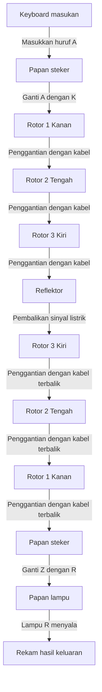
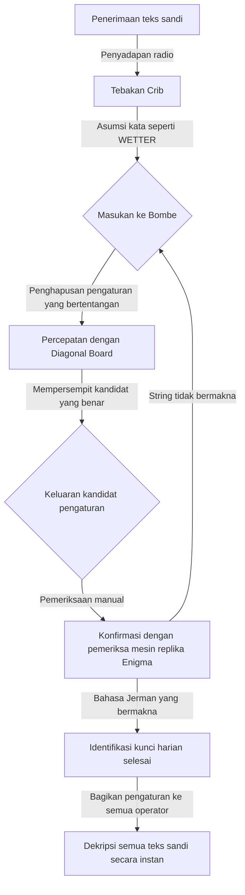

## 1. Pendahuluan: Era Ketika Kriptografi Menggerakkan Sejarah

Dalam perang paling kejam dalam sejarah manusia, Perang Dunia II, bukan hanya kekuatan senjata dan jumlah tentara yang menentukan kemenangan. Hal yang sangat memengaruhi jalannya perang adalah senjata tak kasat mata bernama "informasi", dan pertempuran kriptografi sengit yang terjadi di baliknya.

Jerman Nazi memiliki kepercayaan penuh pada mesin sandi "Enigma". Strukturnya yang rumit dan aneh diyakini tidak mungkin dipecahkan oleh manusia atau mesin mana pun pada masa itu. Namun, para jenius yang dikumpulkan di fasilitas sangat rahasia Inggris, "Bletchley Park", menantang masalah sulit yang dianggap mustahil ini. Di pusat upaya tersebut adalah ahli matematika jenius, yang kemudian juga dikenal sebagai "Bapak Ilmu Komputer", Alan Turing.

Artikel ini akan mengungkap secara rinci drama epik yang tersembunyi di balik sejarah, mulai dari mekanisme luar biasa Enigma, kontribusi para pendahulu dalam perjalanan menuju pemecahannya, pertempuran mematikan di Bletchley Park yang berpusat pada Turing, hingga akhir tragis sang jenius.

## 2. Mesin Sandi Enigma: Mekanisme Kriptografi yang Dianggap Sempurna

Enigma adalah mesin sandi elektromekanis yang menyandang kata bahasa Yunani untuk "teka-teki". Awalnya diciptakan untuk penggunaan komersial pada akhir 1910-an oleh insinyur Jerman Arthur Scherbius, namun kemampuannya enkripsinya yang kuat menarik perhatian militer Jerman, yang mengadopsinya untuk penggunaan militer dan terus memperbaikinya.

### Struktur Dasar Enigma

Fitur terbesar Enigma adalah realisasi mekanis dari "sandi polialfabetik", di mana aturan enkripsi (sirkuit) berubah setiap kali karakter dimasukkan. Strukturnya terutama terdiri dari elemen-elemen berikut.

1. **Keyboard**: Tombol untuk 26 huruf alfabet seperti mesin tik.
2. **Plugboard (Steckerbrett)**: Papan kabel untuk menukar pasangan alfabet dengan kabel.
3. **Rotor (Cakram Sandi)**: Cakram berputar dengan kabel internal yang rumit. Biasanya 3 buah (kemudian Angkatan Laut menggunakan 4 buah) dipasang sebagai satu set.
4. **Reflektor (Rotor Pembalik)**: Mekanisme yang memantulkan sinyal listrik dan mengirimkannya kembali melalui rotor dan plugboard.
5. **Lampboard**: Papan tampilan tempat huruf yang dienkripsi (atau didekripsi) menyala.

### Jumlah Kombinasi yang Astronomis

Saat tombol huruf "A" ditekan di keyboard, sinyal listrik diubah menjadi huruf lain oleh plugboard, diubah lebih kompleks lagi saat melewati 3 rotor, dipantulkan oleh reflektor, lalu melewati kembali rotor dan plugboard dalam urutan terbalik, hingga menyalakan lampu di lampboard.

Proses ini saja sudah rumit, tetapi apa yang membuat Enigma benar-benar menakutkan adalah ia memiliki mekanisme di mana rotor paling kanan berputar satu takik setiap kali tombol ditekan. Ketika rotor paling kanan menyelesaikan satu putaran penuh, rotor tengah berputar satu takik, dan ketika rotor tengah menyelesaikan satu putaran penuh, rotor kiri berputar. Dengan kata lain, "A" yang diketik sebagai huruf pertama dan "A" yang diketik sebagai huruf kedua akan dienkripsi menjadi karakter yang sama sekali berbeda.

Jika menggabungkan pola koneksi plugboard, urutan rotor (awalnya memilih 3 dari 5 jenis), dan posisi awal rotor, jumlah totalnya mencapai angka astronomis sekitar 15.900.000.000.000.000.000 (15,9 kuintiliun) kemungkinan. Militer Jerman mengubah pengaturan (kunci harian) ini setiap hari pada tengah malam, sehingga sangat mustahil dengan teknologi saat itu untuk memecahkan pengaturan hari itu dalam hari yang sama menggunakan metode serangan brute-force.

## 3. Fajar di Bletchley Park: Kontribusi Polandia

Satu hal yang tidak boleh dilupakan ketika membahas sejarah pemecahan Enigma adalah pencapaian Biro Sandi Polandia (Biuro Szyfrów). Pada awal 1930-an, ketika pemecah sandi dari Inggris dan Prancis menyerah dan menyebut Enigma "tidak dapat dipecahkan", Polandia, yang merasakan ancaman langsung dari Jerman, mengerahkan ahli matematika untuk mengatasi tantangan ini.

### Kilasan Jenius Marian Rejewski

Berbeda dengan pendekatan sebelumnya yang mengandalkan metode linguistik, ahli matematika muda Polandia Marian Rejewski berhasil menggunakan pendekatan matematika murni (teori grup) untuk mengidentifikasi perkabelan internal Enigma. Ini adalah hasil dari perpaduan brilian antara informasi parsial dari buku sandi Jerman yang diperoleh intelijen Prancis dan wawasan matematika Rejewski yang jenius.

### Lahirnya Bomba

Rejewski dan timnya mengembangkan mesin yang disebut "Bomba" untuk menemukan pengaturan harian Enigma (seperti posisi awal). Mesin ini menghubungkan beberapa mesin Enigma untuk mengotomatiskan pencarian brute-force. Mereka juga mengembangkan alat pemecahan manual seperti "Lembar Zygalski", dan selama beberapa tahun sebelum perang dimulai, Polandia membaca sandi Jerman secara rutin.

Namun, sejak akhir tahun 1938, militer Jerman mempersulit metode operasi Enigma, seperti menambah jenis rotor dan menambah jumlah koneksi plugboard. Polandia, yang kehabisan dana dan sumber daya, menyerah untuk terus memecahkannya sendirian, dan pada Juli 1939, tepat sebelum pecahnya perang, mereka mengundang perwakilan Inggris dan Prancis ke pinggiran Warsawa. Mereka dengan murah hati menyerahkan semua hasil pemecahan Enigma dan mesin replikanya. Tanpa "oper tongkat" ini, drama pemecahan kode oleh Inggris selanjutnya tidak akan pernah terjadi.

## 4. Alan Turing dan Bletchley Park

Mewarisi peninggalan berharga dari Polandia, Inggris mendirikan pangkalan untuk Government Code and Cypher School (GC&CS) di Bletchley Park, sebuah rumah besar yang luas di Buckinghamshire, barat laut London. Para jenius dan pemikir brilian dari berbagai bidang, termasuk ahli matematika, ahli bahasa, juara catur, dan ahli teka-teki silang dari universitas Oxford dan Cambridge, dikumpulkan di sini.

### Kemunculan Alan Turing

Di antara mereka ada ahli matematika muda Alan Turing, seorang fellow di King's College, Universitas Cambridge. Dalam makalahnya tahun 1936 "On Computable Numbers", ia mengusulkan konsep "Mesin Turing", sebuah mesin virtual yang dapat mengotomatiskan perhitungan apa pun, dan membangun dasar teoritis untuk komputer modern.

Di Bletchley Park, Turing menjadi kepala "Hut 8", yang bertanggung jawab atas Enigma Angkatan Laut Jerman yang dianggap sangat sulit dipecahkan. Aturan pengoperasian Enigma Angkatan Laut lebih ketat daripada aturan Angkatan Darat atau Angkatan Udara, dan pemecahannya menjadi sangat mendesak untuk menghentikan perang penghancuran jalur perdagangan maritim di Samudra Atlantik oleh U-boat (kapal selam).

## 5. Penyelesaian Mesin Pemecah Kode Bombe

Turing lebih jauh mengembangkan konsep "Bomba" Polandia dan mulai merancang mesin raksasa "Bombe" yang dengan cepat mencari pengaturan Enigma.

### Penggunaan Crib

Kunci dari pendekatan pemecahan Turing adalah teknik yang disebut "Crib". Crib adalah "teks biasa yang diketahui" yang diasumsikan terkandung dalam teks sandi. Misalnya, laporan cuaca militer Jerman setiap pagi selalu menyertakan kata "WETTER Cuaca", atau frasa penutup "HEIL HITLER" di akhir pesan.

Karena struktur Enigma, ada kelemahan fatal: "Sebuah huruf tidak akan pernah dienkripsi menjadi dirinya sendiri jika Anda memasukkan A, itu tidak akan pernah keluar sebagai A". Turing mengeksploitasi kelemahan ini dengan menggeser dan menumpuk teks sandi dengan Crib untuk mengidentifikasi posisi di mana tidak ada kontradiksi yang terjadi.

### Diagonal Board Karya Welchman

Desain awal Bombe milik Turing luar biasa, tetapi ada masalah karena pencarian brute-force memakan waktu terlalu lama. Hal ini diperbaiki secara dramatis oleh "Diagonal Board" yang diciptakan oleh rekannya, Gordon Welchman.

Hal ini memungkinkan verifikasi dan eliminasi jumlah kombinasi pengaturan plugboard yang sangat besar secara bersamaan, meningkatkan kecepatan perhitungan Bombe secara eksponensial. Diselesaikan melalui kerja sama antara Turing dan Welchman, mesin ini beroperasi dengan bunyi klik yang keras, mengurangi waktu yang dibutuhkan untuk mengidentifikasi kunci harian dari hitungan jam menjadi hanya beberapa puluh menit.

## 6. Pertempuran Mematikan Melawan U-boat dan Intelijen Ultra

Penyelesaian Bombe menempatkan dekripsi sandi Angkatan Udara dan Angkatan Darat Jerman ke jalurnya yang tepat, namun dekripsi sandi Angkatan Laut (terutama U-boat) masih terhambat. Pada awal tahun 1942, Angkatan Laut Jerman memperkenalkan model baru (sandi Hiu) dengan menambahkan rotor keempat pada Enigma untuk U-boat, yang membuat Bletchley Park jatuh ke dalam "Blackout Kegelapan" di mana mereka tidak dapat membaca sandi selama berbulan-bulan.

### Perampasan Ajaib dari U-110

Situasi putus asa ini dipatahkan oleh operasi mati-matian dari Angkatan Laut Inggris. Ketika kapal perusak Sekutu menangkap sebuah U-boat, mereka berhasil menemukan buku sandi terbaru, mesin Enigma, dan rotor dari dalam kapal yang hampir tenggelam. Khususnya, penangkapan U-110 dan U-559 memberikan informasi penting untuk memecahkan kode tersebut.

Dengan informasi ini, ditambah dengan metode dekripsi yang dipercepat oleh Turing (seperti Banburismus), dan pengoperasian model Bombe baru yang diproduksi massal dengan dukungan finansial dari militer Amerika Serikat, pasukan Sekutu sekali lagi mampu memahami sepenuhnya posisi U-boat.

### Kemenangan yang Dibawa oleh Ultra

Informasi rahasia tingkat tinggi yang didekripsi di Bletchley Park disebut "Ultra". Intelijen Ultra digunakan dengan sangat hati-hati untuk memastikan militer Jerman tidak menyadari fakta bahwa mereka sedang diretas. Terkadang, ketika menenggelamkan armada musuh berdasarkan informasi yang didekripsi, mereka berani menerbangkan pesawat pengintai dan memalsukannya agar Jerman mengira bahwa mereka "menemukannya melalui pengintaian".

Intelijen Ultra ini memungkinkan pasukan Sekutu untuk menangkis ancaman U-boat dalam Pertempuran Atlantik, yang mengarah pada kemenangan di Front Afrika Utara, dan keberhasilan operasi penipuan besar-besaran (Operasi Fortitude) dalam Pendaratan Normandia (D-Day) pada tahun 1944. Para sejarawan memperkirakan bahwa dekripsi Bletchley Park mempersingkat perang setidaknya 2 hingga 4 tahun dan menyelamatkan puluhan juta nyawa.

## 7. Tragedi Pasca-Perang dan Warisan Turing

Setelah perang berakhir, pencapaian Bletchley Park disegel sebagai rahasia tingkat tinggi. Ribuan staf dipaksa menandatangani sumpah bahwa "apa yang terjadi di tempat ini akan dibawa ke liang lahat", dan tindakan heroik mereka baru diketahui dunia pada tahun 1970-an ketika informasinya mulai dibuka ke publik.

### Tragedi yang Menimpa Sang Jenius

Setelah perang, Alan Turing membuat pencapaian perintis di berbagai bidang, termasuk merancang komputer awal (ACE), konsep dasar kecerdasan buatan (Turing Test), dan bahkan penelitian biologi matematika tentang morfogenesis biologis.

Namun, masyarakat Inggris pada saat itu sangat kejam kepadanya. Pada tahun 1952, Turing ditangkap atas tuduhan homoseksualitas, yang mana itu merupakan tindakan ilegal berdasarkan hukum pada masa itu. Untuk menghindari hukuman penjara, ia terpaksa memilih hukuman yang memalukan berupa "pengebirian kimia terapi hormon wanita".

Sangat terluka baik secara fisik maupun mental, sang jenius menghembuskan napas terakhirnya di tempat tidurnya di rumah pada tanggal 7 Juni 1954. Ia meninggal pada usia 41 tahun. Di sampingnya ditemukan sebuah apel yang telah digigit separuh, dan penyebab kematiannya dinyatakan sebagai bunuh diri akibat keracunan kalium sianida (meskipun ada berbagai teori, seperti teori bahwa ia meniru Putri Salju atau bahwa itu adalah sebuah kecelakaan).

### Pemulihan Nama Baik dan Pencapaian Abadi

Perlakuan tidak adil terhadap seorang jenius yang menyelamatkan dunia dan meletakkan dasar bagi masyarakat informasi modern tersebut akan menuai banyak kritik di kemudian hari. Pada tahun 2009, setelah bertahun-tahun lamanya, Perdana Menteri Gordon Brown saat itu secara resmi meminta maaf atas nama pemerintah Inggris. Pada tahun 2013, Ratu Elizabeth memberikan pengampunan anumerta, dan kehormatan Turing dipulihkan sepenuhnya. Hari ini, potretnya tergambar di uang kertas 50 poundsterling, pecahan uang kertas tertinggi di Inggris.

## 8. Kesimpulan

Pertempuran pemecahan kode Enigma bukan sekadar memecahkan teka-teki. Itu adalah perang total akal budi di mana kelangsungan hidup suatu negara dipertaruhkan, dan merupakan bukti sejarah bahwa matematika dan logika dapat mengungguli senjata fisik.

Pencapaian luar biasa yang diraih oleh Alan Turing dan para pahlawan tanpa nama di Bletchley Park adalah asal mula langsung dari internet dan masyarakat komputer yang kita nikmati saat ini. Semangat dan kecerdasan mereka, yang mengungkap sandi rumit dan membuat yang mustahil menjadi mungkin, terus bersinar terang melampaui waktu.

Teknologi kriptografi kini telah mengubah perannya dari alat perang menjadi perisai yang melindungi privasi dan komunikasi kita, namun keindahan logika yang mendasarinya jelas merupakan perpanjangan dari potensi komputer yang diimpikan oleh Turing dan rekan-rekannya.
