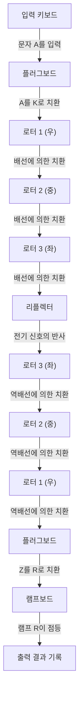
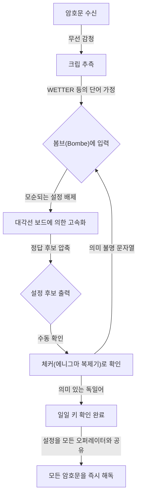

## 1. 서론: 암호가 역사를 움직인 시대

제2차 세계대전이라는 인류 역사상 가장 가혹한 전쟁에서 승리를 결정지은 것은 무기의 위력이나 병사의 수만이 아니었습니다. 전황을 크게 좌우한 것은 '정보'라는 보이지 않는 무기였으며, 그 이면에서 펼쳐진 치열한 암호전이었습니다.

나치 독일이 절대적인 자신감을 가졌던 암호기 '에니그마'. 그 복잡기괴한 구조는 당시의 어떠한 인간이나 기계로도 해독 불가능하다고 믿어졌습니다. 하지만 영국의 극비 시설 '블레츨리 파크'에 모인 천재들은 불가능해 보였던 이 난제에 도전했습니다. 그 중심에 있던 인물이 훗날 '컴퓨터 과학의 아버지'라고도 불리는 천재 수학자 앨런 튜링입니다.

이 글에서는 에니그마의 경이로운 메커니즘, 해독을 향한 과정에서 선구자들의 공헌, 튜링을 중심으로 한 블레츨리 파크에서의 사투, 그리고 천재가 맞이한 비극적인 결말에 이르기까지 역사의 이면에 숨겨진 장대한 드라마를 상세히 풀어냅니다.

## 2. 에니그마 암호기: 완벽하다고 여겨진 암호 메커니즘

에니그마(Enigma)는 그리스어로 '수수께끼'를 의미하는 단어를 딴 전기 기계식 암호기입니다. 원래 1910년대 후반 독일의 기술자 아르투어 슈어비우스(Arthur Scherbius)에 의해 상업용으로 발명되었으나, 그 강력한 암호화 능력에 주목한 독일군이 군사용으로 채택하여 개량을 거듭했습니다.

### 에니그마의 기본 구조

에니그마의 가장 큰 특징은 문자를 입력할 때마다 암호화 규칙(회로)이 변하는 '다중 환자 암호(polyalphabetic substitution cipher)'를 기계적으로 구현했다는 점입니다. 그 구조는 주로 다음과 같은 요소로 이루어져 있었습니다.

1. **키보드**: 타자기와 같은 알파벳 26글자의 키.
2. **플러그보드(Steckerbrett)**: 알파벳 쌍을 케이블로 교환하기 위한 배선반.
3. **로터(암호 원반)**: 내부에 복잡한 배선이 되어 있는 회전반. 보통 3개(나중에 해군은 4개)가 세팅됩니다.
4. **리플렉터(반사 로터)**: 전기 신호를 되돌려, 다시 로터와 플러그보드를 통과해 돌아가게 하는 기구.
5. **램프보드**: 암호화(또는 복호화)된 문자가 점등되는 표시반.

### 천문학적인 조합의 수

키보드에서 문자 'A'를 누르면, 전기 신호는 플러그보드에서 다른 문자로 변환되고, 3개의 로터를 통과하면서 더욱 복잡하게 변환되며, 리플렉터에서 반사되어 다시 로터와 플러그보드를 역순으로 통과한 뒤, 램프보드 상의 램프를 점등시킵니다.

이 과정만으로도 복잡하지만, 에니그마가 진정으로 무서웠던 점은 키를 누를 때마다 가장 오른쪽의 로터가 1칸씩 회전하는 메커니즘을 가지고 있었다는 것입니다. 가장 오른쪽 로터가 1바퀴 돌면 가운데 로터가 1칸 회전하고, 가운데가 1바퀴 돌면 왼쪽 로터가 회전합니다. 즉, 첫 번째 글자를 칠 때의 'A'와 두 번째 글자를 칠 때의 'A'는 전혀 다른 문자로 암호화되는 것입니다.

플러그보드의 연결 패턴, 로터의 순서(처음에는 5종류 중 3개 선택), 로터의 초기 위치 등의 설정을 조합하면 그 총수는 약 15,900,000,000,000,000,000(1,590경)가지라는 천문학적인 숫자에 달했습니다. 독일군은 매일 자정에 이 설정(일일 키)을 변경했기 때문에, 그날의 설정을 하루 안에 무차별 대입으로 해독하는 것은 당시 기술로는 절대적으로 불가능했습니다.

## 3. 블레츨리 파크의 여명: 폴란드의 공헌

에니그마 해독의 역사를 이야기할 때 절대 잊어서는 안 되는 것이 폴란드 암호국(Biuro Szyfrów)의 공적입니다. 영국이나 프랑스의 암호 해독자들이 "에니그마는 해독 불가능"하다며 포기하고 있던 1930년대 초, 폴란드는 독일의 위협을 직접적으로 느끼고 있었고 수학자들을 기용해 이 난제에 도전하고 있었습니다.

### 마리안 레예프스키의 천재적 번뜩임

폴란드의 젊은 수학자 마리안 레예프스키(Marian Rejewski)는 언어학적 기법에 의존하던 기존의 암호 해독과는 달리, 순수한 수학적 접근(군론)을 이용해 에니그마의 내부 배선을 알아내는 데 성공했습니다. 이는 프랑스 정보부가 입수한 독일 암호책의 단편적인 정보와 레예프스키의 천재적인 수학적 통찰이 멋지게 결합된 결과였습니다.

### '봄바(Bomba)'의 탄생

레예프스키 일행은 에니그마의 매일의 설정(초기 위치 등)을 찾아내기 위해 '봄바'라고 불리는 기계를 개발했습니다. 이는 여러 대의 에니그마를 연결하여 무차별 대입 탐색을 자동화한 것이었습니다. 게다가 '지갈스키의 시트' 등 수동 해독 도구도 개발하여 폴란드는 개전 전 몇 년 동안 독일의 암호를 일상적으로 읽고 있었습니다.

하지만 1938년 말부터 독일군은 로터의 종류를 늘리고 플러그보드 연결 수를 늘리는 등 에니그마 운용 방식을 복잡하게 만들었습니다. 자금과 자원이 고갈된 폴란드는 단독 해독을 포기하고, 1939년 7월 개전 직전 바르샤바 근교로 영국과 프랑스의 대표를 초청하여 에니그마 해독의 모든 성과와 복제한 에니그마 기계를 아낌없이 양도했습니다. 이 '바통 터치'가 없었다면 그 후 영국에 의한 해독극은 있을 수 없었을 것입니다.

## 4. 앨런 튜링과 블레츨리 파크

폴란드로부터 귀중한 유산을 물려받은 영국은 런던 북서쪽 버킹엄셔에 있는 넓은 저택 '블레츨리 파크'에 정부암호학교(GC&CS)의 거점을 마련했습니다. 이곳에는 옥스퍼드와 케임브리지의 우수한 수학자, 언어학자, 체스 챔피언, 낱말 퍼즐의 달인 등 다양한 분야의 천재와 영재들이 모였습니다.

### 앨런 튜링의 등장

그 중에는 케임브리지 대학교 킹스 칼리지에서 연구원으로 일하던 젊은 수학자, 앨런 튜링이 있었습니다. 그는 1936년에 발표한 논문 「계산 가능한 수에 대하여」에서 모든 계산을 자동화할 수 있는 가상의 기계 '튜링 머신'의 개념을 제창하여 현대 컴퓨터의 이론적 기초를 다진 인물이었습니다.

튜링은 블레츨리 파크에서 특히 해독이 어렵다고 알려진 독일 해군의 에니그마를 담당하는 'Hut 8(제8동)'의 책임자가 되었습니다. 해군의 에니그마는 육군이나 공군의 것보다 운용 규칙이 엄격했으며, U보트(잠수함)에 의한 대서양 통상파괴전을 저지하기 위해 해독이 급선무로 여겨졌습니다.

## 5. 해독 기계 '봄브(Bombe)'의 완성

튜링은 폴란드의 '봄바' 개념을 더욱 발전시켜, 에니그마의 설정을 고속으로 탐색하는 거대한 기계 '봄브(Bombe)'의 설계에 착수했습니다.

### '크립(Crib)'의 이용

튜링의 해독 접근법에서 핵심이 된 것은 '크립'이라고 불리는 기법이었습니다. 크립이란 암호문 속에 포함되어 있을 것으로 추측되는 '알려진 평문'을 말합니다. 예를 들어, 독일군 기상 통보에는 매일 아침 반드시 'WETTER(날씨)'라는 단어가 포함되어 있거나, 통신 마지막에 'HEIL HITLER'라는 정해진 문구가 포함되어 있었습니다.

에니그마의 구조상, "어떤 문자는 자기 자신으로 암호화되는 일이 절대 없다(A를 넣으면 A로 출력되지 않는다)"는 치명적인 약점이 있었습니다. 튜링은 이 약점을 이용하여 암호문과 크립을 엇갈리게 겹쳐 봄으로써 모순이 생기지 않는 위치를 찾아냈습니다.

### 웰치먼의 '대각선 보드(Diagonal Board)'

튜링의 초기 봄브 설계는 훌륭했지만, 무차별 대입에 시간이 너무 많이 걸린다는 과제가 있었습니다. 이를 획기적으로 개선한 것이 동료 고든 웰치먼(Gordon Welchman)이 고안한 '대각선 보드(Diagonal Board)'였습니다.

이로 인해 플러그보드 설정에 관한 방대한 수의 조합을 동시에 검증하고 배제할 수 있게 되어, 봄브의 계산 속도는 비약적으로 향상되었습니다. 튜링과 웰치먼의 협력으로 완성된 이 기계는 째깍째깍하는 요란한 소리를 내며 가동되었고, 몇 시간이나 걸리던 일일 키 찾기를 불과 몇십 분으로 단축시켰습니다.

## 6. U보트와의 사투와 울트라 정보

봄브의 완성으로 독일 공군이나 육군의 암호 해독은 궤도에 올랐지만, 해군(특히 U보트)의 암호 해독은 여전히 난항을 겪고 있었습니다. 1942년 초, 독일 해군은 U보트용 에니그마에 4번째 로터를 추가한 신형(샤크 암호)을 도입했고, 블레츨리 파크는 몇 달 동안 암호를 읽지 못하는 '블랙아웃(암흑)'에 빠졌습니다.

### U-110에서의 기적적인 탈취

이 절망적인 상황을 타개한 것은 영국 해군의 결사적인 작전이었습니다. 연합국의 구축함이 U보트를 나포했을 때, 침몰 직전의 함내에서 최신 암호책이나 에니그마 본체, 로터를 회수하는 데 성공한 것입니다. 특히 U-110이나 U-559 포획극은 암호 해독에 결정적인 정보를 가져다주었습니다.

이런 정보들과 튜링에 의한 고속화된 해독 기법(반부리스무 등), 나아가 미군의 자금력으로 대량 생산된 신형 봄브의 가동에 힘입어 연합군은 다시 U보트의 배치를 완벽하게 파악할 수 있게 되었습니다.

### '울트라'가 가져온 승리

블레츨리 파크에서 해독된 최고 기밀 정보는 '울트라(Ultra)'라고 불렸습니다. 울트라 정보는 독일군에게 해독되고 있다는 사실을 들키지 않도록 세심한 주의를 기울여 활용되었습니다. 때로는 해독된 정보를 바탕으로 적 선단을 침몰시킬 때, 일부러 정찰기를 띄워 '정찰을 통해 발견했다'고 독일군을 위장할 정도였습니다.

이 울트라 정보 덕분에 연합군은 대서양 전투에서 U보트의 위협을 물리치고, 북아프리카 전선의 승리, 그리고 1944년 노르망디 상륙 작전(D-Day)의 대규모 기만 작전(포티튜드 작전) 성공으로 이어졌습니다. 역사가들은 블레츨리 파크의 암호 해독이 전쟁을 적어도 2년~4년 단축시키고, 수천만 명의 목숨을 구했다고 추정하고 있습니다.

## 7. 전후의 비극과 튜링의 유산

전쟁이 끝난 후 블레츨리 파크의 공적은 최고 기밀로 봉인되었습니다. 수천 명의 스태프는 "이곳에서 일어난 일은 무덤까지 가져간다"는 서약서에 서명해야 했고, 그들의 영웅적 행동이 세상에 알려진 것은 정보 공개가 시작된 1970년대 이후의 일이었습니다.

### 천재를 덮친 비극

전후 앨런 튜링은 초기 컴퓨터(ACE)의 설계나 인공지능의 기초 개념(튜링 테스트), 나아가 생물의 형태 형성에 관한 수리생물학 연구 등 다방면에 걸쳐 선구적인 업적을 남겼습니다.

하지만 당시의 영국 사회는 그에게 냉혹했습니다. 1952년 튜링은 당시 법으로 불법이었던 동성애 혐의로 체포되고 맙니다. 투옥을 피하기 위해 그가 어쩔 수 없이 선택해야 했던 것은 굴욕적인 '화학적 거세(여성 호르몬 투여)' 형이었습니다.

몸과 마음에 깊은 상처를 입은 천재는 1954년 6월 7일 자택 침대에서 숨을 거두었습니다. 향년 41세. 곁에는 한 입 베어 문 사과가 떨어져 있었고, 사인은 청산가리 중독에 의한 자살로 단정되었습니다(※백설공주를 흉내 냈다는 설이나 사고설 등 여러 주장이 있습니다).

### 명예 회복과 영원한 공적

세상을 구하고 현대 정보 사회의 초석을 다진 천재에 대한 부당한 대우는 훗날 큰 비판을 받게 됩니다. 오랜 세월이 흐른 2009년, 당시 고든 브라운 총리가 영국 정부를 대표하여 공식적으로 사과했습니다. 2013년에는 엘리자베스 여왕에 의한 사후 사면이 이루어졌고, 튜링의 명예는 완전히 회복되었습니다. 현재는 영국의 최고액 지폐인 50파운드 지폐의 초상화에 그가 그려져 있습니다.

## 8. 결론

에니그마 암호 해독전은 단순한 퍼즐 풀이가 아닙니다. 그것은 국가의 존망을 건 지식과 지식의 총력전이었으며, 수학과 논리가 물리적인 무기를 능가했다는 역사적인 증명이기도 했습니다.

앨런 튜링과 블레츨리 파크의 무명 영웅들이 이룩한 위업은 현대의 우리가 누리고 있는 인터넷이나 컴퓨터 사회의 직접적인 원점입니다. 복잡한 암호를 해독하고 불가능을 가능하게 한 그들의 열정과 지성은 시공을 초월해 지금도 여전히 빛나고 있습니다.

암호 기술은 현재 전쟁의 도구에서 우리의 프라이버시나 통신을 지키는 방패로 역할을 바꾸었지만, 그 밑바탕에 흐르는 논리의 아름다움은 튜링 일행이 꿈꾸었던 컴퓨터의 가능성의 연장선상에 분명히 존재하고 있는 것입니다.
