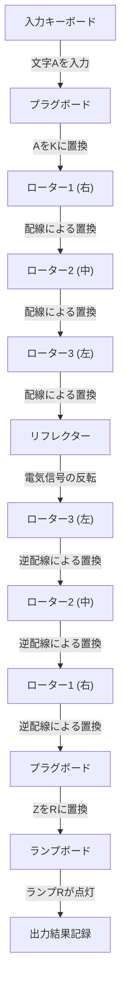
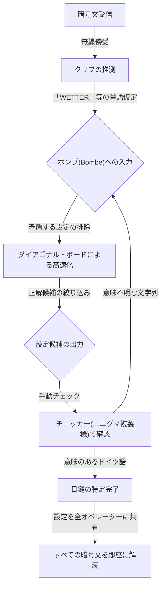

## 1. はじめに：暗号が歴史を動かした時代

第二次世界大戦という人類史上最も過酷な戦争において、勝利を決定づけたのは兵器の威力や兵士の数だけではありませんでした。戦局を大きく左右したのは、「情報」という見えない武器であり、その裏側で繰り広げられた熾烈な暗号戦でした。

ナチス・ドイツが絶対的な自信を持っていた暗号機「エニグマ」。その複雑怪奇な構造は、当時のいかなる人間や機械にも解読不可能であると信じられていました。しかし、イギリスの極秘施設「ブレッチリー・パーク」に集められた天才たちは、不可能と思われたこの難題に挑みました。その中心にいたのが、後に「コンピュータ科学の父」とも称される天才数学者、アラン・チューリングです。

この記事では、エニグマの驚異的なメカニズム、解読への道のりにおける先人たちの貢献、チューリングを中心としたブレッチリー・パークでの死闘、そして天才が辿った悲劇的な結末に至るまで、歴史の裏側に隠された壮大なドラマを詳細に紐解いていきます。

## 2. エニグマ暗号機：完璧とされた暗号のメカニズム

エニグマ（Enigma）は、ギリシャ語で「謎」を意味する言葉を冠した電気機械式暗号機です。もともとは1910年代後半にドイツの技術者アルトゥール・シェルビウスによって商業用に発明されましたが、その強固な暗号化能力に目をつけたドイツ軍が軍事用に採用し、改良を重ねていきました。

### エニグマの基本構造

エニグマの最大の特徴は、文字を入力するたびに暗号化のルール（回路）が変化する「多表式暗号」を機械的に実現した点にあります。その構造は主に以下の要素から成り立っていました。

1. **キーボード**：タイプライターのようなアルファベット26文字のキー。
2. **プラグボード（Steckerbrett）**：アルファベットのペアをケーブルで入れ替えるための配線盤。
3. **ローター（暗号円盤）**：内部に複雑な配線が施された回転盤。通常は3枚（のちに海軍は4枚）がセットされる。
4. **リフレクター（反転ローター）**：電気信号を折り返し、再びローターとプラグボードを通って戻す機構。
5. **ランプボード**：暗号化（または復号）された文字が点灯する表示盤。

### 天文学的な組み合わせの数

キーボードで文字「A」を押すと、電気信号はプラグボードで別の文字に変換され、3枚のローターを通過しながらさらに複雑に変換され、リフレクターで折り返して再度ローターとプラグボードを逆順で通過し、ランプボード上のランプを点灯させます。

このプロセスだけでも複雑ですが、エニグマが真に恐ろしかったのは、キーが押されるたびに一番右のローターが1メモリ回転する仕組みを持っていたことです。一番右のローターが1周すると真ん中のローターが1メモリ回転し、真ん中が1周すると左のローターが回転します。つまり、1文字目を打った時の「A」と、2文字目を打った時の「A」は、全く異なる文字に暗号化されるのです。

プラグボードの接続パターン、ローターの順序（当初は5種類から3つを選択）、ローターの初期位置などの設定を組み合わせると、その総数は約15,900,000,000,000,000,000（1590京）通りという天文学的な数字に達しました。ドイツ軍は毎日午前0時にこの設定（日鍵）を変更したため、その日の設定をその日のうちに力技で総当たりして解読することは、当時の技術では絶対に不可能でした。

## 3. ブレッチリー・パークの夜明け：ポーランドの貢献

エニグマ解読の歴史を語る上で絶対に忘れてはならないのが、ポーランドの暗号局（Biuro Szyfrów）の功績です。イギリスやフランスの暗号解読者が「エニグマは解読不可能」と匙を投げていた1930年代初頭、ポーランドはドイツの脅威を直接的に感じており、数学者を用いてこの難題に挑んでいました。

### マリアン・レイェフスキの天才的ひらめき

ポーランドの若き数学者マリアン・レイェフスキ（Marian Rejewski）は、言語学的手法に頼っていた従来の暗号解読とは異なり、純粋な数学的アプローチ（群論）を用いてエニグマの内部配線を特定することに成功しました。これは、フランス情報部が入手したドイツの暗号書の断片的な情報と、レイェフスキの天才的な数学的洞察が見事に結びついた結果でした。

### 「ボンバ（Bomba）」の誕生

レイェフスキたちは、エニグマの日々の設定（初期位置など）を見つけ出すために、「ボンバ」と呼ばれる機械を開発しました。これは、複数のエニグマ機を連結して総当たり探索を自動化するものでした。さらに、「ジガルスキのシート」などの手動解読ツールも開発し、ポーランドは開戦前の数年間、ドイツの暗号を日常的に読んでいました。

しかし、1938年末からドイツ軍はローターの種類を増やし、プラグボードの接続数を増やすなどエニグマの運用方法を複雑化させました。資金と資源が枯渇したポーランドは単独での解読継続を断念し、1939年7月、開戦直前のワルシャワ郊外にイギリスとフランスの代表を招き、エニグマ解読の全成果と複製したエニグマ機を惜しみなく譲渡しました。この「バトンタッチ」がなければ、その後のイギリスによる解読劇はあり得なかったのです。

## 4. アラン・チューリングとブレッチリー・パーク

ポーランドからの貴重な遺産を受け継いだイギリスは、ロンドン北西のバッキンガムシャーにある広大な邸宅「ブレッチリー・パーク」に、政府暗号学校（GC&CS）の拠点を設けました。ここには、オックスフォードやケンブリッジの優秀な数学者、言語学者、チェスのチャンピオン、クロスワードパズルの達人など、様々な分野の天才・秀才が集められました。

### アラン・チューリングの登場

その中に、ケンブリッジ大学のキングス・カレッジでフェローを務めていた若き数学者、アラン・チューリングがいました。彼は1936年に発表した論文「計算可能数について」で、あらゆる計算を自動化できる仮想の機械「チューリング・マシン」の概念を提唱し、現代のコンピュータの理論的基礎を築いた人物でした。

チューリングはブレッチリー・パークで、特に解読が困難とされていたドイツ海軍のエニグマを担当する「ハット8（第8棟）」の責任者となりました。海軍のエニグマは、陸軍や空軍のものよりも運用規則が厳格であり、Uボート（潜水艦）による大西洋の通商破壊戦を阻止するために、解読が急務とされていました。

## 5. 解読機械「ボンブ（Bombe）」の完成

チューリングは、ポーランドの「ボンバ」の概念をさらに発展させ、エニグマの設定を高速で探索する巨大な機械「ボンブ（Bombe）」の設計に着手しました。

### 「クリブ（Crib）」の利用

チューリングの解読アプローチの鍵となったのは、「クリブ」と呼ばれる手法でした。クリブとは、暗号文の中に含まれていると推測される「既知の平文」のことです。たとえば、ドイツ軍の気象通報には毎朝必ず「WETTER（天気）」という単語が含まれていたり、通信の最後に「HEIL HITLER」という決まり文句が含まれていたりしました。

エニグマの構造上、「ある文字は自分自身に暗号化されることは絶対にない（Aを入れるとAとして出力されることはない）」という致命的な弱点がありました。チューリングはこの弱点を利用し、暗号文とクリブをずらしながら重ね合わせることで、矛盾が生じない位置を特定しました。

### ウェルチマンの「ダイアゴナル・ボード」

チューリングの初期のボンブ設計は素晴らしいものでしたが、総当たりに時間がかかりすぎるという課題がありました。これを劇的に改善したのが、同僚のゴードン・ウェルチマンが考案した「ダイアゴナル・ボード（対角線盤）」でした。

これにより、プラグボードの設定に関する膨大な数の組み合わせを同時に検証・排除できるようになり、ボンブの計算速度は飛躍的に向上しました。チューリングとウェルチマンの協力によって完成したこの機械は、カチカチというけたたましい音を立てながら稼働し、数時間かかっていた日鍵の特定をわずか数十分にまで短縮しました。

## 6. Uボートとの死闘とウルトラ情報

ボンブの完成によってドイツ空軍や陸軍の暗号解読は軌道に乗りましたが、海軍（とりわけUボート）の暗号解読は依然として難航していました。1942年初頭、ドイツ海軍はUボート用のエニグマに4枚目のローターを追加した新型（シャーク暗号）を導入し、ブレッチリー・パークは数ヶ月にわたって暗号を読めなくなる「ブラックアウト（暗闇）」に陥りました。

### U-110からの奇跡の奪取

この絶望的な状況を打破したのが、英海軍による決死の作戦でした。連合国の駆逐艦がUボートを拿捕した際、沈没寸前の艦内から最新の暗号書やエニグマ本体、ローターを回収することに成功したのです。特にU-110やU-559の捕獲劇は、暗号解読に決定的な情報をもたらしました。

これらの情報と、チューリングによる高速化された解読手法（バンブリスムなど）、さらにはアメリカ軍の資金力で大量生産された新型ボンブの稼働により、連合軍は再びUボートの配置を完全に把握できるようになりました。

### 「ウルトラ」がもたらした勝利

ブレッチリー・パークで解読された最高機密情報は「ウルトラ（Ultra）」と呼ばれました。ウルトラ情報は、ドイツ軍に解読されている事実を悟られないよう、細心の注意を払って活用されました。時には、解読された情報をもとに敵船団を沈める際、あえて偵察機を飛ばして「偵察によって発見した」とドイツ軍に偽装工作を行うほどでした。

このウルトラ情報により、連合軍は大西洋の戦いにおけるUボートの脅威を退け、北アフリカ戦線の勝利、そして1944年のノルマンディー上陸作戦（Dデイ）における大規模な欺瞞作戦（フォーティテュード作戦）の成功へと繋がりました。歴史家たちは、ブレッチリー・パークの暗号解読が戦争を少なくとも2年〜4年短縮し、数千万人の命を救ったと推定しています。

## 7. 戦後の悲劇とチューリングの遺産

戦争終結後、ブレッチリー・パークの功績は最高機密として封印されました。数千人のスタッフは「この場所で起きたことは墓場まで持っていく」という誓約書にサインさせられ、彼らの英雄的行動が世に知られるのは、情報公開が始まった1970年代以降のことでした。

### 天才を襲った悲劇

戦後、アラン・チューリングは初期のコンピュータ（ACE）の設計や、人工知能の基礎概念（チューリング・テスト）、さらには生物の形態形成に関する数理生物学の研究など、多岐にわたる分野で先駆的な業績を上げました。

しかし、当時のイギリス社会は彼に対して冷酷でした。1952年、チューリングは当時の法律で違法とされていた同性愛の罪で逮捕されてしまいます。投獄を避けるために彼が選ばざるを得なかったのは、屈辱的な「化学的去勢（女性ホルモンの投与）」の刑でした。

心身ともに深く傷ついた天才は、1954年6月7日、自宅のベッドで息を引き取りました。享年41歳。傍らには、かじりかけのリンゴが落ちており、死因は青酸カリ中毒による自殺と断定されました（※白雪姫を真似たという説や、事故説など諸説あります）。

### 名誉回復と永遠の功績

世界を救い、現代情報社会の礎を築いた天才への不当な扱いは、後年大きな批判を浴びることになります。長い年月を経た2009年、当時のゴードン・ブラウン首相がイギリス政府を代表して正式に謝罪。2013年にはエリザベス女王による死後恩赦が与えられ、チューリングの名誉は完全に回復されました。現在では、イギリスの最高額紙幣である50ポンド札の肖像に彼が描かれています。

## 8. まとめ

エニグマ暗号解読戦は、単なるパズル解きではありません。それは国家の存亡を懸けた知と知の総力戦であり、数学と論理が物理的な兵器を凌駕した歴史的な証明でもありました。

アラン・チューリングとブレッチリー・パークの無名の英雄たちが成し遂げた偉業は、現代の私たちが享受しているインターネットやコンピュータ社会の直接の原点です。複雑な暗号を解き明かし、不可能を可能にした彼らの情熱と知性は、時を超えて今もなお輝き続けています。

暗号技術は現在、戦争の道具から私たちのプライバシーや通信を守る盾へと役割を変えましたが、その根底に流れる論理の美しさは、チューリングたちが夢見たコンピュータの可能性の延長線上に確かに存在しているのです。
