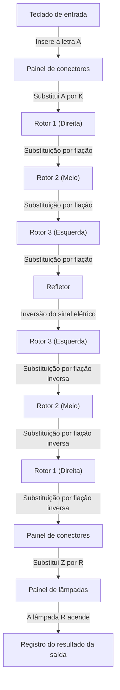
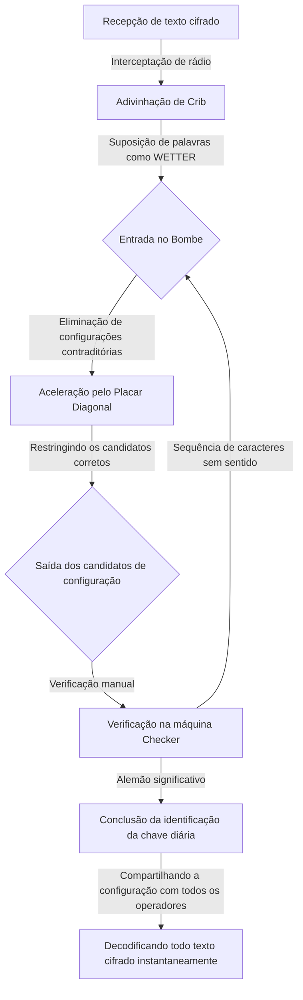

## 1. Introdução: A Era em que os Códigos Moviam a História

Na Segunda Guerra Mundial, a guerra mais brutal da história da humanidade, a vitória não foi determinada apenas pelo poder das armas e pelo número de soldados. O que influenciou muito a situação da guerra foi a arma invisível da "informação", e a feroz guerra de códigos que se desenrolou nos bastidores.

A máquina de criptografia "Enigma", na qual a Alemanha nazista tinha absoluta confiança. Acreditava-se que sua estrutura complexa e bizarra era indecifrável por qualquer humano ou máquina da época. No entanto, os gênios reunidos nas instalações ultrassecretas do Reino Unido, "Bletchley Park", aceitaram esse desafio aparentemente impossível. No centro de tudo isso estava o matemático genial Alan Turing, que mais tarde seria chamado de "o pai da ciência da computação".

Neste artigo, desvendaremos detalhadamente o drama épico escondido nos bastidores da história, desde o incrível mecanismo do Enigma, as contribuições dos predecessores na jornada da decodificação, a luta mortal em Bletchley Park liderada por Turing, até o trágico fim que se abateu sobre o gênio.

## 2. A Máquina Criptográfica Enigma: O Mecanismo da Criptografia Considerado Perfeito

O Enigma (Enigma), que leva a palavra grega para "mistério", é uma máquina de criptografia eletromecânica. Foi originalmente inventada pelo engenheiro alemão Arthur Scherbius no final da década de 1910 para uso comercial, mas os militares alemães, de olho em sua forte capacidade de criptografia, a adotaram para uso militar e continuaram a melhorá-la.

### Estrutura Básica do Enigma

A maior característica do Enigma é que ele realizou mecanicamente uma "cifra polialfabética" onde a regra de criptografia (circuito) muda cada vez que um caractere é inserido. Sua estrutura consistia principalmente nos seguintes elementos.

1. **Teclado**: Teclas de 26 letras do alfabeto como as de uma máquina de escrever.
2. **Painel de Conectores (Steckerbrett)**: Um painel de fiação para trocar pares de letras com cabos.
3. **Rotores (Discos Criptográficos)**: Discos rotativos com fiação interna complexa. Normalmente, 3 discos (posteriormente 4 pela Marinha) eram configurados.
4. **Refletor**: Um mecanismo que rebate o sinal elétrico e o envia de volta através dos rotores e do painel de conectores.
5. **Painel de Lâmpadas**: Um painel de exibição onde a letra criptografada (ou descriptografada) acende.

### Um Número Astronômico de Combinações

Quando a tecla da letra "A" é pressionada, o sinal elétrico é convertido em outra letra no painel de conectores, convertido ainda mais complexamente ao passar por três rotores, refletido pelo refletor, passa pelos rotores e pelo painel de conectores na ordem inversa, e acende uma lâmpada no painel de lâmpadas.

Esse processo por si só é complexo, mas o que tornava o Enigma verdadeiramente assustador era o mecanismo em que o rotor mais à direita girava um entalhe toda vez que uma tecla era pressionada. Quando o rotor mais à direita completava uma volta, o rotor do meio girava um entalhe, e quando o do meio completava uma volta, o rotor da esquerda girava. Em outras palavras, o "A" digitado como a primeira letra e o "A" digitado como a segunda letra são criptografados em letras completamente diferentes.

Combinando configurações como o padrão de conexão do painel de conectores, a ordem dos rotores (inicialmente selecionando 3 de 5 tipos) e a posição inicial dos rotores, o número total chegava a um número astronômico de aproximadamente 15.900.000.000.000.000.000 (15,9 quintilhões) de combinações. Como os militares alemães mudavam essa configuração (chave diária) todos os dias à meia-noite, era absolutamente impossível decifrar a configuração do dia usando força bruta no mesmo dia com a tecnologia da época.

## 3. O Amanhecer de Bletchley Park: A Contribuição da Polônia

Ao contar a história da quebra do Enigma, a conquista do Escritório de Cifras Polonês (Biuro Szyfrów) não deve absolutamente ser esquecida. No início da década de 1930, quando decifradores britânicos e franceses haviam desistido, dizendo que "O Enigma é indecifrável", a Polônia sentiu a ameaça alemã diretamente e estava usando matemáticos para enfrentar esse desafio.

### A Inspiração Genial de Marian Rejewski

O jovem matemático polonês Marian Rejewski conseguiu identificar a fiação interna do Enigma usando uma abordagem matemática pura (teoria dos grupos), ao contrário da criptoanálise tradicional que dependia de métodos linguísticos. Isso foi o resultado da brilhante conexão entre informações fragmentadas de livros de códigos alemães obtidos pela inteligência francesa e a genial visão matemática de Rejewski.

### O Nascimento da "Bomba (Bomba)"

Rejewski e sua equipe desenvolveram uma máquina chamada "Bomba" para descobrir as configurações diárias do Enigma (como posições iniciais). Isso automatizava a busca de força bruta conectando várias máquinas Enigma. Eles também desenvolveram ferramentas manuais de decodificação como as "Folhas de Zygalski", e a Polônia lia rotineiramente as cifras alemãs durante vários anos antes da guerra.

No entanto, a partir do final de 1938, as forças alemãs complicaram o método operacional do Enigma aumentando o número de tipos de rotores e conexões do painel de conectores. Com o esgotamento de fundos e recursos, a Polônia abandonou a continuação da decodificação por conta própria e, em julho de 1939, pouco antes do início da guerra, convidou representantes da Grã-Bretanha e da França aos arredores de Varsóvia, transferindo generosamente todos os resultados da decodificação do Enigma e máquinas Enigma replicadas. Sem essa "passagem de bastão", a subsequente decodificação pelos britânicos teria sido impossível.

## 4. Alan Turing e Bletchley Park

Herdando o precioso legado da Polônia, a Grã-Bretanha estabeleceu a base da Escola de Códigos e Cifras do Governo (GC&CS) na vasta mansão "Bletchley Park" em Buckinghamshire, a noroeste de Londres. Gênios e talentos de diversas áreas, como brilhantes matemáticos de Oxford e Cambridge, linguistas, campeões de xadrez e mestres em palavras cruzadas, foram reunidos lá.

### A Aparição de Alan Turing

Entre eles estava o jovem matemático Alan Turing, um fellow do King's College da Universidade de Cambridge. Em seu artigo de 1936 "Sobre Números Computáveis", ele propôs o conceito da "Máquina de Turing", uma máquina hipotética que poderia automatizar todos os cálculos, lançando as bases teóricas do computador moderno.

Em Bletchley Park, Turing tornou-se o chefe da "Cabana 8", responsável pelo Enigma da Marinha Alemã, que era considerado particularmente difícil de decifrar. O Enigma naval tinha regras operacionais mais rigorosas do que os do exército ou da força aérea, e decifrá-lo era considerado uma tarefa urgente para evitar a destruição do comércio no Atlântico pelos U-boats (submarinos).

## 5. A Conclusão da Máquina Decodificadora "Bombe (Bombe)"

Turing desenvolveu ainda mais o conceito da "Bomba" polonesa e começou a projetar o "Bombe", uma enorme máquina que explorava rapidamente as configurações do Enigma.

### O Uso de "Cribs"

A chave para a abordagem de decodificação de Turing foi uma técnica chamada "crib". Um crib era um "texto simples conhecido" assumido como estando contido na mensagem cifrada. Por exemplo, relatórios meteorológicos militares alemães sempre incluíam a palavra "WETTER" (clima) todas as manhãs, ou continham a frase "HEIL HITLER" no final da mensagem.

Devido à estrutura do Enigma, havia uma fraqueza fatal: "uma letra nunca pode ser criptografada como si mesma (se você inserir A, nunca será gerado como A)". Turing usou essa fraqueza para identificar posições onde não ocorriam contradições, sobrepondo a mensagem cifrada e o crib enquanto os deslocava.

### O "Placar Diagonal (Diagonal Board)" de Welchman

Embora o projeto inicial do Bombe de Turing fosse maravilhoso, havia o problema de que a força bruta levava muito tempo. Isso foi dramaticamente melhorado pelo "Placar Diagonal", inventado por seu colega Gordon Welchman.

Isso permitiu verificar e eliminar simultaneamente um enorme número de combinações para as configurações do painel de conectores, e a velocidade de cálculo do Bombe aumentou assustadoramente. Concluída através da colaboração de Turing e Welchman, essa máquina operava com um som estridente de tique-taque, reduzindo a identificação da chave diária, que costumava levar horas, para apenas dezenas de minutos.

## 6. A Luta Mortal com os U-boats e a Inteligência Ultra

Embora a decodificação dos códigos da Força Aérea e do Exército Alemão tenha entrado nos trilhos com a conclusão do Bombe, a decodificação da Marinha (especialmente dos U-boats) permaneceu difícil. No início de 1942, a Marinha Alemã introduziu um novo tipo (cifra Shark) adicionando um quarto rotor ao Enigma para U-boats, e Bletchley Park caiu em um "apagão (blackout)", incapaz de ler os códigos por vários meses.

### A Captura Milagrosa do U-110

O que quebrou essa situação desesperadora foi uma operação de vida ou morte pela Marinha Real. Quando navios contratorpedeiros aliados capturaram um U-boat, eles conseguiram recuperar o livro de códigos mais recente, a própria máquina Enigma e rotores do interior do submarino que estava prestes a afundar. O drama da captura do U-110 e do U-559, em particular, trouxe informações cruciais para quebrar o código.

Com essas informações e o método de decodificação acelerado de Turing (como o Banburismus), juntamente com a operação de novos Bombes produzidos em massa pelo poder financeiro militar dos EUA, as forças aliadas conseguiram compreender completamente a implantação de U-boats mais uma vez.

### A Vitória Trazida pela "Ultra"

A inteligência ultrassecreta decodificada em Bletchley Park foi chamada de "Ultra (Ultra)". A inteligência Ultra foi utilizada com extremo cuidado para não deixar as forças alemãs perceberem o fato de que ela estava sendo decodificada. Às vezes, ao afundar frotas inimigas com base em informações decodificadas, eles até usavam enganos contra o exército alemão, deliberadamente voando aviões de reconhecimento e dizendo "Encontrado através de reconhecimento".

Esta inteligência Ultra permitiu aos Aliados afastar a ameaça dos U-boats na Batalha do Atlântico, levando à vitória na campanha do Norte da África e ao sucesso da operação de engano em grande escala (Operação Fortitude) durante os Desembarques na Normandia (Dia D) em 1944. Os historiadores estimam que os decifradores de códigos de Bletchley Park encurtaram a guerra em pelo menos dois a quatro anos e salvaram dezenas de milhões de vidas.

## 7. A Tragédia do Pós-Guerra e o Legado de Turing

Após o fim da guerra, as conquistas de Bletchley Park foram seladas como o mais alto segredo. Milhares de funcionários foram obrigados a assinar documentos prometendo que "o que aconteceu neste lugar será levado para o túmulo", e não foi até a década de 1970, quando as informações começaram a ser divulgadas ao público, que suas ações heróicas se tornaram conhecidas pelo mundo.

### A Tragédia que Atingiu o Gênio

No pós-guerra, Alan Turing fez conquistas pioneiras em vários campos, incluindo o design dos primeiros computadores (ACE), os conceitos fundamentais da inteligência artificial (o Teste de Turing) e até pesquisas em biologia matemática sobre a morfogênese dos organismos.

No entanto, a sociedade britânica da época foi cruel com ele. Em 1952, Turing foi preso pelo crime de homossexualidade, que era ilegal sob a lei da época. Para evitar a prisão, a única opção que ele foi forçado a escolher foi a punição humilhante da "castração química (administração de hormônios femininos)".

Profundamente ferido tanto física quanto mentalmente, o gênio faleceu em sua cama em casa em 7 de junho de 1954. Aos 41 anos de idade. Havia uma maçã meio mordida ao lado dele, e a causa da morte foi determinada como suicídio por envenenamento por cianeto (há várias teorias, incluindo a de que ele imitou a Branca de Neve, e a teoria de um acidente).

### Recuperação da Honra e Conquistas Eternas

O tratamento injusto do gênio que salvou o mundo e lançou as bases da sociedade da informação moderna atrairia duras críticas em anos posteriores. Em 2009, depois de muitos anos, o então Primeiro Ministro Gordon Brown emitiu um pedido de desculpas oficial em nome do governo britânico. Em 2013, um perdão póstumo foi concedido pela Rainha Elizabeth, e a honra de Turing foi completamente restaurada. Hoje, seu retrato é desenhado na nota de £50, a nota de mais alto valor do Reino Unido.

## 8. Conclusão

A Batalha de Quebra de Código do Enigma não foi apenas a resolução de um quebra-cabeça. Foi uma guerra total de intelectos em que a sobrevivência das nações estava em jogo e uma prova histórica de que a matemática e a lógica superavam as armas físicas.

A grande conquista alcançada por Alan Turing e pelos heróis desconhecidos de Bletchley Park é o ponto de origem direto da internet e da sociedade dos computadores que desfrutamos hoje. Sua paixão e inteligência, que desvendaram códigos complexos e tornaram o impossível possível, continuam a brilhar mesmo ao longo do tempo.

Embora a tecnologia de criptografia agora tenha mudado seu papel de uma ferramenta de guerra para um escudo que protege nossa privacidade e comunicações, a beleza da lógica que flui em sua base certamente existe como uma extensão do potencial dos computadores com os quais Turing e seus colegas sonhavam.
