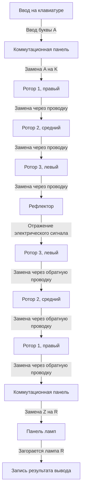
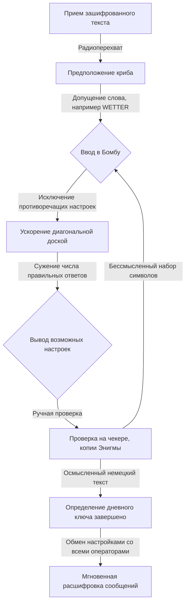

## 1. Введение: Эпоха, когда криптография двигала историю

В самой суровой войне в истории человечества, Второй мировой войне, победу определила не только мощь оружия или численность солдат. Ход войны во многом зависел от невидимого оружия, называемого «информацией», и от ожесточенной криптографической войны, развернувшейся за кулисами.

Шифровальная машина «Энигма», в которой нацистская Германия была абсолютно уверена. Ее сложная и загадочная структура считалась неразрешимой для любого человека или машины того времени. Однако гении, собранные в британском сверхсекретном комплексе Блетчли-парк, бросили вызов этой, казалось бы, невыполнимой задаче. В центре их стоял гениальный математик Алан Тьюринг, которого позже назвали «отцом информатики».

В этой статье подробно рассматривается грандиозная драма, скрытая за кулисами истории: от поразительного механизма Энигмы, вклада предшественников на пути к расшифровке, смертельной борьбы в Блетчли-парке с Тьюрингом во главе, до трагического конца, постигшего гения.

## 2. Шифровальная машина Энигма: Механизм шифрования, считавшийся идеальным

Энигма (Enigma) — это электромеханическая шифровальная машина, носящая имя, которое по-гречески означает «загадка». Первоначально изобретенная немецким инженером Артуром Шербиусом в конце 1910-х годов для коммерческого использования, она привлекла внимание немецких вооруженных сил благодаря своей высокой способности к шифрованию, была принята на вооружение в военных целях и неоднократно совершенствовалась.

### Базовая структура Энигмы

Главная особенность Энигмы заключается в механической реализации «полиалфавитного шифра», при котором правила шифрования (цепи) меняются при каждом вводе буквы. Ее структура в основном состояла из следующих элементов:

1. **Клавиатура**: 26 клавиш с буквами алфавита, как у печатной машинки.
2. **Коммутационная панель**: Панель проводов для замены пар букв с помощью кабелей.
3. **Роторы**: Вращающиеся диски со сложной внутренней проводкой. Обычно устанавливались 3 диска (позже флот использовал 4).
4. **Рефлектор**: Механизм, который отражает электрический сигнал и направляет его обратно через роторы и коммутационную панель.
5. **Панель ламп**: Панель индикаторов, на которой загорается зашифрованная (или расшифрованная) буква.

### Астрономическое количество комбинаций

Когда на клавиатуре нажимается буква «A», электрический сигнал преобразуется в другую букву на коммутационной панели, затем проходит через три ротора, где преобразуется еще более сложным образом, отражается рефлектором и снова проходит через роторы и коммутационную панель в обратном порядке, зажигая лампу на панели ламп.

Даже этот процесс сложен, но по-настоящему пугающим в Энигме было то, что самый правый ротор поворачивался на одно деление при каждом нажатии клавиши. Когда самый правый ротор совершает полный оборот, средний ротор поворачивается на одно деление, а когда средний совершает полный оборот, вращается левый ротор. Это означает, что буква «A», напечатанная как первый символ, и буква «A», напечатанная как второй символ, зашифровываются в совершенно разные буквы.

Сочетание схемы соединений на коммутационной панели, порядка роторов (изначально выбирались 3 из 5 типов) и начального положения роторов приводило к астрономическому числу возможных настроек — около 15 900 000 000 000 000 000 (15,9 квинтиллионов). Поскольку немецкие войска меняли эти настройки (дневной ключ) каждый день в полночь, перебрать все настройки за один день методом грубой силы было абсолютно невозможно при уровне технологий того времени.

## 3. Рассвет Блетчли-парка: Вклад Польши

Говоря об истории расшифровки Энигмы, абсолютно нельзя забывать о заслугах польского Бюро шифров. В начале 1930-х годов, когда британские и французские криптоаналитики сдались, считая Энигму неразрешимой, Польша, напрямую ощущавшая угрозу со стороны Германии, поручила эту сложную задачу математикам.

### Гениальное озарение Мариана Реевского

Молодой польский математик Мариан Реевский, в отличие от традиционного криптоанализа, опиравшегося на лингвистические методы, успешно использовал чисто математический подход (теорию групп) для определения внутренней проводки Энигмы. Это стало результатом блестящего объединения обрывочной информации из немецких шифровальных книг, полученных французской разведкой, и гениальной математической интуиции Реевского.

### Создание «Бомбы»

Для поиска ежедневных настроек (начальных позиций и т.д.) Энигмы Реевский и его команда разработали машину под названием «Бомба». Она автоматизировала поиск полным перебором, соединяя несколько машин Энигма вместе. Кроме того, были разработаны ручные инструменты дешифровки, такие как «листы Зыгальского», и за несколько лет до начала войны Польша регулярно читала немецкие шифровки.

Однако с конца 1938 года немецкая армия усложнила использование Энигмы, увеличив количество типов роторов и число соединений на коммутационной панели. Польша, исчерпав финансовые и материальные ресурсы, отказалась от продолжения расшифровки в одиночку. В июле 1939 года, прямо перед началом войны, они пригласили представителей Великобритании и Франции в пригород Варшавы и безвозмездно передали им все результаты расшифровки и копии машины Энигма. Без этой «передачи эстафеты» последующая британская драма расшифровки была бы невозможна.

## 4. Алан Тьюринг и Блетчли-парк

Великобритания, унаследовавшая бесценное наследие от Польши, создала штаб-квартиру Правительственной школы кодов и шифров в просторном поместье «Блетчли-парк» в Бакингемшире, к северо-западу от Лондона. Здесь были собраны выдающиеся математики из Оксфорда и Кембриджа, лингвисты, чемпионы по шахматам, мастера кроссвордов и другие гении и таланты из различных областей.

### Появление Алана Тьюринга

Среди них был Алан Тьюринг, молодой математик и научный сотрудник Королевского колледжа Кембриджского университета. В 1936 году он опубликовал статью «О вычислимых числах», в которой предложил концепцию «машины Тьюринга» — гипотетической машины, способной автоматизировать любые вычисления, тем самым заложив теоретические основы современных компьютеров.

В Блетчли-парке Тьюринг стал руководителем «Хижины 8», которая отвечала за расшифровку Энигмы немецкого военно-морского флота, считавшейся особенно сложной. Правила использования Энигмы на флоте были более строгими, чем в армии и авиации, и расшифровка была крайне необходима для предотвращения уничтожения торговых судов подводными лодками в Атлантике.

## 5. Завершение создания дешифровальной машины «Бомба»

Тьюринг развил концепцию польской машины и приступил к проектированию гигантской машины «Бомба» для высокоскоростного поиска настроек Энигмы.

### Использование «Криба»

Ключом к подходу Тьюринга к расшифровке стал метод, называемый «криб». Криб — это «известный открытый текст», который, как предполагается, содержится в зашифрованном сообщении. Например, метеорологические сводки немецкой армии каждое утро обязательно содержали слово «WETTER», а в конце сообщений часто встречалась стандартная фраза «HEIL HITLER».

Из-за конструктивных особенностей Энигмы у нее был фатальный недостаток: «буква никогда не может быть зашифрована сама в себя». Тьюринг использовал эту уязвимость, накладывая зашифрованный текст на криб со сдвигом, чтобы найти позицию, в которой не возникало противоречий.

### «Диагональная доска» Уэлчмана

Первоначальный дизайн Бомбы Тьюринга был великолепен, но проблема заключалась в том, что полный перебор занимал слишком много времени. Ситуацию кардинально улучшила «диагональная доска», изобретенная его коллегой Гордоном Уэлчманом.

Это позволило одновременно проверять и исключать огромное количество комбинаций настроек коммутационной панели, что привело к резкому увеличению скорости вычислений Бомбы. Машина, созданная совместными усилиями Тьюринга и Уэлчмана, работала с громким щелканьем и сократила время определения дневного ключа с нескольких часов до всего лишь нескольких десятков минут.

## 6. Смертельная битва с подлодками и информация Ультра

Хотя благодаря созданию Бомбы расшифровка сообщений немецких ВВС и сухопутных войск шла успешно, расшифровка сообщений военно-морского флота по-прежнему сталкивалась с трудностями. В начале 1942 года немецкий флот внедрил новую версию Энигмы с добавлением четвертого ротора для подлодок, и Блетчли-парк погрузился в «блэкаут», не имея возможности читать шифры в течение нескольких месяцев.

### Чудесный захват с U-110

Эту отчаянную ситуацию изменила рискованная операция британского военно-морского флота. Когда эсминцы союзников захватили подводную лодку, им удалось забрать новейшие шифровальные книги, саму Энигму и роторы с тонущего судна. В частности, захват U-110 и U-559 предоставил решающую информацию для расшифровки.

Благодаря этой информации, ускоренным методам расшифровки Тьюринга, а также работе новых моделей Бомб, произведенных в больших количествах на американские средства, союзники вновь смогли полностью отслеживать дислокацию подводных лодок.

### Победа, принесенная «Ультрой»

Сверхсекретная информация, расшифрованная в Блетчли-парке, получила название «Ультра». Информация Ультра использовалась с величайшей осторожностью, чтобы немецкая армия не поняла, что ее шифры разгаданы. Иногда, чтобы потопить вражеский конвой на основе расшифрованной информации, союзники намеренно отправляли разведывательные самолеты, создавая для немцев иллюзию, что корабли были «обнаружены в ходе разведки».

Благодаря информации Ультра союзники смогли отразить угрозу подводных лодок в битве за Атлантику, что привело к победе в Североафриканской кампании и успеху масштабной операции по дезинформации во время высадки в Нормандии в 1944 году. Историки подсчитали, что расшифровки Блетчли-парка сократили войну как минимум на 2–4 года и спасли десятки миллионов жизней.

## 7. Послевоенная трагедия и наследие Тьюринга

После окончания войны достижения Блетчли-парка были засекречены как высшая государственная тайна. Тысячи сотрудников были вынуждены подписать клятву, что «то, что произошло в этом месте, они унесут с собой в могилу», и их героические действия стали известны миру только после начала рассекречивания в 1970-х годах.

### Трагедия, постигшая гения

После войны Алан Тьюринг добился новаторских успехов в различных областях, таких как проектирование ранних компьютеров, фундаментальные концепции искусственного интеллекта и исследования в области математической биологии по морфогенезу.

Однако британское общество того времени было жестоко к нему. В 1952 году Тьюринг был арестован за гомосексуализм, который по тогдашним законам считался незаконным. Чтобы избежать тюремного заключения, он был вынужден выбрать унизительное наказание в виде химической кастрации.

Глубоко раненный физически и морально, гений скончался 7 июня 1954 года в своей постели дома. Ему был 41 год. Рядом лежало надкусанное яблоко, а причиной смерти было признано самоубийство от отравления цианистым калием.

### Восстановление чести и вечные заслуги

Несправедливое обращение с гением, который спас мир и заложил основы современного информационного общества, позже подверглось резкой критике. Спустя много лет, в 2009 году, тогдашний премьер-министр Гордон Браун принес официальные извинения от имени британского правительства. В 2013 году королева Елизавета II даровала ему посмертное помилование, и честь Тьюринга была полностью восстановлена. Сегодня его портрет изображен на банкноте в 50 фунтов стерлингов, самой крупной банкноте Великобритании.

## 8. Заключение

Битва за расшифровку Энигмы была не просто решением головоломок. Это была тотальная интеллектуальная война, на карту в которой было поставлено выживание наций, и историческое доказательство того, что математика и логика могут превзойти физическое оружие.

Великие достижения Алана Тьюринга и безымянных героев Блетчли-парка являются непосредственным источником интернета и компьютерного общества, которыми мы наслаждаемся сегодня. Их страсть и интеллект, которые распутали сложные шифры и сделали невозможное возможным, продолжают сиять сквозь время.

Хотя сегодня криптография превратилась из орудия войны в щит, защищающий нашу конфиденциальность и коммуникации, лежащая в ее основе красота логики несомненно существует как продолжение возможностей компьютеров, о которых мечтали Тьюринг и его коллеги.
