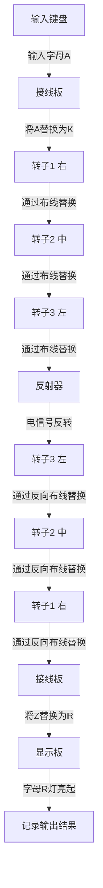
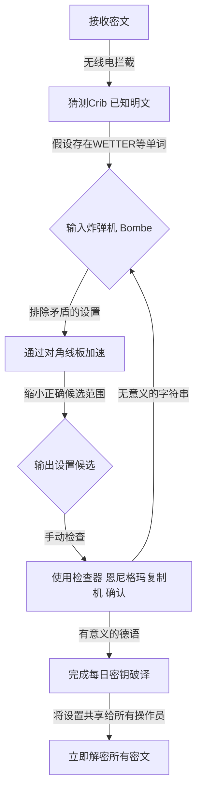

## 1. 引言：密码推动历史的时代

在第二次世界大战这场人类历史上最残酷的战争中，决定胜利的不仅是武器的威力或士兵的数量。很大程度上左右战局的是“信息”这种无形的武器，以及在其背后展开的激烈密码战。

纳粹德国对其拥有绝对自信的密码机“恩尼格玛”。其复杂离奇的结构，被认为当时任何人类或机器都无法破译。然而，聚集在英国绝密设施“布莱切利园”的天才们，向这个看似不可能的难题发起了挑战。处于其核心地位的，是后来被称为“[计算机科学之父](/zh-cn/p/biography-donald-knuth/)”的天才数学家艾伦·图灵。

在本文中，我们将详细解开隐藏在历史背后的宏大剧情，包括恩尼格玛惊人的机制、前人们在破译之路上的贡献、以图灵为中心的布莱切利园的死战，以及天才最终走向的悲惨结局。

## 2. 恩尼格玛密码机：被视为完美的密码机制

恩尼格玛（Enigma）是一台冠以希腊语“谜”之名的机电式密码机。它原本是在1910年代后期由德国工程师亚瑟·谢尔比乌斯（Arthur Scherbius）为商业用途而发明的，但德国军队看中了其强大的加密能力并将其用于军事，且不断进行改进。

### 恩尼格玛的基本结构

恩尼格玛的最大特点在于机械化地实现了“多表密码”，即每次输入字母时，加密规则（电路）都会发生变化。其结构主要由以下要素组成：

1. **键盘**：像打字机一样拥有26个英文字母的按键。
2. **接线板（Steckerbrett）**：用于通过电缆交换字母对的配线盘。
3. **转子（密码圆盘）**：内部布有复杂线路的旋转盘。通常设置3个（后来海军使用4个）。
4. **反射器（反转转子）**：将电信号折返，并使其再次通过转子和接线板返回的机构。
5. **显示板**：显示加密（或解密）后字母灯亮的显示盘。

### 天文数字般的组合数

在键盘上按下字母“A”时，电信号在接线板上被转换为另一个字母，在穿过3个转子的过程中发生更复杂的转换，然后通过反射器折返，逆向穿过转子和接线板，最后使显示板上的字母灯亮起。

仅这个过程就已经很复杂了，但恩尼格玛真正可怕的地方在于，它具有每次按下按键时，最右侧的转子就会旋转1格的机制。最右侧的转子旋转一圈，中间的转子就旋转1格，中间的旋转一圈，左侧的转子就会旋转。也就是说，打第一个字时的“A”和打第二个字时的“A”，会被加密成完全不同的字母。

将接线板的连接模式、转子的顺序（最初从5种中选3个）、转子的初始位置等设置组合起来，其总数达到了约15,900,000,000,000,000,000（1590京）种，这是一个天文数字。由于德军每天午夜零点都会更改这些设置（每日密钥），以当时的技术水平，要在一天内通过暴力破解穷举当天的设置是绝对不可能的。

## 3. 布莱切利园的黎明：波兰的贡献

在谈论破译恩尼格玛的历史时，绝不能忘记波兰密码局（Biuro Szyfrów）的功绩。在20世纪30年代初，当英国和法国的密码破译者们认为“恩尼格玛无法破译”而放弃时，波兰却直接感受到了德国的威胁，并利用数学家向这一难题发起了挑战。

### 马里安·雷耶夫斯基的天才灵光

与以往依赖语言学方法的密码破译不同，波兰的年轻数学家马里安·雷耶夫斯基（Marian Rejewski）成功地使用了纯数学方法（群论）来确定恩尼格玛的内部布线。这是法国情报部门获取的德国密码本片段信息，与雷耶夫斯基天才的数学洞察力完美结合的结果。

### “炸弹机（Bomba）”的诞生

雷耶夫斯基等人开发了一种名为“炸弹机”的机器，以找出恩尼格玛的每日设置（如初始位置）。这是一种将多台恩尼格玛机连接起来，自动进行暴力搜索的机器。此外，他们还开发了“吉加尔斯基纸片（Zygalski sheets）”等手动破译工具。在开战前的几年里，波兰每天都在阅读德国的密码。

然而，从1938年底开始，德军增加了转子的种类，增加了接线板的连接数，使恩尼格玛的操作方法变得更加复杂。由于资金和资源枯竭，波兰放弃了单独继续破译的尝试。1939年7月，在开战前夕的华沙郊外，波兰邀请了英国和法国的代表，毫不吝啬地移交了所有破译恩尼格玛的成果以及复制的恩尼格玛机。如果没有这次“接力”，此后英国的破译奇迹就不会发生。

## 4. 艾伦·图灵与布莱切利园

继承了波兰宝贵遗产的英国，在伦敦西北部白金汉郡的一座巨大庄园“布莱切利园”里，建立了政府密码学校（GC&CS）的基地。在这里，汇集了来自牛津和剑桥的优秀数学家、语言学家、国际象棋冠军、填字游戏高手等各个领域的天才和精英。

### 艾伦·图灵的登场

其中就有曾在剑桥大学国王学院担任研究员的年轻数学家艾伦·图灵。在1936年发表的论文《论可计算数》中，他提出了能够自动执行任何计算的假想机器“图灵机”的概念，奠定了现代计算机的理论基础。

在布莱切利园，图灵成为了负责德国海军恩尼格玛密码的“8号棚屋（Hut 8）”的负责人，这也是当时被认为最难破译的密码。海军恩尼格玛的操作规则比陆军和空军更严格，为了阻止U型潜艇（潜水艇）在大西洋进行的破交战，破译工作迫在眉睫。

## 5. 破译机“炸弹机（Bombe）”的完成

图灵进一步发展了波兰“炸弹机”的概念，开始设计一种被称为“Bombe（炸弹机）”的巨型机器，以高速搜索恩尼格玛的设置。

### 利用“Crib（已知明文）”

图灵破译方法的关键在于一种被称为“Crib”的技术。Crib是指推测包含在密文中的“已知明文”。例如，德军的气象预报每天早上必定包含“WETTER（天气）”这个词，或者在通信的最后包含“HEIL HITLER”这样的套话。

恩尼格玛的结构存在一个致命弱点，即“一个字母绝对不会被加密成它自己（输入A绝不会输出A）”。图灵利用这一弱点，将密文和Crib错开重叠，从而确定了不会产生矛盾的位置。

### 韦尔奇曼的“对角线板”

图灵最初的炸弹机设计非常出色，但也面临着暴力搜索花费时间太长的挑战。极大改善这一点的是他的同事戈登·韦尔奇曼（Gordon Welchman）发明的“对角线板（Diagonal Board）”。

这使得能够同时验证和排除关于接线板设置的庞大组合，炸弹机的计算速度得到了飞跃性的提升。由图灵和韦尔奇曼合作完成的这台机器，在发出刺耳的滴答声中运转，将原本需要几个小时才能完成的每日密钥确定时间缩短到了仅仅几十分钟。

## 6. 与U型潜艇的死战和超级机密

虽然炸弹机的完成使德国空军和陆军的密码破译步入正轨，但海军（特别是U型潜艇）的密码破译依然困难重重。1942年初，德国海军为U型潜艇引入了增加了第4个转子的新型恩尼格玛机（鲨鱼密码），导致布莱切利园陷入了长达数个月无法读取密码的“盲区（Blackout）”。

### 从U-110潜艇上的奇迹夺取

打破这种绝望局面的是英国海军的一场决死行动。盟军驱逐舰在俘获U型潜艇时，成功从即将沉没的舰艇中回收了最新的密码本、恩尼格玛主机和转子。特别是捕获U-110和U-559的行动，为密码破译带来了决定性的信息。

利用这些信息，加上图灵提出的加速破译方法（Banburismus等），以及在美国军队财力支持下大量生产并投入运行的新型炸弹机，盟军再次得以完全掌握U型潜艇的部署。

### “超级机密”带来的胜利

在布莱切利园破译的最高机密信息被称为“超级机密（Ultra）”。为了不让德军察觉密码已被破译的事实，超级机密信息的使用极其谨慎。有时，在根据破译信息击沉敌方船队时，甚至会故意派出侦察机，伪装成“通过侦察发现的”，以欺骗德军。

借助这些超级机密信息，盟军击退了大西洋战役中U型潜艇的威胁，带来了北非战场的胜利，并促成了1944年诺曼底登陆（D日）中大规模欺骗行动（坚忍行动）的成功。历史学家们估计，布莱切利园的密码破译使战争至少缩短了2到4年，拯救了数千万人的生命。

## 7. 战后的悲剧与图灵的遗产

战争结束后，布莱切利园的功绩作为最高机密被封存。数千名工作人员被迫签署了“将在这里发生的事情带入坟墓”的保密协议。他们的英雄事迹直到20世纪70年代信息公开后才为世人所知。

### 降临在天才身上的悲剧

战后，艾伦·图灵在早期计算机（ACE）的设计、人工智能的基础概念（图灵测试），甚至关于生物形态发生的数理生物学研究等众多领域，取得了开创性的成就。

然而，当时的英国社会对他却十分冷酷。1952年，图灵因同性恋罪名被捕，这在当时的法律中是非法的。为了避免入狱，他被迫选择了屈辱的“化学阉割（注射女性荷尔蒙）”刑罚。

这位身心受到重创的天才，于1954年6月7日在家中床上离世，享年41岁。他的身旁掉落着一个咬过一口的苹果，死因被判定为氰化钾中毒自杀（※也有模仿白雪公主或意外等多种说法）。

### 恢复名誉与永恒的功绩

拯救了世界、奠定了现代信息社会基础的天才所受到的不公正待遇，在后年受到了强烈的批评。漫长的岁月过去后，2009年，时任首相戈登·布朗代表英国政府正式道歉。2013年，伊丽莎白女王颁布了死后赦免令，图灵的名誉得到了完全恢复。如今，他的肖像被印在英国面额最大的50英镑纸币上。

## 8. 总结

恩尼格玛密码破译战，绝不仅仅是单纯的解谜。这是一场关系到国家存亡的智慧与智慧的全面战争，也是数学和逻辑超越物理武器的历史性证明。

艾伦·图灵和布莱切利园那些无名英雄们所取得的伟大成就，正是我们今天所享受的互联网和计算机社会的直接起源。他们破解复杂密码、化不可能为可能的激情与智慧，跨越时空，至今依然闪耀着光芒。

虽然现在的密码技术已经从战争工具转变为保护我们隐私和通信的盾牌，但流淌在其底层的逻辑之美，却实实在在地存在于图灵他们所梦想的计算机可能性的延长线上。
