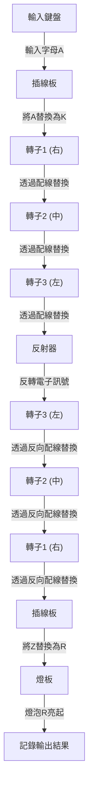
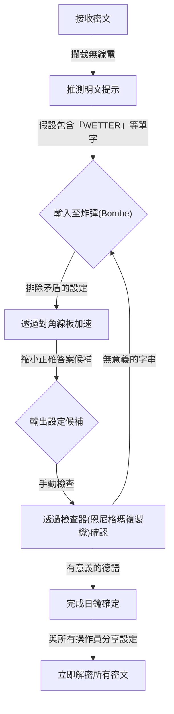

## 1. 前言：密碼推動歷史的時代

在第二次世界大戰這場人類史上最殘酷的戰爭中，決定勝利的不僅僅是武器的威力或士兵的數量。「資訊」這項看不見的武器左右了戰局，而在其背後展開的更是激烈的密碼戰。

納粹德國對密碼機「恩尼格瑪（Enigma）」抱有絕對的自信。它那複雜離奇的結構，被當時的人們認為是任何人類或機器都無法破解的。然而，聚集在英國極機密設施「布萊切利莊園（Bletchley Park）」的天才們，挑戰了這個被認為是不可能的難題。而位於其核心的，正是後來被稱為「電腦科學之父」的天才數學家，艾倫·圖靈（Alan Turing）。

在本文中，我們將詳細解開隱藏在歷史背後的壯闊劇情，從恩尼格瑪驚人的機制、前人在破解之路上的貢獻、以圖靈為中心的布萊切利莊園殊死戰，到天才所走向的悲劇結局。

## 2. 恩尼格瑪密碼機：被認為是完美的密碼機制

恩尼格瑪（Enigma）是一台冠以希臘語中「謎」之意的機電密碼機。最初是在1910年代後半，由德國工程師亞瑟·謝爾比烏斯（Arthur Scherbius）為商業用途所發明，但德國軍方看中了其強大的加密能力，將其用於軍事並不斷改良。

### 恩尼格瑪的基本結構

恩尼格瑪最大的特徵在於，它以機械方式實現了每次輸入字母時，加密規則（電路）都會改變的「多表密碼」。其結構主要由以下要素組成。

1. **鍵盤**：類似打字機的26個英文字母鍵。
2. **插線板（Steckerbrett）**：用電纜交換字母配對的配線盤。
3. **轉子（密碼圓盤）**：內部設有複雜配線的旋轉盤。通常設置3個（後來海軍為4個）。
4. **反射器（反轉轉子）**：將電子訊號折返，並使其再次穿過轉子與插線板返回的機構。
5. **燈板**：亮起加密（或解密）後字母的顯示盤。

### 天文數字般的組合數

當在鍵盤上按下字母「A」時，電子訊號會在插線板轉換為另一個字母，在通過3個轉子時發生更複雜的轉換，接著在反射器折返，以相反順序再次通過轉子與插線板，並點亮燈板上的燈泡。

光是這個過程就已經很複雜，但恩尼格瑪真正可怕的地方在於，它具有每次按下按鍵時，最右邊的轉子就會旋轉一格的機制。最右邊的轉子旋轉一圈時，中間的轉子會旋轉一格，而中間旋轉一圈時，左邊的轉子就會旋轉。也就是說，輸入第一個字母時的「A」與輸入第二個字母時的「A」，會被加密為完全不同的字母。

將插線板的連接模式、轉子的順序（最初是從5種中選擇3種）、轉子的初始位置等設定組合起來，其總數達到了約15,900,000,000,000,000,000（1590京）種的天文數字。由於德軍每天凌晨0點會更改這項設定（日鑰），要在一天內透過暴力破解來解密當天的設定，在當時的技術下是絕對不可能的。

## 3. 布萊切利莊園的黎明：波蘭的貢獻

在講述恩尼格瑪破解的歷史時，絕對不能忘記波蘭密碼局（Biuro Szyfrów）的功績。在1930年代初期，當英國和法國的密碼破解者們放棄並認為「恩尼格瑪無法破解」時，波蘭直接感受到了德國的威脅，並動用數學家來挑戰這個難題。

### 馬里安·雷耶夫斯基的天才靈光

波蘭的年輕數學家馬里安·雷耶夫斯基（Marian Rejewski），與依賴語言學方法的傳統密碼破解不同，成功運用純數學的方法（群論）確定了恩尼格瑪的內部配線。這是法國情報部門取得的德國密碼書片段資訊，與雷耶夫斯基天才般的數學洞察力完美結合的結果。

### 「炸彈（Bomba）」的誕生

雷耶夫斯基等人為了找出恩尼格瑪的每日設定（初始位置等），開發了一台稱為「炸彈（Bomba）」的機器。這是一台連接多台恩尼格瑪機，以自動化暴力破解的機器。此外，他們還開發了「吉加爾斯基穿孔片（Zygalski sheets）」等手動解密工具，使得波蘭在開戰前的幾年間，能夠日常性地讀取德國的密碼。

然而，從1938年底開始，德軍增加了轉子的種類並增加了插線板的連接數量，使得恩尼格瑪的運用方法變得更加複雜。資金和資源枯竭的波蘭放棄了單獨繼續破解，並在1939年7月，於開戰前的華沙郊外邀請了英國和法國的代表，毫無保留地將恩尼格瑪破解的全部成果和複製的恩尼格瑪機轉讓給了他們。如果沒有這次的「交接」，就不會有後來英國的密碼破解劇了。

## 4. 艾倫·圖靈與布萊切利莊園

繼承了波蘭寶貴遺產的英國，在位於倫敦西北部白金漢郡的一座廣闊莊園「布萊切利莊園」中設立了政府密碼學校（GC&CS）的基地。這裡聚集了來自牛津和劍橋的優秀數學家、語言學家、西洋棋冠軍、填字遊戲達人等各個領域的天才與菁英。

### 艾倫·圖靈的登場

其中，有一位在劍橋大學國王學院擔任研究員的年輕數學家，艾倫·圖靈。他在1936年發表的論文《論可計算數》中，提出了能夠將所有計算自動化的假想機器「圖靈機」的概念，是奠定現代電腦理論基礎的人物。

圖靈在布萊切利莊園擔任了「第8小屋（Hut 8）」的負責人，專門負責破解被認為特別困難的德國海軍恩尼格瑪。海軍的恩尼格瑪比陸軍或空軍的運用規則更為嚴格，為阻止U型潛艇在大西洋的破交戰，破解密碼成為了當務之急。

## 5. 解密機器「炸彈（Bombe）」的完成

圖靈進一步發展了波蘭「炸彈（Bomba）」的概念，開始設計一台名為「炸彈（Bombe）」的巨型機器，用於高速搜尋恩尼格瑪的設定。

### 「明文提示（Crib）」的利用

圖靈破解方法的關鍵在於一種被稱為「明文提示（Crib）」的手法。明文提示是指推測包含在密文中的「已知明文」。例如，德軍的氣象通報每天早上必定包含「WETTER（天氣）」這個詞，或是在通訊的最後包含「HEIL HITLER」等慣用語。

在恩尼格瑪的結構上，存在著一個致命的弱點：「某個字母絕對不會被加密為它自己（輸入A絕對不會輸出為A）」。圖靈利用這個弱點，將密文與明文提示交錯重疊，從而找出了不產生矛盾的位置。

### 韋爾奇曼的「對角線板」

圖靈早期的炸彈設計非常出色，但存在著暴力破解耗時過長的問題。大幅改善這一點的，是同事戈登·韋爾奇曼（Gordon Welchman）發明的「對角線板（Diagonal Board）」。

這使得能夠同時驗證並排除與插線板設定相關的龐大組合數，讓炸彈的計算速度獲得了飛躍性的提升。由圖靈和韋爾奇曼合作完成的這台機器，在發出巨大喀喀聲的運轉下，將原本需要數小時才能確定的日鑰，縮短到了僅僅幾十分鐘。

## 6. 與U型潛艇的殊死戰和超級機密情報

隨著炸彈的完成，德國空軍和陸軍的密碼破解步上了軌道，但海軍（特別是U型潛艇）的密碼破解依然困難重重。1942年初，德國海軍引進了一種在U型潛艇用恩尼格瑪上追加了第4個轉子的新型號（鯊魚密碼），導致布萊切利莊園陷入了長達數個月無法讀取密碼的「停電（Blackout）」。

### 從U-110奇蹟般的奪取

打破這種絕望狀況的，是英國海軍一場視死如歸的行動。當盟軍驅逐艦俘虜U型潛艇時，成功從即將沉沒的艦艇內部回收了最新的密碼書、恩尼格瑪本體以及轉子。尤其是U-110和U-559的捕獲劇，為密碼破解帶來了決定性的資訊。

這些資訊加上圖靈發明的高速化破解手法（Banburismus等），以及在美軍資金協助下大量生產的新型炸彈開始運作，使得盟軍得以再次完全掌握U型潛艇的部署。

### 「超級機密」帶來的勝利

在布萊切利莊園破解的最高機密情報被稱為「超級機密（Ultra）」。為避免德軍察覺密碼已被破解，超級機密情報在運用時非常謹慎。有時候，在根據破解情報擊沉敵方船團時，甚至會刻意派出偵察機，向德軍偽裝成是「透過偵察發現的」。

這些超級機密情報讓盟軍成功擊退了大西洋戰役中U型潛艇的威脅，並促成了北非戰線的勝利，以及1944年諾曼第登陸作戰（D-Day）中大規模欺敵作戰（堅忍行動）的成功。歷史學家估計，布萊切利莊園的密碼破解至少讓戰爭縮短了2到4年，並拯救了數千萬人的生命。

## 7. 戰後的悲劇與圖靈的遺產

戰爭結束後，布萊切利莊園的功績作為最高機密被封印了起來。數千名工作人員被迫簽署了一份誓約書，保證「將在這個地方發生的事情帶進墳墓」，直到1970年代資訊解密後，他們的英雄事蹟才為世人所知。

### 襲擊天才的悲劇

戰後，艾倫·圖靈在早期電腦（ACE）的設計、人工智慧的基礎概念（圖靈測試），甚至是有關生物形態發生的數理生物學研究等廣泛領域，都取得了先驅性的成就。

然而，當時的英國社會對他卻十分冷酷。1952年，圖靈因當時被視為違法的同性愛罪名遭到逮捕。為了避免入獄，他不得不選擇屈辱的「化學閹割（注射女性荷爾蒙）」之刑。

身心都受到深深創傷的天才，於1954年6月7日，在自家床上嚥下了最後一口氣。享年41歲。身旁掉落著一顆咬過一口的蘋果，死因被判定為氰化鉀中毒自殺（※也有模仿白雪公主或意外等各種說法）。

### 名譽恢復與永恆的功績

拯救了世界、奠定現代資訊社會基礎的天才所遭遇的不當對待，在日後引發了巨大的批判。經過漫長的歲月，2009年，當時的首相戈登·布朗代表英國政府正式道歉。2013年，伊莉莎白女王頒布了死後特赦，圖靈的名譽終於完全恢復。現在，他的肖像被印在英國最高面額的50英鎊紙鈔上。

## 8. 總結

恩尼格瑪密碼破解戰，不僅僅是單純的解謎。這是一場賭上國家存亡的智慧與智慧的總體戰，也是數學與邏輯凌駕於實體武器之上的歷史性證明。

艾倫·圖靈和布萊切利莊園無名英雄們所完成的偉業，正是我們現代所享受的網際網路與電腦社會的直接起源。他們解開複雜密碼、將不可能化為可能的熱情與智慧，超越了時空，至今依然閃耀著光芒。

雖然密碼技術如今已從戰爭的工具轉變為保護我們隱私與通訊的盾牌，但流淌在其根底的邏輯之美，確實存在於圖靈他們所夢想的電腦可能性的延長線上。
