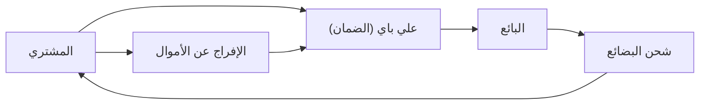

## 1. تأسيس علي بابا
في عام 1999، أسس جاك ما الشركة مع 18 من زملائه في شقة. بدأت كموقع للتوفيق بين الشركات (B2B).

## 2. نجاح تاوباو (Taobao)
أطلق منصة تاوباو (Taobao) من المستهلك إلى المستهلك (C2C)، وحقق نجاحاً هائلاً أجبر شركة إيباي (eBay) على الانسحاب من السوق الصينية.

## 3. خلق الائتمان من خلال علي باي (Alipay)
في ظل عدم انتشار بطاقات الائتمان في الصين، تم بناء خدمة الدفع بالضمان "علي باي" (Alipay). أصبح هذا أساس المجتمع غير النقدي في الصين.

## 4. السحابة ويوم العزاب
من خلال بناء البنية التحتية بواسطة سحابة علي بابا (Alibaba Cloud) وحدث التخفيضات الضخم "يوم العزاب (11 نوفمبر)"، لا تزال الشركة تقود الاقتصاد الرقمي الصيني حتى اليوم.

## جزء التحقق التقني الإضافي 1

## جزء التحقق التقني الإضافي 2

## جزء التحقق التقني الإضافي 3

## جزء التحقق التقني الإضافي 4

## جزء التحقق التقني الإضافي 5

## جزء التحقق التقني الإضافي 6

## جزء التحقق التقني الإضافي 7

## جزء التحقق التقني الإضافي 8

## جزء التحقق التقني الإضافي 9

## جزء التحقق التقني الإضافي 10

## جزء التحقق التقني الإضافي 11

## جزء التحقق التقني الإضافي 12

## جزء التحقق التقني الإضافي 13

## جزء التحقق التقني الإضافي 14

