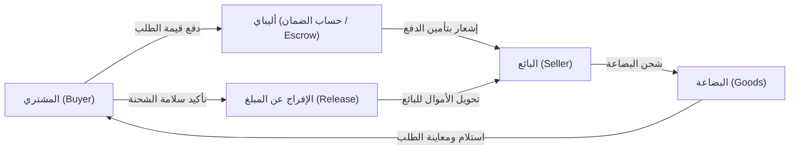

عند دراسة الاقتصاد الرقمي العالمي المعاصر، يستحيل تجاهل البصمة الهائلة التي تركتها مجموعة علي بابا (Alibaba Group). فاليوم، يطلب مئات الملايين من المستهلكين مختلف السلع بلمسة زر عبر هواتفهم الذكية وتكتمل معاملاتهم المالية في أجزاء من الثانية. ولكن في الصين، كانت علي بابا هي التي شيدت هذه البنية التحتية الأساسية من نقطة الصفر. كيف تمكن جاك ما (ما يون)، معلم اللغة الإنجليزية السابق، من إعادة صياغة تجارة التجزئة والأنظمة المالية في بلاده ليبني أحد أضخم الأنظمة البيئية الرقمية على كوكب الأرض؟ تستعرض هذه المقالة التاريخ الملحمي لشركة علي بابا والقرارات الاستراتيجية التي اتخذتها في مختلف المنعطفات الحاسمة.

## 1. نقطة البداية: التأسيس في شقة بمدينة هانغتشو (1999)

بدأت مسيرة علي بابا في عام 1999 داخل شقة متواضعة يملكها جاك ما في مدينة هانغتشو بمقاطعة تشجيانغ. وكان ما قد أطلق سابقاً مشروع "China Pages" كدليل تجاري إلكتروني، غير أن معدل انتشار الإنترنت في الصين آنذاك كان ضئيلاً للغاية، مما تسبب في تعثر العديد من المبادرات المبكرة.

ومع ذلك، كان جاك ما يؤمن إيماناً راسخاً بقدرة الإنترنت على ربط الأسواق العالمية ببعضها. وفي عام 1999، جمع 18 من أصدقائه وزملائه (المعروفين تاريخياً باسم "المؤسسين الثمانية عشر") في شقته وطرح عليهم رؤية طموحة: إنشاء منصة رقمية تربط المصانع والورش الصينية الصغيرة والمتوسطة بالمشترين والتجار حول العالم. فبينما كانت الصين تتحول بخطى متسارعة إلى "مصنع العالم"، كانت ملايين المصانع الصغيرة تفتقر إلى أي قنوات اتصال مباشرة بالأسواق الخارجية.

وهكذا وُلد موقع "Alibaba.com" كمنصة تجارة إلكترونية بين الشركات (B2B). ومن خلال تمكين الشركات الأجنبية من شراء السلع بالجملة مباشرة من الموردين الصينيين، شهدت علي بابا نمواً متسارعاً. وجاء الدعم المالي المبكر من بنك جولدمان ساكس ومجموعة سوفت بنك (بقيادة ماسايوشي سون) ليوفر الوقود الاستثماري الحاسم للشركة. وكان استثمار سوفت بنك البالغ 20 مليون دولار في عام 2000 من أنجح الصفقات الاستثمارية الجريئة وأكثرها ربحية في تاريخ الاقتصاد الحديث.

## 2. ولادة تاوباو (Taobao) والمعركة الملحمية ضد إيباي (2003)

بعد أن رسخت علي بابا أقدامها في قطاع التجارة بين الشركات، واجهت في عام 2003 تحدياً وجودياً هائلاً. فقد استحوذت شركة إيباي (eBay) الأمريكية، التي كانت تتربع على عرش المزادات الإلكترونية عالمياً، على موقع EachNet الصيني وضخت رؤوس أموال ضخمة لاقتحام سوق التجارة بين المستهلكين (C2C) في الصين.

أدرك جاك ما بذكائه الاستراتيجي أن إيباي إذا سيطرت على تجارة التجزئة الاستهلاكية، فستتمدد عاجلاً أم آجلاً لتهديد منصة علي بابا الأساسية. وفي سرية بالغة، شكّلت علي بابا فريقاً متخصصاً في شقة ما القديمة لتطوير منصة C2C خاصة بها: "تاوباو (Taobao)" (والتي تعني باللغة الصينية "البحث عن الكنوز").

وفي مواجهة إيباي، انتهجت تاوباو استراتيجية مدمرة وغير مسبوقة: إلغاء رسوم التسجيل وعمولات المعاملات بالكامل لمدة ثلاث سنوات على الأقل. وفي الوقت الذي كانت فيه إيباي تقتطع رسوماً عن كل عملية بيع، منحت تاوباو صغار التجار إمكانية العمل مجاناً دون أي أعباء. وعلاوة على ذلك، صممت تاوباو واجهتها لتلائم الذوق الصيني وأطلقت تطبيق المراسلة الفورية "علي وانغ وانغ (Aliwangwang)"، مما أتاح للبائعين والمشترين التحدث والتفاوض والمساومة وبناء علاقات ثقة شخصية بشكل فوري.

في المقابل، حاولت إيباي إجبار المستخدمين الصينيين على استخدام منصتها العالمية الموحدة، مما أدى إلى بطء فادح وفشل ذريع في التكيف مع الثقافة المحلية. وبفضل مجانية الخدمات والتركيز على الخصوصية الصينية، استطاعت تاوباو سحب البساط بالكامل من تحت أقدام إيباي. وبحلول عام 2006، اضطرت إيباي للانسحاب الفعلي من السوق الصينية، لتصبح تاوباو المتوجة بلا منازع على عرش التجارة الإلكترونية الاستهلاكية في الصين.

## 3. ابتكار أليباي (Alipay): الضمان المالي الذي بنى جدار الثقة (2004)

مع النمو الهائل الذي حققته تاوباو، اصطدمت علي بابا بعقبة اجتماعية وتجارية متجذرة في الصين آنذاك: أزمة انعدام الثقة المتبادلة.

في مطلع الألفية، كانت بطاقات الائتمان شبه معدومة في الصين. وكان المشترون يخشون الدفع المسبق خوفاً من عدم استلام البضائع، بينما كان البائعون يرفضون الشحن قبل استلام أموالهم. وكانت الحوالات البريدية أو الدفع عند الاستلام حلولاً بدائية وبطيئة تعجز عن مواكبة تجارة إلكترونية ضخمة.

ولحل هذا المأزق، أطلقت علي بابا في عام 2004 خدمة "أليباي (Alipay / 支付寶)". ابتكرت أليباي نظام حساب الضمان المستقل (Escrow):

```mermaid
flowchart LR
    Buyer["المشتري (Buyer)"] -->|دفع قيمة الطلب| Alipay["أليباي (حساب الضمان / Escrow)"]
    Alipay -->|إشعار بتأمين الدفع| Seller["البائع (Seller)"]
    Seller -->|شحن البضاعة| Goods["البضاعة (Goods)"]
    Goods -->|استلام ومعاينة الطلب| Buyer
    Buyer -->|تأكيد سلامة الشحنة| Release["الإفراج عن المبلغ (Release)"]
    Release -->|تحويل الأموال للبائع| Seller
```

بموجب هذا النظام، تحتفظ أليباي بأموال المشتري في حساب ضمان مؤقت، ولا يتم تحويل المبلغ إلى البائع إلا بعد أن يستلم المشتري الشحنة ويتأكد من جودتها ومطابقتها. قضت هذه الآلية تماماً على مخاوف الاحتيال ومكّنت غرباء تماماً من إبرام صفقاتهم عبر الإنترنت بكل طمأنينة.

توسعت أليباي لاحقاً لتتجاوز تاوباو، وتصبح مظلة لدفع الفواتير الخدمية، والمدفوعات عبر رموز الاستجابة السريعة (QR Code) في المتاجر، وإدارة الصناديق المالية (Yu'e Bao)، وتقييم الجدارة الائتمانية (Zhima Credit). هذه المنظومة المالية، التي استقلت لاحقاً تحت اسم "مجموعة آنت (Ant Group)"، كانت القاطرة الأساسية التي جعلت من الصين المجتمع الأكثر تقدماً في العالم في التخلي عن المعاملات النقدية الورقية.

## 4. تدشين تي مول (Tmall) والانتقال إلى التجارة الموثوقة (2008)

على الرغم من النجاح الساحق لموقع تاوباو، إلا أن طبيعته المفتوحة أدت إلى انتشار البضائع المقلدة والمنتجات متدنية الجودة. ومع ارتفاع القدرة الشرائية للطبقة الوسطى الصينية، زاد الإقبال على المنتجات الأصلية والعلامات التجارية الكبرى. واستجابة لذلك، أطلقت علي بابا في عام 2008 "تاوباو مول"، الذي غُيّر اسمه لاحقاً إلى "تي مول (Tmall / 天貓)".

صُمم تي مول كمنصة تجارة مباشرة بين الشركات والمستهلكين (B2C) بشروط دخول صارمة، حيث يقتصر البيع فيه على أصحاب العلامات التجارية الرسمية والموزعين المعتمدين. وفر ذلك للمستهلكين ضمانة شراء منتجات أصلية 100%. واليوم، تدير كبرى الشركات العالمية مثل آبل ونايكي ويونيكلو متاجرها الرسمية عبر تي مول، مما جعله نافذة التجزئة الرقمية الأكثر أهمية للمنتجات الراقية في الصين.

## 5. تأسيس علي بابا كلاود (Aliyun) والاستثمار في البنية التحتية (2009)

مع التزايد الهائل في أحجام البيانات والعمليات الشرائية، بلغت البنى التحتية التقليدية المعتمدة على خوادم وقواعد بيانات الشركات الغربية (IBM وOracle وEMC) حدود طاقتها الاستيعابية، فضلاً عن تكلفتها الباهظة. وإدراكاً لضرورة السيادة التكنولوجية، أنشأت علي بابا في عام 2009 ذراعها للحوسبة السحابية: "علي بابا كلاود (Aliyun)".

ورغم التشكيك الواسع الذي ساد الأوساط التقنية في الصين آنذاك، كان جاك ما ومدير التكنولوجيا وانغ جيان على يقين تام بأن البيانات والقدرة الحاسوبية هما نفط القرن الحادي والعشرين. وبعد أن صُقلت منصة "أبسارا (Apsara)" السحابية تحت ضغط ملايين العمليات المتزامنة في مواسم التسوق الخاصة بالشركة، فُتحت المنصة لخدمة الشركات والمؤسسات الحكومية، لتصبح علي بابا كلاود المزود الأول لخدمات السحابة في الصين وواحدة من أكبر الشركات السحابية في العالم.

## 6. مهرجان "يوم العزاب (Double 11)": أضخم حدث تسوق في العالم (2009 — حتى الآن)

يبرز مهرجان "يوم العزاب" (11.11 / Double 11) الذي يُقام سنوياً في 11 نوفمبر كأعظم برهان على البراعة التسويقية والتفوق التقني لشركة علي بابا.

في البداية، كان يوم 11 نوفمبر مناسبة غير رسمية يحتفل بها طلاب الجامعات الصينية باسم "يوم العزاب" (Guanggun Jie). وقد استغل دانيال تشانغ، مسؤول تي مول آنذاك والذي أصبح لاحقاً الرئيس التنفيذي لعلي بابا، هذه المناسبة وحولها إلى مهرجان تجاري يدعو الأفراد إلى "مكافأة أنفسهم وشراء الهدايا".

انطلقت الدورة الأولى عام 2009 بمشاركة 27 علامة تجارية فقط، لكن المهرجان تطور سريعاً ليسجل مبيعات خيالية بعشرات المليارات من الدولارات خلال ساعات معدودة، متجاوزاً مبيعات "الجمعة السوداء" و"إثنين الإنترنت" في الولايات المتحدة مجتمعين. وتعد قدرة علي بابا كلاود على معالجة مئات الآلاف من الطلبات في الثانية دون أي توقف برهاناً ساطعاً على متانة بنيتها التكنولوجية.

## 7. استراتيجية "التجزئة الجديدة (New Retail)" والدمج الشامل (2016 — حتى الآن)

في عام 2016، أعلن جاك ما مقولته الشهيرة: "عصر التجارة الإلكترونية البحتة يوشك على الانتهاء. المستقبل ينتمي إلى 'التجزئة الجديدة' (New Retail) التي تدمج بسلاسة بين العالم الرقمي، والمتاجر التقليدية، وشبكات الخدمات اللوجستية، والتحليلات البيانية اللحظية".

وتتجسد هذه الفلسفة بوضوح في سلسلة المتاجر الذكية "فريشيبو (Freshippo / Hema Xiansheng)" التابعة لعلي بابا. فمتاجر هيما تعمل في آن واحد كمتجر راقٍ للبقالة، ومطعم للمأكولات البحرية الطازجة، ومستودع تجهيز آلي للطلبات الإلكترونية. ويمكن للمستهلكين التسوق داخل المتجر أو الطلب عبر التطبيق مع التزام المتجر بالتوصيل في غضون 30 دقيقة فقط للمنازل الواقعة ضمن نطاق 3 كيلومترات.

وتستند هذه الشبكة اللوجستية الفائقة إلى منظومة "تساينياو (Cainiao Network)" التابعة لعلي بابا. وبدلاً من شراء أساطيل ضخمة من الشاحنات والمستودعات، تدير تساينياو منصة ذكية مدعومة بالذكاء الاصطناعي تعمل على تنسيق وربط وتحسين مسارات شركات التوصيل والمستودعات الخاصة في جميع أرجاء الصين.

## 8. التوسع الدولي والتحديات الاستراتيجية الحديثة

لم تتوقف طموحات علي بابا عند حدود السوق الصينية. فمن خلال الاستحواذ على منصات إقليمية بارزة مثل "لازادا (Lazada)" في جنوب شرق آسيا، و"ترينديول (Trendyol)" في تركيا، بالإضافة إلى منصة "علي إكسبريس (AliExpress)" الموجهة للمستهلكين حول العالم، سعت الشركة بدأب لتحقيق رسالتها التأسيسية: "تسهيل ممارسة الأعمال التجارية في أي مكان" (Make it easy to do business anywhere).

ورغم هذا النجاح، واجهت علي بابا في السنوات الأخيرة تحديات عاصفة. فبعد تنحي جاك ما عن المناصب التنفيذية، خضعت الشركة لرقابة تنظيمية صارمة من السلطات الصينية، حيث عُلّق الطرح العام التاريخي لأسهم مجموعة آنت في أواخر عام 2020، وتبعه فرض غرامات احتكارية قياسية على علي بابا.

وبالتوازي مع ذلك، اشتدت المنافسة في السوق المحلية مع الصعود السريع لشركة "بيندودو (Pinduoduo)" في التجارة الاجتماعية منخفضة التكلفة، ودخول "بايت دانس (ByteDance)" بقوة عبر البث المباشر التجاري في تطبيق "دويين (Douyin/TikTok)". ولمواجهة هذه المتغيرات، أعلنت علي بابا في عام 2023 عن أضخم إعادة هيكلة في تاريخها، وقسمت المجموعة إلى ست وحدات أعمال مستقلة لاستعادة المرونة التشغيلية وإشعال شعلة الابتكار من جديد.

## 9. خاتمة: إرث علي بابا ومستقبلها

من شقة سكنية بسيطة في هانغتشو عام 1999 إلى تكتل تقني عملاق يضم التجارة الإلكترونية، والتكنولوجيا المالية، والخدمات اللوجستية الذكية، والحوسبة السحابية، أعادت علي بابا رسم ملامح الاقتصاد الرقمي الصيني الحديث.

إن الانتصار على إيباي، وتأسيس منظومة الثقة عبر أليباي، وبناء سحابة وطنية مستقلة، وابتكار مفهوم التجزئة الجديدة، كلها محطات بارزة خلدت اسم علي بابا في تاريخ التكنولوجيا. ورغم التحولات التنظيمية والمنافسة الشرسة، فإن الإرث التكنولوجي والروح الابتكارية التي أرستها الشركة على مدار ربع قرن ستظل عاملاً مؤثراً في صياغة مستقبل التجارة الرقمية على مستوى العالم.
