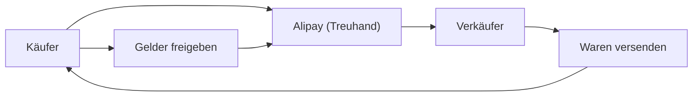

## 1. Gründung von Alibaba
1999 gründete Jack Ma das Unternehmen gemeinsam mit 18 Weggefährten in einer Wohnung. Es startete als B2B-Matchmaking-Website.

## 2. Erfolg von Taobao
Sie starteten die C2C-Plattform Taobao und erzielten einen großen Erfolg, der eBay zum Rückzug aus dem chinesischen Markt zwang.

## 3. Kreditkreation durch Alipay
Da Kreditkarten in China nicht weit verbreitet waren, bauten sie den Treuhand-Zahlungsservice "Alipay" auf. Dies wurde die Grundlage für Chinas bargeldlose Gesellschaft.

## 4. Cloud und Singles' Day
Durch den Aufbau von Infrastruktur mit Alibaba Cloud und das riesige Verkaufsereignis "Singles' Day (11. November)" treiben sie auch heute noch die digitale Wirtschaft Chinas an.

## Zusätzliche technische Überprüfung Teil 1

### 1. Gründung von Alibaba
1999 gründete Jack Ma das Unternehmen gemeinsam mit 18 Weggefährten in einer Wohnung. Es startete als B2B-Matchmaking-Website.

### 2. Erfolg von Taobao
Sie starteten die C2C-Plattform Taobao und erzielten einen großen Erfolg, der eBay zum Rückzug aus dem chinesischen Markt zwang.

### 3. Kreditkreation durch Alipay
Da Kreditkarten in China nicht weit verbreitet waren, bauten sie den Treuhand-Zahlungsservice "Alipay" auf. Dies wurde die Grundlage für Chinas bargeldlose Gesellschaft.

### 4. Cloud und Singles' Day
Durch den Aufbau von Infrastruktur mit Alibaba Cloud und das riesige Verkaufsereignis "Singles' Day (11. November)" treiben sie auch heute noch die digitale Wirtschaft Chinas an.

## Zusätzliche technische Überprüfung Teil 2

### 1. Gründung von Alibaba
1999 gründete Jack Ma das Unternehmen gemeinsam mit 18 Weggefährten in einer Wohnung. Es startete als B2B-Matchmaking-Website.

### 2. Erfolg von Taobao
Sie starteten die C2C-Plattform Taobao und erzielten einen großen Erfolg, der eBay zum Rückzug aus dem chinesischen Markt zwang.

### 3. Kreditkreation durch Alipay
Da Kreditkarten in China nicht weit verbreitet waren, bauten sie den Treuhand-Zahlungsservice "Alipay" auf. Dies wurde die Grundlage für Chinas bargeldlose Gesellschaft.

### 4. Cloud und Singles' Day
Durch den Aufbau von Infrastruktur mit Alibaba Cloud und das riesige Verkaufsereignis "Singles' Day (11. November)" treiben sie auch heute noch die digitale Wirtschaft Chinas an.

## Zusätzliche technische Überprüfung Teil 3

### 1. Gründung von Alibaba
1999 gründete Jack Ma das Unternehmen gemeinsam mit 18 Weggefährten in einer Wohnung. Es startete als B2B-Matchmaking-Website.

### 2. Erfolg von Taobao
Sie starteten die C2C-Plattform Taobao und erzielten einen großen Erfolg, der eBay zum Rückzug aus dem chinesischen Markt zwang.

### 3. Kreditkreation durch Alipay
Da Kreditkarten in China nicht weit verbreitet waren, bauten sie den Treuhand-Zahlungsservice "Alipay" auf. Dies wurde die Grundlage für Chinas bargeldlose Gesellschaft.

### 4. Cloud und Singles' Day
Durch den Aufbau von Infrastruktur mit Alibaba Cloud und das riesige Verkaufsereignis "Singles' Day (11. November)" treiben sie auch heute noch die digitale Wirtschaft Chinas an.

## Zusätzliche technische Überprüfung Teil 4

### 1. Gründung von Alibaba
1999 gründete Jack Ma das Unternehmen gemeinsam mit 18 Weggefährten in einer Wohnung. Es startete als B2B-Matchmaking-Website.

### 2. Erfolg von Taobao
Sie starteten die C2C-Plattform Taobao und erzielten einen großen Erfolg, der eBay zum Rückzug aus dem chinesischen Markt zwang.

### 3. Kreditkreation durch Alipay
Da Kreditkarten in China nicht weit verbreitet waren, bauten sie den Treuhand-Zahlungsservice "Alipay" auf. Dies wurde die Grundlage für Chinas bargeldlose Gesellschaft.

### 4. Cloud und Singles' Day
Durch den Aufbau von Infrastruktur mit Alibaba Cloud und das riesige Verkaufsereignis "Singles' Day (11. November)" treiben sie auch heute noch die digitale Wirtschaft Chinas an.

## Zusätzliche technische Überprüfung Teil 5

### 1. Gründung von Alibaba
1999 gründete Jack Ma das Unternehmen gemeinsam mit 18 Weggefährten in einer Wohnung. Es startete als B2B-Matchmaking-Website.

### 2. Erfolg von Taobao
Sie starteten die C2C-Plattform Taobao und erzielten einen großen Erfolg, der eBay zum Rückzug aus dem chinesischen Markt zwang.

### 3. Kreditkreation durch Alipay
Da Kreditkarten in China nicht weit verbreitet waren, bauten sie den Treuhand-Zahlungsservice "Alipay" auf. Dies wurde die Grundlage für Chinas bargeldlose Gesellschaft.

### 4. Cloud und Singles' Day
Durch den Aufbau von Infrastruktur mit Alibaba Cloud und das riesige Verkaufsereignis "Singles' Day (11. November)" treiben sie auch heute noch die digitale Wirtschaft Chinas an.

## Zusätzliche technische Überprüfung Teil 6

### 1. Gründung von Alibaba
1999 gründete Jack Ma das Unternehmen gemeinsam mit 18 Weggefährten in einer Wohnung. Es startete als B2B-Matchmaking-Website.

### 2. Erfolg von Taobao
Sie starteten die C2C-Plattform Taobao und erzielten einen großen Erfolg, der eBay zum Rückzug aus dem chinesischen Markt zwang.

### 3. Kreditkreation durch Alipay
Da Kreditkarten in China nicht weit verbreitet waren, bauten sie den Treuhand-Zahlungsservice "Alipay" auf. Dies wurde die Grundlage für Chinas bargeldlose Gesellschaft.

### 4. Cloud und Singles' Day
Durch den Aufbau von Infrastruktur mit Alibaba Cloud und das riesige Verkaufsereignis "Singles' Day (11. November)" treiben sie auch heute noch die digitale Wirtschaft Chinas an.

## Zusätzliche technische Überprüfung Teil 7

### 1. Gründung von Alibaba
1999 gründete Jack Ma das Unternehmen gemeinsam mit 18 Weggefährten in einer Wohnung. Es startete als B2B-Matchmaking-Website.

### 2. Erfolg von Taobao
Sie starteten die C2C-Plattform Taobao und erzielten einen großen Erfolg, der eBay zum Rückzug aus dem chinesischen Markt zwang.

### 3. Kreditkreation durch Alipay
Da Kreditkarten in China nicht weit verbreitet waren, bauten sie den Treuhand-Zahlungsservice "Alipay" auf. Dies wurde die Grundlage für Chinas bargeldlose Gesellschaft.

### 4. Cloud und Singles' Day
Durch den Aufbau von Infrastruktur mit Alibaba Cloud und das riesige Verkaufsereignis "Singles' Day (11. November)" treiben sie auch heute noch die digitale Wirtschaft Chinas an.

## Zusätzliche technische Überprüfung Teil 8

### 1. Gründung von Alibaba
1999 gründete Jack Ma das Unternehmen gemeinsam mit 18 Weggefährten in einer Wohnung. Es startete als B2B-Matchmaking-Website.

### 2. Erfolg von Taobao
Sie starteten die C2C-Plattform Taobao und erzielten einen großen Erfolg, der eBay zum Rückzug aus dem chinesischen Markt zwang.

### 3. Kreditkreation durch Alipay
Da Kreditkarten in China nicht weit verbreitet waren, bauten sie den Treuhand-Zahlungsservice "Alipay" auf. Dies wurde die Grundlage für Chinas bargeldlose Gesellschaft.

### 4. Cloud und Singles' Day
Durch den Aufbau von Infrastruktur mit Alibaba Cloud und das riesige Verkaufsereignis "Singles' Day (11. November)" treiben sie auch heute noch die digitale Wirtschaft Chinas an.

## Zusätzliche technische Überprüfung Teil 9

### 1. Gründung von Alibaba
1999 gründete Jack Ma das Unternehmen gemeinsam mit 18 Weggefährten in einer Wohnung. Es startete als B2B-Matchmaking-Website.

### 2. Erfolg von Taobao
Sie starteten die C2C-Plattform Taobao und erzielten einen großen Erfolg, der eBay zum Rückzug aus dem chinesischen Markt zwang.

### 3. Kreditkreation durch Alipay
Da Kreditkarten in China nicht weit verbreitet waren, bauten sie den Treuhand-Zahlungsservice "Alipay" auf. Dies wurde die Grundlage für Chinas bargeldlose Gesellschaft.

### 4. Cloud und Singles' Day
Durch den Aufbau von Infrastruktur mit Alibaba Cloud und das riesige Verkaufsereignis "Singles' Day (11. November)" treiben sie auch heute noch die digitale Wirtschaft Chinas an.

## Zusätzliche technische Überprüfung Teil 10

### 1. Gründung von Alibaba
1999 gründete Jack Ma das Unternehmen gemeinsam mit 18 Weggefährten in einer Wohnung. Es startete als B2B-Matchmaking-Website.

### 2. Erfolg von Taobao
Sie starteten die C2C-Plattform Taobao und erzielten einen großen Erfolg, der eBay zum Rückzug aus dem chinesischen Markt zwang.

### 3. Kreditkreation durch Alipay
Da Kreditkarten in China nicht weit verbreitet waren, bauten sie den Treuhand-Zahlungsservice "Alipay" auf. Dies wurde die Grundlage für Chinas bargeldlose Gesellschaft.

### 4. Cloud und Singles' Day
Durch den Aufbau von Infrastruktur mit Alibaba Cloud und das riesige Verkaufsereignis "Singles' Day (11. November)" treiben sie auch heute noch die digitale Wirtschaft Chinas an.

## Zusätzliche technische Überprüfung Teil 11

### 1. Gründung von Alibaba
1999 gründete Jack Ma das Unternehmen gemeinsam mit 18 Weggefährten in einer Wohnung. Es startete als B2B-Matchmaking-Website.

### 2. Erfolg von Taobao
Sie starteten die C2C-Plattform Taobao und erzielten einen großen Erfolg, der eBay zum Rückzug aus dem chinesischen Markt zwang.

### 3. Kreditkreation durch Alipay
Da Kreditkarten in China nicht weit verbreitet waren, bauten sie den Treuhand-Zahlungsservice "Alipay" auf. Dies wurde die Grundlage für Chinas bargeldlose Gesellschaft.

### 4. Cloud und Singles' Day
Durch den Aufbau von Infrastruktur mit Alibaba Cloud und das riesige Verkaufsereignis "Singles' Day (11. November)" treiben sie auch heute noch die digitale Wirtschaft Chinas an.

## Zusätzliche technische Überprüfung Teil 12

### 1. Gründung von Alibaba
1999 gründete Jack Ma das Unternehmen gemeinsam mit 18 Weggefährten in einer Wohnung. Es startete als B2B-Matchmaking-Website.

### 2. Erfolg von Taobao
Sie starteten die C2C-Plattform Taobao und erzielten einen großen Erfolg, der eBay zum Rückzug aus dem chinesischen Markt zwang.

### 3. Kreditkreation durch Alipay
Da Kreditkarten in China nicht weit verbreitet waren, bauten sie den Treuhand-Zahlungsservice "Alipay" auf. Dies wurde die Grundlage für Chinas bargeldlose Gesellschaft.

### 4. Cloud und Singles' Day
Durch den Aufbau von Infrastruktur mit Alibaba Cloud und das riesige Verkaufsereignis "Singles' Day (11. November)" treiben sie auch heute noch die digitale Wirtschaft Chinas an.

## Zusätzliche technische Überprüfung Teil 13

### 1. Gründung von Alibaba
1999 gründete Jack Ma das Unternehmen gemeinsam mit 18 Weggefährten in einer Wohnung. Es startete als B2B-Matchmaking-Website.

### 2. Erfolg von Taobao
Sie starteten die C2C-Plattform Taobao und erzielten einen großen Erfolg, der eBay zum Rückzug aus dem chinesischen Markt zwang.

### 3. Kreditkreation durch Alipay
Da Kreditkarten in China nicht weit verbreitet waren, bauten sie den Treuhand-Zahlungsservice "Alipay" auf. Dies wurde die Grundlage für Chinas bargeldlose Gesellschaft.

### 4. Cloud und Singles' Day
Durch den Aufbau von Infrastruktur mit Alibaba Cloud und das riesige Verkaufsereignis "Singles' Day (11. November)" treiben sie auch heute noch die digitale Wirtschaft Chinas an.

## Zusätzliche technische Überprüfung Teil 14

### 1. Gründung von Alibaba
1999 gründete Jack Ma das Unternehmen gemeinsam mit 18 Weggefährten in einer Wohnung. Es startete als B2B-Matchmaking-Website.

### 2. Erfolg von Taobao
Sie starteten die C2C-Plattform Taobao und erzielten einen großen Erfolg, der eBay zum Rückzug aus dem chinesischen Markt zwang.

### 3. Kreditkreation durch Alipay
Da Kreditkarten in China nicht weit verbreitet waren, bauten sie den Treuhand-Zahlungsservice "Alipay" auf. Dies wurde die Grundlage für Chinas bargeldlose Gesellschaft.

### 4. Cloud und Singles' Day
Durch den Aufbau von Infrastruktur mit Alibaba Cloud und das riesige Verkaufsereignis "Singles' Day (11. November)" treiben sie auch heute noch die digitale Wirtschaft Chinas an.
