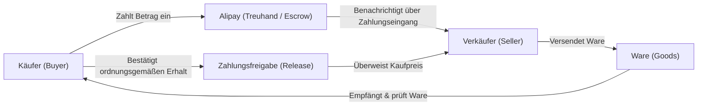

Wer über die moderne globale digitale Wirtschaft spricht, kommt an der Alibaba Group nicht vorbei. Heute ist es für Hunderte Millionen von Menschen selbstverständlich, Waren mit einem einfachen Fingerzeig auf dem Smartphone zu bestellen und in Sekundenschnelle zu bezahlen. Doch in China war es Alibaba, das diese elementare Infrastruktur von Grund auf aus dem Nichts geschaffen hat. Wie gelang es Jack Ma (Ma Yun), einem ehemaligen Englischlehrer, den traditionellen Einzelhandel und das Zahlungswesen Chinas grundlegend umzukrempeln und eines der größten digitalen Ökosysteme der Welt zu errichten? Dieser Artikel beleuchtet die spannende Unternehmensgeschichte und die richtungsweisenden Entscheidungen an den entscheidenden Wendepunkten.

## 1. Die Anfänge: Gründung in einer Wohnung in Hangzhou (1999)

Die Geschichte von Alibaba begann 1999 in der bescheidenen Wohnung von Jack Ma in Hangzhou, Provinz Zhejiang. Ma hatte zuvor mit „China Pages“ eines der ersten Online-Verzeichnisse des Landes gegründet, doch damals war die Internetverbreitung in China noch verschwindend gering, und viele frühe Projekte scheiterten an den schwierigen Rahmenbedingungen.

Dennoch glaubte Ma felsenfest an das revolutionäre Potenzial des Internets, Märkte rund um den Globus miteinander zu verknüpfen. 1999 versammelte er 18 Mitstreiter (die berühmten „18 Gründer“) in seiner Wohnung und formulierte eine visionäre Idee: Eine Online-Plattform zu errichten, die Chinas unzählige kleine und mittelständische Produktionsbetriebe direkt mit internationalen Einkäufern verbindet. Während China damals im Eiltempo zur „Werkbank der Welt“ aufstieg, fehlten den Fabrikanten die nötigen Kontakte und Vertriebswege ins Ausland.

Daraus entstand „Alibaba.com“, eine globale B2B-Plattform (Business-to-Business). Indem ausländische Unternehmen nun mühelos Waren in großen Stückzahlen direkt bei chinesischen Lieferanten ordern konnten, verzeichnete Alibaba ein explosives Wachstum. Entscheidende Frühinvestitionen von Goldman Sachs und SoftBank (unter Masayoshi Son) verschafften dem Start-up das nötige Kapital. Vor allem SoftBanks 20-Millionen-Dollar-Einstieg im Jahr 2000 gilt bis heute als eine der lukrativsten und legendärsten Risikokapitalinvestitionen aller Zeiten.

## 2. Die Geburtsstunde von Taobao und der Sieg über eBay (2003)

Nachdem sich Alibaba im B2B-Handel etabliert hatte, folgte 2003 die nächste große Bewährungsprobe. Der damalige US-amerikanische Auktionsriese eBay übernahm das chinesische Portal EachNet und drängte mit enormen finanziellen Mitteln aggressiv in den chinesischen C2C-Markt (Consumer-to-Consumer).

Jack Ma erkannte messerscharf: Sollte eBay den Endkundenmarkt in China dominieren, würde dies langfristig auch Alibabas Kerngeschäft im B2B-Bereich gefährden. Streng geheim formierte Alibaba in Mas alter Wohnung ein schlagkräftiges Team, um eine eigene C2C-Plattform aus dem Boden zu stampfen: „Taobao“ (was im Chinesischen so viel wie „Schätze ausgraben“ bedeutet).

Im erbitterten Duell mit eBay wählte Taobao eine radikale und zerstörerische Strategie: Vollständige Gebührenfreiheit für Händler und Käufer über einen Zeitraum von mindestens drei Jahren. Während eBay auf jede Transaktion Gebühren erhob, konnten Verkäufer auf Taobao kostenlos agieren. Zudem passte Taobao das Design optimal an die Gewohnheiten chinesischer Nutzer an – lebendig, bildstark und ausgestattet mit „Aliwangwang“, einem integrierten Instant-Messenger, über den Käufer und Verkäufer in Echtzeit feilschen, chatten und persönliches Vertrauen aufbauen konnten.

eBay hingegen versuchte, chinesische Kunden in seine starre globale Plattform einzubinden, was zu schweren Lokalisierungsfehlern und trägen Ladezeiten führte. Die kostenlose Nutzung und die überlegene Ausrichtung auf lokale Bedürfnisse brachten die Wende: 2006 musste sich eBay geschlagen geben und zog sich praktisch aus dem chinesischen C2C-Markt zurück. Taobao hatte die Vormachtstellung im chinesischen Onlinehandel endgültig erobert.

## 3. Die Alipay-Innovation: Treuhanddienste als Fundament des Vertrauens (2004)

Mit dem rasanten Wachstum von Taobao stieß Alibaba jedoch auf eine gewaltige Barriere: Das tief sitzende Misstrauen im chinesischen Handel.

Zu Beginn der 2000er-Jahre besaßen in China die wenigsten Menschen eine Kreditkarte. Verbraucher fürchteten, im Voraus bezahlte Ware niemals zu erhalten, während Verkäufer bangten, bei Lieferung auf Rechnung um ihr Geld betrogen zu werden. Vorkasse per Überweisung oder Barzahlung bei Lieferung waren viel zu träge, um einen Massen-E-Commerce zu tragen.

Um diesen Vertrauensengpass zu lösen, schuf Alibaba 2004 das Bezahlsystem „Alipay“ (Zhifubao). Alipay setzte auf ein bahnbrechendes Treuhandmodell (Escrow):

```mermaid
flowchart LR
    Buyer["Käufer (Buyer)"] -->|Zahlt Betrag ein| Alipay["Alipay (Treuhand / Escrow)"]
    Alipay -->|Benachrichtigt über Zahlungseingang| Seller["Verkäufer (Seller)"]
    Seller -->|Versendet Ware| Goods["Ware (Goods)"]
    Goods -->|Empfängt & prüft Ware| Buyer
    Buyer -->|Bestätigt ordnungsgemäßen Erhalt| Release["Zahlungsfreigabe (Release)"]
    Release -->|Überweist Kaufpreis| Seller
```

Nach diesem Prinzip wurde das Geld des Käufers zunächst bei Alipay sicher hinterlegt. Erst wenn der Kunde die gelieferte Ware in Händen hielt und deren Unversehrtheit bestätigte, wurde das Geld an den Händler weitergeleitet. Dieses System beseitigte das Betrugsrisiko und erlaubte es einander völlig Fremden, im Internet vertrauensvoll Geschäfte abzuschließen.

Alipay wuchs rasch über den reinen E-Commerce hinaus und integrierte das Bezahlen von Nebenkosten, mobiles Bezahlen per QR-Code im stationären Handel, Geldmarktfonds (Yu'e Bao) und Bonitätsprüfungen (Zhima Credit). Die später als „Ant Group“ ausgegliederte Finanzsparte wurde zum wichtigsten Schrittmacher für Chinas Aufstieg zur weltweit führenden bargeldlosen Gesellschaft.

## 4. Gründung von Tmall und Wandel zur B2C-Markenplattform (2008)

Taobao dominierte zwar den Markt, doch das offene C2C-Konzept brachte zunehmend Probleme mit Plagiaten und minderwertigen Waren mit sich. Da das Einkommen der chinesischen Mittelschicht kontinuierlich stieg, wuchs die Nachfrage nach geprüfter Markenqualität. Darauf reagierte Alibaba 2008 mit der Einführung von „Taobao Mall“, das kurz darauf in „Tmall“ (Tianmao) umbenannt wurde.

Tmall wurde als B2C-Plattform (Business-to-Consumer) konzipiert, zu der ausschließlich verifizierte Originalhersteller und autorisierte Händler Zugang erhielten. Dadurch konnten Kunden bedenkenlos hochwertige Markenartikel erwerben. Heute betreiben globale Spitzenmarken wie Apple, Nike und Uniqlo eigene Flagship-Stores auf Tmall, womit die Plattform zum unverzichtbaren Vertriebskanal für den chinesischen Premium-Markt geworden ist.

## 5. Start von Alibaba Cloud und Infrastruktur-Investitionen (2009)

Als die Transaktionszahlen in schwindelerregende Höhen kletterten, geriet Alibaba an die Grenzen herkömmlicher Hard- und Softwarelösungen westlicher Großkonzerne (IBM, Oracle, EMC). Die enormen Kosten und mangelnde Skalierbarkeit veranlassten das Unternehmen 2009 zur Gründung einer eigenen Cloud-Sparte: „Alibaba Cloud“ (Aliyun).

Während viele Branchenexperten in China Cloud Computing damals für ein Hirngespinst hielten, waren Jack Ma und sein Chefarchitekt Wang Jian überzeugt, dass Datenverarbeitung und Rechenleistung das Erdöl des 21. Jahrhunderts sein würden. Gehärtet durch die gigantischen Datenmengen des eigenen Geschäfts, öffnete sich das Cloud-System Apsara später für Unternehmen und Behörden. Heute ist Alibaba Cloud der unangefochtene Marktführer in China und zählt weltweit zu den führenden Cloud-Anbietern.

## 6. Der „Singles' Day (Double 11)“: Das größte Shopping-Festival der Welt (2009 - heute)

Das Meisterstück aus Marketing und technologischem Höchstleistungsbetrieb ist das alljährliche „Singles' Day“-Shoppingfestival am 11. November (Double 11).

Ursprünglich war der 11. November unter chinesischen Universitätsstudenten als humorvoller „Tag der Alleinstehenden“ (Guanggun Jie) zelebriert worden. Daniel Zhang, damals Leiter von Tmall und späterer Konzernchef von Alibaba, nutzte die Gelegenheit und etablierte den Tag als Anlass, sich selbst mit Geschenken zu belohnen.

Was 2009 mit gerade einmal 27 Marken bescheiden begann, wuchs zu einem gigantischen Konsumereignis mit Umsätzen im zweistelligen Milliardenbereich heran und stellte den US-amerikanischen Black Friday und Cyber Monday mühelos in den Schatten. Die Fähigkeit von Alibaba Cloud, während des Ansturms Hunderttausende Transaktionen pro Sekunde ohne Unterbrechung fehlerfrei abzuwickeln, gilt weltweit als Beweis für die technische Exzellenz des Konzerns.

## 7. „New Retail“: Die Verschmelzung von Online und Offline (2016 - heute)

2016 verkündete Jack Ma: „Die Ära des reinen E-Commerce geht zu Ende. Die Zukunft gehört dem 'New Retail' – der perfekten Symbiose aus Online-Plattformen, stationärem Handel, moderner Logistik und Datenströmen in Echtzeit.“

Das Aushängeschild dieser Strategie ist die von Alibaba gegründete Hightech-Supermarktkette „Freshippo“ (Hema Xiansheng). Bei Freshippo ist jede Filiale gleichzeitig Erlebnissupermarkt, Fischrestaurant und automatisiertes Lager für Onlinebestellungen. Kunden können vor Ort einkaufen oder per App bestellen – mit einer garantierten Lieferzeit von nur 30 Minuten innerhalb eines Drei-Kilometer-Radius.

Das Rückgrat dieser blitzschnellen Logistik bildet „Cainiao Network“. Statt selbst tausende Lastwagen und Lagerhallen zu kaufen, betreibt Cainiao ein KI-gestütztes Datennetzwerk, das bestehende Logistikunternehmen und Paketdienste im ganzen Land digital verknüpft und deren Routen und Auslastung optimal steuert.

## 8. Globale Expansion und neue Herausforderungen

Alibabas Ambitionen beschränken sich längst nicht mehr auf den chinesischen Heimatmarkt. Mit der Übernahme von Lazada in Südostasien, Trendyol in der Türkei und der globalen B2C-Plattform AliExpress treibt der Konzern seine Mission „Make it easy to do business anywhere“ weltweit voran.

Dennoch verliefen die letzten Jahre nicht ohne Turbulenzen. Nach dem Rückzug von Jack Ma aus dem operativen Geschäft geriet Alibaba verstärkt ins Visier staatlicher Aufsichtsbehörden. Ende 2020 wurde der geplante Rekordbörsengang der Ant Group in letzter Minute gestoppt, gefolgt von empfindlichen Strafzahlungen wegen Wettbewerbsverstößen.

Zudem wuchs mit Plattformen wie Pinduoduo und ByteDances Live-Shopping-Angeboten (Douyin/TikTok) eine starke neue Konkurrenz heran. Als Reaktion darauf kündigte Alibaba 2023 eine historische Umstrukturierung an: Der Konzern wurde in sechs eigenständige Geschäftsbereiche aufgeteilt, um flexibler zu werden und neue Innovationskräfte freizusetzen.

## 9. Fazit: Das Vermächtnis von Alibaba und der Blick nach vorn

Aus einer schlichten Wohnung in Hangzhou im Jahr 1999 hat sich Alibaba zu einem vielseitigen Tech-Konglomerat entwickelt, das Handel, Finanzen, Logistik und Cloud-Technologien in China nachhaltig geprägt hat.

Mit dem Sieg über eBay, der Schaffung von Vertrauen durch Alipay, dem Aufbau souveräner Cloud-Infrastrukturen und dem Konzept des New Retail hat Alibaba Wirtschaftsgeschichte geschrieben. Trotz veränderter regulatorischer Rahmenbedingungen und verschärftem Wettbewerb bleibt das von Alibaba aufgebaute digitale Ökosystem ein entscheidender Taktgeber für die Zukunft des weltweiten digitalen Handels.
