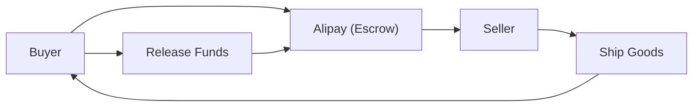

## 1. The Founding of Alibaba
In 1999, Jack Ma founded the company with 18 peers in an apartment. It started as a B2B matching site.

## 2. The Success of Taobao
By launching the C2C platform Taobao, they achieved great success and forced eBay to withdraw from the Chinese market.

## 3. Credit Creation by Alipay
Amidst the lack of widespread credit card usage in China, they built the escrow payment service "Alipay". This became the foundation of China's cashless society.

## 4. Cloud and Singles' Day
They continue to drive China's digital economy today, through infrastructure building via Alibaba Cloud and massive sales events like "Singles' Day" (November 11).

