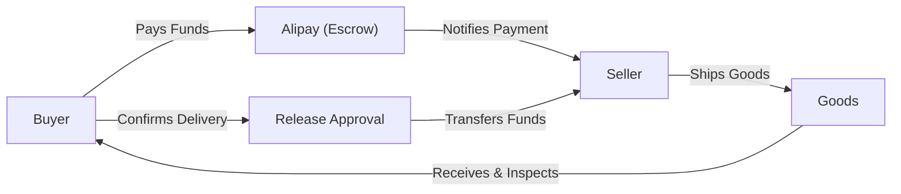

When discussing the modern digital economy, it is impossible to overlook the monumental influence of China's tech titan, Alibaba Group. Today, hundreds of millions of consumers effortlessly order products with a smartphone tap and complete transactions in seconds. Yet in China, the foundational infrastructure that made this convenience a reality was built from scratch by Alibaba. How did Jack Ma (Ma Yun), a former English teacher, transform Chinese retail and payments to forge one of the largest digital ecosystems on the planet? This article unpacks the epic history of Alibaba, examining the strategic breakthroughs and pivotal decisions at every turning point.

## 1. The Genesis: Founding in a Hangzhou Apartment (1999)

Alibaba's journey began in 1999 inside Jack Ma's modest apartment in Hangzhou, Zhejiang Province. Ma had previously launched an early internet directory service called "China Pages," but internet penetration in China was minuscule at the time, and many early digital ventures struggled to survive.

However, Ma held an unyielding conviction in the power of the internet to connect global markets. In 1999, he gathered 18 friends and colleagues (the co-founding team) in his apartment and articulated a bold vision: building an online platform that would bridge China's small and medium-sized manufacturers with global buyers. While China was rapidly emerging as the "world's factory," millions of small factories lacked direct channels to reach international markets.

This gave birth to "Alibaba.com," a global B2B (business-to-business) marketplace. As a platform enabling foreign businesses to source goods directly from Chinese suppliers in volume, Alibaba experienced explosive growth. Crucial early venture backing from Goldman Sachs and SoftBank (led by Masayoshi Son) provided the capital rocket fuel Alibaba needed. Notably, SoftBank's $20 million investment in 2000 would become legendary as one of the most lucrative and successful bets in venture capital history.

## 2. The Birth of Taobao and the Epic Battle with eBay (2003)

While establishing a formidable presence in the B2B sector, Alibaba encountered an existential challenge in 2003. eBay, then the undisputed global leader in online auctions, acquired China's "EachNet" and made an aggressive, capital-heavy entry into China's C2C (consumer-to-consumer) marketplace.

Jack Ma foresaw that if eBay monopolized China's consumer retail, it would eventually encroach upon Alibaba's B2B fortress. Operating in extreme secrecy, Alibaba assembled a stealth project team inside Ma's original apartment to develop its own C2C platform: "Taobao" (meaning "digging for treasure" in Chinese).

Taobao launched a disruptive counter-offensive with a radically simple strategy: completely eliminating listing and transaction fees. While eBay charged transaction fees on every sale, Taobao pledged that its platform would remain completely free for at least three years. Furthermore, Taobao customized its user interface to cater directly to Chinese consumer psychology—designing vibrant, information-rich product showcases and introducing "Aliwangwang," an instant messaging tool that allowed buyers and sellers to negotiate, bargain, and build relationships in real time.

eBay, conversely, attempted to force Chinese users onto its standardized global platform, resulting in severe localization failures and sluggish website performance. Ultimately, Taobao's free-fee model and deep localization dismantled eBay's dominance. By 2006, eBay was effectively forced into a humiliating retreat from China's C2C market, cementing Alibaba's absolute reign over Chinese consumer e-commerce.

## 3. The Alipay Revolution: Escrow Creating Trust (2004)

As Taobao expanded exponentially, Alibaba ran headfirst into a fundamental obstacle unique to the Chinese market at the time: a deep deficit of mutual trust.

In the early 2000s, credit card penetration across China was virtually nonexistent. Consumers harbored severe anxiety that "paying upfront would lead to never receiving their goods," while sellers feared that "shipping items without upfront payment would result in non-payment." Cash-on-delivery and wire transfers were cumbersome and incapable of sustaining explosive e-commerce volume.

To resolve this trust gap, Alibaba engineered "Alipay" in 2004. Alipay pioneered a secure escrow system:

```mermaid
flowchart LR
    Buyer["Buyer"] -->|Pays Funds| Alipay["Alipay (Escrow)"]
    Alipay -->|Notifies Payment| Seller["Seller"]
    Seller -->|Ships Goods| Goods["Goods"]
    Goods -->|Receives & Inspects| Buyer
    Buyer -->|Confirms Delivery| Release["Release Approval"]
    Release -->|Transfers Funds| Seller
```

Under this escrow mechanism, the buyer's payment was held securely by Alipay. Funds were only released to the seller after the buyer physically received, inspected, and verified the goods. This breakthrough eliminated counterparty risk, enabling complete strangers across China to conduct commerce with total peace of mind.

Alipay rapidly expanded beyond Taobao, evolving into utility payments, offline QR code mobile payments, wealth management (Yu'e Bao), and social credit scoring (Zhima Credit). Later spun off as "Ant Group," this fintech platform became the primary engine that propelled China into the world's most advanced cashless society.

## 4. Launch of Tmall and Expansion into B2C (2008)

While Taobao made Alibaba an undisputed e-commerce titan, its open C2C nature made it vulnerable to counterfeit and low-quality merchandise. As household incomes across China surged, consumer demand shifted toward authentic, high-grade branded products. In response, Alibaba unveiled "Taobao Mall" in 2008, subsequently rebranded as "Tmall" (Tianmao).

Tmall was constructed as a premium B2C (business-to-consumer) marketplace open exclusively to verified brand owners and authorized distributors. This structure guaranteed product authenticity, allowing consumers to purchase high-end domestic and global brands with complete confidence. Today, multinational giants including Apple, Nike, and Uniqlo operate flagship storefronts on Tmall, making it an indispensable digital retail channel in China.

## 5. The Genesis of Alibaba Cloud and Infrastructure Investments (2009)

As transaction volumes skyrocketed across its marketplaces, Alibaba encountered a critical technological bottleneck: computing power and database scalability. Recognizing the exorbitant cost and limitations of relying on traditional Western enterprise hardware and proprietary databases (such as Oracle and IBM), Alibaba initiated its own cloud computing division, "Alibaba Cloud" (Aliyun), in 2009.

At that time, domestic tech skepticism toward cloud infrastructure ran rampant, but Jack Ma and Chief Technology Architect Wang Jian were convinced that computational data would serve as the crude oil of 21st-century commerce. Built and stress-tested under the extreme fires of Alibaba's own massive traffic, Alibaba Cloud eventually opened to third-party enterprises and public sector institutions. Today, it stands as China's largest cloud provider and one of the top cloud computing vendors globally.

## 6. Singles' Day (Double 11): The World's Largest Shopping Festival (2009 - Present)

The pinnacle of Alibaba's marketing genius and technological prowess is "Singles' Day" (Double 11 / 11.11), hosted annually on November 11.

Originally, November 11 had been lightheartedly celebrated among Chinese university students as "Bachelors' Day" (Guanggun Jie). Daniel Zhang, then-head of Tmall and later CEO and Chairman of Alibaba, reimagined the occasion as an opportunity for singles to "reward themselves through retail therapy."

The inaugural Double 11 in 2009 involved only 27 merchants and generated modest sales. However, the festival grew exponentially year after year. Today, Singles' Day generates tens of billions of dollars in gross merchandise volume within its opening hours, dwarfing Black Friday and Cyber Monday combined. Alibaba Cloud's ability to smoothly handle hundreds of thousands of concurrent transactional orders per second without downtime stands as a global testament to the resilience of Alibaba's tech stack.

## 7. New Retail: Bridging Online and Offline (2016 - Present)

In 2016, Jack Ma declared that "pure e-commerce would soon become obsolete. The future belongs to 'New Retail'—the seamless integration of online platforms, offline physical stores, modern logistics, and real-time data."

This philosophy found physical form in "Freshippo" (Hema Xiansheng), Alibaba's proprietary smart supermarket chain. In Freshippo stores, physical locations serve simultaneously as premium grocery markets, experiential seafood eateries, and automated fulfillment centers for online deliveries. Customers can purchase groceries in-store using smartphone payments or order via the app for doorstep delivery in as little as 30 minutes for residents within a 3-kilometer radius.

This ultra-fast logistics capability is orchestrated by "Cainiao Network," Alibaba's logistics data backbone. Rather than purchasing fleets of trucks and massive warehouses outright, Cainiao operates an open, AI-driven data platform that coordinates and optimizes China's vast network of third-party express couriers and distribution hubs.

## 8. Globalization and New Strategic Hurdles

Alibaba's ambitions extend far beyond mainland China. Through strategic acquisitions and expansions—including "Lazada" in Southeast Asia, "Trendyol" in Turkey, and the international marketplace "AliExpress"—Alibaba has actively pursued global consumers and merchants. Its founding mission, "To make it easy to do business anywhere," continues to guide its international footprint.

Nevertheless, Alibaba's path has encountered severe headwinds. Following Jack Ma's step back from executive roles, Alibaba faced heightened regulatory scrutiny. In late 2020, Ant Group's planned dual-listing IPO was unexpectedly halted by Chinese financial regulators, followed by landmark anti-monopoly penalties levied against Alibaba.

Concurrently, fierce domestic competition has emerged from agile rivals like Pinduoduo (PDD Holdings) and ByteDance (via Douyin/TikTok live-commerce). In response to these headwinds, Alibaba unveiled a sweeping restructuring in 2023, splitting into six independent business groups to decentralize decision-making, accelerate agility, and pursue individual market valuations.

## 9. Conclusion: The Enduring Legacy of Alibaba

From a cramped Hangzhou apartment in 1999 to a sprawling digital conglomerate, Alibaba fundamentally redefined modern commerce, consumer finance, cloud computing, and automated logistics across China.

By conquering eBay, forging mutual trust through Alipay, pioneering domestic cloud infrastructure, and dissolving the borders between digital and physical shopping, Alibaba's history mirrors the transformation of the Chinese digital economy itself. Despite evolving regulatory environments and intense market rivalries, the innovative DNA and foundational infrastructure Alibaba established over the past quarter-century will continue to shape the trajectory of global commerce for generations to come.
