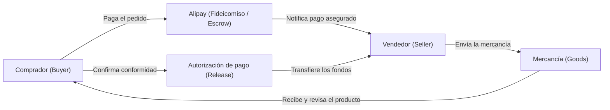

Al analizar la economía digital moderna, resulta imposible pasar por alto la colosal influencia del gigante tecnológico chino Alibaba Group. Hoy en día, cientos de millones de usuarios compran con un simple toque en la pantalla de su teléfono inteligente y realizan transacciones en cuestión de segundos. Sin embargo, en China, la infraestructura esencial que transformó esta comodidad en una realidad cotidiana fue construida desde cero por Alibaba. ¿Cómo logró Jack Ma (Ma Yun), un antiguo profesor de inglés, transformar el comercio minorista y las finanzas del país para forjar uno de los mayores ecosistemas digitales del planeta? Este artículo profundiza en la fascinante historia de Alibaba y en las decisiones estratégicas que marcaron cada uno de sus puntos de inflexión.

## 1. El origen: Fundación en un apartamento de Hangzhou (1999)

La trayectoria de Alibaba comenzó en 1999 en el modesto apartamento de Jack Ma en Hangzhou, provincia de Zhejiang. Ma ya había fundado con anterioridad "China Pages", uno de los primeros directorios en línea del país, pero la penetración de internet en la China de aquella época era prácticamente insignificante y muchas iniciativas pioneras terminaron en fracaso.

No obstante, Ma creía con firmeza en el poder disruptivo de internet para interconectar los mercados mundiales. En 1999, reunió a 18 amigos y colegas (el legendario equipo de los 18 fundadores) en su apartamento y les expuso una visión ambiciosa: crear una plataforma digital que conectara a los pequeños y medianos fabricantes chinos con compradores internacionales. Aunque China emergía a pasos agigantados como la "fábrica del mundo", millones de pequeñas fábricas carecían de canales directos para acceder a compradores extranjeros.

Así nació "Alibaba.com", una plataforma B2B (empresa a empresa) orientada al comercio exterior. Al facilitar a empresas internacionales el aprovisionamiento de productos al por mayor directamente desde proveedores chinos, Alibaba experimentó un crecimiento vertiginoso. El crucial respaldo financiero temprano de Goldman Sachs y SoftBank (encabezado por Masayoshi Son) proporcionó el combustible necesario para su expansión. En particular, la inversión de 20 millones de dólares de SoftBank en el año 2000 se convertiría con el tiempo en una de las operaciones de capital de riesgo más exitosas y rentables de la historia.

## 2. El nacimiento de Taobao y la épica batalla contra eBay (2003)

Mientras consolidaba su liderazgo en el segmento B2B, Alibaba se topó con un reto existencial en 2003. eBay, el coloso indiscutible de las subastas en línea a escala global, adquirió la compañía china EachNet e ingresó agresivamente con enormes recursos de capital en el mercado C2C (consumidor a consumidor) del país.

Jack Ma advirtió que si eBay lograba monopolizar el comercio minorista de consumidores, tarde o temprano amenazaría el núcleo del negocio B2B de Alibaba. Por ello, la compañía organizó en secreto un equipo especial en el apartamento original de Ma para diseñar su propia plataforma C2C: "Taobao" (que en chino significa "buscar tesoros").

Frente a eBay, Taobao desplegó una estrategia radical y demoledora: la gratuidad absoluta en las comisiones de publicación y transacción durante un mínimo de tres años. Mientras que eBay cobraba tarifas por cada operación realizada, Taobao permitió que los pequeños comerciantes vendieran sin coste alguno. Además, Taobao diseñó su plataforma adaptándose a la psicología del consumidor local, con una interfaz visualmente rica y la incorporación de "Aliwangwang", una herramienta de mensajería instantánea que permitía a compradores y vendedores chatear, regatear y construir relaciones de confianza en tiempo real.

eBay, en cambio, intentó estandarizar a los usuarios chinos en su plataforma global unificada, sufriendo graves problemas de adaptación y una lentitud exasperante en el servicio. La gratuidad y la profunda localización hicieron que Taobao conquistara rápidamente la cuota de mercado. Hacia 2006, eBay se vio obligada a retirarse de facto del mercado C2C chino, consagrando a Alibaba como el soberano indiscutible del comercio electrónico en el país.

## 3. La innovación de Alipay: El fideicomiso que creó la confianza (2004)

Con la expansión astronómica de Taobao, Alibaba chocó contra una barrera estructural propia del mercado chino de la época: la desconfianza generalizada.

A principios de la década de 2000, la penetración de las tarjetas de crédito en China era prácticamente nula. Los consumidores desconfiaban de pagar por adelantado por temor a no recibir nunca los productos, mientras que los vendedores temían enviar mercancías sin haber cobrado previamente. Las transferencias bancarias y los envíos contra reembolso eran procesos lentos e incapaces de soportar un comercio digital masivo.

Para superar este obstáculo, Alibaba creó en 2004 "Alipay" (Zhifubao). Alipay implementó un ingenioso sistema de depósito en garantía (escrow):

Mediante este esquema, el dinero abonado por el comprador quedaba retenido de forma segura en Alipay. Los fondos solo se transferían a la cuenta del vendedor una vez que el comprador confirmaba la recepción satisfactoria de la mercancía. Este mecanismo eliminó por completo el riesgo de fraude, permitiendo que perfectos desconocidos hicieran negocios con total tranquilidad en internet.

Posteriormente, Alipay trascendió el comercio electrónico para incorporar el pago de suministros públicos, pagos móviles mediante códigos QR, fondos monetarios de inversión (Yu'e Bao) y sistemas de puntuación crediticia (Zhima Credit). Esta plataforma, segregada más tarde bajo el nombre de "Ant Group", fue el principal motor que impulsó a China a convertirse en la sociedad sin efectivo más avanzada del mundo.

## 4. Creación de Tmall y salto cualitativo al B2C (2008)

Aunque Taobao cosechó un éxito rotundo, su naturaleza abierta de C2C acarreaba inevitablemente la proliferación de imitaciones y artículos de calidad dispar. A medida que el poder adquisitivo de los consumidores chinos aumentaba, creció la demanda de productos auténticos y de primeras marcas. En respuesta, Alibaba presentó en 2008 "Taobao Mall", bautizado poco después como "Tmall" (Tianmao).

Tmall se diseñó como un mercado B2C (empresa a consumidor) con estrictos requisitos de admisión, abierto únicamente a marcas consagradas y distribuidores oficiales certificados. Esto brindó a los compradores la garantía de adquirir productos 100% genuinos. Hoy en día, gigantes multinacionales como Apple, Nike o Uniqlo disponen de sus principales tiendas insignia en Tmall, convirtiéndolo en un canal de distribución insustituible para el mercado chino.

## 5. El despegue de Alibaba Cloud y la inversión en infraestructura (2009)

Ante el crecimiento exponencial de las transacciones, Alibaba se enfrentó a un cuello de botella informático decisivo: la capacidad de cálculo y escalabilidad de las bases de datos. Consciente de los costes astronómicos y las restricciones técnicas de depender del hardware tradicional de empresas occidentales (IBM, Oracle, EMC), Alibaba fundó en 2009 su propia división de computación en la nube: "Alibaba Cloud" (Aliyun).

En aquel entonces reinaba un gran escepticismo sobre la viabilidad del cloud computing en China, pero Jack Ma y el arquitecto jefe de tecnología, Wang Jian, estaban convencidos de que los datos y la computación serían el auténtico petróleo del siglo XXI. Forjada en el fuego de soportar el colosal tráfico de la propia Alibaba, la plataforma Apsara de Alibaba Cloud se abrió más tarde a empresas privadas y organismos públicos, convirtiéndose en el primer proveedor de la nube de China y uno de los mayores del mundo.

## 6. El "Día de los Solteros (Doble 11)": El mayor festival de compras del mundo (2009 - presente)

El ejemplo más elocuente del poder tecnológico y comercial de Alibaba es la celebración anual del "Día de los Solteros" (Doble 11 / 11.11) cada 11 de noviembre.

Originalmente, el 11 de noviembre era una fecha informal festejada con tono festivo por jóvenes universitarios chinos como el "Día de los Solteros" (Guanggun Jie). Daniel Zhang, entonces responsable de Tmall y más tarde presidente ejecutivo de Alibaba, reinventó la fecha bajo la premisa de "recompensarse a uno mismo mediante las compras".

La primera edición de 2009 contó con apenas 27 marcas participantes; sin embargo, con los años la cita creció hasta cifras astronómicas de miles de millones de dólares en volumen de ventas, eclipsando sobradamente las cifras combinadas del Black Friday y el Cyber Monday de Estados Unidos. La solvencia de Alibaba Cloud para gestionar sin caídas cientos de miles de pedidos concurrentes por segundo constituye una demostración incontestable de la robustez tecnológica de su ecosistema.

## 7. El "Nuevo Comercio Minorista (New Retail)" y la integración total (2016 - presente)

En 2016, Jack Ma sentenció: "La era del comercio electrónico puro pronto tocará a su fin; el futuro pertenece al 'Nuevo Comercio Minorista' (New Retail), la fusión total entre plataformas online, tiendas físicas, logística avanzada y analítica de datos en tiempo real".

El modelo insigne de esta filosofía es "Freshippo" (Hema Xiansheng), la cadena de supermercados inteligentes de Alibaba. En Freshippo, cada establecimiento opera simultáneamente como tienda de alimentación gourmet, restaurante de marisco fresco y centro logístico automatizado de preparación de pedidos en línea. Los clientes pueden comprar presencialmente escaneando productos con la aplicación o solicitar envíos a domicilio que se entregan en tan solo 30 minutos en un radio de tres kilómetros.

Esta extraordinaria capacidad logística se apoya en "Cainiao Network", la división de inteligencia logística de Alibaba. En lugar de adquirir enormes flotas de camiones o naves industriales, Cainiao despliega una plataforma digital impulsada por inteligencia artificial que coordina, optimiza e interconecta las redes de mensajería y almacenes de terceros en toda China.

## 8. Globalización y nuevos retos estratégicos

Las ambiciones de Alibaba trascienden con creces las fronteras chinas. A través de la adquisición de plataformas punteras como Lazada en el sudeste asiático, Trendyol en Turquía y su propio canal internacional de venta minorista AliExpress, Alibaba ha buscado expandir globalmente su lema fundacional: "Hacer fácil los negocios en cualquier parte del mundo" (Make it easy to do business anywhere).

Con todo, la trayectoria reciente de Alibaba no ha estado exenta de turbulencias. Tras la salida de Jack Ma de la primera línea de gestión, el grupo afrontó un marco regulatorio más severo. A finales de 2020, las autoridades suspendieron la histórica salida a bolsa de Ant Group, a lo que siguieron importantes sanciones antimonopolio para el consorcio.

Al mismo tiempo, la competencia doméstica se ha recrudecido con la fulgurante ascensión de Pinduoduo en el comercio social y de ByteDance a través del comercio electrónico en transmisiones en vivo (Douyin/TikTok). Como respuesta, Alibaba emprendió en 2023 la mayor reestructuración organizativa de su historia, dividiéndose en seis grupos de negocios independientes para ganar agilidad y reactivar su espíritu innovador.

## 9. Conclusión: El legado de Alibaba y el horizonte futuro

Desde una austera vivienda de Hangzhou en 1999 hasta convertirse en un titán que abarca comercio electrónico, finanzas digitales, logística automatizada y computación en la nube, Alibaba ha liderado la metamorfosis de la economía digital en China.

Vencer a eBay, instaurar la confianza comercial a través de Alipay, liderar la revolución de la nube y difuminar las fronteras entre el mundo físico y el digital definen una epopeya corporativa sin precedentes. A pesar de los nuevos desafíos regulatorios y competitivos, la huella y el espíritu innovador de Alibaba seguirán desempeñando un papel clave en el porvenir del comercio tecnológico internacional.
