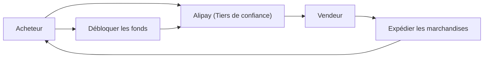

## 1. La création d'Alibaba
En 1999, Jack Ma a fondé l'entreprise avec 18 collègues dans un appartement. Elle a démarré comme un site de mise en relation B2B.

## 2. Le succès de Taobao (淘宝網)
Ils ont lancé Taobao, une plateforme C2C, et ont remporté un énorme succès qui a forcé eBay à se retirer du marché chinois.

## 3. La création de crédit par Alipay
En Chine, où les cartes de crédit n'étaient pas répandues, ils ont construit "Alipay", un service de paiement par tiers de confiance. Cela est devenu la base de la société sans numéraire en Chine.

## 4. Le cloud et le Jour des célibataires
Avec la construction de l'infrastructure par Alibaba Cloud et l'énorme événement de vente du "Jour des célibataires (11 novembre)", ils continuent de stimuler l'économie numérique chinoise aujourd'hui.

## Partie de vérification technique supplémentaire 1

## Partie de vérification technique supplémentaire 2

## Partie de vérification technique supplémentaire 3

## Partie de vérification technique supplémentaire 4

## Partie de vérification technique supplémentaire 5

## Partie de vérification technique supplémentaire 6

## Partie de vérification technique supplémentaire 7

## Partie de vérification technique supplémentaire 8

## Partie de vérification technique supplémentaire 9

## Partie de vérification technique supplémentaire 10

## Partie de vérification technique supplémentaire 11

## Partie de vérification technique supplémentaire 12

## Partie de vérification technique supplémentaire 13

## Partie de vérification technique supplémentaire 14

