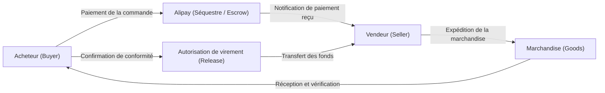

Lorsque l'on étudie l'économie numérique contemporaine, il est impossible de faire abstraction de l'influence gigantesque du titan technologique chinois Alibaba Group. Aujourd'hui, commander des produits en un clin d'œil sur un smartphone et finaliser un paiement en quelques fractions de seconde fait partie du quotidien de centaines de millions de citoyens. Pourtant, en Chine, l'infrastructure fondatrice qui a rendu cette fluidité possible a été entièrement bâtie par Alibaba. Comment Jack Ma (Ma Yun), un modeste professeur d'anglais, a-t-il pu réinventer le commerce de détail et les flux financiers de son pays pour ériger l'un des écosystèmes numériques les plus imposants de la planète ? Cet article explore en détail la trajectoire spectaculaire d'Alibaba et les choix stratégiques cruciaux qui ont jalonné son histoire.

## 1. La genèse : Naissance dans un modeste appartement de Hangzhou (1999)

L'aventure d'Alibaba a commencé en 1999 au sein du modeste appartement de Jack Ma à Hangzhou, dans la province du Zhejiang. Ma avait auparavant développé « China Pages », un annuaire en ligne pionnier, mais le taux de pénétration d'Internet en Chine était alors infime et de nombreuses initiatives initiales s'étaient soldées par des échecs.

Néanmoins, Jack Ma était habité par la conviction inébranlable que l'Internet possédait le pouvoir unique d'interconnecter le monde. En 1999, il réunit 18 proches et collaborateurs (les mythiques « dix-huit pères fondateurs ») dans son appartement pour leur exposer une vision audacieuse : créer une plateforme en ligne capable de relier les petites et moyennes manufactures chinoises aux acheteurs du monde entier. Alors que la Chine s'imposait à grande vitesse comme « l'usine du monde », des millions de petites usines manquaient cruellement de canaux pour toucher directement la clientèle internationale.

C'est ainsi qu'a vu le jour « Alibaba.com », une place de marché B2B (interentreprises) dédiée au commerce international. En offrant aux entreprises étrangères la possibilité d'acheter en volume directement auprès de fournisseurs chinois, Alibaba connut une expansion fulgurante. Le soutien financier décisif apporté à ses débuts par Goldman Sachs et SoftBank (dirigé par Masayoshi Son) fournit le carburant indispensable à cette croissance. En particulier, l'investissement de 20 millions de dollars consenti par SoftBank en 2000 est devenu l'une des opérations de capital-risque les plus légendaires et rentables de l'histoire financière.

## 2. La naissance de Taobao et la bataille épique contre eBay (2003)

Alors qu'Alibaba s'imposait avec autorité sur le segment B2B, l'entreprise fit face à une menace existentielle en 2003. Le géant américain des enchères en ligne eBay racheta l'acteur local EachNet et fit une entrée fracassante, dotée d'immenses capitaux, sur le marché chinois du C2C (consommateur à consommateur).

Jack Ma comprit immédiatement que si eBay parvenait à verrouiller le commerce grand public, il finirait par asphyxier le bastion B2B d'Alibaba. Dans le plus grand secret, Alibaba constitua une équipe commando dans l'ancien appartement de Ma pour développer sa propre plateforme grand public : « Taobao » (signifiant « dénicher des trésors » en chinois).

Dans ce duel sans merci, Taobao frappa un grand coup avec une stratégie radicale : la gratuité totale des frais d'inscription et de transaction pendant au moins trois ans. Tandis qu'eBay prélevait des commissions sur chaque vente, Taobao offrit aux commerçants un espace de vente sans aucun coût. De surcroît, Taobao adapta minutieusement son interface aux habitudes locales, proposant un design vivant et chaleureux ainsi qu'un outil de messagerie instantanée intégré, « Aliwangwang », permettant aux acheteurs et vendeurs de converser, négocier et tisser des liens de confiance en temps réel.

À l'inverse, eBay tenta de contraindre les utilisateurs chinois à utiliser sa plateforme mondiale standardisée, provoquant des lenteurs et une inadaptation culturelle flagrante. Grâce à la gratuité et à une localisation parfaite, Taobao évinça son rival américain. Dès 2006, eBay fut contraint d'abandonner de facto le marché chinois, consacrant Alibaba comme le maître incontesté du commerce de détail en ligne en Chine.

## 3. L'innovation Alipay : L'entiercement au service de la confiance mutuelle (2004)

À mesure que Taobao grandissait à un rythme vertigineux, Alibaba se heurta à un problème culturel et bancaire majeur en Chine : le déficit absolu de confiance commerciale.

Au début des années 2000, l'usage des cartes bancaires était rarissime en Chine. Les consommateurs craignaient de payer d'avance sans jamais voir arriver leurs colis, tandis que les commerçants refusaient d'expédier de la marchandise sans avoir perçu l'argent au préalable. Les systèmes de virements postaux ou de paiement à la livraison étaient lents et totalement inadaptés à un commerce électronique de masse.

Pour lever ce verrou bloquant, Alibaba créa en 2004 « Alipay » (Zhifubao). Alipay mit au point un mécanisme novateur de compte séquestre (escrow) :

```mermaid
flowchart LR
    Buyer["Acheteur (Buyer)"] -->|Paiement de la commande| Alipay["Alipay (Séquestre / Escrow)"]
    Alipay -->|Notification de paiement reçu| Seller["Vendeur (Seller)"]
    Seller -->|Expédition de la marchandise| Goods["Marchandise (Goods)"]
    Goods -->|Réception et vérification| Buyer
    Buyer -->|Confirmation de conformité| Release["Autorisation de virement (Release)"]
    Release -->|Transfert des fonds| Seller
```

Grâce à ce système d'entiercement, les fonds versés par l'acheteur étaient conservés en toute sécurité par Alipay. L'argent n'était viré au vendeur qu'après confirmation formelle par l'acheteur de la bonne réception du produit. Ce dispositif ingénieux dissipa toute appréhension, autorisant de parfaits inconnus à commercer en ligne en toute sérénité.

Alipay s'émancipa ensuite rapidement du simple périmètre de Taobao pour intégrer le paiement de factures courantes, les règlements physiques par QR code, la gestion d'épargne (Yu'e Bao) et l'évaluation de crédit social (Zhima Credit). Cette entité, devenue plus tard « Ant Group », constitua le réacteur principal ayant propulsé la Chine au rang de première société sans argent liquide au monde.

## 4. L'avènement de Tmall et l'essor du B2C de marque (2008)

Si Taobao avait conquis un public gigantesque, son fonctionnement ouvert de C2C favorisait inévitablement la circulation de contrefaçons et d'articles de qualité médiocre. Avec l'élévation rapide du pouvoir d'achat de la classe moyenne chinoise, l'exigence d'authenticité et de marques officielles se fit plus pressante. Alibaba lança ainsi en 2008 « Taobao Mall », renommé par la suite « Tmall » (Tianmao).

Tmall fut pensé comme une place de marché B2C (d'entreprise à consommateur) sélective, réservée exclusivement aux marques reconnues et à leurs distributeurs agréés. Les consommateurs purent dès lors commander en toute quiétude des produits certifiés authentiques. Aujourd'hui, des fleurons mondiaux tels qu'Apple, Nike ou Uniqlo exploitent leurs boutiques officielles phares sur Tmall, qui s'impose comme un point de passage obligatoire pour le commerce haut de gamme en Chine.

## 5. L'émergence d'Alibaba Cloud et les investissements d'infrastructure (2009)

Face à l'explosion continue des volumes de données et de transactions, Alibaba atteignit les limites techniques des architectures informatiques traditionnelles fournies par les géants occidentaux (IBM, Oracle, EMC). Conscient des coûts exorbitants et du manque de flexibilité de ces systèmes, Alibaba créa en 2009 sa propre division de cloud computing : « Alibaba Cloud » (Aliyun).

Malgré le scepticisme ambiant dans l'écosystème tech chinois de l'époque, Jack Ma et son directeur technologique Wang Jian avaient la certitude que la puissance de calcul et la donnée constitueraient l'énergie motrice de l'économie moderne. Éprouvé par les vagues massives de trafic interne d'Alibaba, le système cloud Apsara s'est ensuite ouvert aux entreprises privées et aux services publics, hissant Alibaba Cloud au rang de leader incontesté en Chine et de géant mondial du secteur.

## 6. La « Fête des Célibataires (Double 11) » : Le plus grand festival d'achat mondial (2009 - présent)

Le symbole par excellence de la maestria marketing et de la puissance technologique d'Alibaba demeure la « Fête des Célibataires » (Double 11 / 11.11), célébrée chaque année le 11 novembre.

À l'origine, le 11 novembre était une fête informelle et humoristique célébrée par les étudiants chinois sous le nom de « Journée des célibataires » (Guanggun Jie). Daniel Zhang, alors responsable de Tmall puis futur PDG d'Alibaba, transforma cette date en un gigantesque festival commercial invitant chacun à « se faire plaisir en s'offrant des cadeaux ».

La première édition en 2009 ne regroupait que 27 marques participantes, mais l'événement connut une trajectoire exponentielle pour atteindre des dizaines de milliards d'euros de volume d'affaires en quelques heures, surclassant largement le Black Friday et le Cyber Monday américains réunis. La capacité d'Alibaba Cloud à traiter sans la moindre interruption des centaines de milliers de transactions par seconde témoigne de la prodigieuse résilience de ses infrastructures.

## 7. Le « Nouveau Commerce (New Retail) » et l'intégration totale (2016 - présent)

En 2016, Jack Ma déclarait : « L'ère du pur commerce en ligne est révolue ; l'avenir appartient au "Nouveau Commerce" (New Retail), qui réalise l'intégration symbiotique du Web, des magasins physiques, de la logistique moderne et de l'analyse des données en temps réel ».

L'incarnation la plus éclatante de ce concept est « Freshippo » (Hema Xiansheng), la chaîne de supermarchés intelligents développée par Alibaba. Chez Hema, chaque établissement combine un supermarché physique haut de gamme, un espace de restauration et un centre de préparation de commandes en ligne ultra-rapide. Les clients peuvent y faire leurs courses sur place ou commander via l'application pour être livrés chez eux en 30 minutes dans un rayon de 3 kilomètres.

Cette chaîne logistique sans équivalent repose sur « Cainiao Network », la branche d'intelligence logistique d'Alibaba. Plutôt que de posséder de vastes flottes de véhicules en propre, Cainiao opère un réseau numérique collaboratif basé sur des algorithmes d'IA qui optimise et synchronise les acteurs logistiques et entrepôts tiers dans tout le pays.

## 8. L'internationalisation et les nouveaux défis stratégiques

L'horizon d'Alibaba a toujours dépassé les seules frontières chinoises. Grâce à des investissements ciblés dans Lazada en Asie du Sud-Est, Trendyol en Turquie ou via sa plateforme d'exportation grand public AliExpress, le groupe s'est efforcé d'accomplir sa mission d'origine : « Faciliter les affaires partout dans le monde » (Make it easy to do business anywhere).

Pour autant, le parcours d'Alibaba a été marqué ces dernières années par d'importantes turbulences. Après le retrait progressif de Jack Ma des fonctions de direction, le groupe a fait face à un renforcement de la régulation étatique. Fin 2020, l'introduction en bourse d'Ant Group fut suspendue in extremis par les autorités de régulation financière, suivie de sanctions antitrust historiques visant Alibaba.

Parallèlement, une concurrence acharnée s'est installée en Chine avec la montée fulgurante de Pinduoduo sur le commerce à bas prix et l'irruption de ByteDance (Douyin/TikTok) dans le commerce vidéo en direct. Pour relever ces défis, Alibaba a lancé en 2023 une restructuration majeure de son organisation, scindant le groupe en six entités autonomes pour restaurer l'agilité décisionnelle et l'esprit d'innovation initial.

## 9. Conclusion : L'héritage d'Alibaba et ses perspectives d'avenir

D'un modeste salon de Hangzhou en 1999 à un empire transversal couvrant le commerce, les technologies financières, la logistique intelligente et le cloud computing, l'histoire d'Alibaba se confond avec celle de la formidable mutation numérique de la Chine.

En terrassant eBay, en instituant la confiance grâce à Alipay, en développant des technologies cloud souveraines et en redéfinissant le commerce physique avec le New Retail, Alibaba a gravé son nom dans l'histoire de la tech mondiale. Malgré les aléas économiques et réglementaires, le savoir-faire technologique et l'audace entrepreneuriale façonnés par Alibaba continueront de peser lourdement sur l'avenir du commerce mondial.
