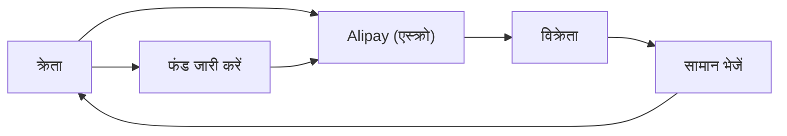

## 1. अलीबाबा की स्थापना
1999 में, जैक मा ने अपने अपार्टमेंट के एक कमरे में 18 साथियों के साथ इसकी स्थापना की। यह एक B2B मैचिंग साइट के रूप में शुरू हुआ।

## 2. Taobao (ताओबाओ) की सफलता
C2C प्लेटफॉर्म Taobao लॉन्च किया गया, जिसने eBay को चीनी बाजार से बाहर करने में बड़ी सफलता हासिल की।

## 3. Alipay द्वारा क्रेडिट निर्माण
चीन में जहां क्रेडिट कार्ड का प्रचलन नहीं था, वहां एस्क्रो भुगतान सेवा "Alipay" का निर्माण किया गया। यह चीन के कैशलेस समाज की नींव बन गया।

## 4. क्लाउड और सिंगल्स डे
Alibaba Cloud द्वारा इंफ्रास्ट्रक्चर का निर्माण और "सिंगल्स डे (11 नवंबर)" का विशाल बिक्री कार्यक्रम, जो आज भी चीन की डिजिटल अर्थव्यवस्था को आगे बढ़ा रहा है।

## अतिरिक्त तकनीकी सत्यापन भाग 1

### 1. अलीबाबा की स्थापना
1999 में, जैक मा ने अपने अपार्टमेंट के एक कमरे में 18 साथियों के साथ इसकी स्थापना की। यह एक B2B मैचिंग साइट के रूप में शुरू हुआ।

### 2. Taobao (ताओबाओ) की सफलता
C2C प्लेटफॉर्म Taobao लॉन्च किया गया, जिसने eBay को चीनी बाजार से बाहर करने में बड़ी सफलता हासिल की।

### 3. Alipay द्वारा क्रेडिट निर्माण
चीन में जहां क्रेडिट कार्ड का प्रचलन नहीं था, वहां एस्क्रो भुगतान सेवा "Alipay" का निर्माण किया गया। यह चीन के कैशलेस समाज की नींव बन गया।

### 4. क्लाउड और सिंगल्स डे
Alibaba Cloud द्वारा इंफ्रास्ट्रक्चर का निर्माण और "सिंगल्स डे (11 नवंबर)" का विशाल बिक्री कार्यक्रम, जो आज भी चीन की डिजिटल अर्थव्यवस्था को आगे बढ़ा रहा है।

## अतिरिक्त तकनीकी सत्यापन भाग 2

### 1. अलीबाबा की स्थापना
1999 में, जैक मा ने अपने अपार्टमेंट के एक कमरे में 18 साथियों के साथ इसकी स्थापना की। यह एक B2B मैचिंग साइट के रूप में शुरू हुआ।

### 2. Taobao (ताओबाओ) की सफलता
C2C प्लेटफॉर्म Taobao लॉन्च किया गया, जिसने eBay को चीनी बाजार से बाहर करने में बड़ी सफलता हासिल की।

### 3. Alipay द्वारा क्रेडिट निर्माण
चीन में जहां क्रेडिट कार्ड का प्रचलन नहीं था, वहां एस्क्रो भुगतान सेवा "Alipay" का निर्माण किया गया। यह चीन के कैशलेस समाज की नींव बन गया।

### 4. क्लाउड और सिंगल्स डे
Alibaba Cloud द्वारा इंफ्रास्ट्रक्चर का निर्माण और "सिंगल्स डे (11 नवंबर)" का विशाल बिक्री कार्यक्रम, जो आज भी चीन की डिजिटल अर्थव्यवस्था को आगे बढ़ा रहा है।

## अतिरिक्त तकनीकी सत्यापन भाग 3

### 1. अलीबाबा की स्थापना
1999 में, जैक मा ने अपने अपार्टमेंट के एक कमरे में 18 साथियों के साथ इसकी स्थापना की। यह एक B2B मैचिंग साइट के रूप में शुरू हुआ।

### 2. Taobao (ताओबाओ) की सफलता
C2C प्लेटफॉर्म Taobao लॉन्च किया गया, जिसने eBay को चीनी बाजार से बाहर करने में बड़ी सफलता हासिल की।

### 3. Alipay द्वारा क्रेडिट निर्माण
चीन में जहां क्रेडिट कार्ड का प्रचलन नहीं था, वहां एस्क्रो भुगतान सेवा "Alipay" का निर्माण किया गया। यह चीन के कैशलेस समाज की नींव बन गया।

### 4. क्लाउड और सिंगल्स डे
Alibaba Cloud द्वारा इंफ्रास्ट्रक्चर का निर्माण और "सिंगल्स डे (11 नवंबर)" का विशाल बिक्री कार्यक्रम, जो आज भी चीन की डिजिटल अर्थव्यवस्था को आगे बढ़ा रहा है।

## अतिरिक्त तकनीकी सत्यापन भाग 4

### 1. अलीबाबा की स्थापना
1999 में, जैक मा ने अपने अपार्टमेंट के एक कमरे में 18 साथियों के साथ इसकी स्थापना की। यह एक B2B मैचिंग साइट के रूप में शुरू हुआ।

### 2. Taobao (ताओबाओ) की सफलता
C2C प्लेटफॉर्म Taobao लॉन्च किया गया, जिसने eBay को चीनी बाजार से बाहर करने में बड़ी सफलता हासिल की।

### 3. Alipay द्वारा क्रेडिट निर्माण
चीन में जहां क्रेडिट कार्ड का प्रचलन नहीं था, वहां एस्क्रो भुगतान सेवा "Alipay" का निर्माण किया गया। यह चीन के कैशलेस समाज की नींव बन गया।

### 4. क्लाउड और सिंगल्स डे
Alibaba Cloud द्वारा इंफ्रास्ट्रक्चर का निर्माण और "सिंगल्स डे (11 नवंबर)" का विशाल बिक्री कार्यक्रम, जो आज भी चीन की डिजिटल अर्थव्यवस्था को आगे बढ़ा रहा है।

## अतिरिक्त तकनीकी सत्यापन भाग 5

### 1. अलीबाबा की स्थापना
1999 में, जैक मा ने अपने अपार्टमेंट के एक कमरे में 18 साथियों के साथ इसकी स्थापना की। यह एक B2B मैचिंग साइट के रूप में शुरू हुआ।

### 2. Taobao (ताओबाओ) की सफलता
C2C प्लेटफॉर्म Taobao लॉन्च किया गया, जिसने eBay को चीनी बाजार से बाहर करने में बड़ी सफलता हासिल की।

### 3. Alipay द्वारा क्रेडिट निर्माण
चीन में जहां क्रेडिट कार्ड का प्रचलन नहीं था, वहां एस्क्रो भुगतान सेवा "Alipay" का निर्माण किया गया। यह चीन के कैशलेस समाज की नींव बन गया।

### 4. क्लाउड और सिंगल्स डे
Alibaba Cloud द्वारा इंफ्रास्ट्रक्चर का निर्माण और "सिंगल्स डे (11 नवंबर)" का विशाल बिक्री कार्यक्रम, जो आज भी चीन की डिजिटल अर्थव्यवस्था को आगे बढ़ा रहा है।

## अतिरिक्त तकनीकी सत्यापन भाग 6

### 1. अलीबाबा की स्थापना
1999 में, जैक मा ने अपने अपार्टमेंट के एक कमरे में 18 साथियों के साथ इसकी स्थापना की। यह एक B2B मैचिंग साइट के रूप में शुरू हुआ।

### 2. Taobao (ताओबाओ) की सफलता
C2C प्लेटफॉर्म Taobao लॉन्च किया गया, जिसने eBay को चीनी बाजार से बाहर करने में बड़ी सफलता हासिल की।

### 3. Alipay द्वारा क्रेडिट निर्माण
चीन में जहां क्रेडिट कार्ड का प्रचलन नहीं था, वहां एस्क्रो भुगतान सेवा "Alipay" का निर्माण किया गया। यह चीन के कैशलेस समाज की नींव बन गया।

### 4. क्लाउड और सिंगल्स डे
Alibaba Cloud द्वारा इंफ्रास्ट्रक्चर का निर्माण और "सिंगल्स डे (11 नवंबर)" का विशाल बिक्री कार्यक्रम, जो आज भी चीन की डिजिटल अर्थव्यवस्था को आगे बढ़ा रहा है।

## अतिरिक्त तकनीकी सत्यापन भाग 7

### 1. अलीबाबा की स्थापना
1999 में, जैक मा ने अपने अपार्टमेंट के एक कमरे में 18 साथियों के साथ इसकी स्थापना की। यह एक B2B मैचिंग साइट के रूप में शुरू हुआ।

### 2. Taobao (ताओबाओ) की सफलता
C2C प्लेटफॉर्म Taobao लॉन्च किया गया, जिसने eBay को चीनी बाजार से बाहर करने में बड़ी सफलता हासिल की।

### 3. Alipay द्वारा क्रेडिट निर्माण
चीन में जहां क्रेडिट कार्ड का प्रचलन नहीं था, वहां एस्क्रो भुगतान सेवा "Alipay" का निर्माण किया गया। यह चीन के कैशलेस समाज की नींव बन गया।

### 4. क्लाउड और सिंगल्स डे
Alibaba Cloud द्वारा इंफ्रास्ट्रक्चर का निर्माण और "सिंगल्स डे (11 नवंबर)" का विशाल बिक्री कार्यक्रम, जो आज भी चीन की डिजिटल अर्थव्यवस्था को आगे बढ़ा रहा है।

## अतिरिक्त तकनीकी सत्यापन भाग 8

### 1. अलीबाबा की स्थापना
1999 में, जैक मा ने अपने अपार्टमेंट के एक कमरे में 18 साथियों के साथ इसकी स्थापना की। यह एक B2B मैचिंग साइट के रूप में शुरू हुआ।

### 2. Taobao (ताओबाओ) की सफलता
C2C प्लेटफॉर्म Taobao लॉन्च किया गया, जिसने eBay को चीनी बाजार से बाहर करने में बड़ी सफलता हासिल की।

### 3. Alipay द्वारा क्रेडिट निर्माण
चीन में जहां क्रेडिट कार्ड का प्रचलन नहीं था, वहां एस्क्रो भुगतान सेवा "Alipay" का निर्माण किया गया। यह चीन के कैशलेस समाज की नींव बन गया।

### 4. क्लाउड और सिंगल्स डे
Alibaba Cloud द्वारा इंफ्रास्ट्रक्चर का निर्माण और "सिंगल्स डे (11 नवंबर)" का विशाल बिक्री कार्यक्रम, जो आज भी चीन की डिजिटल अर्थव्यवस्था को आगे बढ़ा रहा है।

## अतिरिक्त तकनीकी सत्यापन भाग 9

### 1. अलीबाबा की स्थापना
1999 में, जैक मा ने अपने अपार्टमेंट के एक कमरे में 18 साथियों के साथ इसकी स्थापना की। यह एक B2B मैचिंग साइट के रूप में शुरू हुआ।

### 2. Taobao (ताओबाओ) की सफलता
C2C प्लेटफॉर्म Taobao लॉन्च किया गया, जिसने eBay को चीनी बाजार से बाहर करने में बड़ी सफलता हासिल की।

### 3. Alipay द्वारा क्रेडिट निर्माण
चीन में जहां क्रेडिट कार्ड का प्रचलन नहीं था, वहां एस्क्रो भुगतान सेवा "Alipay" का निर्माण किया गया। यह चीन के कैशलेस समाज की नींव बन गया।

### 4. क्लाउड और सिंगल्स डे
Alibaba Cloud द्वारा इंफ्रास्ट्रक्चर का निर्माण और "सिंगल्स डे (11 नवंबर)" का विशाल बिक्री कार्यक्रम, जो आज भी चीन की डिजिटल अर्थव्यवस्था को आगे बढ़ा रहा है।

## अतिरिक्त तकनीकी सत्यापन भाग 10

### 1. अलीबाबा की स्थापना
1999 में, जैक मा ने अपने अपार्टमेंट के एक कमरे में 18 साथियों के साथ इसकी स्थापना की। यह एक B2B मैचिंग साइट के रूप में शुरू हुआ।

### 2. Taobao (ताओबाओ) की सफलता
C2C प्लेटफॉर्म Taobao लॉन्च किया गया, जिसने eBay को चीनी बाजार से बाहर करने में बड़ी सफलता हासिल की।

### 3. Alipay द्वारा क्रेडिट निर्माण
चीन में जहां क्रेडिट कार्ड का प्रचलन नहीं था, वहां एस्क्रो भुगतान सेवा "Alipay" का निर्माण किया गया। यह चीन के कैशलेस समाज की नींव बन गया।

### 4. क्लाउड और सिंगल्स डे
Alibaba Cloud द्वारा इंफ्रास्ट्रक्चर का निर्माण और "सिंगल्स डे (11 नवंबर)" का विशाल बिक्री कार्यक्रम, जो आज भी चीन की डिजिटल अर्थव्यवस्था को आगे बढ़ा रहा है।

## अतिरिक्त तकनीकी सत्यापन भाग 11

### 1. अलीबाबा की स्थापना
1999 में, जैक मा ने अपने अपार्टमेंट के एक कमरे में 18 साथियों के साथ इसकी स्थापना की। यह एक B2B मैचिंग साइट के रूप में शुरू हुआ।

### 2. Taobao (ताओबाओ) की सफलता
C2C प्लेटफॉर्म Taobao लॉन्च किया गया, जिसने eBay को चीनी बाजार से बाहर करने में बड़ी सफलता हासिल की।

### 3. Alipay द्वारा क्रेडिट निर्माण
चीन में जहां क्रेडिट कार्ड का प्रचलन नहीं था, वहां एस्क्रो भुगतान सेवा "Alipay" का निर्माण किया गया। यह चीन के कैशलेस समाज की नींव बन गया।

### 4. क्लाउड और सिंगल्स डे
Alibaba Cloud द्वारा इंफ्रास्ट्रक्चर का निर्माण और "सिंगल्स डे (11 नवंबर)" का विशाल बिक्री कार्यक्रम, जो आज भी चीन की डिजिटल अर्थव्यवस्था को आगे बढ़ा रहा है।

## अतिरिक्त तकनीकी सत्यापन भाग 12

### 1. अलीबाबा की स्थापना
1999 में, जैक मा ने अपने अपार्टमेंट के एक कमरे में 18 साथियों के साथ इसकी स्थापना की। यह एक B2B मैचिंग साइट के रूप में शुरू हुआ।

### 2. Taobao (ताओबाओ) की सफलता
C2C प्लेटफॉर्म Taobao लॉन्च किया गया, जिसने eBay को चीनी बाजार से बाहर करने में बड़ी सफलता हासिल की।

### 3. Alipay द्वारा क्रेडिट निर्माण
चीन में जहां क्रेडिट कार्ड का प्रचलन नहीं था, वहां एस्क्रो भुगतान सेवा "Alipay" का निर्माण किया गया। यह चीन के कैशलेस समाज की नींव बन गया।

### 4. क्लाउड और सिंगल्स डे
Alibaba Cloud द्वारा इंफ्रास्ट्रक्चर का निर्माण और "सिंगल्स डे (11 नवंबर)" का विशाल बिक्री कार्यक्रम, जो आज भी चीन की डिजिटल अर्थव्यवस्था को आगे बढ़ा रहा है।

## अतिरिक्त तकनीकी सत्यापन भाग 13

### 1. अलीबाबा की स्थापना
1999 में, जैक मा ने अपने अपार्टमेंट के एक कमरे में 18 साथियों के साथ इसकी स्थापना की। यह एक B2B मैचिंग साइट के रूप में शुरू हुआ।

### 2. Taobao (ताओबाओ) की सफलता
C2C प्लेटफॉर्म Taobao लॉन्च किया गया, जिसने eBay को चीनी बाजार से बाहर करने में बड़ी सफलता हासिल की।

### 3. Alipay द्वारा क्रेडिट निर्माण
चीन में जहां क्रेडिट कार्ड का प्रचलन नहीं था, वहां एस्क्रो भुगतान सेवा "Alipay" का निर्माण किया गया। यह चीन के कैशलेस समाज की नींव बन गया।

### 4. क्लाउड और सिंगल्स डे
Alibaba Cloud द्वारा इंफ्रास्ट्रक्चर का निर्माण और "सिंगल्स डे (11 नवंबर)" का विशाल बिक्री कार्यक्रम, जो आज भी चीन की डिजिटल अर्थव्यवस्था को आगे बढ़ा रहा है।

## अतिरिक्त तकनीकी सत्यापन भाग 14

### 1. अलीबाबा की स्थापना
1999 में, जैक मा ने अपने अपार्टमेंट के एक कमरे में 18 साथियों के साथ इसकी स्थापना की। यह एक B2B मैचिंग साइट के रूप में शुरू हुआ।

### 2. Taobao (ताओबाओ) की सफलता
C2C प्लेटफॉर्म Taobao लॉन्च किया गया, जिसने eBay को चीनी बाजार से बाहर करने में बड़ी सफलता हासिल की।

### 3. Alipay द्वारा क्रेडिट निर्माण
चीन में जहां क्रेडिट कार्ड का प्रचलन नहीं था, वहां एस्क्रो भुगतान सेवा "Alipay" का निर्माण किया गया। यह चीन के कैशलेस समाज की नींव बन गया।

### 4. क्लाउड और सिंगल्स डे
Alibaba Cloud द्वारा इंफ्रास्ट्रक्चर का निर्माण और "सिंगल्स डे (11 नवंबर)" का विशाल बिक्री कार्यक्रम, जो आज भी चीन की डिजिटल अर्थव्यवस्था को आगे बढ़ा रहा है।
