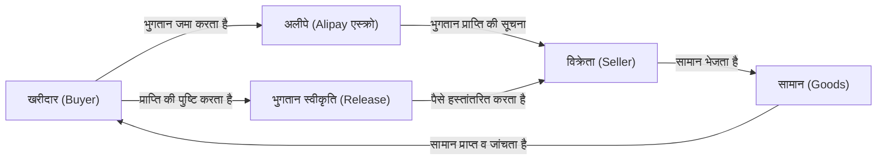

आधुनिक वैश्विक डिजिटल अर्थव्यवस्था की चर्चा करते समय चीनी प्रौद्योगिकी दिग्गज 'अलीबाबा ग्रुप (Alibaba Group)' के अभूतपूर्व प्रभाव को नजरअंदाज करना असंभव है। आज करोड़ों उपभोक्ता स्मार्टफोन पर एक स्पर्श के साथ सामान मंगवाते हैं और कुछ ही पलों में भुगतान पूरा कर लेते हैं। लेकिन चीन में इस सुविधा का आधारभूत ढांचा शून्य से तैयार करने का श्रेय पूरी तरह अलीबाबा को जाता है। अंग्रेजी के एक पूर्व शिक्षक जैक मा (मा युन) ने किस तरह देश के खुदरा बाजार और वित्तीय प्रणाली को बदलकर दुनिया के सबसे बड़े डिजिटल साम्राज्यों में से एक की नींव रखी? यह लेख अलीबाबा के प्रेरक इतिहास और उसके रणनीतिक निर्णयों का विस्तृत विश्लेषण करता है।

## 1. प्रस्थान बिंदु: हांग्जो के एक अपार्टमेंट में स्थापना (1999)

अलीबाबा की यात्रा 1999 में चीन के झेजियांग प्रांत के हांग्जो में स्थित जैक मा के एक साधारण अपार्टमेंट से शुरू हुई। इससे पहले मा ने 'चाइना पेजेस' नामक एक प्रारंभिक इंटरनेट डायरेक्टरी सेवा शुरू की थी, लेकिन उस समय चीन में इंटरनेट की पहुंच बहुत कम थी और कई शुरुआती प्रयास विफल हो गए थे।

इसके बावजूद जैक मा को इंटरनेट द्वारा वैश्विक बाजारों को जोड़ने की क्षमता पर अटूट विश्वास था। 1999 में, उन्होंने अपने अपार्टमेंट में 18 मित्रों और सहयोगियों (प्रसिद्ध '18 संस्थापक') को एकत्र किया और एक महत्वाकांक्षी विजन साझा किया: एक ऐसा ऑनलाइन मंच बनाना जो चीन के छोटे और मध्यम विनिर्माताओं को दुनिया भर के खरीदारों से सीधे जोड़ सके। उस समय चीन तेजी से "दुनिया की फैक्ट्री" बन रहा था, लेकिन लाखों छोटे कारखानों के पास विदेशी ग्राहकों तक सीधे पहुंचने का कोई साधन नहीं था।

इसी सोच से "Alibaba.com" का जन्म हुआ, जो अंतरराष्ट्रीय व्यापार के लिए एक B2B (बिजनेस-टू-बिजनेस) प्लेटफॉर्म था। विदेशी कंपनियों को सीधे चीनी आपूर्तिकर्ताओं से थोक में सामान खरीदने की सुविधा देकर अलीबाबा ने तीव्र गति से विस्तार किया। गोल्डमैन सैक्स और सॉफ्टबैंक (मसायोशी सोन) से मिले शुरुआती निवेश ने इस विस्तार को आवश्यक वित्तीय संबल दिया। विशेष रूप से 2000 में सॉफ्टबैंक द्वारा किया गया 20 मिलियन डॉलर का निवेश आगे चलकर उद्यम पूंजी (Venture Capital) के इतिहास में सबसे सफल और लाभदायक सौदों में से एक साबित हुआ।

## 2. ताओबाओ (Taobao) का जन्म और ईबे (eBay) के साथ ऐतिहासिक मुकाबला (2003)

B2B क्षेत्र में मजबूत पकड़ बनाने के बाद, 2003 में अलीबाबा के सामने एक बड़ा संकट आया। उस समय ऑनलाइन नीलामी की वैश्विक दिग्गज अमेरिकी कंपनी ईबे (eBay) ने चीनी प्लेटफॉर्म 'ईचनेट (EachNet)' का अधिग्रहण कर लिया और भारी पूंजी के साथ चीन के C2C (उपभोक्ता-से-उपभोक्ता) बाजार में उतरी।

जैक मा ने भांप लिया कि यदि ईबे ने चीन के खुदरा बाजार पर एकाधिकार कर लिया, तो वह अंततः अलीबाबा के B2B व्यापार को भी निगल जाएगा। अत्यंत गोपनीयता बरतते हुए, अलीबाबा ने मा के पुराने अपार्टमेंट में एक विशेष टीम बनाई और अपना खुद का C2C प्लेटफॉर्म तैयार किया: "ताओबाओ (Taobao)" (जिसका चीनी भाषा में अर्थ है 'खजाना खोजना')।

ईबे के खिलाफ लड़ाई में ताओबाओ ने एक अत्यंत आक्रामक रणनीति अपनाई: कम से कम तीन साल तक दुकान खोलने और लेनदेन पर शून्य शुल्क (पूर्णतः मुफ्त सेवा)। ईबे प्रत्येक बिक्री पर कमीशन लेता था, जबकि ताओबाओ ने छोटे व्यापारियों को मुफ्त मंच प्रदान किया। इसके अलावा, ताओबाओ ने वेबसाइट को स्थानीय प्राथमिकताओं के अनुरूप डिजाइन किया और "अलीवांगवांग (Aliwangwang)" नामक एक त्वरित संदेश सेवा शुरू की, जिससे खरीदार और विक्रेता सीधे चैट कर सकते थे, मोलभाव कर सकते थे और आपसी विश्वास कायम कर सकते थे।

इसके विपरीत, ईबे ने चीनी उपयोगकर्ताओं को अपने वैश्विक मंच पर जबरन ढालने की कोशिश की, जिससे उसे स्थानीय स्तर पर भारी विफलता और धीमी गति का सामना करना पड़ा। शून्य शुल्क और सटीक स्थानीयकरण के बल पर ताओबाओ ने ईबे से बाजार छीन लिया। 2006 तक ईबे को चीन के C2C बाजार से बाहर होने पर मजबूर होना पड़ा, और ताओबाओ चीन के खुदरा ई-कॉमर्स का निर्विवाद सम्राट बन गया।

## 3. अलीपे (Alipay) का नवाचार: एस्क्रो व्यवस्था से उपजा विश्वास (2004)

ताओबाओ के तेजी से बढ़ते विस्तार के साथ ही अलीबाबा के सामने तत्कालीन चीनी समाज की एक बहुत बड़ी समस्या आई: आपसी विश्वास की घोर कमी।

2000 के दशक की शुरुआत में चीन में क्रेडिट कार्ड का प्रचलन नगण्य था। खरीदारों को डर था कि अग्रिम भुगतान करने पर सामान नहीं मिलेगा, और विक्रेताओं को डर था कि सामान भेजने पर पैसे नहीं मिलेंगे। बैंक ट्रांसफर और कैश-ऑन-डिलीवरी बेहद धीमे तरीके थे जो विशाल स्तर के ई-कॉमर्स को नहीं संभाल सकते थे।

इस विश्वास की कमी को दूर करने के लिए अलीबाबा ने 2004 में "अलीपे (Alipay / 支付寶)" की शुरुआत की। अलीपे ने एक क्रांतिकारी एस्क्रो (तीसरे पक्ष द्वारा सुरक्षित जमा) प्रणाली लागू की:

```mermaid
flowchart LR
    Buyer["खरीदार (Buyer)"] -->|भुगतान जमा करता है| Alipay["अलीपे (Alipay एस्क्रो)"]
    Alipay -->|भुगतान प्राप्ति की सूचना| Seller["विक्रेता (Seller)"]
    Seller -->|सामान भेजता है| Goods["सामान (Goods)"]
    Goods -->|सामान प्राप्त व जांचता है| Buyer
    Buyer -->|प्राप्ति की पुष्टि करता है| Release["भुगतान स्वीकृति (Release)"]
    Release -->|पैसे हस्तांतरित करता है| Seller
```

इस व्यवस्था के तहत खरीदार का पैसा अलीपे के पास सुरक्षित रहता था। जब खरीदार सामान प्राप्त कर लेता था और उसकी पुष्टि कर देता था, तभी वह राशि विक्रेता के खाते में भेजी जाती थी। इस व्यवस्था ने धोखाधड़ी का खतरा पूरी तरह मिटा दिया और अपरिचित लोगों को इंटरनेट पर निर्भय होकर व्यापार करने में सक्षम बनाया।

आगे चलकर अलीपे केवल ताओबाओ का भुगतान साधन न रहकर बिजली-पानी के बिल भुगतान, दुकानों में क्यूआर कोड स्कैनिंग, फंड निवेश (यूए बाओ) और क्रेडिट स्कोरिंग (झिमा क्रेडिट) का एक विशाल वित्तीय मंच बन गया। बाद में 'एंट ग्रुप (Ant Group)' के रूप में स्वतंत्र हुई यह कंपनी चीन को दुनिया के सबसे बड़े कैशलेस समाज में बदलने का मुख्य वाहक बनी।

## 4. टी-मॉल (Tmall) की स्थापना और आधिकारिक ब्रांड्स का उदय (2008)

ताओबाओ को अपार लोकप्रियता मिली, लेकिन C2C प्रकृति के कारण उस पर नकली और घटिया गुणवत्ता के उत्पादों की समस्या उठने लगी। जैसे-जैसे चीनी मध्यवर्ग की आय बढ़ी, असली और प्रतिष्ठित ब्रांडेड उत्पादों की मांग में उछाल आया। इसके समाधान हेतु अलीबाबा ने 2008 में 'ताओबाओ मॉल' लॉन्च किया, जिसे बाद में "टी-मॉल (Tmall / 天貓)" नाम दिया गया।

टी-मॉल एक सख्त चयन प्रक्रिया वाला B2C (बिजनेस-टू-कंज्यूमर) प्लेटफॉर्म था, जहां केवल प्रमाणित आधिकारिक ब्रांड और वितरक ही अपनी दुकानें खोल सकते थे। इससे उपभोक्ताओं को बिना किसी संशय के मूल उत्पाद खरीदने का भरोसा मिला। आज एप्पल, नाइकी और यूनीक्लो जैसे वैश्विक ब्रांड टी-मॉल पर अपने प्रमुख फ्लैगशिप स्टोर संचालित करते हैं।

## 5. अलीबाबा क्लाउड (Aliyun) की शुरुआत और तकनीकी बुनियादी ढांचा (2009)

लेनदेन की संख्या में बेतहाशा वृद्धि होने पर पश्चिमी कंपनियों (IBM, Oracle, EMC) के पारंपरिक हार्डवेयर और डेटाबेस सिस्टम अलीबाबा का भार उठाने में असमर्थ होने लगे और अत्यधिक महंगे साबित हुए। तकनीकी आत्मनिर्भरता की आवश्यकता को समझते हुए, अलीबाबा ने 2009 में अपने स्वयं के क्लाउड कंप्यूटिंग प्रभाग "अलीबाबा क्लाउड (Aliyun)" की स्थापना की।

उस समय चीन के तकनीकी जगत में क्लाउड को लेकर काफी संशय था, लेकिन जैक मा और मुख्य प्रौद्योगिकी वास्तुकार वांग जियान का मानना था कि डेटा और कंप्यूटिंग शक्ति 21वीं सदी का नया कच्चा तेल हैं। अलीबाबा के अपने भारी ट्रैफिक और शॉपिंग फेस्टिवल्स के दबाव में तपकर तैयार हुए इस क्लाउड सिस्टम 'अप्सरा' को बाद में बाहरी उद्यमों और सरकारी संस्थाओं के लिए भी खोला गया। आज अलीबाबा क्लाउड चीन का नंबर एक और दुनिया के अग्रणी क्लाउड प्रदाताओं में से एक है।

## 6. 'सिंगल्स डे (डबल 11)': दुनिया का सबसे बड़ा शॉपिंग फेस्टिवल (2009 — वर्तमान)

अलीबाबा के विपणन कौशल और तकनीकी क्षमता का सबसे बड़ा प्रमाण हर साल 11 नवंबर को आयोजित होने वाला 'सिंगल्स डे' (डबल 11 / 11.11) है।

मूल रूप से 11 नवंबर को चीनी विश्वविद्यालय के छात्र 'अविवाहितों के दिन' (गुआंगगुन जी) के रूप में मनाते थे। उस समय टी-मॉल के प्रमुख और बाद में अलीबाबा के सीईओ बने डैनियल झांग ने इसे "खुद को उपहार देकर खुश करने के दिन" के रूप में एक विशाल शॉपिंग उत्सव में बदल दिया।

2009 में पहले आयोजन में केवल 27 ब्रांड शामिल हुए थे, लेकिन साल-दर-साल इसका विस्तार इतना विशाल हुआ कि यह कुछ ही घंटों में अरबों डॉलर की बिक्री के साथ अमेरिकी 'ब्लैक फ्राइडे' और 'साइबर मंडे' के संयुक्त आंकड़े को भी पीछे छोड़ गया। बिना किसी तकनीकी रुकावट के प्रति सेकंड लाखों ऑर्डरों को संभालने की अलीबाबा क्लाउड की क्षमता इसकी तकनीकी शक्ति का वैश्विक प्रमाण है।

## 7. 'न्यू रिटेल' और ऑनलाइन-ऑफलाइन का संपूर्ण एकीकरण (2016 — वर्तमान)

2016 में जैक मा ने घोषणा की: "केवल ऑनलाइन ई-कॉमर्स का युग समाप्त हो रहा है। भविष्य 'न्यू रिटेल' (New Retail) का है—जहां ऑनलाइन प्लेटफॉर्म, भौतिक स्टोर, आधुनिक लॉजिस्टिक्स और डेटा एक साथ मिलकर काम करेंगे।"

इस अवधारणा का सबसे बेहतरीन उदाहरण अलीबाबा की स्मार्ट सुपरमार्केट श्रृंखला "फ्रेशहिप्पो (Freshippo / हेमी शिआंगशेंग)" है। हेमी स्टोर एक ही समय में प्रीमियम ग्रोसरी स्टोर, सीफूड रेस्तरां और ऑनलाइन ऑर्डर डिलीवरी हब के रूप में कार्य करते हैं। ग्राहक स्टोर में खरीदारी कर सकते हैं या ऐप से ऑर्डर दे सकते हैं, जहां 3 किलोमीटर के दायरे में केवल 30 मिनट में डिलीवरी की गारंटी दी जाती है।

इस लॉजिस्टिक्स प्रणाली का संचालन "काइनियाओ नेटवर्क (Cainiao)" करता है। काइनियाओ स्वयं बड़े पैमाने पर ट्रक या गोदाम खरीदने के बजाय एक एआई-संचालित डेटा प्लेटफॉर्म चलाता है, जो पूरे चीन की निजी कूरियर कंपनियों और वितरण केंद्रों को आपस में जोड़कर उनकी कार्यकुशलता को बढ़ाता है।

## 8. वैश्विक विस्तार और नई चुनौतियाँ

अलीबाबा का विजन केवल चीन तक सीमित नहीं रहा। दक्षिण-पूर्व एशिया में 'लज़ादा (Lazada)', तुर्की में 'ट्रेंडीयोल (Trendyol)' के अधिग्रहण और वैश्विक रिटेल प्लेटफॉर्म 'अलीएक्सप्रेस (AliExpress)' के माध्यम से उसने अपने मूल मंत्र "कहीं भी व्यापार करना आसान बनाना (Make it easy to do business anywhere)" को वैश्विक स्तर पर आगे बढ़ाया।

हालाँकि, हाल के वर्षों में कंपनी को कई गंभीर चुनौतियों का सामना करना पड़ा है। जैक मा के प्रबंधन से हटने के बाद नियामक संस्थाओं ने अलीबाबा पर अपनी पकड़ मजबूत की। 2020 के अंत में एंट ग्रुप के बहुप्रतीक्षित आईपीओ को रोक दिया गया और अलीबाबा पर भारी एंटी-मोनोपॉली जुर्माना लगाया गया।

इसके साथ ही घरेलू बाजार में 'पिंडुओडुओ (Pinduoduo)' और बाइटडांस के लाइव-स्ट्रीम कॉमर्स (Douyin/TikTok) से मिलने वाली कड़ी प्रतिस्पर्धा ने अलीबाबा के सामने नई मुश्किलें खड़ी की हैं। इन चुनौतियों से निपटने के लिए अलीबाबा ने 2023 में अपने पूरे संगठन को छह स्वतंत्र व्यापार समूहों में विभाजित करने का ऐतिहासिक निर्णय लिया, ताकि निर्णय लेने की गति तेज हो सके।

## 9. निष्कर्ष: अलीबाबा की विरासत और भविष्य

1999 में हांग्जो के एक छोटे से अपार्टमेंट से निकलकर खुदरा व्यापार, फिनटेक, स्मार्ट लॉजिस्टिक्स और क्लाउड कंप्यूटिंग के विशाल साम्राज्य तक का अलीबाबा का सफर वास्तव में चीन की आधुनिक डिजिटल अर्थव्यवस्था के विकास का ही इतिहास है।

ईबे को पीछे छोड़ना, अलीपे से विश्वास का निर्माण करना, क्लाउड में आत्मनिर्भरता हासिल करना और न्यू रिटेल का सूत्रपात करना—अलीबाबा ने जो विरासत छोड़ी है, वह आने वाले कई दशकों तक वैश्विक तकनीकी और व्यावसायिक जगत को प्रेरित करती रहेगी।
