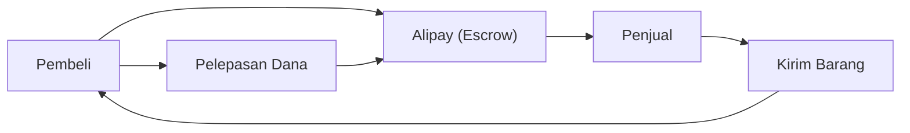

## 1. Pendirian Alibaba
Pada tahun 1999, Jack Ma mendirikan perusahaan ini di sebuah apartemen bersama 18 orang rekannya. Dimulai sebagai situs pencocokan B2B.

## 2. Kesuksesan Taobao (淘宝網)
Meluncurkan Taobao, platform C2C, dan meraih kesuksesan besar yang mendepak eBay dari pasar Tiongkok.

## 3. Penciptaan Kredit oleh Alipay
Di tengah kartu kredit yang belum memasyarakat di Tiongkok, membangun layanan pembayaran escrow "Alipay". Ini menjadi fondasi bagi masyarakat tanpa uang tunai di Tiongkok.

## 4. Cloud dan Hari Jomblo
Melalui pembangunan infrastruktur oleh Alibaba Cloud dan acara obral raksasa "Hari Jomblo (11 November)", hingga kini masih menjadi penggerak ekonomi digital Tiongkok.

## Bagian Verifikasi Teknologi Tambahan 1

## Bagian Verifikasi Teknologi Tambahan 2

## Bagian Verifikasi Teknologi Tambahan 3

## Bagian Verifikasi Teknologi Tambahan 4

## Bagian Verifikasi Teknologi Tambahan 5

## Bagian Verifikasi Teknologi Tambahan 6

## Bagian Verifikasi Teknologi Tambahan 7

## Bagian Verifikasi Teknologi Tambahan 8

## Bagian Verifikasi Teknologi Tambahan 9

## Bagian Verifikasi Teknologi Tambahan 10

## Bagian Verifikasi Teknologi Tambahan 11

## Bagian Verifikasi Teknologi Tambahan 12

## Bagian Verifikasi Teknologi Tambahan 13

## Bagian Verifikasi Teknologi Tambahan 14

