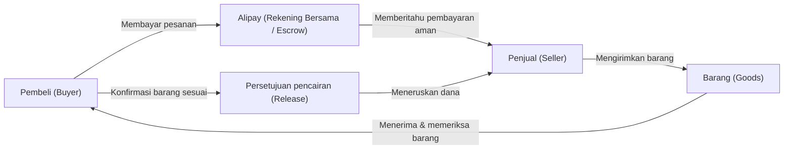

Membahas ekonomi digital global modern tidak akan lengkap tanpa mengulas pengaruh masif dari raksasa teknologi Tiongkok, Alibaba Group. Saat ini, ratusan juta konsumen dapat dengan mudah memesan berbagai macam barang melalui ponsel pintar dan menyelesaikan transaksi dalam hitungan detik. Namun di Tiongkok, infrastruktur mendasar yang mewujudkan kenyamanan ini dibangun dari nol oleh Alibaba. Bagaimana Jack Ma (Ma Yun), seorang mantan guru bahasa Inggris, mampu mengubah wajah ritel dan sistem pembayaran hingga mendirikan salah satu ekosistem digital terkuat di bumi? Artikel ini mengulas secara mendalam sejarah epik Alibaba beserta keputusan-keputusan strategis di setiap titik penting perkembangannya.

## 1. Titik Awal: Pendirian di Apartemen Hangzhou (1999)

Perjalanan Alibaba bermula pada tahun 1999 di dalam apartemen sederhana milik Jack Ma di Hangzhou, Provinsi Zhejiang. Sebelumnya, Ma sempat mendirikan "China Pages", salah satu direktori internet pertama di Tiongkok, tetapi penetrasi internet kala itu masih sangat rendah dan banyak proyek awal berujung pada kegagalan.

Kendati demikian, Ma memegang keyakinan kuat akan potensi internet dalam menyatukan pasar dunia. Pada tahun 1999, ia mengumpulkan 18 teman dan koleganya (dikenal sebagai "18 Pendiri") di apartemennya untuk membagikan sebuah visi besar: membangun platform daring yang menghubungkan industri manufaktur kecil dan menengah di Tiongkok dengan pembeli di seluruh dunia. Ketika itu Tiongkok tengah berkembang pesat menjadi "pabrik dunia", namun jutaan pabrik lokal tidak memiliki akses langsung ke pasar internasional.

Dari visi tersebut lahirlah "Alibaba.com", platform B2B (business-to-business) perdagangan internasional. Dengan memfasilitasi bisnis asing untuk membeli produk grosir langsung dari produsen Tiongkok, Alibaba tumbuh dengan sangat pesat. Suntikan modal penting dari Goldman Sachs dan SoftBank (dipimpin oleh Masayoshi Son) memberi bahan bakar finansial yang krusial. Terutama, investasi senilai US$20 juta dari SoftBank pada tahun 2000 kelak menjadi salah satu langkah investasi ventura paling menguntungkan dan melegenda dalam sejarah bisnis global.

## 2. Kelahiran Taobao dan Perang Epik Melawan eBay (2003)

Setelah mengamankan posisinya di ranah B2B, Alibaba menghadapi ancaman besar pada tahun 2003. Raksasa lelang daring asal Amerika Serikat, eBay, mengakuisisi platform lokal EachNet dan memasuki pasar C2C (consumer-to-consumer) Tiongkok dengan modal melimpah.

Jack Ma menyadari bahwa jika eBay berhasil memonopoli pasar ritel konsumen, cepat atau lambat bisnis B2B Alibaba pun akan terancam. Secara rahasia, Alibaba membentuk tim khusus di apartemen lama Ma untuk mengembangkan platform C2C tandingan: "Taobao" (yang dalam bahasa Mandarin berarti "menggali harta karun").

Menghadapi dominasi eBay, Taobao menerapkan strategi yang sangat berani dan disruptif: membebaskan seluruh biaya listing dan komisi transaksi setidaknya selama tiga tahun. Sementara eBay memungut biaya dari setiap transaksi, Taobao menggratiskan layanan bagi pedagang kecil. Selain itu, Taobao menyesuaikan tata letak situs agar selaras dengan kebiasaan pengguna lokal—menghadirkan visual yang dinamis serta fitur pesan instan "Aliwangwang" yang memungkinkan pembeli dan penjual bernegosiasi, menawar harga, dan membangun rasa saling percaya secara langsung.

Sebaliknya, eBay berupaya menyeragamkan konsumen Tiongkok ke dalam sistem globalnya yang kaku, mengakibatkan kegagalan adaptasi lokal dan penurunan kecepatan akses. Kebijakan bebas biaya dan lokalisasi mendalam membuat Taobao merebut pangsa pasar dengan cepat. Pada tahun 2006, eBay terpaksa menarik diri dari pasar C2C Tiongkok, mengukuhkan Alibaba sebagai penguasa mutlak e-commerce ritel di negara tersebut.

## 3. Inovasi Alipay: Layanan Escrow yang Membangun Kepercayaan (2004)

Seiring lonjakan pengguna Taobao, Alibaba terbentur pada hambatan struktural terbesar dalam ekosistem perdagangan Tiongkok saat itu: ketiadaan rasa saling percaya.

Pada awal dekade 2000-an, kepemilikan kartu kredit di Tiongkok sangat minim. Konsumen khawatir uang yang mereka bayarkan di muka akan hilang tanpa pengiriman barang, sementara penjual takut mengirim barang tanpa jaminan pembayaran. Transfer bank manual dan sistem bayar di tempat (COD) terlalu lambat untuk menopang lonjakan transaksi digital berskala masif.

Demi mengatasi krisis kepercayaan ini, Alibaba meluncurkan "Alipay" (Zhifubao) pada tahun 2004. Alipay mempelopori sistem rekening bersama atau penjaminan pihak ketiga (escrow):

```mermaid
flowchart LR
    Buyer["Pembeli (Buyer)"] -->|Membayar pesanan| Alipay["Alipay (Rekening Bersama / Escrow)"]
    Alipay -->|Memberitahu pembayaran aman| Seller["Penjual (Seller)"]
    Seller -->|Mengirimkan barang| Goods["Barang (Goods)"]
    Goods -->|Menerima & memeriksa barang| Buyer
    Buyer -->|Konfirmasi barang sesuai| Release["Persetujuan pencairan (Release)"]
    Release -->|Meneruskan dana| Seller
```

Dalam sistem ini, dana pembayaran pembeli ditahan secara aman oleh Alipay dan baru diteruskan ke penjual setelah pembeli menerima barang dalam kondisi baik. Inovasi ini melenyapkan rasa takut akan penipuan dan memungkinkan masyarakat yang belum pernah bertemu untuk bertransaksi dengan aman melalui internet.

Alipay kemudian berevolusi melampaui Taobao, mencakup pembayaran tagihan utilitas, transaksi kode QR di toko fisik, reksa dana pasar uang (Yu'e Bao), hingga sistem skor kredit (Zhima Credit). Divisi ini, yang kelak mandiri dengan nama "Ant Group", menjadi pendorong utama transformasi Tiongkok menjadi masyarakat tanpa uang tunai (cashless society) paling maju di dunia.

## 4. Kehadiran Tmall dan Ekspansi ke Pasar B2C Resmi (2008)

Meskipun Taobao mendominasi pasar, sifat terbukanya sebagai platform C2C memunculkan persoalan barang tiruan dan kualitas yang tidak merata. Seiring meningkatnya pendapatan masyarakat Tiongkok, permintaan akan produk orisinal dan merek ternama melonjak tajam. Menjawab kebutuhan ini, Alibaba meluncurkan "Taobao Mall" pada tahun 2008, yang kemudian berganti nama menjadi "Tmall" (Tianmao).

Tmall dirancang sebagai pusat belanja B2C (business-to-consumer) dengan seleksi ketat, hanya memperbolehkan pemilik merek resmi dan distributor terverifikasi untuk membuka toko. Konsumen pun dapat berbelanja produk asli dengan tenang. Saat ini, jenama raksasa global seperti Apple, Nike, dan Uniqlo mengoperasikan toko resmi utama mereka di Tmall, menjadikannya saluran penjualan ritel digital yang mutlak diperlukan di Tiongkok.

## 5. Kelahiran Alibaba Cloud dan Pembangunan Fondasi Teknologi (2009)

Lonjakan transaksi tahunan yang eksponensial membuat sistem komputasi dan basis data konvensional dari vendor barat (IBM, Oracle, EMC) tidak lagi sanggup mengimbangi beban dan memakan biaya yang terlampau besar. Menyadari risiko ketergantungan teknologi ini, Alibaba mendirikan divisi komputasi awan mandiri pada tahun 2009: "Alibaba Cloud" (Aliyun).

Kala itu, banyak pihak meragukan prospek komputasi awan di Tiongkok. Namun Jack Ma dan kepala arsitek teknologi Wang Jian meyakini bahwa data dan daya komputasi akan menjadi minyak penggerak utama pada abad ke-21. Ditempa oleh arus transaksi masif di internal Alibaba, sistem awan Apsara akhirnya dibuka untuk korporasi swasta dan lembaga pemerintah. Kini, Alibaba Cloud merupakan penyedia layanan komputasi awan nomor satu di Tiongkok dan salah satu yang terbesar di kancah global.

## 6. Festival Belanja "Singles' Day (Double 11)": Terbesar di Dunia (2009 - sekarang)

Wujud nyata dari kepiawaian pemasaran dan kekuatan teknologi Alibaba tercermin dalam festival belanja tahunan "Singles' Day" (Double 11 / 11.11) setiap tanggal 11 November.

Mulanya, tanggal 11 November dirayakan secara santai oleh mahasiswa Tiongkok sebagai "Hari Lajang" (Guanggun Jie). Daniel Zhang, yang saat itu memimpin Tmall dan kelak menjabat CEO Alibaba, mengubah momen tersebut menjadi festival belanja besar-besaran untuk "memanjakan diri sendiri dengan berbelanja".

Dimulai pada tahun 2009 dengan hanya 27 jenama terdaftar, festival ini bertransformasi menjadi fenomena konsumsi global dengan nilai transaksi puluhan miliar dolar hanya dalam waktu beberapa jam, melampaui gabungan Black Friday dan Cyber Monday di Amerika Serikat. Kemampuan Alibaba Cloud memproses ratusan ribu pesanan per detik tanpa gangguan menjadi bukti ketangguhan infrastruktur teknologi digitalnya.

## 7. Konsep "New Retail" dan Integrasi Menyeluruh (2016 - sekarang)

Pada tahun 2016, Jack Ma menyatakan: "Era e-commerce murni akan segera berakhir. Masa depan adalah milik 'New Retail' (Ritel Baru)—integrasi terpadu antara kanal online, toko fisik, logistik cerdas, dan analisis data waktu nyata."

Konsep ini diwujudkan melalui jaringan supermarket cerdas milik Alibaba, "Freshippo" (Hema Xiansheng). Di Hema, setiap gerai berfungsi ganda sebagai supermarket premium, restoran makanan laut segar, sekaligus pusat pemenuhan pesanan daring. Konsumen dapat berbelanja langsung di gerai atau memesan via aplikasi dengan jaminan pengiriman hanya 30 menit untuk radius tiga kilometer.

Kekuatan logistik kilat ini ditopang oleh "Cainiao Network", tulang punggung data logistik Alibaba. Alih-alih membeli ribuan armada truk secara fisik, Cainiao mengoperasikan platform data berbasis kecerdasan buatan yang mengoordinasikan serta mengoptimalkan rute jaringan ekspedisi pihak ketiga di seluruh pelosok negeri.

## 8. Langkah Globalisasi dan Tantangan Strategis Baru

Jangkauan Alibaba tidak berhenti di pasar domestik Tiongkok. Melalui akuisisi platform besar seperti Lazada di Asia Tenggara dan Trendyol di Turki, serta pengembangan pasar ekspor langsung AliExpress, Alibaba aktif merealisasikan misi awalnya: "Memudahkan bisnis dilakukan di mana saja" (Make it easy to do business anywhere).

Meskipun demikian, perjalanan beberapa tahun terakhir menghadirkan ujian yang cukup berat. Seiring langkah mundur Jack Ma dari jajaran manajemen operasional, Alibaba menghadapi pengawasan regulasi pemerintah yang kian ketat. Pada akhir tahun 2020, rencana IPO Ant Group ditangguhkan oleh otoritas keuangan, disusul sanksi antimonopoli terhadap entitas Alibaba.

Di saat yang sama, persaingan kian sengit dengan melejitnya Pinduoduo di segmen perdagangan sosial berharga terjangkau dan ekspansi ByteDance (lewat Douyin/TikTok) di ranah live-shopping. Menanggapi dinamika ini, pada tahun 2023 Alibaba mengumumkan restrukturisasi terbesar dalam sejarahnya dengan membagi korporasi menjadi enam grup bisnis independen guna memulihkan kelincahan dan memacu kembali inovasi.

## 9. Kesimpulan: Warisan dan Pandangan Masa Depan Alibaba

Dari sebuah apartemen sederhana di Hangzhou pada tahun 1999 hingga berkembang menjadi konglomerat teknologi yang menaungi e-commerce, tekfin, logistik pintar, dan komputasi awan, Alibaba telah membentuk cetak biru ekonomi digital Tiongkok.

Kemenangan atas eBay, pembangunan kepercayaan melalui Alipay, keberanian berinvestasi pada teknologi awan, dan perintisan konsep New Retail menjadi babak penting dalam sejarah inovasi bisnis global. Walau dihadapkan pada regulasi baru dan persaingan yang kian ketat, modal teknologi dan jiwa kewirausahaan yang dibangun Alibaba selama seperempat abad akan terus memainkan peran sentral dalam masa depan perdagangan digital dunia.
