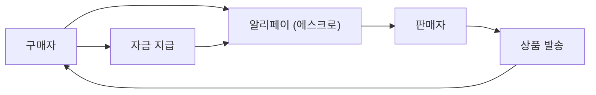

## 1. 알리바바의 창업
1999년, 마윈이 아파트 방 하나에서 18명의 동료와 함께 창업. B2B 매칭 사이트로 시작했습니다.

## 2. Taobao(타오바오)의 성공
C2C 플랫폼인 Taobao를 출시하여, eBay를 중국 시장에서 철수시키는 큰 성공을 거두었습니다.

## 3. Alipay를 통한 신용 창출
중국에서 신용카드가 보급되지 않은 가운데, 에스크로 결제 서비스 'Alipay'를 구축. 이것이 중국의 캐시리스 사회의 기반이 되었습니다.

## 4. 클라우드와 광군제
Alibaba Cloud에 의한 인프라 구축이나, '광군제(11월 11일)'의 거대한 세일 이벤트 등, 현재도 중국의 디지털 경제를 견인하고 있습니다.

## 추가 기술 검증 파트 1

### 1. 알리바바의 창업
1999년, 마윈이 아파트 방 하나에서 18명의 동료와 함께 창업. B2B 매칭 사이트로 시작했습니다.

## 추가 기술 검증 파트 2

### 1. 알리바바의 창업
1999년, 마윈이 아파트 방 하나에서 18명의 동료와 함께 창업. B2B 매칭 사이트로 시작했습니다.

## 추가 기술 검증 파트 3

### 1. 알리바바의 창업
1999년, 마윈이 아파트 방 하나에서 18명의 동료와 함께 창업. B2B 매칭 사이트로 시작했습니다.

## 추가 기술 검증 파트 4

### 1. 알리바바의 창업
1999년, 마윈이 아파트 방 하나에서 18명의 동료와 함께 창업. B2B 매칭 사이트로 시작했습니다.

## 추가 기술 검증 파트 5

### 1. 알리바바의 창업
1999년, 마윈이 아파트 방 하나에서 18명의 동료와 함께 창업. B2B 매칭 사이트로 시작했습니다.

## 추가 기술 검증 파트 6

### 1. 알리바바의 창업
1999년, 마윈이 아파트 방 하나에서 18명의 동료와 함께 창업. B2B 매칭 사이트로 시작했습니다.

## 추가 기술 검증 파트 7

### 1. 알리바바의 창업
1999년, 마윈이 아파트 방 하나에서 18명의 동료와 함께 창업. B2B 매칭 사이트로 시작했습니다.

## 추가 기술 검증 파트 8

### 1. 알리바바의 창업
1999년, 마윈이 아파트 방 하나에서 18명의 동료와 함께 창업. B2B 매칭 사이트로 시작했습니다.

## 추가 기술 검증 파트 9

### 1. 알리바바의 창업
1999년, 마윈이 아파트 방 하나에서 18명의 동료와 함께 창업. B2B 매칭 사이트로 시작했습니다.

## 추가 기술 검증 파트 10

### 1. 알리바바의 창업
1999년, 마윈이 아파트 방 하나에서 18명의 동료와 함께 창업. B2B 매칭 사이트로 시작했습니다.

## 추가 기술 검증 파트 11

### 1. 알리바바의 창업
1999년, 마윈이 아파트 방 하나에서 18명의 동료와 함께 창업. B2B 매칭 사이트로 시작했습니다.

## 추가 기술 검증 파트 12

### 1. 알리바바의 창업
1999년, 마윈이 아파트 방 하나에서 18명의 동료와 함께 창업. B2B 매칭 사이트로 시작했습니다.

## 추가 기술 검증 파트 13

### 1. 알리바바의 창업
1999년, 마윈이 아파트 방 하나에서 18명의 동료와 함께 창업. B2B 매칭 사이트로 시작했습니다.

## 추가 기술 검증 파트 14

### 1. 알리바바의 창업
1999년, 마윈이 아파트 방 하나에서 18명의 동료와 함께 창업. B2B 매칭 사이트로 시작했습니다.

