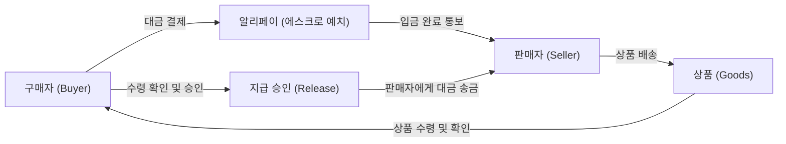

현대 글로벌 디지털 경제를 논할 때 중국의 거대 테크 기업인 '알리바바 그룹(Alibaba Group)'을 빼놓을 수 없습니다. 오늘날 스마트폰 터치 몇 번으로 물건을 주문하고 순식간에 결제를 완료하는 것은 수억 명의 일상이 되었습니다. 그러나 중국에서 이러한 인프라를 무(無)에서 유(有)로 일궈낸 주인공이 바로 알리바바입니다. 영어 교사 출신인 잭 마(마윈)는 어떻게 중국의 유통과 금융을 근본적으로 바꾸고 세계 최대 규모의 디지털 생태계를 구축했을까요? 본 기사에서는 알리바바의 파란만장한 역사와 주요 분기점마다 단행된 전략적 결단을 심층 조명합니다.

## 1. 출발점: 항저우 아파트에서의 창업 (1999년)

알리바바의 역사는 1999년 중국 저장성 항저우에 위치한 잭 마의 작은 아파트에서 시작되었습니다. 마윈은 앞서 인터넷 디렉터리 서비스인 '차이나 페이지(China Pages)'를 창업한 경험이 있었으나, 당시 중국의 인터넷 보급률은 극히 낮았고 많은 도전이 실패로 끝났습니다.

그러나 그는 인터넷이 가진 '세계를 연결하는 힘'을 굳게 믿었습니다. 1999년, 마윈은 18명의 동료(공동 창업자들)를 아파트에 불러 모아 거대한 비전을 제시했습니다. 그것은 바로 "중국의 수많은 중소 제조업체와 글로벌 바이어를 연결하는 플랫폼을 만든다"는 것이었습니다. 당시 중국은 '세계의 공장'으로 급부상하고 있었지만, 대다수 중소 제조사들은 해외 바이어를 직접 만날 통로가 전무했습니다.

그렇게 탄생한 것이 B2B(기업 간 거래) 매칭 플랫폼인 '알리바바닷컴(Alibaba.com)'이었습니다. 해외 기업들이 중국 공급업체로부터 대량으로 물품을 소싱할 수 있는 장을 열어주면서 알리바바는 비약적인 성장을 거듭했습니다. 골드만삭스와 소프트뱅크(손정의 회장)로부터의 초기 투자는 결정적인 도약의 계기가 되었습니다. 특히 소프트뱅크의 2,000만 달러 투자는 훗날 벤처 투자 역사상 가장 성공적인 투자 사례 중 하나로 기록되었습니다.

## 2. 타오바오(Taobao)의 탄생과 이베이(eBay)와의 격전 (2003년)

B2B 시장에서 확고한 입지를 굳히던 알리바바는 2003년 중대한 도전에 직면합니다. 당시 세계 최대의 전자상거래 경매 사이트였던 미국의 이베이(eBay)가 중국의 '이취왕(EachNet)'을 인수하며 막대한 자본과 함께 중국 C2C(소비자 간 거래) 시장에 전면 진출한 것입니다.

마윈은 이베이가 중국 소비자 시장을 장악하면 알리바바의 본업인 B2B 시장까지 잠식당할 것이라 판단했습니다. 이에 알리바바는 비밀 프로젝트 팀을 결성하여 마윈의 옛 아파트에서 독자적인 C2C 플랫폼인 '타오바오(Taobao, 淘寶網)'를 개발했습니다. '타오바오'는 중국어로 '보물을 캐낸다'는 뜻입니다.

이베이와의 건곤일척 승부에서 타오바오가 취한 무기는 파격적인 '수수료 전면 무료화'였습니다. 거래마다 수수료를 부과하던 이베이에 맞서, 타오바오는 최소 3년간 입점료와 거래 수수료를 100% 무료로 하겠다고 선언했습니다. 나아가 타오바오는 중국 소비자들의 기호에 맞춰 사이트를 화려하고 정보량이 풍부하게 디자인했으며, 구매자와 판매자가 실시간으로 대화하고 흥정할 수 있는 메신저 기능인 '알리왕왕(Aliwangwang)'을 탑재했습니다.

반면 이베이는 중국 사용자들을 글로벌 통합 플랫폼에 무리하게 맞추려다 철저한 현지화 실패와 속도 저하를 겪었습니다. 결국 수수료 무료 정책과 완벽한 현지화 전략에 힘입어 타오바오는 이베이를 밀어내고 시장 점유율을 완전히 장악했습니다. 2006년 이베이는 사실상 중국 C2C 시장에서 철수해야만 했습니다.

## 3. 알리페이(Alipay)의 혁신: 신뢰를 창조한 에스크로 결제 (2004년)

타오바오가 폭발적으로 성장하면서 알리바바는 당시 중국 사회의 치명적인 구조적 문제에 직면했습니다. 바로 '신용(신뢰)의 결여'였습니다.

2000년대 초반 중국은 신용카드 보급률이 극히 낮았으며, 구매자는 "돈을 먼저 보내면 물건을 안 보낼까 봐", 판매자는 "물건을 먼저 보내면 돈을 떼일까 봐" 서로를 극도로 불신했습니다. 기존의 은행 송금이나 착불 택배 시스템으로는 이커머스의 대폭발을 감당할 수 없었습니다.

이 불신의 장벽을 깨부수기 위해 2004년에 탄생한 것이 바로 '알리페이(Alipay, 支付寶)'입니다. 알리페이는 제3자 예치 방식인 '에스크로(Escrow)' 시스템을 전격 도입했습니다:

```mermaid
flowchart LR
    Buyer["구매자 (Buyer)"] -->|대금 결제| Alipay["알리페이 (에스크로 예치)"]
    Alipay -->|입금 완료 통보| Seller["판매자 (Seller)"]
    Seller -->|상품 배송| Goods["상품 (Goods)"]
    Goods -->|상품 수령 및 확인| Buyer
    Buyer -->|수령 확인 및 승인| Release["지급 승인 (Release)"]
    Release -->|판매자에게 대금 송금| Seller
```

이 시스템을 통해 구매자가 결제한 금액은 알리페이가 임시로 보관하며, 구매자가 상품을 실제로 받아보고 확인한 뒤에야 비로소 판매자에게 대금이 정산됩니다. 이 혁신적인 메커니즘 덕분에 일면식도 없는 낯선 사람들끼리 안심하고 온라인 거래를 진행할 수 있게 되었습니다.

알리페이는 타오바오 결제 수단을 넘어 공과금 납부, 오프라인 QR코드 모바일 결제, 자산 관리(위어바오), 신용 평가(즈마신용) 등으로 영역을 넓혀갔습니다. 훗날 '앤트그룹(Ant Group)'으로 독립하게 되는 이 핀테크 플랫폼은 중국을 세계에서 가장 앞선 '현금 없는 사회'로 이끈 결정적 원동력이 되었습니다.

## 4. 티몰(Tmall)의 출범과 B2C 브랜드화 (2008년)

타오바오의 대성공으로 시장을 장악한 알리바바였지만, C2C 특성상 위조품(짝퉁)이나 조악한 품질의 상품이 유통되는 문제가 대두되었습니다. 중국 중산층의 소득이 증가하면서 정품과 프리미엄 브랜드에 대한 수요가 급증하자, 알리바바는 2008년 '타오바오 몰(이후 티몰 / 天貓)'을 선보였습니다.

티몰은 엄격한 심사를 통과한 정식 브랜드 및 공식 대리점만 입점할 수 있는 B2C(기업과 소비자 간 거래) 플랫폼이었습니다. 이를 통해 소비자들은 가품 걱정 없이 국내외 유명 브랜드 제품을 신뢰하고 구매할 수 있게 되었습니다. 현재 애플, 나이키, 유니클로 등 글로벌 톱 브랜드들이 티몰 플래그십 스토어를 운영하고 있으며, 중국 시장 진출의 필수 관문으로 자리 잡았습니다.

## 5. 알리바바 클라우드(Aliyun)의 탄생과 기술 인프라 구축 (2009년)

플랫폼의 트래픽이 기하급수적으로 폭증하자, 기존의 외산 하드웨어와 데이터베이스(IBM, Oracle, EMC 등)로는 비용과 확장성의 한계에 부딪혔습니다. 이에 알리바바는 2009년 독자적인 클라우드 컴퓨팅 부문인 '알리바바 클라우드(Aliyun)'를 설립했습니다.

당시 중국 IT 업계에서는 클라우드의 실효성에 대한 회의론이 지배적이었지만, 마윈과 경영진은 "데이터와 컴퓨팅 파워야말로 미래 비즈니스의 원유"라고 확신했습니다. 자체 대규모 트래픽과 광군제 트래픽을 처리하며 극한의 담금질을 거친 알리바바 클라우드는 외부 기업과 공공기관에도 개방되었고, 현재 중국 1위이자 글로벌 선두권의 클라우드 서비스 기업으로 확고히 자리 잡았습니다.

## 6. '광군제(Double 11)': 세계 최대의 쇼핑 축제 (2009년〜현재)

알리바바의 압도적인 마케팅 능력과 기술력을 증명하는 대표적인 상징이 바로 매년 11월 11일에 열리는 '광군제(솔로 데이 / 쌍11)' 세일입니다.

원래 11월 11일은 중국 젊은이들 사이에서 솔로를 위로하며 장난삼아 기념하던 날이었습니다. 당시 타오바오 몰의 총괄 책임자이자 훗날 알리바바 CEO가 되는 대니얼 장(장융)은 이 날을 "나 자신을 위한 힐링 쇼핑의 날"이라는 대규모 축제로 기획했습니다.

2009년 첫 회에는 27개 브랜드만이 참가했으나, 회를 거듭할수록 규모가 폭발적으로 팽창하여 수십조 원의 매출을 기록하는 세계 최대의 쇼핑 이벤트로 성장했습니다. 미국의 블랙프라이데이와 사이버먼데이를 합친 규모를 훌쩍 뛰어넘는 이 축제에서 초당 수십만 건의 거래를 무중단으로 처리해내는 알리바바 클라우드의 기술력은 전 세계의 감탄을 자아냈습니다.

## 7. '신유통(New Retail)'과 옴니채널 생태계의 완성 (2016년〜현재)

2016년 마윈은 "순수한 전자상거래의 시대는 끝났다. 앞으로는 온·오프라인, 물류, 데이터가 완전히 융합된 '신유통(新零售)'의 시대가 올 것"이라고 선언했습니다.

이 개념을 완벽하게 구현한 것이 바로 알리바바의 스마트 신선식품 슈퍼마켓 '허마셴셩(Freshippo / 盒馬鮮生)'입니다. 허마 매장은 단순한 오프라인 점포가 아니라, 신선식품 체험 레스토랑이자 온라인 주문을 즉시 패킹하여 배송하는 도심형 물류 센터 역할을 겸합니다. 매장 반경 3km 이내 고객에게 30분 만에 배송하는 혁신적인 물류 체계를 완성했습니다.

이를 떠받치는 물류 백본이 바로 '차이냐오(Cainiao)'입니다. 차이냐오는 직접 트럭이나 창고를 대규모로 사들이는 대신, 빅데이터와 지능형 알고리즘을 통해 중국 전역의 민간 택배사들을 네트워크로 통합하여 배송 효율을 극대화하는 물류 데이터 플랫폼입니다.

## 8. 글로벌 확장과 맞닥뜨린 새로운 도전 과제

알리바바의 비전은 중국 내에만 머무르지 않았습니다. 동남아의 '라자다(Lazada)', 튀르키예의 '트렌디욜(Trendyol)', 글로벌 소비자 직구 플랫폼인 '알리익스프레스(AliExpress)' 등을 통해 세계 시장을 적극 공략했습니다. 창업 초기부터 견지해 온 "어디서나 비즈니스를 쉽게 할 수 있도록 돕는다(Make it easy to do business anywhere)"는 사명은 전 세계로 확장되었습니다.

하지만 최근 몇 년간 알리바바는 적지 않은 도전에 직면했습니다. 마윈이 경영 일선에서 물러난 이후 2020년 말 앤트그룹의 사상 최대 규모 IPO가 규제 당국에 의해 보류되었고, 반독점 규제로 인한 막대한 과징금을 부과받기도 했습니다.

아울러 중국 내에서는 '핀둬둬(Pinduoduo)'와 바이트댄스의 '도우인(Douyin, 틱톡의 중국 버전)' 등 신흥 강자들의 거센 도전을 받고 있습니다. 이에 대응하여 알리바바는 2023년 조직을 6대 독립 사업 그룹으로 분할하는 대대적인 지배구조 개편을 단행하며 기동성과 혁신 역량을 회복하기 위한 새로운 도정에 올랐습니다.

## 9. 맺음말: 알리바바가 남긴 유산과 미래

1999년 항저우의 낡은 아파트에서 출발한 알리바바는 단순한 인터넷 기업을 넘어 중국의 소매 유통, 디지털 금융, 물류 및 클라우드 컴퓨팅 인프라를 총괄하는 거대한 디지털 생태계로 성장했습니다.

이베이와의 승부, 에스크로를 통한 신뢰 구축, 클라우드에 대한 선제적 투자, 신유통 혁신 등 알리바바가 걸어온 길은 중국 디지털 경제 발전의 역사 그 자체였습니다. 급변하는 규제 환경과 치열한 시장 경쟁 속에서도, 지난 25년간 알리바바가 축적해 온 기술력과 비즈니스 혁신의 DNA는 앞으로도 글로벌 테크 지형도에서 강력한 영향력을 발휘할 것입니다.
