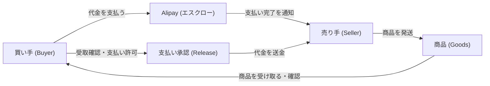

現代のデジタル経済を語る上で、中国の巨大テクノロジー企業「アリババ・グループ（Alibaba Group / 阿里巴巴集団）」の存在を無視することはできません。今日、私たちはスマートフォン一つであらゆる商品を注文し、瞬時に決済を完了させることができますが、中国においてこの「当たり前」のインフラをゼロから構築したのがアリババです。英語教師であったジャック・マー（馬雲）がいかにして中国の小売と決済を変革し、世界最大規模のデジタルエコシステムを築き上げたのか。本記事では、その壮大な歴史と各転換点における戦略的決定について、詳細に紐解いていきます。

## 1. 原点：杭州のアパートでの起業（1999年）

アリババの物語は、1999年の中国・浙江省杭州市にあるジャック・マーのアパートの一室から始まりました。マーは過去に「China Pages」というインターネットディレクトリサービスを立ち上げるなどの起業経験を持っていましたが、当時の中国ではまだインターネットの普及率は低く、多くの挑戦は失敗に終わっていました。

しかし、彼はインターネットが持つ「世界をつなぐ力」を強く信じていました。1999年、マーは18人の仲間（共同創業者たち）をアパートに集め、新たなビジョンを語りかけました。それは、「中国の中小企業をグローバルな市場とつなぐプラットフォームを作る」というものでした。当時の中国は「世界の工場」として急速に成長していましたが、多くの中小製造業者は海外のバイヤーと直接つながる手段を持っていませんでした。

そこで誕生したのが、B2B（企業間取引）のマッチングサイト「Alibaba.com」です。海外の企業が中国のサプライヤーから製品を大量に仕入れるためのプラットフォームとして、アリババは急速に成長を遂げました。ゴールドマン・サックスやソフトバンク（孫正義氏）からの初期投資を受けたことは、アリババの飛躍的な成長に向けた強力な後押しとなりました。特に、ソフトバンクからの2000万ドルの出資は、後にテクノロジー投資の歴史において最も成功したディールの一つとして語り継がれることになります。

## 2. Taobao（淘宝網）の誕生とeBayとの壮絶な戦い（2003年）

B2B市場で確固たる地位を築きつつあったアリババですが、2003年に大きな転機が訪れます。当時の世界最大のオークションサイトである米国のeBayが中国の「EachNet（易趣）」を買収し、中国のC2C（消費者間取引）市場に本格参入したのです。

ジャック・マーは、eBayがC2C市場を制覇すれば、いずれB2B市場にも脅威を及ぼすと考えました。そこでアリババは秘密裏にプロジェクトチームを結成し、独自のC2Cプラットフォーム「Taobao（淘宝網）」を開発しました。「淘宝」とは中国語で「宝探し」を意味します。

eBayとの戦いにおいて、Taobaoが取った戦略は非常にシンプルかつ破壊的なものでした。それは「出品手数料と取引手数料の完全無料化」です。eBayはプラットフォームでの取引に手数料を課していましたが、Taobaoは最低3年間は無料であると宣言しました。さらに、Taobaoは中国の消費者の嗜好に合わせ、サイトのデザインを賑やかで情報量の多いものにし、買い手と売り手が直接チャットで交渉できる「Aliwangwang（阿里旺旺）」というインスタントメッセンジャー機能を組み込みました。

これに対し、eBayはグローバルな統一プラットフォームに中国のユーザーを統合しようとしたため、ローカライズに失敗し、システムの動作も遅くなってしまいました。最終的に、手数料無料と徹底的なローカリゼーション戦略が功を奏し、TaobaoはeBayから中国市場のシェアを奪い取ることに成功。2006年にeBayは実質的に中国のC2C市場から撤退を余儀なくされました。

## 3. Alipay（支付宝）の革新：信用を創造したエスクロー決済（2004年）

Taobaoの急成長に伴い、アリババは中国市場特有の大きな壁に直面しました。「信用」の問題です。

当時の中国ではクレジットカードの普及率が非常に低く、消費者は「お金を払っても商品が届かないのではないか」、出品者は「商品を発送してもお金が支払われないのではないか」という根強い不信感を抱えていました。銀行振込や代金引換が主流でしたが、これではEコマースの爆発的な成長は望めません。

この「信用の欠如」という課題を解決するために2004年に生み出されたのが「Alipay（支付宝）」です。Alipayは「エスクロー（第三者預託）」という仕組みを採用しました。

この図に示されるように、買い手が支払った代金は一時的にAlipayが預かり、買い手が無事に商品を受け取って確認した後に初めて、Alipayから売り手へと代金が送金されます。この革新的な仕組みにより、見知らぬ人同士でも安心して取引を行うことができるようになりました。

Alipayは単なるTaobaoの決済ツールにとどまらず、公共料金の支払いや実店舗でのQRコード決済、さらには資産運用（余額宝）や信用スコア（芝麻信用）へと機能を拡大させていきました。のちに「アント・グループ（Ant Group）」として独立するこの決済プラットフォームは、中国を一気にキャッシュレス社会へと押し上げる最大の原動力となりました。

## 4. Tmall（天猫）の設立とB2Cへの拡大（2008年）

Taobaoの成功によって中国最大のEコマースプラットフォームとなったアリババですが、TaobaoはC2C（消費者間取引）であるため、偽物や品質の低い商品が流通しやすいという課題もありました。中国の消費者の所得が向上し、正規品や高品質なブランド品へのニーズが高まる中、アリババは2008年に「Taobao Mall（のちのTmall / 天猫）」を立ち上げました。

Tmallは、厳しい審査を通過したブランドや正規代理店のみが出店できるB2C（企業対消費者）プラットフォームです。これにより、消費者は偽物の心配をすることなく、国内外の有名ブランド製品を安心して購入できるようになりました。現在では、ユニクロやApple、ナイキといったグローバルブランドの多くがTmallに旗艦店を構えており、中国市場における不可欠な販売チャネルとなっています。

## 5. アリババクラウド（阿里雲）の誕生とインフラへの投資（2009年）

Eコマースプラットフォームのトラフィックが爆発的に増加するにつれ、アリババは巨大なコンピューティング能力を必要とするようになりました。他社のサーバーやデータベースに依存することの限界とコストを悟ったアリババは、2009年に自社でクラウドコンピューティング事業「Alibaba Cloud（阿里雲）」を立ち上げました。

当時、クラウド・コンピューティングの将来性について中国国内では懐疑的な見方も多くありましたが、ジャック・マーとアリババの経営陣は、データこそが未来のビジネスの原油であると確信していました。自社の巨大なトラフィックを処理するために鍛え上げられたAlibaba Cloudは、やがて外部の企業や政府機関にも提供されるようになり、現在では中国最大のクラウドサービスプロバイダー、そして世界でもトップクラスのシェアを誇るまでに成長しました。

## 6. 「独身の日（ダブルイレブン）」：世界最大のショッピングフェスティバルの創出（2009年〜）

アリババの卓越したマーケティング力と技術力を象徴するのが、毎年11月11日に開催される「独身の日（ダブルイレブン / 双11）」セールです。

もともと11月11日は、中国の若者の間で「光棍節（独身者の日）」として冗談半分で祝われていた非公式な記念日でした。当時のTmallの責任者であり、後にジャック・マーの後継者としてCEOとなるダニエル・チャン（張勇）は、この日を「独身の自分へのご褒美として買い物をする日」として大規模なセールイベントに仕立て上げました。

2009年の第1回目は参加ブランドも少なく、売上もわずか数億円規模でしたが、年を追うごとに規模は桁違いに拡大。現在では、開始数分で数兆円の売上を記録し、アメリカのブラックフライデーとサイバーマンデーを足したものよりもはるかに規模の大きい、世界最大のショッピング・フェスティバルとなりました。この日に発生する毎秒数十万件という驚異的なトランザクションをダウンすることなく処理し続けるAlibaba Cloudの技術力は、アリババのエコシステムの強靭さを世界に証明しています。

## 7. 「ニューリテール（新小売）」の提唱とエコシステムの完成（2016年〜）

2016年、ジャック・マーは「純粋なEコマースの時代は終わる。これからはオンラインとオフライン、物流、データが完全に統合された『ニューリテール（新小売）』の時代が来る」と提唱しました。

このコンセプトを具現化したのが、アリババが展開するスーパーマーケット「Freshippo（盒馬鮮生 / フーマー）」です。フーマーでは、店舗は単なる売り場ではなく、オンライン注文の配送センターも兼ねています。顧客は店舗で商品を見てスマートフォンのアプリで決済し、そのまま持ち帰ることも、自宅に配送してもらうことも可能です。店舗から半径3キロ以内であれば最短30分で商品が届くという驚異的な物流システムを実現しています。

これを支えているのが、アリババの物流部門である「Cainiao（菜鳥網絡）」です。Cainiaoは自社で大量のトラックや倉庫を所有するのではなく、データとテクノロジーを駆使して中国全土の物流会社をネットワーク化し、配送の最適化を図るデータプラットフォームです。

## 8. グローバル化と直面する新たな課題

アリババの野望は中国国内にとどまりません。東南アジアの「Lazada」、トルコの「Trendyol」、そしてグローバル向けC2Cの「AliExpress」などを通じて、グローバル市場への進出を積極的に進めてきました。「世界中のどこでも簡単にビジネスができるようにする」という創業時からのミッション（Make it easy to do business anywhere）は、着実に世界中へと拡大しています。

しかし、アリババの歴史は順風満帆なだけではありません。2019年にジャック・マーが会長職を退いた後、アリババは新たな局面に立たされています。2020年末には、子会社であるアント・グループの史上最大規模となるはずだったIPO（新規株式公開）が中国当局によって直前で延期され、その後アリババ本体にも独占禁止法違反による巨額の罰金が科されました。

さらに、近年では「Pinduoduo（拼多多）」や「ByteDance（字節跳動 / TikTokの親会社）」といった新興の競合他社が中国のEコマース市場で急成長しており、激しい競争に直面しています。これに対応するため、アリババは2023年に大規模な組織再編を発表し、グループを6つの独立した事業グループに分割し、それぞれの意思決定のスピードアップと独自の上場を目指すという大胆な改革に乗り出しています。

## 9. 結び：アリババが残す遺産と未来への展望

1999年のアパートの一室から始まったアリババは、単なるインターネット企業から、中国の商業、金融、物流、そしてクラウドインフラを支える巨大なデジタルエコシステムへと進化を遂げました。

eBayとの競争に勝ち、Alipayで信用の壁を打ち破り、クラウドコンピューティングという未来への投資を行い、ニューリテールでリアルとデジタルの境界線を溶かしてきたアリババの歴史は、そのまま中国におけるデジタル経済の発展の歴史でもあります。

現在、テクノロジーの進化と規制環境の変化、そして強力なライバルの台頭というかつてない挑戦に直面していますが、アリババが過去四半世紀にわたって構築してきたエコシステムとイノベーションのDNAは、今後もグローバルなデジタル経済において重要な役割を果たし続けることでしょう。アリババの次なる変革が、私たちの生活やビジネスをどのように変えていくのか、その歩みから目を離すことはできません。
