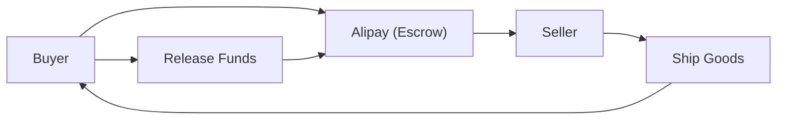

## 1. アリババの創業
1999年、ジャック・マーがアパートの一室で18人の仲間と共に創業。B2Bのマッチングサイトとしてスタートしました。

## 2. Taobao（淘宝網）の成功
C2CプラットフォームであるTaobaoを立ち上げ、eBayを中国市場から撤退させる大成功を収めました。

## 3. Alipayによる信用創造
中国においてクレジットカードが普及していない中、エスクロー決済サービス「Alipay」を構築。これが中国のキャッシュレス社会の基盤となりました。

## 4. クラウドと独身の日
Alibaba Cloudによるインフラ構築や、「独身の日（11月11日）」の巨大なセールイベントなど、現在も中国のデジタル経済を牽引しています。

## 追加技術検証パート 1

### 1. アリババの創業
1999年、ジャック・マーがアパートの一室で18人の仲間と共に創業。B2Bのマッチングサイトとしてスタートしました。

### 2. Taobao（淘宝網）の成功
C2CプラットフォームであるTaobaoを立ち上げ、eBayを中国市場から撤退させる大成功を収めました。

### 3. Alipayによる信用創造
中国においてクレジットカードが普及していない中、エスクロー決済サービス「Alipay」を構築。これが中国のキャッシュレス社会の基盤となりました。

### 4. クラウドと独身の日
Alibaba Cloudによるインフラ構築や、「独身の日（11月11日）」の巨大なセールイベントなど、現在も中国のデジタル経済を牽引しています。

## 追加技術検証パート 2

### 1. アリババの創業
1999年、ジャック・マーがアパートの一室で18人の仲間と共に創業。B2Bのマッチングサイトとしてスタートしました。

### 2. Taobao（淘宝網）の成功
C2CプラットフォームであるTaobaoを立ち上げ、eBayを中国市場から撤退させる大成功を収めました。

### 3. Alipayによる信用創造
中国においてクレジットカードが普及していない中、エスクロー決済サービス「Alipay」を構築。これが中国のキャッシュレス社会の基盤となりました。

### 4. クラウドと独身の日
Alibaba Cloudによるインフラ構築や、「独身の日（11月11日）」の巨大なセールイベントなど、現在も中国のデジタル経済を牽引しています。

## 追加技術検証パート 3

### 1. アリババの創業
1999年、ジャック・マーがアパートの一室で18人の仲間と共に創業。B2Bのマッチングサイトとしてスタートしました。

### 2. Taobao（淘宝網）の成功
C2CプラットフォームであるTaobaoを立ち上げ、eBayを中国市場から撤退させる大成功を収めました。

### 3. Alipayによる信用創造
中国においてクレジットカードが普及していない中、エスクロー決済サービス「Alipay」を構築。これが中国のキャッシュレス社会の基盤となりました。

### 4. クラウドと独身の日
Alibaba Cloudによるインフラ構築や、「独身の日（11月11日）」の巨大なセールイベントなど、現在も中国のデジタル経済を牽引しています。

## 追加技術検証パート 4

### 1. アリババの創業
1999年、ジャック・マーがアパートの一室で18人の仲間と共に創業。B2Bのマッチングサイトとしてスタートしました。

### 2. Taobao（淘宝網）の成功
C2CプラットフォームであるTaobaoを立ち上げ、eBayを中国市場から撤退させる大成功を収めました。

### 3. Alipayによる信用創造
中国においてクレジットカードが普及していない中、エスクロー決済サービス「Alipay」を構築。これが中国のキャッシュレス社会の基盤となりました。

### 4. クラウドと独身の日
Alibaba Cloudによるインフラ構築や、「独身の日（11月11日）」の巨大なセールイベントなど、現在も中国のデジタル経済を牽引しています。

## 追加技術検証パート 5

### 1. アリババの創業
1999年、ジャック・マーがアパートの一室で18人の仲間と共に創業。B2Bのマッチングサイトとしてスタートしました。

### 2. Taobao（淘宝網）の成功
C2CプラットフォームであるTaobaoを立ち上げ、eBayを中国市場から撤退させる大成功を収めました。

### 3. Alipayによる信用創造
中国においてクレジットカードが普及していない中、エスクロー決済サービス「Alipay」を構築。これが中国のキャッシュレス社会の基盤となりました。

### 4. クラウドと独身の日
Alibaba Cloudによるインフラ構築や、「独身の日（11月11日）」の巨大なセールイベントなど、現在も中国のデジタル経済を牽引しています。

## 追加技術検証パート 6

### 1. アリババの創業
1999年、ジャック・マーがアパートの一室で18人の仲間と共に創業。B2Bのマッチングサイトとしてスタートしました。

### 2. Taobao（淘宝網）の成功
C2CプラットフォームであるTaobaoを立ち上げ、eBayを中国市場から撤退させる大成功を収めました。

### 3. Alipayによる信用創造
中国においてクレジットカードが普及していない中、エスクロー決済サービス「Alipay」を構築。これが中国のキャッシュレス社会の基盤となりました。

### 4. クラウドと独身の日
Alibaba Cloudによるインフラ構築や、「独身の日（11月11日）」の巨大なセールイベントなど、現在も中国のデジタル経済を牽引しています。

## 追加技術検証パート 7

### 1. アリババの創業
1999年、ジャック・マーがアパートの一室で18人の仲間と共に創業。B2Bのマッチングサイトとしてスタートしました。

### 2. Taobao（淘宝網）の成功
C2CプラットフォームであるTaobaoを立ち上げ、eBayを中国市場から撤退させる大成功を収めました。

### 3. Alipayによる信用創造
中国においてクレジットカードが普及していない中、エスクロー決済サービス「Alipay」を構築。これが中国のキャッシュレス社会の基盤となりました。

### 4. クラウドと独身の日
Alibaba Cloudによるインフラ構築や、「独身の日（11月11日）」の巨大なセールイベントなど、現在も中国のデジタル経済を牽引しています。

## 追加技術検証パート 8

### 1. アリババの創業
1999年、ジャック・マーがアパートの一室で18人の仲間と共に創業。B2Bのマッチングサイトとしてスタートしました。

### 2. Taobao（淘宝網）の成功
C2CプラットフォームであるTaobaoを立ち上げ、eBayを中国市場から撤退させる大成功を収めました。

### 3. Alipayによる信用創造
中国においてクレジットカードが普及していない中、エスクロー決済サービス「Alipay」を構築。これが中国のキャッシュレス社会の基盤となりました。

### 4. クラウドと独身の日
Alibaba Cloudによるインフラ構築や、「独身の日（11月11日）」の巨大なセールイベントなど、現在も中国のデジタル経済を牽引しています。

## 追加技術検証パート 9

### 1. アリババの創業
1999年、ジャック・マーがアパートの一室で18人の仲間と共に創業。B2Bのマッチングサイトとしてスタートしました。

### 2. Taobao（淘宝網）の成功
C2CプラットフォームであるTaobaoを立ち上げ、eBayを中国市場から撤退させる大成功を収めました。

### 3. Alipayによる信用創造
中国においてクレジットカードが普及していない中、エスクロー決済サービス「Alipay」を構築。これが中国のキャッシュレス社会の基盤となりました。

### 4. クラウドと独身の日
Alibaba Cloudによるインフラ構築や、「独身の日（11月11日）」の巨大なセールイベントなど、現在も中国のデジタル経済を牽引しています。

## 追加技術検証パート 10

### 1. アリババの創業
1999年、ジャック・マーがアパートの一室で18人の仲間と共に創業。B2Bのマッチングサイトとしてスタートしました。

### 2. Taobao（淘宝網）の成功
C2CプラットフォームであるTaobaoを立ち上げ、eBayを中国市場から撤退させる大成功を収めました。

### 3. Alipayによる信用創造
中国においてクレジットカードが普及していない中、エスクロー決済サービス「Alipay」を構築。これが中国のキャッシュレス社会の基盤となりました。

### 4. クラウドと独身の日
Alibaba Cloudによるインフラ構築や、「独身の日（11月11日）」の巨大なセールイベントなど、現在も中国のデジタル経済を牽引しています。

## 追加技術検証パート 11

### 1. アリババの創業
1999年、ジャック・マーがアパートの一室で18人の仲間と共に創業。B2Bのマッチングサイトとしてスタートしました。

### 2. Taobao（淘宝網）の成功
C2CプラットフォームであるTaobaoを立ち上げ、eBayを中国市場から撤退させる大成功を収めました。

### 3. Alipayによる信用創造
中国においてクレジットカードが普及していない中、エスクロー決済サービス「Alipay」を構築。これが中国のキャッシュレス社会の基盤となりました。

### 4. クラウドと独身の日
Alibaba Cloudによるインフラ構築や、「独身の日（11月11日）」の巨大なセールイベントなど、現在も中国のデジタル経済を牽引しています。

## 追加技術検証パート 12

### 1. アリババの創業
1999年、ジャック・マーがアパートの一室で18人の仲間と共に創業。B2Bのマッチングサイトとしてスタートしました。

### 2. Taobao（淘宝網）の成功
C2CプラットフォームであるTaobaoを立ち上げ、eBayを中国市場から撤退させる大成功を収めました。

### 3. Alipayによる信用創造
中国においてクレジットカードが普及していない中、エスクロー決済サービス「Alipay」を構築。これが中国のキャッシュレス社会の基盤となりました。

### 4. クラウドと独身の日
Alibaba Cloudによるインフラ構築や、「独身の日（11月11日）」の巨大なセールイベントなど、現在も中国のデジタル経済を牽引しています。

## 追加技術検証パート 13

### 1. アリババの創業
1999年、ジャック・マーがアパートの一室で18人の仲間と共に創業。B2Bのマッチングサイトとしてスタートしました。

### 2. Taobao（淘宝網）の成功
C2CプラットフォームであるTaobaoを立ち上げ、eBayを中国市場から撤退させる大成功を収めました。

### 3. Alipayによる信用創造
中国においてクレジットカードが普及していない中、エスクロー決済サービス「Alipay」を構築。これが中国のキャッシュレス社会の基盤となりました。

### 4. クラウドと独身の日
Alibaba Cloudによるインフラ構築や、「独身の日（11月11日）」の巨大なセールイベントなど、現在も中国のデジタル経済を牽引しています。

## 追加技術検証パート 14

### 1. アリババの創業
1999年、ジャック・マーがアパートの一室で18人の仲間と共に創業。B2Bのマッチングサイトとしてスタートしました。

### 2. Taobao（淘宝網）の成功
C2CプラットフォームであるTaobaoを立ち上げ、eBayを中国市場から撤退させる大成功を収めました。

### 3. Alipayによる信用創造
中国においてクレジットカードが普及していない中、エスクロー決済サービス「Alipay」を構築。これが中国のキャッシュレス社会の基盤となりました。

### 4. クラウドと独身の日
Alibaba Cloudによるインフラ構築や、「独身の日（11月11日）」の巨大なセールイベントなど、現在も中国のデジタル経済を牽引しています。
