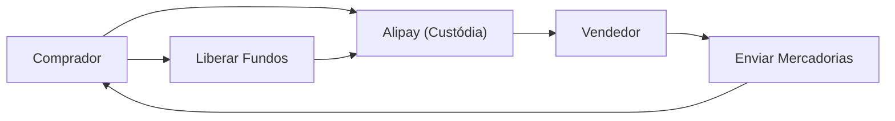

## 1. Fundação do Alibaba
Em 1999, Jack Ma fundou a empresa com 18 colegas em um apartamento. Começou como um site de matchmaking B2B.

## 2. O Sucesso do Taobao (淘宝網)
Lançou o Taobao, uma plataforma C2C, e alcançou um enorme sucesso, forçando a saída do eBay do mercado chinês.

## 3. Criação de Crédito pelo Alipay
Na China, onde os cartões de crédito não eram amplamente utilizados, foi construído o serviço de pagamento com custódia "Alipay". Isso se tornou a base da sociedade sem dinheiro em espécie na China.

## 4. Nuvem e o Dia dos Solteiros
A construção da infraestrutura através do Alibaba Cloud e o gigantesco evento de vendas "Dia dos Solteiros (11 de Novembro)" continuam a impulsionar a economia digital da China hoje.

## Parte Adicional de Verificação Técnica 1

## Parte Adicional de Verificação Técnica 2

## Parte Adicional de Verificação Técnica 3

## Parte Adicional de Verificação Técnica 4

## Parte Adicional de Verificação Técnica 5

## Parte Adicional de Verificação Técnica 6

## Parte Adicional de Verificação Técnica 7

## Parte Adicional de Verificação Técnica 8

## Parte Adicional de Verificação Técnica 9

## Parte Adicional de Verificação Técnica 10

## Parte Adicional de Verificação Técnica 11

## Parte Adicional de Verificação Técnica 12

## Parte Adicional de Verificação Técnica 13

## Parte Adicional de Verificação Técnica 14

