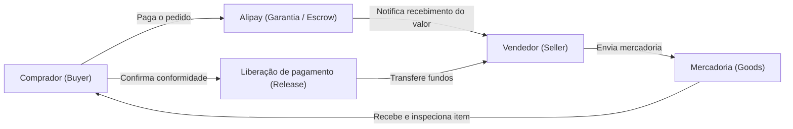

Ao analisar a economia digital contemporânea, é impossível ignorar o gigantesco impacto do conglomerado tecnológico chinês Alibaba Group. Hoje, centenas de milhões de cidadãos compram facilmente através do smartphone e efetuam pagamentos em frações de segundo. Contudo, na China, a infraestrutura basilar que tornou essa comodidade possível foi construída do zero pelo Alibaba. Como pôde Jack Ma (Ma Yun), um modesto professor de inglês, reinventar o varejo e os sistemas de pagamento do país para erguer um dos maiores ecossistemas digitais do planeta? Este artigo disseca a épica trajetória do Alibaba e as decisões estratégicas que ditaram seus grandes pontos de virada.

## 1. O ponto de partida: Fundação em um apartamento em Hangzhou (1999)

A trajetória do Alibaba teve início em 1999, no modesto apartamento de Jack Ma em Hangzhou, província de Zhejiang. Ma já havia experimentado o empreendedorismo anteriormente com o "China Pages", um dos pioneiros catálogos online do país, mas a taxa de penetração da internet na China de então era irrisória e muitos projetos pioneiros sucumbiram.

Ainda assim, Ma acreditava fervorosamente no poder transformador da internet para conectar mercados globais. Em 1999, reuniu 18 amigos e parceiros (os históricos "18 fundadores") em sua sala e compartilhou uma visão ousada: criar uma plataforma digital que conectasse as pequenas e médias indústrias chinesas a compradores em todo o mundo. Enquanto a China despontava vertiginosamente como a "fábrica do mundo", milhões de pequenas manufaturas não dispunham de canais diretos para alcançar compradores internacionais.

Assim nasceu o "Alibaba.com", um portal de comércio B2B (empresa para empresa) voltado à exportação. Ao permitir que companhias estrangeiras comprassem grandes volumes diretamente de fabricantes chineses, o Alibaba experimentou um crescimento estonteante. O aporte de capital estratégico do Goldman Sachs e do SoftBank (liderado por Masayoshi Son) garantiu o combustível financeiro crucial para essa expansão. Notavelmente, o investimento de US$ 20 milhões feito pelo SoftBank no ano 2000 se tornaria uma das apostas de capital de risco mais bem-sucedidas e lucrativas de toda a história.

## 2. A criação do Taobao e o duelo épico contra o eBay (2003)

Após fincar raízes sólidas no segmento B2B, o Alibaba encarou um desafio decisivo em 2003. O eBay, soberano global das plataformas de leilões online na época, comprou o portal chinês EachNet e desembarcou com pesados investimentos no mercado C2C (consumidor para consumidor) da China.

Jack Ma vislumbrou que, se o eBay dominasse o varejo de consumo chinês, mais cedo ou mais tarde avançaria sobre o reduto B2B do Alibaba. Agindo em absoluto sigilo, o Alibaba organizou uma equipe de elite no antigo apartamento de Ma para conceber sua própria plataforma C2C: o "Taobao" (termo chinês que significa "garimpar tesouros").

Diante do colosso americano, o Taobao utilizou uma estratégia demolidora: gratuidade total nas taxas de anúncio e intermediação de transações por pelo menos três anos. Enquanto o eBay cobrava comissões sobre cada venda, o Taobao ofereceu custo zero aos comerciantes. Além disso, o Taobao desenhou seu ambiente virtual em harmonia com a cultura local: páginas visualmente movimentadas e a ferramenta de mensagens instantâneas "Aliwangwang", que permitia a compradores e vendedores negociar, pechinchar e construir relações de confiança em tempo real.

O eBay, ao contrário, insistiu em forçar os internautas chineses a utilizar sua plataforma global padronizada, gerando lentidão e forte atrito cultural. A política de custo zero e a minuciosa adaptação local viraram o jogo em favor do Taobao. Em 2006, o eBay foi forçado a recuar e abandonar praticamente o mercado C2C na China, coroando o Alibaba como o soberano absoluto do comércio eletrônico local.

## 3. A inovação do Alipay: O depósito em garantia que construiu a confiança (2004)

À medida que o Taobao crescia em escala astronômica, o Alibaba encontrou uma barreira estrutural crítica: a profunda falta de confiança no ambiente comercial chinês da época.

Nos anos 2000, a penetração de cartões de crédito na China era insignificante. Havia enorme receio por parte dos consumidores em pagar adiantado sem garantia de entrega, ao mesmo tempo em que os vendedores temiam enviar mercadorias sem receber previamente. O pagamento na entrega e as transferências bancárias eram processos lentos e inviáveis para sustentar a explosão do e-commerce.

Para derrubar essa muralha de desconfiança, o Alibaba lançou em 2004 o "Alipay" (Zhifubao). O Alipay introduziu o pioneiro sistema de depósito em garantia (escrow):

```mermaid
flowchart LR
    Buyer["Comprador (Buyer)"] -->|Paga o pedido| Alipay["Alipay (Garantia / Escrow)"]
    Alipay -->|Notifica recebimento do valor| Seller["Vendedor (Seller)"]
    Seller -->|Envia mercadoria| Goods["Mercadoria (Goods)"]
    Goods -->|Recebe e inspeciona item| Buyer
    Buyer -->|Confirma conformidade| Release["Liberação de pagamento (Release)"]
    Release -->|Transfere fundos| Seller
```

Sob esse modelo, o dinheiro pago pelo consumidor era retido de forma segura pelo Alipay. Os valores só eram creditados ao vendedor após o comprador confirmar a entrega perfeita da mercadoria. Essa sistemática eliminou o perigo de golpes e permitiu que completos estranhos realizassem negócios com total tranquilidade pela internet.

Com o tempo, o Alipay evoluiu de mera ferramenta de compras para uma superplataforma abrangendo pagamento de contas de consumo, pagamentos presenciais via QR Code, investimentos (Yu'e Bao) e análise de pontuação de crédito (Zhima Credit). Essa estrutura, mais tarde desmembrada como "Ant Group", foi o motor supremo que transformou a China na vanguarda mundial das sociedades sem dinheiro físico.

## 4. O surgimento do Tmall e a consolidação do comércio B2C (2008)

O Taobao conquistou o público em massa, mas a natureza aberta do modelo C2C abriu brechas para a circulação de produtos falsificados e mercadorias de qualidade duvidosa. Conforme a renda média da população crescia, surgiu uma demanda vigorosa por produtos autênticos e marcas consagradas. Como resposta, o Alibaba inaugurou em 2008 o "Taobao Mall", rebatizado posteriormente como "Tmall" (Tianmao).

O Tmall foi desenhado como um shopping center virtual B2C com critérios rigorosos de qualificação, permitindo apenas a entrada de fabricantes oficiais e distribuidores autorizados. Isso conferiu aos consumidores a certeza absoluta de estarem comprando itens originais. Atualmente, ícones globais como Apple, Nike e Uniqlo operam suas principais lojas virtuais no Tmall, consolidando-o como um canal imperativo para o varejo de qualidade no país.

## 5. O advento do Alibaba Cloud e a aposta em infraestrutura tecnológica (2009)

Diante do volume gigantesco de tráfego que crescia exponencialmente, o Alibaba esbarrou no limite das infraestruturas de hardware e banco de dados proprietárias fornecidas por multinacionais ocidentais (IBM, Oracle, EMC). Ciente dos custos astronômicos e da inflexibilidade técnica, o Alibaba inaugurou em 2009 sua própria divisão de computação em nuvem: a "Alibaba Cloud" (Aliyun).

Embora a computação em nuvem fosse recebida com ceticismo no setor tecnológico chinês da época, Jack Ma e seu diretor técnico Wang Jian tinham a convicção de que os dados e o poder computacional seriam o petróleo indispensável do século XXI. Testada no limite extremo das operações do próprio Alibaba, a plataforma em nuvem Apsara abriu suas portas a empresas privadas e governos, convertendo-se na maior fornecedora de serviços de nuvem da China e uma das maiores do planeta.

## 6. O "Dia dos Solteiros (Double 11)": O maior festival de compras do planeta (2009 - presente)

A expressão máxima do poder de mobilização e da musculatura tecnológica do Alibaba é o festival de compras do "Dia dos Solteiros" (Double 11 / 11.11), realizado em 11 de novembro.

Originalmente, o dia 11 de novembro era comemorado informalmente por estudantes chineses como o "Dia dos Solteiros" (Guanggun Jie). Daniel Zhang, então líder do Tmall e posteriormente CEO do grupo, transformou a data em um grande momento para que os consumidores se presenteassem e celebrassem o consumo.

A estreia em 2009 contou com somente 27 marcas, mas o festival explodiu para vendas de dezenas de bilhões de dólares em poucas horas, superando largamente a soma de eventos como a Black Friday e a Cyber Monday dos Estados Unidos. A capacidade do Alibaba Cloud de processar centenas de milhares de transações simultâneas por segundo sem qualquer instabilidade consolidou mundialmente a robustez de sua engenharia.

## 7. O conceito de "Novo Varejo (New Retail)" e a unificação dos canais (2016 - presente)

Em 2016, Jack Ma sentenciou: "O ciclo do comércio eletrônico puro está se encerrando. O futuro pertence ao 'Novo Varejo' (New Retail), a integração sinérgica entre plataformas digitais, comércio físico, logística rápida e dados em tempo real".

A materialização dessa visão é a rede de supermercados inteligentes "Freshippo" (Hema Xiansheng), criada pelo Alibaba. Cada loja Hema atua como mercado gourmet, restaurante de frutos do mar e armazém automatizado para entregas virtuais. Os clientes podem comprar presencialmente ou fazer pedidos via aplicativo com entrega garantida em até 30 minutos em um raio de 3 quilômetros.

Essa engrenagem é coordenada pela "Cainiao Network", a unidade de dados logísticos do Alibaba. Em vez de comprar frotas maciças de caminhões ou grandes galpões, a Cainiao opera uma rede digital orientada por algoritmos de inteligência artificial que conecta e otimiza transportadoras e centros de distribuição privados em todo o país.

## 8. A expansão global e as novas fronteiras

A ambição do Alibaba sempre transcendeu as fronteiras chinesas. Por meio de aquisições de peso, como a Lazada no Sudeste Asiático e a Trendyol na Turquia, além do canal internacional AliExpress, o grupo persegue ativamente sua missão inicial: "Tornar fácil fazer negócios em qualquer lugar do mundo" (Make it easy to do business anywhere).

Apesar disso, os últimos anos trouxeram complexos desafios. Com o afastamento gradual de Jack Ma da liderança executiva, o Alibaba enfrentou um escrutínio regulatório sem precedentes. No final de 2020, a oferta pública de ações (IPO) do Ant Group foi suspensa pelas autoridades regulatórias, seguida de multas expressivas decorrentes de investigações antitruste.

Simultaneamente, a concorrência se intensificou no mercado chinês com o crescimento vigoroso do Pinduoduo no comércio social e da ByteDance (via Douyin/TikTok) no segmento de transmissões ao vivo com compras integradas. Em resposta a esse cenário, o Alibaba anunciou em 2023 uma profunda reestruturação societária, dividindo-se em seis unidades de negócios autônomas para acelerar tomadas de decisão e renovar sua capacidade inovadora.

## 9. Conclusão: O legado duradouro do Alibaba

Do modesto apartamento em Hangzhou em 1999 até o atual império multidisciplinar englobando varejo, finanças digitais, inteligência logística e computação em nuvem, o Alibaba moldou a transformação digital da economia chinesa.

Ao superar o eBay, viabilizar o comércio seguro com o Alipay, liderar o desenvolvimento da nuvem e derrubar as barreiras entre o ambiente físico e o digital no Novo Varejo, o Alibaba construiu um legado marcante. Mesmo diante de novos desafios econômicos e concorrenciais, o capital tecnológico e o espírito empreendedor cultivados pelo Alibaba permanecerão como forças determinantes no futuro do comércio digital em escala global.
