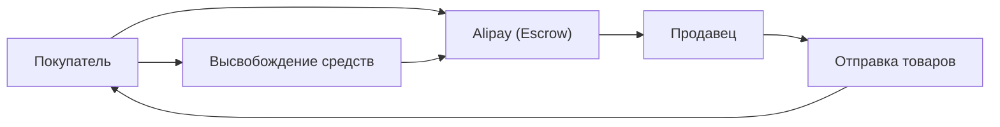

## 1. Основание Alibaba
В 1999 году Джек Ма вместе с 18 соратниками основал компанию в своей квартире. Она начиналась как B2B-платформа для поиска партнеров.

## 2. Успех Taobao
Была запущена C2C-платформа Taobao, которая добилась огромного успеха, вынудив eBay уйти с китайского рынка.

## 3. Создание доверия с помощью Alipay
В условиях, когда кредитные карты не были распространены в Китае, была создана система эскроу-платежей Alipay. Это стало основой безналичного общества в Китае.

## 4. Облачные технологии и День холостяка
Создание инфраструктуры с помощью Alibaba Cloud и гигантские распродажи в «День холостяка» (11 ноября) — компания продолжает стимулировать цифровую экономику Китая и по сей день.

## Дополнительная техническая проверка, часть 1

## Дополнительная техническая проверка, часть 2

## Дополнительная техническая проверка, часть 3

## Дополнительная техническая проверка, часть 4

## Дополнительная техническая проверка, часть 5

## Дополнительная техническая проверка, часть 6

## Дополнительная техническая проверка, часть 7

## Дополнительная техническая проверка, часть 8

## Дополнительная техническая проверка, часть 9

## Дополнительная техническая проверка, часть 10

## Дополнительная техническая проверка, часть 11

## Дополнительная техническая проверка, часть 12

## Дополнительная техническая проверка, часть 13

## Дополнительная техническая проверка, часть 14

