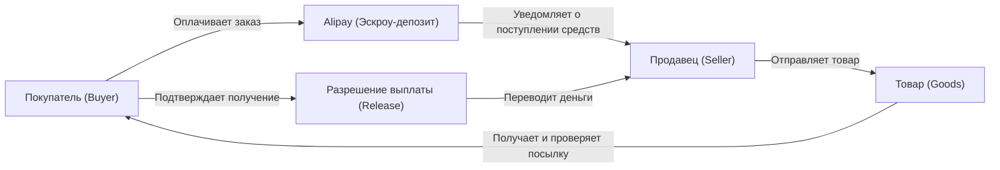

Рассматривая современную глобальную цифровую экономику, невозможно переоценить колоссальное влияние китайского технологического гиганта Alibaba Group. Сегодня миллионы людей привычно совершают покупки одним касанием экрана смартфона и мгновенно оплачивают счета. Однако в Китае именно Alibaba с нуля построила всю эту фундаментальную инфраструктуру. Как Джек Ма (Ма Юнь), бывший школьный учитель английского языка, сумел преобразовать торговлю и финансовые расчеты в стране, создав одну из мощнейших цифровых экосистем на планете? В этой статье подробно анализируется история Alibaba и стратегические решения на ключевых этапах ее развития.

## 1. Исток: Основание в квартире в Ханчжоу (1999 год)

История Alibaba началась в 1999 году в скромной квартире Джека Ма в городе Ханчжоу, провинция Чжэцзян. До этого Ма уже пытался развивать интернет-каталог «China Pages», однако в то время проникновение интернета в Китае было крайне низким, и многие ранние стартапы терпели крах.

Тем не менее Ма непоколебимо верил в способность интернета объединять мировые рынки. В 1999 году он собрал в своей квартире 18 друзей и соратников (ставших известными как «18 основателей») и изложил им масштабное видение: создать онлайн-платформу, которая соединит китайские малые и средние производственные предприятия с зарубежными покупателями. В то время Китай стремительно превращался в «мировую фабрику», но миллионы фабрик не имели прямого выхода на международных закупщиков.

Так появился портал «Alibaba.com» — платформа B2B (бизнес для бизнеса), ориентированная на международную торговлю. Предоставляя иностранным компаниям возможность закупать оптовые партии товаров напрямую у китайских производителей, Alibaba продемонстрировала взрывной рост. Важнейшие ранние инвестиции от Goldman Sachs и SoftBank (во главе с Масаёси Соном) обеспечили компанию необходимым капиталом. Инвестиция SoftBank в размере 20 миллионов долларов в 2000 году впоследствии стала одной из самых успешных и прибыльных сделок в истории венчурного капитала.

## 2. Рождение Taobao и историческая победа над eBay (2003 год)

Укрепив позиции в сегменте B2B, в 2003 году Alibaba столкнулась с экзистенциальным вызовом. Американский гигант онлайн-аукционов eBay приобрел китайскую площадку EachNet и с колоссальными финансовыми ресурсами вышел на китайский рынок C2C (потребитель для потребителя).

Джек Ма осознавал: если eBay монополизирует розничную торговлю для населения, он неизбежно поставит под угрозу и B2B-бизнес Alibaba. В строжайшей тайне команда специалистов в старой квартире Ма начала разработку собственной платформы C2C — «Taobao» (что по-китайски означает «поиск сокровищ»).

В схватке с eBay проект Taobao применил разрушительную стратегию: полную отмену комиссий за размещение товаров и проведение сделок как минимум на три года. Пока eBay взимал плату с каждой продажи, Taobao предоставил предпринимателям абсолютно бесплатную площадку. Кроме того, Taobao адаптировал интерфейс под вкусы китайских покупателей — создал яркий, информативный дизайн и интегрировал мессенджер «Aliwangwang», позволявший покупателям и продавцам общаться, торговаться и выстраивать доверительные отношения в режиме реального времени.

eBay же попытался перевести китайских пользователей на свою унифицированную глобальную платформу, столкнувшись с культурным отторжением и медленной работой сайта. Бесплатная модель и идеальная локализация принесли плоды: к 2006 году eBay был вынужден фактически свернуть операции на китайском рынке C2C. Taobao занял доминирующее положение в сфере интернет-торговли в Китае.

## 3. Инновация Alipay: Эскроу как основа доверия (2004 год)

По мере стремительного роста Taobao компания Alibaba столкнулась с главным барьером китайского рынка того времени — дефицитом взаимного доверия.

В начале 2000-х годов кредитные карты в Китае были редкостью. Покупатели боялись отправлять предоплату, опасаясь остаться без товара, а продавцы не решались отправлять заказы без оплаты. Банковские переводы и наложенный платеж были слишком медленными и не могли обеспечить массовый рост интернет-торговли.

Чтобы решить эту проблему, в 2004 году Alibaba запустила сервис «Alipay» (Чжифубао). В основу Alipay лег механизм условного депонирования (эскроу):

```mermaid
flowchart LR
    Buyer["Покупатель (Buyer)"] -->|Оплачивает заказ| Alipay["Alipay (Эскроу-депозит)"]
    Alipay -->|Уведомляет о поступлении средств| Seller["Продавец (Seller)"]
    Seller -->|Отправляет товар| Goods["Товар (Goods)"]
    Goods -->|Получает и проверяет посылку| Buyer
    Buyer -->|Подтверждает получение| Release["Разрешение выплаты (Release)"]
    Release -->|Переводит деньги| Seller
```

Деньги покупателя временно замораживались на счете Alipay и перечислялись продавцу только после того, как покупатель лично подтверждал получение и качество товара. Это полностью исключило риск обмана и позволило незнакомым людям уверенно совершать сделки через интернет.

Впоследствии Alipay эволюционировал в универсальную финансовую платформу: оплата коммунальных услуг, расчеты по QR-кодам в магазинах, инвестиционные фонды (Yu'e Bao) и система кредитного скоринга (Zhima Credit). Это подразделение, позже преобразованное в «Ant Group», стало главным катализатором превращения Китая в самое передовое безналичное общество в мире.

## 4. Появление Tmall и переход к качественному B2C (2008 год)

Хотя Taobao завоевал огромную популярность, открытая модель C2C неизбежно порождала проблемы с контрафактом и товарами низкого качества. С ростом доходов среднего класса в Китае стремительно рос спрос на подлинные брендовые товары. В ответ на это в 2008 году Alibaba запустила «Taobao Mall», вскоре переименованный в «Tmall» (Тяньмао).

Tmall создавался как закрытый маркетплейс формата B2C (бизнес для потребителя) со строгим отбором продавцов: доступ туда имели только официальные бренды и сертифицированные дистрибьюторы. Это гарантировало покупателям подлинность продукции. Сегодня ведущие мировые корпорации, такие как Apple, Nike и Uniqlo, держат свои официальные флагманские магазины на Tmall, что делает платформу ключевым каналом розничных продаж в Китае.

## 5. Запуск Alibaba Cloud и инвестиции в инфраструктуру (2009 год)

На фоне лавинообразного роста трафика традиционные серверные и программные комплексы западных поставщиков (IBM, Oracle, EMC) перестали справляться с нагрузками и стали непомерно дорогими. Осознав технологический тупик, Alibaba в 2009 году создала собственное подразделение облачных вычислений — «Alibaba Cloud» (Aliyun).

Тогда многие эксперты скептически относились к перспективам облаков в Китае, но Джек Ма и главный технический архитектор Ван Цзянь были убеждены, что данные и вычислительная мощность станут нефтью цифровой эпохи. Закаленная колоссальными пиковыми нагрузками собственных сервисов, облачная платформа Apsara со временем открылась для корпоративных и государственных заказчиков, став крупнейшим облачным провайдером Китая и одним из лидеров мирового рынка.

## 6. «День холостяка (Двойной 11)»: Крупнейший фестиваль онлайн-шопинга (2009 — н.в.)

Ярчайшим воплощением маркетинговой мощи и технологической устойчивости Alibaba стал ежегодный фестиваль распродаж «День холостяка» (11.11 / Double 11), проходящий 11 ноября.

Изначально дата 11 ноября была шуточным праздником студентов («День холостяка»). Дэниел Чжан, возглавлявший тогда Tmall, а затем ставший генеральным директором Alibaba, превратил этот день в масштабный повод «порадовать себя покупками».

Если в 2009 году в первой распродаже участвовало всего 27 брендов, то со временем оборот фестиваля достиг десятков миллиардов долларов за сутки, оставив далеко позади американские «Черную пятницу» и «Киберпонедельник» вместе взятые. Способность Alibaba Cloud обрабатывать сотни тысяч транзакций в секунду без малейших сбоев доказала миру высочайшую надежность ее технологий.

## 7. Концепция «Нового ритейла (New Retail)» и единая экосистема (2016 — н.в.)

В 2016 году Джек Ма провозгласил: «Эпоха чистой электронной коммерции завершается. Будущее принадлежит "Новому ритейлу" (New Retail) — глубокой интеграции онлайн-платформ, офлайн-магазинов, логистики и анализа данных в реальном времени».

Флагманом этой концепции стала сеть умных супермаркетов «Freshippo» (Hema Xiansheng). Магазины Hema служат одновременно розничным супермаркетом деликатесов, рестораном морепродуктов и автоматизированным сортировочным складом для онлайн-заказов. Покупатели могут совершать покупки на месте или заказывать доставку через приложение, получая товары в течение 30 минут в радиусе 3 километров.

Работу этой логистической системы обеспечивает сеть «Cainiao Network». Вместо покупки собственных парков грузовиков Cainiao развивает ИИ-платформу, которая объединяет, координирует и оптимизирует работу независимых курьерских и складских компаний по всему Китаю.

## 8. Международная экспансия и новые вызовы

Амбиции Alibaba всегда простирались за пределы китайского рынка. Через приобретение Lazada в Юго-Восточной Азии, платформы Trendyol в Турции и развитие глобального маркетплейса AliExpress группа последовательно реализует свою миссию: «Сделать так, чтобы вести бизнес было легко в любой точке мира» (Make it easy to do business anywhere).

Тем не менее последние годы принесли компании серьезные испытания. После ухода Джека Ма от оперативного управления Alibaba столкнулась с ужесточением регулирования. В конце 2020 года было отложено рекордное IPO Ant Group, за чем последовали антимонопольные проверки и штрафы.

Параллельно обострилась конкуренция: стремительный рост платформы Pinduoduo и бурное развитие видеошопинга в Douyin (китайский аналог TikTok от ByteDance) создали мощное давление на рынок. В ответ на это в 2023 году Alibaba объявила о масштабной реорганизации, разделившись на шесть независимых бизнес-групп для возвращения гибкости и ускорения инноваций.

## 9. Заключение: Наследие Alibaba и взгляд в будущее

Пройдя путь от скромной квартиры в Ханчжоу в 1999 году до технологического гиганта, охватывающего розницу, финансы, логистику и облачную инфраструктуру, Alibaba определила развитие всей цифровой экономики Китая.

Победа над eBay, создание системы доверия через Alipay, прорыв в сфере облачных сервисов и запуск концепции Нового ритейла стали важными вехами в мировой истории технологий. Несмотря на новые регуляторные и рыночные вызовы, технологический фундамент и предпринимательский дух Alibaba останутся мощным двигателем развития глобальной коммерции.
